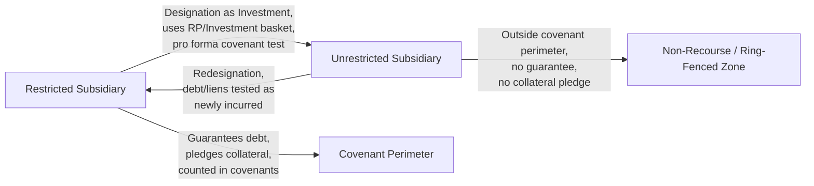

## Restricted versus Unrestricted Subsidiaries


### Definition and Purpose

The restricted/unrestricted subsidiary framework is a structural mechanism in credit agreements and high-yield bond indentures that divides a corporate group into two regulatory zones:

- **Restricted subsidiaries** are bound by the covenants of the credit agreement or indenture — they are counted in financial covenant calculations, subject to negative covenant restrictions (debt incurrence, liens, dividends, asset sales), and typically required to guarantee the debt and pledge collateral.
- **Unrestricted subsidiaries** sit outside the covenant package entirely — their debt, liens, and financial results are not consolidated for covenant-compliance purposes, and they generally do not guarantee the parent facility's debt.

**Key Points**

- The designation is a contractual, not automatic, feature — it is created by definitions and mechanics negotiated into the credit agreement or indenture, not by tax or GAAP consolidation rules.
- The framework gives sponsors and management flexibility to house new ventures, joint ventures, or riskier assets outside the restrictive covenant perimeter, while giving lenders/noteholders comfort that the "core" credit remains covenant-protected.

### Why the Distinction Exists

From the borrower/sponsor perspective, unrestricted subsidiary status is a tool to:

1. Ring-fence higher-risk or non-recourse assets (e.g., a project finance vehicle, a speculative JV, or a foreign operation) so that its liabilities and operating volatility do not affect covenant compliance at the restricted group.
2. Raise structurally senior or non-recourse financing at the unrestricted subsidiary level without needing consent from the restricted group's lenders.
3. Facilitate acquisitions where the target's existing debt cannot be immediately refinanced or where consents are outstanding.

From the lender/noteholder perspective, the framework requires careful drafting because it is a well-known vector for **collateral and value leakage** — assets can migrate outside the covenant perimeter through the designation mechanism itself, or through permitted investments from the restricted group into unrestricted subsidiaries.

### Designation Mechanics

**Initial Designation**

Subsidiaries are typically all restricted by default unless specifically designated unrestricted at closing (listed in a schedule to the credit agreement/indenture).

**Subsequent Designation (Restricted → Unrestricted)**

The credit agreement/indenture permits the borrower to redesignate a restricted subsidiary as unrestricted, subject to conditions:

- No default or event of default exists (or would result)
- Pro forma compliance with financial covenants (e.g., leverage ratio, fixed charge coverage ratio) after giving effect to the designation
- The designation is treated as an "Investment" by the restricted group in the unrestricted subsidiary, using up capacity under the investment/restricted payments basket, measured at the fair market value of the net assets transferred

**Subsequent Designation (Unrestricted → Restricted)**

Redesignation back to restricted status is generally permitted but treated as:

- The incurrence of any debt and liens existing at that subsidiary (tested against the debt/lien incurrence covenants as if newly incurred)
- Often requires pro forma covenant compliance similarly to the reverse designation

**Example**

Assume a sponsor wants to designate a wholly-owned subsidiary with $20,000,000 of net assets as unrestricted to pursue a speculative technology investment outside the credit facility's covenant package. Under a typical credit agreement:

1. The $20,000,000 fair market value of net assets transferred is deemed an "Investment" and must fit within the available restricted payments/investments basket (e.g., the greater of a fixed dollar basket and a percentage of EBITDA, plus a builder basket).
2. Pro forma leverage ratios are recalculated excluding the designated subsidiary's EBITDA and debt.
3. If pro forma leverage exceeds the covenant threshold post-designation, the designation is not permitted.

[Inference] The exact basket sizing, whether designations "use" restricted payments capacity or a separate investments basket, and whether unused capacity can be reclaimed on later redesignation back to restricted, are heavily negotiated points that vary deal-by-deal.



### Financial Covenant and Collateral Effects

| Attribute | Restricted Subsidiary | Unrestricted Subsidiary |
| --- | --- | --- |
| Consolidated in leverage/coverage ratio calcs | Yes | No |
| Guarantees parent facility debt | Typically yes (subject to exclusions) | No |
| Grants security interest/collateral | Typically yes | No |
| Subject to negative covenants (debt, liens, dividends) | Yes | No (governed by its own financing, if any) |
| Debt at that entity counted against restricted group's debt incurrence tests | Yes | No — treated as non-recourse to restricted group |
| Dividends/distributions from it to restricted group | N/A (already consolidated) | Typically permitted and may increase restricted payments capacity or be excluded from covenant calcs |

**Key Points**

- Because unrestricted subsidiary debt is non-recourse to the restricted group (subject to guarantee/support limitations), lenders to the unrestricted subsidiary generally cannot claim against restricted group assets, and vice versa.
- Restricted group lenders should scrutinize "non-recourse" carve-outs carefully, as sponsors sometimes negotiate limited guarantees, keepwells, or completion guarantees running from the restricted group to the unrestricted subsidiary's lenders — these can reintroduce credit exposure.

### Guardrails and Negotiated Limitations

Because the restricted/unrestricted toggle is a recognized leakage risk, credit agreements and indentures typically include:

1. **Investment basket caps** limiting the aggregate value that can be designated to unrestricted subsidiaries over the life of the facility.
2. **Material subsidiary override** — a rule preventing designation of a subsidiary that holds a disproportionate share of consolidated assets/EBITDA (this became a heavily litigated issue following market disputes over similar covenant structures).
3. **"J.Crew Blocker" provisions** — restrictions preventing the transfer of material intellectual property or other collateral to unrestricted or non-guarantor subsidiaries specifically to prevent structural subordination of existing lenders. [Unverified — deal-specific] Adoption and precise scope of these blockers vary significantly by deal vintage and negotiating leverage, following market reaction to prior transactions where IP was transferred to an unrestricted subsidiary to raise structurally senior financing.
4. **"Serta Blocker" / open market purchase restrictions** — provisions restricting non-pro-rata debt buybacks or exchanges that could otherwise be used in conjunction with subsidiary redesignation to subordinate existing lenders. [Unverified — deal-specific] These provisions emerged in response to specific market transactions and their prevalence continues to evolve.
5. **Minimum guarantor coverage tests** — requiring that restricted (guarantor) subsidiaries represent a minimum percentage of consolidated EBITDA/assets, limiting how much can be shifted to unrestricted status before triggering a default or requiring cure.

### Interaction with Restricted Payments and Debt Covenants

The unrestricted subsidiary framework interacts with two other core covenants:

- **Restricted Payments covenant**: designations of restricted subsidiaries as unrestricted are typically defined as a form of "Restricted Payment" or "Investment," consuming available basket capacity (see prior chapter item for basket construction).
- **Debt Incurrence covenant**: debt incurred at the unrestricted subsidiary level is excluded from the restricted group's leverage-based incurrence tests, but redesignation back to restricted status requires that any such debt satisfy the incurrence covenant on a pro forma basis at that time (often via the "ratio debt" basket or the general debt basket).

$$\text{Pro Forma Leverage Ratio (post-designation)} = \frac{\text{Restricted Group Net Debt} - \text{Debt Attributable to Redesignated Entity}}{\text{Restricted Group Consolidated EBITDA} - \text{EBITDA Attributable to Redesignated Entity}}$$

### Practical Use Cases

**Example**

- **Project finance carve-out**: A sponsor operating a portfolio company with a stable core business designates a newly formed subsidiary developing a capital-intensive greenfield project (e.g., a power plant or data center) as unrestricted, allowing that project to raise non-recourse project-level debt without breaching the restricted group's leverage covenants or requiring lender consent for each draw.
- **Distressed acquisition integration**: An acquired target with legacy secured debt that cannot be immediately refinanced (due to prepayment penalties or consent requirements) is held as an unrestricted subsidiary until its debt matures or is refinanced, at which point it is redesignated as restricted and folded into the guarantee/collateral structure.
- **Litigation or regulatory risk isolation**: A subsidiary facing material contingent liabilities (e.g., product liability, environmental remediation) may be kept unrestricted to insulate the restricted group's covenant compliance and collateral package from that exposure. [Speculation] Whether lenders would view this favorably or negotiate specific protections against it depends heavily on deal-specific risk allocation and negotiating dynamics.

### Diagram: Restricted vs. Unrestricted Group Structure (svg_diagram)

<svg xmlns="http://www.w3.org/2000/svg" viewBox="0 0 900 320">
<text x="450" y="25" font-size="18" font-weight="bold" text-anchor="middle" fill="#1a1a1a">Restricted vs. Unrestricted Group Structure (svg_diagram)</text>
<rect x="60" y="60" width="780" height="180" rx="10" fill="none" stroke="#4a6fa5" stroke-width="2" stroke-dasharray="6,4" />
<text x="450" y="80" font-size="13" font-weight="bold" text-anchor="middle" fill="#4a6fa5">Covenant Perimeter (Restricted Group)</text>
<g font-family="sans-serif" font-size="13">
<rect x="100" y="100" width="150" height="60" rx="8" fill="#e8f0fe" stroke="#4a6fa5" stroke-width="2" />
<text x="175" y="135" text-anchor="middle">Parent / Borrower</text>



```
<rect x="320" y="100" width="150" height="60" rx="8" fill="#e6f4ea" stroke="#3c8047" stroke-width="2" />
<text x="395" y="130" text-anchor="middle">Restricted</text>
<text x="395" y="148" text-anchor="middle">Sub (Guarantor)</text>

<rect x="540" y="100" width="240" height="60" rx="8" fill="#e6f4ea" stroke="#3c8047" stroke-width="2" />
<text x="660" y="130" text-anchor="middle">Restricted Sub</text>
<text x="660" y="148" text-anchor="middle">(Guarantor, Collateral Pledge)</text>

<path d="M175 160 L175 200" stroke="#333" stroke-width="1.5" />
<path d="M395 160 L395 200" stroke="#333" stroke-width="1.5" />
<path d="M660 160 L660 200" stroke="#333" stroke-width="1.5" />

<rect x="330" y="270" width="240" height="40" rx="8" fill="#fdeaea" stroke="#b03a3a" stroke-width="2" />
<text x="450" y="295" text-anchor="middle">Unrestricted Subsidiary (Non-Recourse)</text>

<path d="M395 160 L450 270" stroke="#b03a3a" stroke-width="2" stroke-dasharray="5,3" marker-end="url(#arrow2)" />
<text x="330" y="220" font-size="11" fill="#b03a3a">Designation as</text>
<text x="330" y="234" font-size="11" fill="#b03a3a">Investment (basket use)</text>
```

</g>
</svg>

**Conclusion**

The restricted/unrestricted subsidiary toggle is one of the most consequential structural levers in a credit agreement or indenture, directly controlling the scope of the covenant perimeter, the composition of the guarantor/collateral group, and the potential for value or collateral leakage. Careful drafting of designation conditions, basket sizing, minimum guarantor coverage, and blocker provisions (IP transfer restrictions, non-pro-rata buyback limits) is essential to prevent the mechanism from being used to structurally subordinate existing creditors.

**Related Topics**

- Restricted Payments Covenant and Basket Construction
- Debt Incurrence Covenants and Ratio Debt Baskets
- Guarantee Structures and Minimum Guarantor Coverage Tests
- Collateral Packages and Security Interests
- Intercompany Investment Baskets
- Structural Subordination and Non-Guarantor Subsidiary Debt
- Project Finance and Non-Recourse Structuring
- Covenant Litigation Precedents (e.g., IP transfer and non-pro-rata liability management transactions)