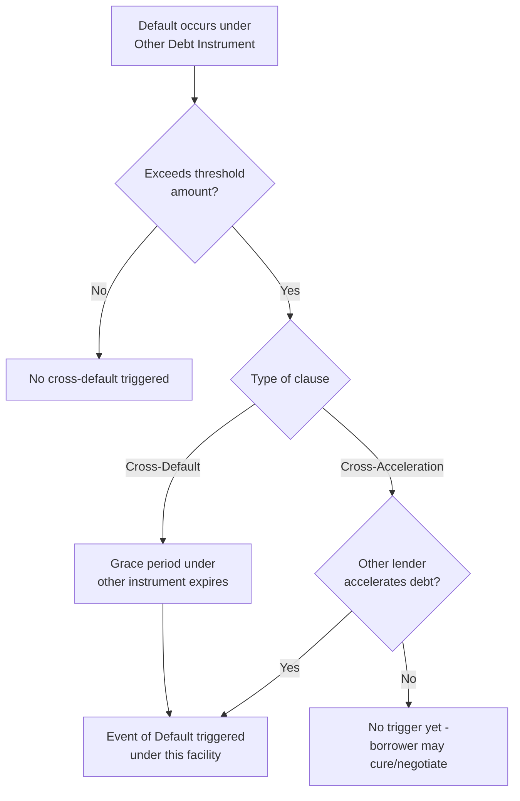

## Cross-Default and Cross-Acceleration Provisions

### Definition and Purpose

Cross-default and cross-acceleration provisions are event-of-default triggers in a credit agreement or indenture that link the borrower's default status under one debt instrument to its status under other debt instruments across the capital structure. They ensure that a payment failure or acceleration on one obligation cannot be isolated from the rest of a borrower's creditors — instead, it triggers (or threatens to trigger) default consequences across multiple facilities simultaneously.

**Key Points**

- **Cross-default** is triggered by a default under another debt instrument, even if that other lender has not yet accelerated (demanded immediate repayment).
- **Cross-acceleration** is triggered only when the other debt instrument has actually been accelerated (i.e., the other lender has exercised its remedy to demand immediate repayment) — a narrower and less lender-friendly trigger.
- Both provisions exist to prevent a borrower from selectively defaulting on lower-priority or smaller creditors while remaining current with others, and to give all creditor classes simultaneous negotiating leverage in a distressed scenario.

### Cross-Default vs. Cross-Acceleration: Structural Comparison

| Feature | Cross-Default | Cross-Acceleration |
| --- | --- | --- |
| Trigger event | Any default (payment or covenant) under specified other debt | Only actual acceleration of specified other debt |
| Sensitivity | Higher — triggers earlier, before other lender acts | Lower — requires other lender to take action first |
| Typical usage | More common in bank credit agreements (favors senior lenders) | More common in high-yield bond indentures (favors issuer flexibility) |
| Cure period interaction | Often no independent cure period; tied to underlying default's own cure period | Same — but delay before acceleration itself provides a practical cushion |
| Negotiating leverage effect | Strong — gives lenders early warning and leverage | Weaker — other creditors must act first, giving borrower time to negotiate/cure |

**Example**

Consider a borrower with a $300,000,000 term loan (Facility A) containing a cross-default provision referencing "any other Indebtedness in excess of $25,000,000," and $150,000,000 of senior notes (Facility B) containing a cross-acceleration provision with the same threshold.

- If the borrower misses a covenant test under an unrelated $40,000,000 revolving facility and that default is not waived or cured within its applicable grace period, Facility A's cross-default provision is triggered immediately — even if the revolver lender has not yet accelerated.
- Facility B's cross-acceleration provision, however, is not triggered unless and until the revolver lender actually accelerates the $40,000,000 facility. If the revolver lender simply waives the default or negotiates a forbearance, Facility B is never triggered.

### Standard Drafting Components

A cross-default/cross-acceleration clause typically has three key negotiated parameters:

1. **Threshold amount**: A minimum dollar (or currency-equivalent) amount of other debt that must be in default/accelerated before the clause is triggered. This prevents immaterial defaults on small obligations from triggering a facility-wide event of default.
2. **Scope of "Indebtedness" captured**: Defined broadly to include borrowed money, capital lease obligations, guarantees of third-party debt, and sometimes hedging/derivative obligations — but frequently carves out intercompany debt, trade payables, and certain non-recourse or project-level debt (particularly where an unrestricted subsidiary framework is in place).
3. **Grace/cure period alignment**: Whether the cross-default is measured after expiration of any grace or cure period under the other instrument, or immediately upon the underlying default (regardless of whether that other lender is still within its own cure window).

**Example — typical cross-default clause structure**

> "An Event of Default shall occur if any Indebtedness of the Borrower or any Restricted Subsidiary having an outstanding principal amount of $25,000,000 or more, individually or in the aggregate, (a) is not paid when due (after giving effect to any applicable grace period), or (b) is declared to be or becomes due and payable prior to its stated maturity as a result of a default thereunder."

Note that clause (a) reflects cross-default logic (failure to pay after the grace period, regardless of acceleration) while clause (b) reflects cross-acceleration logic (declared due and payable early). Many real-world provisions combine both triggers within a single defined "Cross-Default" event, layering payment-default and acceleration triggers together.

### Interaction with Grace Periods and Cure Rights

**Key Points**

- Cross-default clauses commonly incorporate the underlying instrument's own grace period — the cross-default is not triggered on day one of a covenant breach, but only once that breach has ripened into an actual, uncured default under its own terms.
- Some credit agreements add an additional standalone cure period (e.g., an extra 5–10 business days) specifically for the cross-default trigger itself, giving the borrower a final opportunity to cure or obtain a waiver from the other creditor before the cross-default facility's own event of default becomes effective.
- [Inference] Lenders in a strong negotiating position (e.g., tight, high-leverage, sponsor-backed deals with fewer competing bidders) will typically resist stacking additional cure periods on top of the underlying instrument's grace period, preferring the earliest possible trigger point.

### Rationale and Credit Risk Function

Cross-default and cross-acceleration provisions serve several risk-management functions:

1. **Preventing selective default**: Without cross-default protection, a borrower facing liquidity stress could choose to default only on its least aggressive creditor (e.g., a subordinated lender unlikely to accelerate quickly) while remaining current on senior facilities, effectively using senior lenders' patience to fund continued operations at the expense of enforcement rights.
2. **Synchronizing creditor remedies**: By linking default status across instruments, all creditor classes are incentivized to negotiate a global restructuring or forbearance simultaneously, rather than allowing piecemeal, sequential enforcement actions that could destroy going-concern value.
3. **Early warning function**: For senior secured lenders in particular, cross-default clauses (as opposed to the narrower cross-acceleration) provide earlier visibility into deteriorating credit conditions elsewhere in the capital structure, allowing proactive engagement before a liquidity crisis fully materializes.

**Key Points**

- From a borrower/sponsor perspective, cross-acceleration clauses are preferred (and are the market standard in high-yield indentures) because they reduce "hair-trigger" default risk from technical or immaterial breaches on unrelated debt that the other lender has not chosen to escalate.
- From a bank lender perspective, cross-default clauses are preferred in term loan/revolving credit agreements because they provide earlier information rights and negotiating leverage, consistent with banks' typically more active covenant monitoring role relative to bondholders.

### Interaction with Other Structural Provisions

- **Threshold calibration vs. debt basket sizing**: The cross-default threshold is typically set with reference to the size of permitted debt baskets in the negative covenants — if the general debt basket permits incurrence of up to $20,000,000 without further conditions, a cross-default threshold set well above that level (e.g., $25,000,000–$50,000,000) avoids inadvertently triggering cross-default on routine, permitted debt incurrences that later run into technical breaches.
- **Guarantee and restricted subsidiary scope**: Cross-default provisions typically apply to indebtedness of the borrower and its restricted subsidiaries (see prior chapter item) — debt at unrestricted subsidiaries is generally excluded, reinforcing the non-recourse, ring-fenced nature of that structural designation.
- **Hedging and derivative obligations**: Many modern agreements extend cross-default triggers to include termination events or early termination amounts owed under swap/hedging agreements above the threshold, reflecting the growing materiality of derivative exposure in leveraged capital structures. [Unverified] The specific scope of derivative-related cross-default triggers varies significantly by deal and counterparty negotiating dynamics.

### Practical Negotiation Considerations

**Example**

In a sponsor-led leveraged buyout with a term loan B (bank market) and a senior notes offering (bond market) issued concurrently:

- The term loan B credit agreement will typically include a cross-default provision (broader trigger) referencing the senior notes.
- The senior notes indenture will typically include only a cross-acceleration provision (narrower trigger) referencing the term loan B and any other material debt.
- This asymmetry is standard market practice, reflecting differing conventions between the bank loan market (LSTA-influenced documentation) and the high-yield bond market (indenture-driven documentation with less frequent covenant monitoring and amendment flexibility).

[Speculation] Whether a specific deal deviates from this asymmetric convention (e.g., a term loan accepting a cross-acceleration-only standard) generally depends on relative negotiating leverage, market conditions at the time of syndication, and whether the term loan is a broadly syndicated, covenant-lite structure more closely resembling bond-market conventions.

**Conclusion**

Cross-default and cross-acceleration provisions are essential mechanisms for synchronizing creditor remedies across a borrower's capital structure, preventing selective default, and calibrating the sensitivity of default triggers to reflect the relative negotiating position and monitoring intensity of different creditor classes. Precise drafting of threshold amounts, scope of captured indebtedness, and interaction with grace periods is critical to avoid both under-protection (allowing selective default) and over-sensitivity (triggering defaults on immaterial or unrelated technical breaches).

**Related Topics**

- Events of Default: Payment, Covenant, and Bankruptcy Triggers
- Grace Periods and Cure Rights in Credit Agreements
- Restricted versus Unrestricted Subsidiaries
- Debt Incurrence Covenants and Basket Sizing
- Intercreditor Agreements and Standstill Provisions
- Forbearance Agreements and Standstill Negotiations
- Hedging Agreement Termination Events and ISDA Cross-Default Provisions
- Covenant-Lite Loan Structures and High-Yield Market Conventions