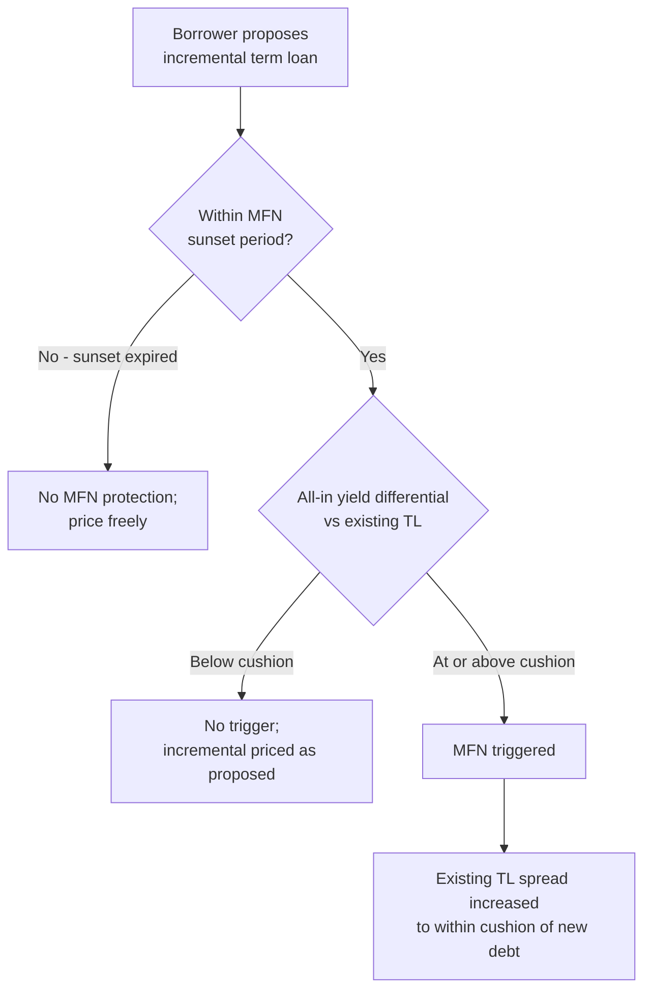
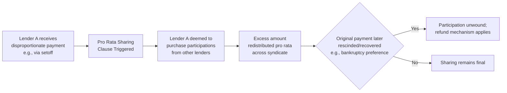

## Most-Favored-Nation and Pro Rata Sharing Protections

### Definition and Purpose

Most-Favored-Nation (MFN) and pro rata sharing provisions are protective mechanisms in syndicated credit agreements designed to preserve pricing consistency and equitable treatment among lenders within the same facility or across incremental additions to it.

- **MFN (Most-Favored-Nation) provisions**, also called "yield protection" or "anti-layering" pricing provisions, protect existing term loan lenders against being economically disadvantaged when a borrower raises incremental or additional pari passu debt at a higher yield shortly after closing.
- **Pro rata sharing provisions** ensure that payments and recoveries received by any lender in a syndicate (whether through voluntary payment, setoff, or enforcement) are shared proportionately among all lenders holding the same class of debt, preventing one lender from obtaining a disproportionate recovery.

**Key Points**

- Both mechanisms exist to preserve the collective action and equal-treatment principles that make syndicated lending viable — without them, individual lenders would have incentives to act unilaterally to their own advantage at the expense of the syndicate.

### Most-Favored-Nation (MFN) Provisions

**Mechanics**

An MFN provision typically states that if the borrower incurs incremental term loans (or other specified pari passu debt) within a defined "sunset period" (commonly 6–24 months after the closing date) at an "all-in yield" more than a specified number of basis points higher than the existing term loan's all-in yield, the existing term loan's yield must be increased to match (typically to within the specified basis point cushion) — or, alternatively, the borrower must apply the MFN pricing adjustment to the new incremental debt itself.

**Key Points**

- "All-in yield" typically captures the sum of: (i) the applicable margin/spread, (ii) any interest rate floor, and (iii) original issue discount (OID), amortized over an agreed life (commonly 4 years, expressed in basis points per annum).
- The MFN threshold ("cushion") is a heavily negotiated number, commonly in the range of 50–100 basis points — meaning the new debt can price up to that cushion above existing debt without triggering the protection.
- MFN provisions typically apply only to term loans of the "same class" (e.g., first lien term loans), and frequently exclude certain categories of debt: acquisition-related incremental facilities above a certain size, debt with a materially different maturity (e.g., more than 1–2 years longer than existing debt), or debt priced with different currency/benchmark conventions.

**Example**

Assume an existing term loan B is priced at SOFR + 400 basis points with a 0.50% SOFR floor and no OID, giving an all-in yield of approximately 450 basis points (over the floor-adjusted base rate). The credit agreement contains a 12-month MFN sunset with a 50 basis point cushion.

- If, in month 8, the borrower raises an incremental term loan priced at SOFR + 475 basis points (all-in yield ~475 bps), the differential is 25 basis points — within the 50 basis point cushion, so MFN is not triggered.
- If instead the incremental term loan prices at SOFR + 500 basis points (all-in yield ~500 bps), the differential is 50 basis points — at or above the cushion threshold — triggering the MFN provision. The existing term loan's spread must then be increased (commonly to SOFR + 450 basis points, i.e., within 50 bps of the new debt) to comply.

$$\text{MFN Trigger} = \text{All-in Yield}_{new} - \text{All-in Yield}_{existing} \geq \text{Cushion (bps)}$$

**MFN Sunset and Erosion**

The MFN protection is time-limited by design:

- **Sunset period**: after the specified period elapses (e.g., 12–24 months from closing), the MFN protection expires entirely, and the borrower can price subsequent incremental debt at any level without triggering a yield adjustment on existing loans.
- [Inference] Over the past several credit cycles, MFN sunset periods and cushions have generally trended toward being more borrower-friendly (shorter sunsets, wider cushions, more carve-outs) in periods of strong liquidity and issuer-favorable market conditions, and tightened in more lender-favorable, risk-averse market environments — reflecting relative negotiating leverage at the time of original syndication.

### Pro Rata Sharing Provisions

**Mechanics**

Pro rata sharing provisions (sometimes called "sharing of payments" clauses) require that if any lender receives a payment on its share of the debt — whether through voluntary prepayment, exercise of a contractual right of setoff, litigation recovery, or otherwise — in an amount greater than its pro rata share of total payments received by the syndicate, that lender must purchase participations from the other lenders (or otherwise share the excess) so that all lenders end up receiving payment in proportion to their respective holdings.

**Key Points**

- This mechanism is distinct from, but complementary to, the payment waterfall provisions found in collateral enforcement/intercreditor contexts — pro rata sharing applies to the ordinary course application of payments among lenders of the same class, not just enforcement proceeds.
- The provision typically deems the disproportionately-paid lender to have purchased a participation in the other lenders' loans equal to the excess amount, effectively refunding the excess back through the participation mechanism, with a right to a corresponding refund if the original payment is later recovered/rescinded (e.g., as a preference in bankruptcy).

**Example**

A syndicate of 5 lenders holds a $500,000,000 term loan pro rata. Lender A holds $150,000,000 (30%) and exercises a contractual right of setoff against a deposit account the borrower maintains with Lender A's affiliated bank, recovering $10,000,000 outside of the normal payment waterfall.

- Under the pro rata sharing clause, Lender A is deemed to have received a disproportionate payment.
- Lender A must purchase participations from the other four lenders in an amount that restores proportionality — effectively distributing a share of the $10,000,000 to the other lenders based on their relative holdings (70% of the total, or $7,000,000 in this example), so that all lenders' effective recovery remains proportional to their 30%/70% split.

$$\text{Sharing Amount} = \text{Excess Payment} \times \left(1 - \frac{\text{Lender's Pro Rata Share}}{100\%}\right)$$

Applying the example: $10{,}000{,}000 \times (1 - 0.30) = 7{,}000{,}000$ to be shared with the other lenders in proportion to their respective holdings.

**Purpose and Rationale**

- Prevents any single lender from using superior contractual rights (e.g., setoff rights arising from an incidental banking relationship with the borrower) or more aggressive litigation tactics to obtain an outsized recovery relative to peers holding the identical credit risk.
- Reinforces the collective action framework that allows a large syndicate of otherwise-unrelated financial institutions to extend credit under a single set of terms with confidence that enforcement and recovery will be treated equitably.

### Distinction from Related Concepts

| Concept | Scope | Trigger | Key Mechanism |
| --- | --- | --- | --- |
| MFN Provision | Pricing of new pari passu incremental debt | New debt priced above cushion vs. existing debt | Yield adjustment (spread increase) on existing loans |
| Pro Rata Sharing | Payments/recoveries among lenders of same class | Disproportionate payment received by one lender | Deemed participation purchase to restore proportionality |
| Intercreditor Waterfall | Allocation of enforcement proceeds across different debt classes/tranches | Collateral enforcement or bankruptcy distribution | Contractual priority of payment among tranches |
| Voting/Amendment Provisions | Approval thresholds for credit agreement amendments | Proposed amendment or waiver | Required lender percentage (majority, supermajority, or 100%) |

**Key Points**

- MFN protects against **pricing** disparity on newly incurred debt of the same class; pro rata sharing protects against **payment/recovery** disparity among lenders of debt already outstanding. They address different points in the credit lifecycle (origination/pricing vs. servicing/enforcement) but share the underlying goal of equal treatment within a lender class.

### Negotiation Dynamics and Market Trends

[Inference] In borrower-favorable ("covenant-lite," sponsor-driven) markets, MFN provisions have historically featured:

- Shorter sunset periods (or none at all in the most aggressive deals)
- Wider cushions (100+ basis points)
- Broader carve-outs (e.g., exclusion of amend-and-extend transactions, acquisition financing above a specified size, or debt used to fund a specific permitted acquisition)

In more lender-favorable markets, MFN provisions tend to feature:

- Longer or perpetual (no sunset) protection
- Tighter cushions (25–50 basis points)
- Fewer carve-outs

Pro rata sharing provisions are comparatively less variable across market cycles, as they are considered a foundational mechanical protection rather than a negotiated economic term — most credit agreements include a fairly standardized sharing clause regardless of overall market leverage dynamics. [Unverified] The degree of standardization may still vary by jurisdiction, agent bank documentation precedent (e.g., LSTA model provisions), and deal type (club deal vs. broadly syndicated facility).

**Conclusion**

MFN and pro rata sharing provisions serve complementary but distinct roles in preserving equitable treatment within a lending syndicate: MFN protects against being priced out by more aggressively priced future debt of the same class, while pro rata sharing prevents any single lender from obtaining a disproportionate recovery through superior contractual rights or timing. Both mechanisms are foundational to maintaining lender confidence in syndicated structures, and their precise calibration (cushions, sunsets, carve-outs) is a key negotiated element of any credit agreement's overall lender protection package.

**Next Steps**

- Incremental Facilities and Accordion Provisions
- Amend-and-Extend Transactions and Amendment Voting Thresholds
- Debt Incurrence Covenants and Ratio Debt Baskets
- Intercreditor Agreements and Payment Waterfalls
- Original Issue Discount (OID) and All-in Yield Calculations
- Assignment and Participation Mechanics in Syndicated Loans
- Agent Bank Roles and LSTA Model Credit Agreement Provisions