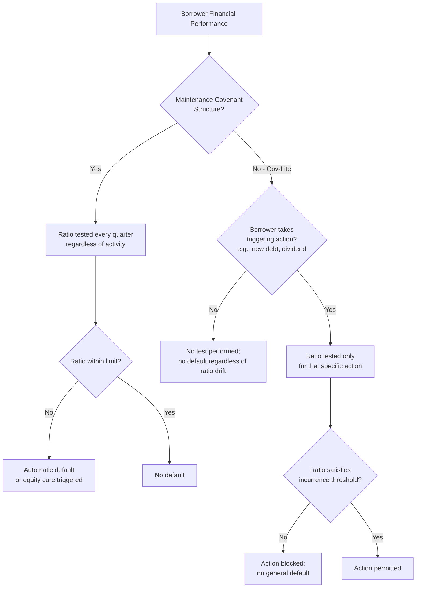
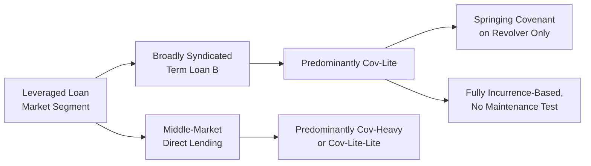

## Covenant-Lite Structuring and Market Evolution

### Definition and Purpose

Covenant-lite (or "cov-lite") structuring refers to leveraged loan documentation that omits maintenance financial covenants — recurring, periodic tests of financial ratios (e.g., leverage or coverage) that must be satisfied regardless of borrower activity — while retaining incurrence-based covenants that are tested only when the borrower takes a specific action (incurring debt, paying a dividend, making an acquisition, etc.).

**Key Points**

- The defining feature of cov-lite is the **absence of maintenance covenants**, not the absence of covenants generally — cov-lite facilities still contain negative covenants (restrictions on debt, liens, asset sales, dividends), affirmative covenants (reporting, insurance, compliance), and events of default.
- Cov-lite structuring originated in the institutional term loan B market (funded primarily by CLOs and institutional investors) and has historically been far less common in revolving credit facilities, which are typically funded by banks that retain maintenance covenant requirements even in otherwise cov-lite capital structures.

### Maintenance Covenants vs. Incurrence Covenants

| Feature | Maintenance Covenant | Incurrence Covenant |
| --- | --- | --- |
| Testing frequency | Periodic (typically quarterly), regardless of borrower activity | Only upon a specific triggering action |
| Typical example | Maximum total net leverage ratio tested each quarter | Leverage ratio tested only when incurring new debt or making a restricted payment |
| Default consequence | Breach is an automatic event of default (or triggers a cure right) | No default if borrower simply refrains from the triggering action |
| Lender monitoring function | Provides regular, forced checkpoints and early warning of credit deterioration | Provides no automatic checkpoint; lenders rely on periodic reporting covenants for visibility |
| Typical facility type | Revolving credit facilities, traditional bank term loans | Institutional term loan B, high-yield bonds |

**Example**

A traditional (cov-heavy) term loan might require the borrower to maintain a total net leverage ratio not exceeding 5.50x, tested at the end of each fiscal quarter, regardless of whether the borrower has taken any specific action. A single quarter of EBITDA underperformance that pushes leverage to 5.75x would constitute an automatic default (or, if a springing/cushion mechanism exists, an equity cure right), even without any voluntary borrower action.

A cov-lite term loan B, by contrast, would only test a leverage ratio if the borrower seeks to, for example: incur additional debt under the general debt basket, make a restricted payment (dividend) using a ratio-based basket, or complete a permitted acquisition financed with new debt. If the borrower simply continues operating without taking any of these actions — even as leverage drifts upward due to EBITDA decline — no default is triggered, because there is no periodic maintenance test to fail.

### Historical Market Evolution

[Inference] The market evolution described below reflects generally documented industry trends; precise statistics and dates should be verified against current market data sources, as leveraged loan market composition shifts materially across credit cycles.

**Origins (pre-2007)**

Cov-lite structures existed in a limited capacity prior to the 2007–2008 financial crisis, primarily used in the largest, highest-quality sponsor-backed credits where borrowers had sufficient negotiating leverage to demand bond-like documentation (reflecting high-yield indenture conventions) in the bank loan market.

**Post-Crisis Contraction and Re-Emergence**

Following the 2008 financial crisis, cov-lite issuance initially contracted sharply as lenders demanded tighter maintenance covenant protection amid heightened credit risk aversion. However, cov-lite structures re-emerged and grew substantially in subsequent years, driven by:

- Growth of the CLO (collateralized loan obligation) investor base, which generally does not rely on maintenance covenants as a primary risk-management tool in the same way traditional bank balance-sheet lenders do
- Increased issuer/sponsor negotiating leverage in a highly liquid, yield-seeking institutional investor market
- Convergence of loan market documentation conventions toward high-yield bond market conventions (incurrence-based testing)

**Market Share Growth**

[Unverified — time-sensitive] The proportion of the broadly syndicated institutional term loan market issued on a cov-lite basis grew from a small minority prior to the financial crisis to a substantial majority in subsequent years, though the exact percentage fluctuates with market conditions and should be verified against current league table data (e.g., from LCD/PitchBook, LSTA, or S&P Global Ratings) for any time-sensitive analysis.

### Drivers of Cov-Lite Prevalence

**Key Points**

1. **Investor base composition**: CLOs, the dominant purchaser of institutional term loans, are structured investment vehicles with their own compliance tests (e.g., overcollateralization tests, weighted average life tests) operating at the CLO level rather than relying on maintenance covenants at the underlying loan level for risk management.
2. **Liquidity and secondary market trading**: Institutional term loans trade actively in the secondary market; investors can exit a deteriorating credit through a sale rather than relying on covenant-triggered default remedies, reducing the perceived necessity of maintenance covenants as a protective mechanism.
3. **Competitive pressure among arrangers**: In borrower-favorable market conditions, arranging banks compete to win mandates by offering more flexible (cov-lite) terms, as borrowers and sponsors generally prefer documentation with fewer automatic default triggers.
4. **Convergence with high-yield bond terms**: Since sponsors frequently use a "covenant package" negotiated across both a term loan B and senior notes simultaneously (see cross-default provisions), documentation conventions have tended to converge, pulling loan market terms toward the incurrence-based, cov-lite standard long used in the bond market.

### Lender Risk Implications

**Key Points**

- **Reduced early warning**: Without periodic maintenance testing, lenders lose a key mechanism for early intervention — a company's credit can deteriorate significantly before any covenant-driven default provides a contractual basis for lenders to demand information, negotiate amendments, or restrict further value leakage.
- **Delayed workout leverage**: In a downside scenario, cov-lite lenders often do not gain negotiating leverage (via default and associated waiver/amendment fees or covenant renegotiation) until closer to a liquidity event (e.g., an actual payment default or maturity), by which point enterprise value may have deteriorated further than it would have under a maintenance covenant regime with earlier intervention points.
- **Reliance on incurrence tests and baskets**: Lender protection under cov-lite structures shifts almost entirely to the precision of incurrence covenant drafting — debt incurrence tests, restricted payment baskets, asset sale provisions, and investment baskets (see related covenant items in this chapter) become the primary defense against value leakage, making careful basket sizing and definitional precision (e.g., EBITDA add-back definitions) disproportionately important.
- **"Covenant-lite" is not "covenant-free"**: Negative covenants, event-of-default triggers (payment default, bankruptcy, cross-default/cross-acceleration), and reporting covenants remain fully applicable — the structural risk is concentrated specifically in the loss of periodic, activity-independent monitoring.

### Partial and Hybrid Structures

Not all cov-lite deals are identical; the market has developed several intermediate structures:

- **"Cov-lite with a springing covenant"**: A single maintenance covenant (commonly a maximum net leverage ratio applicable only to the revolving credit facility) that is tested only when revolver utilization exceeds a specified threshold (e.g., 35–40% of revolver commitments), meaning the term loan B tranche remains cov-lite while the revolver lenders retain some maintenance protection, but only when revolver draws are material.
- **"Cov-lite-lite" or partial cov-lite**: Retention of one or two maintenance covenants at looser (higher) threshold levels than would be customary in a traditional cov-heavy deal, offering partial protection without full periodic testing across all standard ratios.
- **Full cov-heavy structures**: Persist primarily in middle-market direct lending (where lenders are typically private credit funds or business development companies (BDCs) retaining more traditional underwriting discipline), smaller broadly syndicated deals, and situations involving weaker credits where lenders retain sufficient negotiating leverage to demand maintenance protection.

### Rating Agency and Regulatory Perspectives

[Unverified — subject to ongoing regulatory and market developments] Rating agencies and banking regulators have periodically flagged cov-lite prevalence as a systemic risk consideration in leveraged lending markets, given the reduced early-warning function and potential for lower recovery rates in a downside/default scenario compared to maintenance-covenant structures. Specific regulatory guidance (e.g., leveraged lending guidance from U.S. banking regulators) and rating agency recovery rate assumptions should be verified against current publications, as this is an area of ongoing regulatory attention that evolves with market conditions and credit cycle dynamics.

### Practical Impact on Recovery Rates

**Example**

[Inference] Comparative studies of historical default and recovery data have generally suggested that cov-lite loans can experience different recovery dynamics than cov-heavy loans in a default scenario, potentially including deeper pre-default deterioration (since maintenance covenant breaches no longer force earlier restructuring negotiations) and correspondingly different ultimate recovery rates. However, the direction and magnitude of this effect is empirically debated and highly dependent on the broader economic cycle, individual credit characteristics, and time period studied — specific recovery rate figures should be sourced from current rating agency or academic default studies rather than treated as a fixed rule.

**Conclusion**

Covenant-lite structuring represents a fundamental shift in leveraged loan risk allocation, replacing periodic maintenance testing with a reliance on incurrence-based covenants triggered only by specific borrower actions. Its growth reflects the changing composition of the institutional loan investor base (led by CLOs), competitive dynamics among arranging banks, and convergence with high-yield bond documentation conventions. While cov-lite does not eliminate covenant protection entirely, it materially shifts the primary defense against value leakage toward the precision of incurrence covenant drafting, basket sizing, and definitional discipline — making the surrounding covenant package (debt incurrence, restricted payments, asset sales, and the restricted/unrestricted subsidiary framework) disproportionately important in the absence of a periodic financial health checkpoint.

**Related Topics**

- Debt Incurrence Covenants and Ratio Debt Baskets
- Restricted Payments Covenant and Basket Construction
- Restricted versus Unrestricted Subsidiaries
- CLO Structures and Institutional Loan Investor Base
- Springing Covenants and Revolver-Only Maintenance Tests
- EBITDA Add-Back Definitions and Adjusted EBITDA Negotiation
- Leveraged Lending Guidance and Regulatory Oversight
- Direct Lending and Middle-Market Credit Documentation Standards