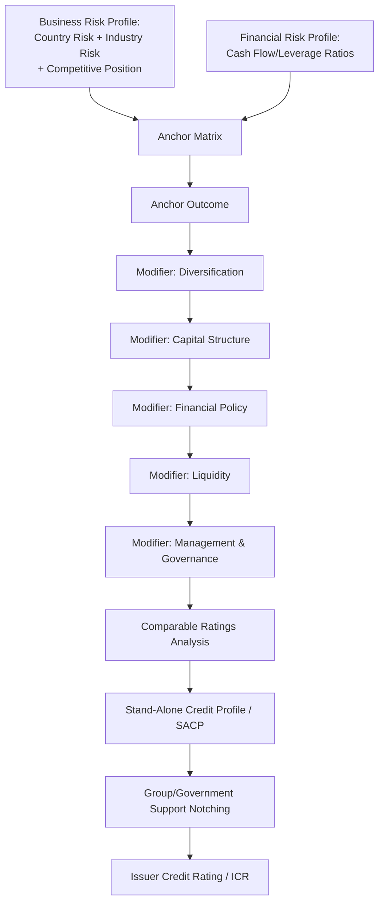
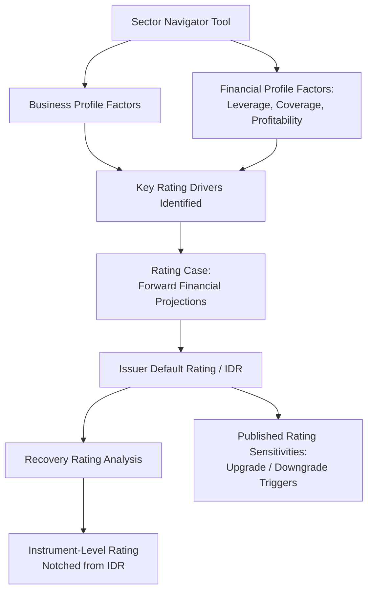

## Credit Rating Agency Methodologies: S&P, Moody's, and Fitch

### Definition and Purpose

Credit rating agencies (CRAs) — principally S&P Global Ratings, Moody's Investors Service, and Fitch Ratings — assign standardized opinions on the relative creditworthiness of issuers and specific debt instruments. These ratings serve as a common reference point across capital markets for pricing risk, satisfying regulatory capital requirements, and setting eligibility criteria for institutional investment mandates (e.g., investment-grade-only bond funds).

**Key Points**

- Ratings are forward-looking, relative opinions of default probability (and, for issue-level ratings, expected loss severity) — not guarantees, audits, or investment recommendations.
- All three agencies use a similar overall analytical architecture: a business/qualitative risk assessment combined with a financial/quantitative risk assessment, producing an anchor or baseline outcome that is then adjusted by modifiers (liquidity, structural features, governance, group support, government support, and comparable peer analysis).
- Despite structural similarity, each agency's specific scoring mechanics, terminology, and modifier weighting differ, which can produce **rating splits** (differing ratings for the same issuer/instrument across agencies) even when analysts broadly agree on the underlying credit facts.

### Rating Scale Comparison

| Category | S&P | Moody's | Fitch |
| --- | --- | --- | --- |
| Highest quality | AAA | Aaa | AAA |
| High grade | AA+/AA/AA- | Aa1/Aa2/Aa3 | AA+/AA/AA- |
| Upper medium grade | A+/A/A- | A1/A2/A3 | A+/A/A- |
| Lower medium grade (lowest investment grade) | BBB+/BBB/BBB- | Baa1/Baa2/Baa3 | BBB+/BBB/BBB- |
| Speculative (non-investment grade) | BB+/BB/BB- | Ba1/Ba2/Ba3 | BB+/BB/BB- |
| Highly speculative | B+/B/B- | B1/B2/B3 | B+/B/B- |
| Substantial risk | CCC+/CCC/CCC- | Caa1/Caa2/Caa3 | CCC+/CCC/CCC- |
| Extremely speculative | CC | Ca | CC |
| Default / near-default | D / SD | C | RD / D |

**Key Points**

- The **investment grade / speculative grade (high-yield) boundary** sits at BBB-/Baa3 for S&P/Fitch and Moody's respectively — this threshold has substantial practical significance because many institutional investment mandates, insurance company capital charges, and regulatory frameworks reference this boundary directly.
- S&P and Fitch use "+/-" modifiers within each letter category; Moody's uses numerical modifiers (1, 2, 3) with 1 indicating the higher end of the category.

### S&P Global Ratings Methodology

**Core Framework: Business Risk Profile and Financial Risk Profile**

S&P's corporate methodology combines an assessment of business risk profile and financial risk profile to produce an "anchor" outcome, which is then adjusted by modifiers to arrive at the stand-alone credit profile (SACP) and, ultimately, the issuer credit rating (ICR).

**Business Risk Profile** components:

1. Country risk (economic and institutional/governance risk in the countries where the issuer operates)
2. Industry risk (cyclicality, competitive intensity, barriers to entry, growth prospects)
3. Competitive position (market share, cost position, product diversification, profitability relative to peers)

**Financial Risk Profile** components:

- Primarily driven by cash flow/leverage analysis, using core ratios such as funds from operations (FFO) to debt, debt to EBITDA, and free operating cash flow to debt.

$$\text{FFO to Debt} = \frac{\text{Funds From Operations}}{\text{Total Adjusted Debt}}$$

**Anchor Matrix**

S&P combines the business risk profile assessment (ranging from "excellent" to "vulnerable") with the financial risk profile assessment (ranging from "minimal" to "highly leveraged") in a matrix to produce an anchor score.

**Modifiers Applied to the Anchor**

1. Diversification/portfolio effect
2. Capital structure (currency mismatches, structural subordination)
3. Financial policy (management's stated leverage targets and capital allocation priorities)
4. Liquidity (assessed on a descriptive scale from "exceptional" to "weak")
5. Management and governance
6. Comparable ratings analysis (a final holistic check against similarly-rated peers)

For entities with government or group support considerations, S&P applies additional notching for extraordinary support likelihood.

**Example**

A mid-sized industrial manufacturer assessed with a "satisfactory" business risk profile and "significant" financial risk profile might map to a "bb+" anchor under S&P's matrix. If the company has strong, well-articulated financial policies (conservative leverage targets, consistent deleveraging history) and "adequate" liquidity, the SACP could be affirmed at bb+ or modestly adjusted upward; weak liquidity or an aggressive, debt-funded acquisition strategy would typically pressure the SACP downward, potentially to bb or bb-.

### Moody's Investors Service Methodology

**Core Framework: Scorecard-Based Rating Methodologies**

Moody's employs sector-specific "rating methodology" scorecards that assign weighted scores to a defined set of factors and sub-factors, mapping to indicated rating outcomes that serve as a starting point (not a mechanical determinant) for the assigned rating.

**Typical Scorecard Factor Categories** (illustrative — varies by sector methodology):

1. **Scale** (revenue size, often used as a proxy for business complexity and diversification)
2. **Business Profile** (market position, diversification, regulatory/competitive environment)
3. **Profitability and Efficiency** (margins, returns)
4. **Leverage and Coverage** (debt/EBITDA, EBIT/interest expense, retained cash flow/debt)
5. **Financial Policy** (in some sector scorecards, assessed as a standalone factor)

Each factor and sub-factor is assigned a weight (expressed as a percentage of the overall scorecard), and the weighted composite score maps to an indicated rating range via a published grid.

$$\text{Scorecard-Indicated Outcome} = \sum_{i} (\text{Factor}_i \text{ Score} \times \text{Factor}_i \text{ Weight})$$

**Key Points**

- Moody's explicitly frames scorecard outputs as **indicative**, not determinative — published methodology documents typically state that the actual assigned rating may differ from the scorecard-indicated outcome due to analyst judgment incorporating factors not fully captured by the scorecard (e.g., forward-looking considerations, event risk, management credibility).
- Moody's ratings incorporate an explicit **Loss Given Default (LGD)** framework for instrument-level ratings in some sectors, formally linking the issuer-level probability of default assessment with instrument-specific expected loss severity to produce notching between different debt instruments in the same capital structure.
- Government-related issuers and entities with potential parental/affiliate support are assessed using a **joint-default analysis (JDA)** framework, blending the standalone baseline credit assessment (BCA) with an assessment of support probability and dependence.

**Example**

Under a hypothetical Moody's scorecard for a business services company, "Scale" (weighted 10%) might score at the "Baa" level based on revenue, "Business Profile" (weighted 25%) at the "Ba" level reflecting customer concentration, and "Leverage and Coverage" (weighted 40%, combining sub-factors like debt/EBITDA and EBITA/interest) at the "B" level reflecting high leverage. The weighted composite might indicate a "Ba3" outcome; the assigned rating could deviate from this (e.g., to B1) if the analyst incorporates a forward view of near-term deleveraging risk or refinancing risk not fully captured by trailing financial ratios.

### Fitch Ratings Methodology

**Core Framework: Key Rating Drivers and Sector Navigators**

Fitch's corporate rating methodology is organized around identification of **Key Rating Drivers (KRDs)** — the specific factors an analyst determines to be most material to a given issuer's credit profile — assessed using sector-specific "Navigator" tools that provide standardized scoring benchmarks across factor categories.

**Typical Navigator Factor Categories**:

1. **Business Profile** (operating environment, sector characteristics, competitive positioning, diversification)
2. **Financial Profile**, including:
   - Profitability
   - Leverage (gross and net debt/EBITDA)
   - Coverage (EBITDA/interest expense)
   - Financial structure and liquidity

**Rating Case and Sensitivity Analysis**

A distinguishing feature of Fitch's approach is the explicit publication of a **"Rating Case"** — a forward-looking financial projection (typically covering several years) reflecting Fitch's own assumptions (often more conservative than management's base case), alongside **rating sensitivities** that describe the specific quantitative and qualitative factors that could lead to a positive or negative rating action.

**Key Points**

- Fitch ratings reports typically publish explicit upgrade and downgrade sensitivity triggers (e.g., "leverage sustained below 3.0x could lead to a positive rating action; leverage sustained above 4.5x could lead to a negative rating action"), providing more direct forward guidance on rating trajectory compared to some peer disclosures.
- Fitch's Navigator tool visually displays factor scores (typically on a color-coded scale) benchmarked against the assigned rating category, offering transparency into which factors are constraining or supporting the rating relative to sector peers.
- Similar to Moody's, Fitch incorporates **Recovery Ratings** for speculative-grade issuers, assessing expected recovery in a default scenario to notch instrument-level ratings above or below the issuer default rating (IDR) based on relative priority and collateral coverage.

### Comparative Summary of Methodological Approaches

| Dimension | S&P | Moody's | Fitch |
| --- | --- | --- | --- |
| Core structure | Business risk / financial risk profile matrix → anchor → modifiers | Weighted factor scorecard → indicated outcome → analyst judgment | Key Rating Drivers via sector Navigator → IDR → recovery notching |
| Primary quantitative anchor | Anchor matrix (business risk x financial risk) | Weighted scorecard composite | Navigator factor scores + Rating Case projections |
| Explicit forward guidance | Outlook (Positive/Stable/Negative/Developing) | Outlook + scorecard trend commentary | Explicit numerical rating sensitivities (upgrade/downgrade triggers) |
| Instrument-level notching approach | Issue rating notched from ICR based on subordination/recovery analysis | Formal LGD framework in select sectors | Recovery Rating framework, IDR + notching |
| Support/affiliation framework | Group and government support notching | Joint-Default Analysis (JDA), Baseline Credit Assessment (BCA) | Support-driven rating uplift methodology (parent/subsidiary linkage) |
| Terminology for standalone credit | Stand-Alone Credit Profile (SACP) | Baseline Credit Assessment (BCA) | Standalone rating factors within IDR framework |

### Sources of Rating Splits

**Key Points**

Even with broadly similar architectures, rating splits between agencies commonly arise from:

1. **Differing sector weightings**: One agency's scorecard/matrix may weight leverage more heavily relative to business profile/qualitative factors than another.
2. **Differing treatment of hybrid instruments and off-balance-sheet items**: Agencies apply different equity/debt content classifications to instruments like preferred stock, convertible debt, and operating leases, producing different adjusted leverage figures from the same underlying financial statements.
3. **Differing forward-looking assumptions**: Fitch's explicit "Rating Case" may embed different macro or company-specific assumptions than Moody's scorecard inputs (which may rely more heavily on trailing and near-term projected metrics) or S&P's financial risk profile assessment.
4. **Differing support/notching frameworks**: Divergent views on parent, government, or group support likelihood can produce different uplift (or the absence of uplift) above an otherwise similar standalone assessment.

[Inference] The precise magnitude and frequency of rating splits across the three major agencies varies by sector, geography, and credit cycle, and would require current empirical data (e.g., published split-rating studies) to quantify accurately for any specific analytical purpose.

### Relevance to Capital Structuring and Syndication

**Key Points**

- Rating agency methodologies directly inform **pricing grids** in credit agreements (margin/spread tied to issuer or facility rating level) and covenant thresholds calibrated to preserve a target rating.
- **Instrument-level notching practices** (S&P issue ratings, Moody's LGD framework, Fitch Recovery Ratings) are directly relevant to structuring decisions around collateral packages, guarantee scope, and lien priority — a well-structured, well-secured facility will typically receive a higher instrument-level rating (or smaller downward notch from the issuer-level rating) than an unsecured or structurally subordinated instrument at the same issuer.
- Sponsors and arrangers frequently engage rating agencies pre-syndication to obtain preliminary/indicative feedback on how proposed capital structure alternatives (e.g., first lien/second lien split, guarantee scope, dividend recapitalization sizing) would likely be assessed, directly informing structuring decisions before final terms are locked.

**Conclusion**

S&P, Moody's, and Fitch each apply a broadly comparable analytical architecture — combining qualitative business/industry assessment with quantitative financial risk analysis to produce a baseline credit outcome, then applying structural, liquidity, governance, and support-related modifiers — but differ meaningfully in their specific mechanics: S&P's anchor matrix and modifier framework, Moody's weighted scorecard with explicit LGD/JDA frameworks, and Fitch's Key Rating Driver/Navigator approach with published forward-looking Rating Cases and explicit sensitivity triggers. Understanding these methodological differences is essential for capital structuring professionals seeking to anticipate rating outcomes, calibrate instrument-level structuring (collateral, guarantees, subordination) to target rating objectives, and explain rating splits to investors during syndication.

**Next Steps**

- Notching Methodologies and Instrument-Level Rating Differentiation
- Recovery Rating Analysis and Loss Given Default (LGD) Frameworks
- Rating Agency Pre-Syndication Engagement and Indicative Feedback Process
- EBITDA Adjustments and Leverage Ratio Calculation Differences Across Agencies
- Government-Related Issuer Support Frameworks and Sovereign Ceiling Considerations
- Pricing Grids and Ratings-Based Margin Step-Ups in Credit Agreements
- Outlook and Watch/Review Designations Across Agencies