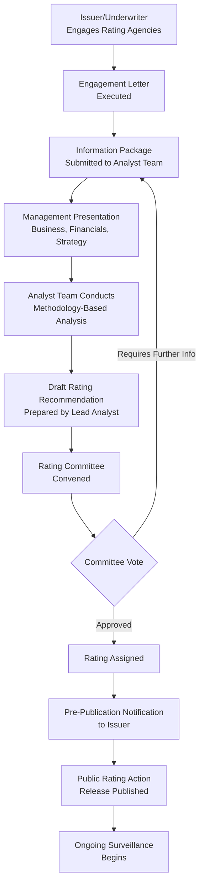
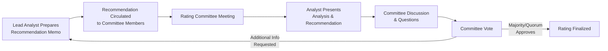

## Corporate Credit Rating Process for New Issuances

### Definition and Purpose

The corporate credit rating process for new issuances is the sequence of engagement, analysis, review, and disclosure steps through which an issuer obtains a credit rating from one or more nationally recognized statistical rating organizations (NRSROs, e.g., S&P, Moody's, Fitch) in connection with a new debt offering — whether a syndicated bank loan, a public or Rule 144A bond issuance, or a structured facility.

**Key Points**

- The rating process runs largely in parallel with, and materially informs, the broader syndication timeline: pricing, investor marketing, and final allocation decisions typically depend on having at least a preliminary or indicative rating in hand.
- Distinct from an existing issuer's periodic surveillance review, the new issuance process involves an initial mandate, comprehensive first-time (or updated) analysis, and formal rating committee action, generally on a compressed timeline driven by market windows and underwriter deal schedules.

### Stage 1: Mandate and Engagement

**Key Points**

- The issuer (or its financial advisor/underwriter on its behalf) formally engages one or more rating agencies, typically selecting 2–3 agencies for a syndicated bank loan or public bond offering to maximize investor eligibility and pricing efficiency (many institutional mandates require ratings from at least two agencies).
- An engagement letter is executed specifying the scope of the rating (issuer rating, specific instrument rating, or both), fee structure, and confidentiality terms.
- The issuer designates a primary analyst team (a lead analyst and a backup/secondary analyst) from each engaged agency.

**Example**

A sponsor preparing to syndicate a $750,000,000 term loan B alongside a concurrent $400,000,000 senior notes offering will typically engage both a public/private issuer rating and instrument-specific (facility) ratings from two or three agencies simultaneously, allowing the arranger to market the transaction to a broad institutional investor base (many of which have minimum rating-count eligibility requirements written into their investment guidelines).

### Stage 2: Information Gathering and Management Presentation

**Key Points**

The issuer provides the rating agency team with a comprehensive information package, typically including:

1. Historical audited financial statements (typically 3–5 years)
2. Financial projections/forecasts (often 3–5 years forward, prepared by management or the arranger)
3. Detailed capital structure and proposed transaction terms (draft credit agreement/indenture, use of proceeds, pro forma capitalization table)
4. Business overview materials (investor presentation, industry/competitive positioning data, customer/supplier concentration data)
5. Legal and structural documentation (organizational chart, material contracts, litigation disclosures)

**Management Presentation/Meeting**

A formal meeting (in-person or virtual) between the issuer's senior management team (typically CEO and CFO) and the rating agency analyst team, covering:

- Business strategy and competitive positioning
- Historical financial performance drivers and variance explanations
- Forward-looking financial projections and underlying assumptions
- Capital allocation priorities and financial policy (leverage targets, dividend/buyback philosophy, M&A appetite)
- Specific terms of the proposed new issuance and intended use of proceeds

[Inference] The depth and formality of the management presentation may be reduced for smaller issuers, follow-on issuances by frequent issuers, or agencies that already maintain an existing surveillance relationship with the issuer, compared to a full first-time (unsolicited-to-solicited) rating assignment.

### Stage 3: Analytical Process

The lead analyst applies the agency's relevant sector methodology (see comparative methodology discussion in the prior chapter item) to develop:

1. A business risk/qualitative assessment (industry risk, competitive position, country/operating environment risk)
2. A financial risk/quantitative assessment (historical and projected leverage, coverage, and cash flow metrics, adjusted per the agency's standard analytical adjustments — e.g., operating lease capitalization, pension underfunding treatment, hybrid securities equity/debt content)
3. A preliminary indicated outcome (an anchor, scorecard-indicated result, or Navigator-driven assessment depending on the agency), which is then evaluated against modifiers (liquidity, financial policy, governance, structural/subordination considerations)

**Key Points**

- For **new issuance instrument ratings** specifically (as opposed to the overall issuer rating), the analyst additionally performs a **notching analysis**, comparing the priority, security, and structural position of the new instrument relative to other debt in the capital structure to determine whether the instrument rating should be set above, at, or below the issuer-level rating.
- Analysts typically prepare a draft rating recommendation memorandum, which is circulated to the rating committee members in advance of the committee meeting.

### Stage 4: Rating Committee

**Key Points**

- The rating committee is the formal decision-making body — the lead analyst does not unilaterally assign the rating; rather, the analyst presents a recommendation to a committee composed of other senior analysts and, at some agencies, a designated committee chair, who vote on the final rating outcome.
- This structure is a core element of NRSRO governance frameworks (in the U.S., subject to SEC oversight under the Credit Rating Agency Reform Act and related rules), intended to reduce the risk that a single analyst's judgment (or potential conflicts of interest, such as pressure from a fee-paying issuer) improperly influences the outcome.
- Committee composition and voting procedures vary by agency but generally require a quorum of voting members and a specified majority (or, at some agencies, chair-weighted) decision process.
- The committee may approve the recommended rating as presented, adjust it (up or down), request additional information/analysis before finalizing, or in rare cases decline to assign a rating.

### Stage 5: Notification, Publication, and Appeal

**Key Points**

- Prior to public release, the issuer is typically notified of the rating outcome and given a limited window (often 24–48 hours, per agency policy and applicable regulation) to identify any factual errors or request review of the analysis — this is generally **not** an opportunity to lobby for a different rating outcome based on disagreement with analytical judgment, but rather a factual-accuracy check.
- If the issuer identifies a material factual error, the agency will typically reconvene or the analyst will address it, potentially through an expedited follow-up committee review, before publication.
- Following the notification period, the agency publishes a formal rating action release (a "new issue report" or "rating action commentary"), including the assigned rating(s), outlook, key rating drivers/rationale, and (for instrument-level ratings) any notching rationale relative to the issuer rating.
- [Unverified — jurisdiction and agency-specific] The precise notification window, appeal rights, and disclosure requirements are governed by applicable securities regulation (e.g., SEC rules for U.S.-registered NRSROs, ESMA rules for EU-registered CRAs) and individual agency published policies, which should be verified against current regulatory and agency-specific procedures for any specific transaction.

### Stage 6: Ongoing Surveillance

Once assigned, the new issuance rating (and associated issuer rating) transitions into the agency's ongoing surveillance process:

- Periodic reviews (commonly annual, or more frequent for lower-rated/higher-volatility credits)
- Event-driven reviews triggered by material developments (earnings releases showing significant variance from projections, M&A announcements, leverage-increasing transactions, management changes, litigation developments)
- Assignment of rating outlooks (Positive/Stable/Negative/Developing) and, where applicable, CreditWatch/Rating Watch designations signaling a heightened likelihood of near-term rating action

**Key Points**

- Surveillance ratings are subject to the same committee-based governance process as new issuance ratings — an analyst cannot unilaterally change a rating outside of the committee framework.

### Parallel Timeline: Rating Process and Syndication Process

**Example**

In a typical broadly syndicated leveraged loan/high-yield bond transaction, the rating process timeline commonly runs as follows (illustrative, deal-specific timing varies substantially):

| Week | Syndication Activity | Rating Process Activity |
| --- | --- | --- |
| Week 1–2 | Underwriters finalize term sheet, begin due diligence | Issuer engages rating agencies; information package delivered |
| Week 2–3 | Draft credit agreement/offering memorandum circulated | Management presentation conducted; analyst team begins detailed review |
| Week 3–4 | Roadshow/investor marketing begins (often with only preliminary/expected ratings disclosed) | Rating committee convened; preliminary rating determined |
| Week 4 | Pricing and allocation finalized | Formal rating action published (or affirmed) concurrent with or shortly before pricing |
| Post-closing | Ongoing reporting per credit agreement/indenture covenants | Rating enters surveillance cycle |

[Inference] Actual timelines compress significantly for well-known, frequent issuers with existing agency relationships (sometimes to 1–2 weeks) and extend for first-time issuers, complex carve-out/spin-off transactions, or cross-border structures requiring additional legal and structural analysis.

### Instrument-Level Rating Considerations for New Issuances

**Key Points**

- For a new issuance that is one tranche within a larger capital structure (e.g., a new second lien term loan issued alongside existing first lien debt), the rating process includes an explicit **relative ranking analysis**, assessing:
  - Collateral coverage and lien priority relative to other secured debt
  - Guarantee scope (does the new tranche benefit from the same guarantor pool as existing debt?)
  - Structural seniority/subordination (debt at the operating company level vs. holding company level)
- This analysis directly determines the notching differential between the new instrument's rating and the overall issuer/corporate family rating — a well-collateralized, senior-most tranche will often be notched above the issuer rating, while an unsecured or structurally subordinated tranche will typically be notched below it.

**Example**

An issuer with a "B1" corporate family rating (Moody's) issuing a new senior secured first lien term loan with a strong collateral package and broad guarantor coverage might receive an instrument rating of "Ba3" (one notch above the corporate family rating) reflecting a stronger expected recovery in a default scenario, while a concurrently issued senior unsecured note from the same issuer might be rated "B3" (one notch below), reflecting weaker expected recovery given its subordinated position relative to the secured term loan.

### Confidential/Private Ratings and Indicative Feedback

**Key Points**

- Issuers (particularly private equity sponsors evaluating financing alternatives pre-launch) frequently request **private or "shadow" ratings** — confidential indicative assessments not intended for public disclosure — to inform capital structure decisions (e.g., comparing the likely rating outcome, and associated pricing implications, of alternative leverage levels or collateral structures) before committing to a public rating mandate.
- These private engagements typically follow a similar analytical process (information submission, analyst review, potentially an informal committee-equivalent review) but without the formal publication step, and may be converted to a public rating later if the issuer proceeds with a public or broadly marketed transaction.

**Conclusion**

The corporate credit rating process for new issuances is a structured, multi-stage sequence — engagement, information gathering and management presentation, methodology-driven analysis, formal committee deliberation, notification and publication, and transition into ongoing surveillance — that runs in close parallel with the broader syndication and marketing timeline. For capital structuring professionals, understanding this process is essential not only for timeline planning but also for anticipating how proposed structural features (collateral, guarantees, subordination, financial policy commitments) will be assessed and notched during the rating committee's deliberation, directly influencing the final cost and structure of the financing.

**Related Topics**

- Credit Rating Agency Methodologies: S&P, Moody's, and Fitch
- Notching Methodologies and Instrument-Level Rating Differentiation
- Rating Agency Pre-Syndication Engagement and Indicative Feedback
- NRSRO Regulatory Oversight and Rating Committee Governance
- Corporate Family Ratings vs. Issuer and Instrument Ratings
- Outlook, CreditWatch, and Rating Watch Designations
- Syndication Timeline and Roadshow Mechanics
- Recovery Rating Analysis and Loss Given Default Frameworks