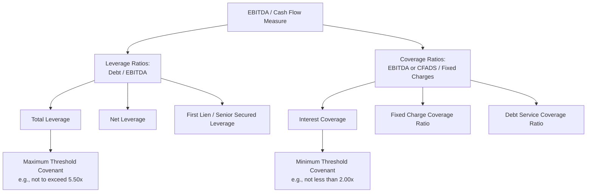

## Key Credit Metrics: Leverage, Coverage, and Liquidity Ratios

### Definition and Purpose

Leverage, coverage, and liquidity ratios are the core quantitative metrics used by lenders, rating agencies, and credit analysts to assess an issuer's capital structure risk, debt-servicing capacity, and near-term solvency. These ratios translate financial statement data into standardized measures that support covenant design, pricing decisions, and comparative credit analysis across issuers and industries.

**Key Points**

- **Leverage ratios** measure the magnitude of debt relative to earnings, cash flow, or capital, addressing the question: "how much debt does this issuer carry relative to its capacity to generate value?"
- **Coverage ratios** measure the issuer's capacity to service debt obligations (interest and/or principal) from current earnings or cash flow, addressing the question: "can this issuer comfortably pay what it owes as it comes due?"
- **Liquidity ratios** measure near-term solvency — the availability of cash and readily convertible assets relative to near-term obligations, addressing the question: "can this issuer meet its obligations over the next 12 months without external financing or asset sales?"

### Leverage Ratios

**Total Debt to EBITDA (Total Leverage Ratio)**

The most widely used leverage metric in credit agreements, measuring gross debt relative to a cash-flow proxy (EBITDA).

$$\text{Total Leverage Ratio} = \frac{\text{Total Debt}}{\text{EBITDA}}$$

**Net Debt to EBITDA (Net Leverage Ratio)**

Adjusts total debt for unrestricted cash and cash equivalents, reflecting the view that cash on hand could be used to immediately pay down debt.

$$\text{Net Leverage Ratio} = \frac{\text{Total Debt} - \text{Unrestricted Cash}}{\text{EBITDA}}$$

**First Lien Leverage Ratio**

Isolates only first lien secured debt relative to EBITDA, used specifically in credit agreements with multiple layers of secured/unsecured debt to test incurrence capacity for additional first-lien-ranking debt.

$$\text{First Lien Leverage Ratio} = \frac{\text{First Lien Secured Debt}}{\text{EBITDA}}$$

**Senior Secured Leverage Ratio and Total Net Leverage Ratio**

Variations that isolate specific debt tranches (senior secured debt only) or combine all debt classes net of cash, used as distinct covenant tests calibrated to different tranches within the capital structure.

**Key Points**

- The precise definition of "Debt" for leverage ratio purposes is a heavily negotiated defined term in credit agreements — it typically includes borrowed money and capital lease obligations, and may include or exclude items such as: undrawn letters of credit, earnout obligations, preferred stock, and off-balance-sheet financing arrangements, depending on negotiated definitions.
- The precise definition of "EBITDA" (and its adjusted variant) is equally, if not more, heavily negotiated — see related discussion of EBITDA add-back definitions — as the denominator's size directly determines available covenant headroom.

**Example**

An issuer with $450,000,000 of total funded debt, $50,000,000 of unrestricted cash, and $100,000,000 of trailing-twelve-month EBITDA has:

$$\text{Total Leverage Ratio} = \frac{450{,}000{,}000}{100{,}000{,}000} = 4.5x$$

$$\text{Net Leverage Ratio} = \frac{450{,}000{,}000 - 50{,}000{,}000}{100{,}000{,}000} = 4.0x$$

If $300,000,000 of the total debt is first lien secured:

$$\text{First Lien Leverage Ratio} = \frac{300{,}000{,}000}{100{,}000{,}000} = 3.0x$$

### Coverage Ratios

**Interest Coverage Ratio (EBITDA/Interest Expense)**

Measures the multiple by which earnings before interest, taxes, depreciation, and amortization exceed cash interest obligations.

$$\text{Interest Coverage Ratio} = \frac{\text{EBITDA}}{\text{Cash Interest Expense}}$$

**Fixed Charge Coverage Ratio (FCCR)**

A broader coverage measure incorporating additional mandatory fixed obligations beyond interest — commonly scheduled debt amortization, capital lease payments, and sometimes capital expenditures and/or taxes and dividends — used extensively as both a maintenance covenant (in asset-based lending) and an incurrence test (for restricted payments/debt baskets).

$$\text{FCCR} = \frac{\text{EBITDA} - \text{Unfinanced Capex} - \text{Cash Taxes}}{\text{Cash Interest Expense} + \text{Scheduled Debt Amortization} + \text{Capital Lease Payments}}$$

[Inference] The exact FCCR formula construction varies significantly across credit agreements — some exclude capital expenditures from the numerator entirely, others net only "maintenance" capex, and treatment of dividends/distributions in the denominator is inconsistent across market precedent — the formula above reflects a common but non-universal construction.

**Debt Service Coverage Ratio (DSCR)**

Common in project finance and real estate lending, measuring cash flow available for debt service relative to total scheduled debt service (principal plus interest).

$$\text{DSCR} = \frac{\text{Net Operating Income (or CFADS)}}{\text{Total Debt Service (Principal + Interest)}}$$

Where CFADS refers to "Cash Flow Available for Debt Service," a project finance-specific cash flow measure.

**Key Points**

- Coverage ratios are typically structured as **minimum** thresholds in covenants (e.g., "FCCR shall not be less than 1.10x"), the inverse convention of leverage ratios, which are structured as **maximum** thresholds (e.g., "Total Leverage Ratio shall not exceed 5.50x").
- A DSCR or FCCR below 1.0x indicates that operating cash flow is insufficient to cover fixed debt service obligations without drawing on reserves, additional financing, or asset sales — a critical red flag in credit analysis.

**Example**

A project finance vehicle generates $45,000,000 of CFADS in a given period against total scheduled debt service (principal amortization plus interest) of $36,000,000:

$$\text{DSCR} = \frac{45{,}000{,}000}{36{,}000{,}000} = 1.25x$$

A DSCR of 1.25x indicates a 25% cushion above the minimum cash flow required to service scheduled debt — project finance credit agreements commonly require a minimum DSCR covenant (e.g., 1.20x) tested at each debt service payment date, with mechanisms such as debt service reserve accounts and cash sweep/lock-up provisions triggered if the ratio falls within a specified band above the minimum but below a target level.

### Liquidity Ratios

**Current Ratio**

A traditional balance-sheet-based liquidity measure comparing current assets to current liabilities.

$$\text{Current Ratio} = \frac{\text{Current Assets}}{\text{Current Liabilities}}$$

**Quick Ratio (Acid-Test Ratio)**

A more conservative liquidity measure excluding inventory (and sometimes other less-liquid current assets) from the numerator, reflecting the view that inventory may not be readily convertible to cash at book value in a stress scenario.

$$\text{Quick Ratio} = \frac{\text{Cash} + \text{Marketable Securities} + \text{Accounts Receivable}}{\text{Current Liabilities}}$$

**Liquidity Runway / Cash Burn Analysis**

Particularly relevant for non-investment-grade, high-growth, or turnaround credits, measuring the number of months or years of operating runway available before cash reserves are exhausted at the current cash burn rate.

$$\text{Liquidity Runway (months)} = \frac{\text{Cash and Available Revolver Capacity}}{\text{Average Monthly Cash Burn}}$$

**Key Points**

- Rating agencies (as discussed in the prior chapter item) typically assess liquidity using a broader, more qualitative descriptive framework (e.g., S&P's "exceptional" to "weak" liquidity descriptors) that incorporates not just balance sheet ratios but also: availability and headroom under revolving credit facilities, upcoming debt maturities relative to available sources, covenant headroom, and access to capital markets.
- In leveraged finance specifically, **revolver availability** (undrawn capacity under a committed revolving credit facility, net of any borrowing base limitations) is often a more decision-relevant liquidity metric than traditional balance sheet current/quick ratios, since revolver capacity represents a committed, immediately accessible source of liquidity.

**Example**

A borrower with $25,000,000 of unrestricted cash and $60,000,000 of undrawn availability under its revolving credit facility (net of any borrowing base limitations and outstanding letters of credit), facing average monthly cash burn of $7,000,000 during a period of operating stress, has:

$$\text{Liquidity Runway} = \frac{25{,}000{,}000 + 60{,}000{,}000}{7{,}000{,}000} \approx 12.1 \text{ months}$$

This runway calculation directly informs both lender risk assessment and, from the borrower's side, the urgency of pursuing refinancing, asset sales, or operational restructuring initiatives.

### Interaction with Covenant Structuring

**Key Points**

- **Leverage ratios** most commonly appear as maximum incurrence tests (governing the ability to incur additional debt, make restricted payments, or complete acquisitions) and, in cov-heavy structures, as maintenance covenants tested quarterly (see prior chapter item on covenant-lite structuring).
- **Coverage ratios**, particularly FCCR, are frequently used in asset-based lending as a "springing" maintenance covenant, tested only when revolver excess availability falls below a specified threshold — directly linking a liquidity trigger (low availability) to a coverage-based financial test.
- **Liquidity metrics** rarely appear as formal covenant tests in their own right (unlike leverage/coverage ratios), but are heavily scrutinized in credit agreement negotiations around minimum liquidity requirements, MFN-adjacent "most favored lender" liquidity reserve provisions, and springing covenant trigger thresholds tied to availability.

### Ratio Definitional Nuances Across Contexts

| Ratio Type | Bank Credit Agreement Convention | Rating Agency Convention | High-Yield Indenture Convention |
| --- | --- | --- | --- |
| EBITDA basis | Heavily adjusted (add-backs for synergies, restructuring, non-recurring items) | Standardized analytical adjustments (lease capitalization, pension, one-time items per house methodology) | Often similarly adjusted to bank agreement, sometimes with even broader add-back flexibility |
| Debt basis | Defined term excluding/including specific items per negotiation | Adjusted debt incorporating agency-standard treatment of hybrids, leases, pensions | Defined term per indenture, often narrower exclusions than bank agreements |
| Testing frequency | Quarterly (maintenance) or event-driven (incurrence) | Continuous surveillance, periodic formal review | Event-driven (incurrence-based) almost universally |
| Net vs. gross leverage | Both used; gross more common in maintenance covenants | Agencies typically calculate both and may weight net leverage in liquidity assessment | Both used; net leverage common in restricted payment baskets |

[Inference] The degree of divergence between "credit agreement EBITDA" (heavily negotiated, borrower-favorable add-backs) and a rating agency's or a fundamental credit analyst's own adjusted EBITDA can be substantial in aggressively negotiated sponsor-driven transactions — analysts frequently recalculate leverage using their own EBITDA definition rather than relying solely on the covenant-defined figure, producing a materially different (typically higher) leverage picture than the credit agreement's own compliance certificate would suggest.

### Practical Application: Building a Credit Metrics Summary

**Example**

A comprehensive credit metrics table for a leveraged issuer might be presented as follows (illustrative figures):

| Metric | Current Period | Prior Period | Covenant Threshold |
| --- | --- | --- | --- |
| Total Leverage Ratio | 5.2x | 5.6x | ≤ 6.50x (incurrence) |
| Net Leverage Ratio | 4.8x | 5.1x | N/A (informational) |
| First Lien Leverage Ratio | 3.5x | 3.8x | ≤ 4.25x (incurrence) |
| Interest Coverage Ratio | 2.6x | 2.3x | N/A (informational) |
| Fixed Charge Coverage Ratio | 1.35x | 1.22x | ≥ 1.10x (springing, ABL) |
| Liquidity Runway | 18 months | 14 months | N/A |

This type of summary table is standard in credit committee memoranda, rating agency presentations, and lender/investor reporting packages, allowing quick comparison of trend direction (improving/deteriorating) against both formal covenant thresholds and informational benchmarks.

**Conclusion**

Leverage, coverage, and liquidity ratios form the quantitative backbone of credit analysis, translating financial statement data into standardized measures of capital structure risk, debt-servicing capacity, and near-term solvency. While the underlying formulas are broadly consistent across market contexts, the precise definitions of key inputs — particularly EBITDA and Debt — vary substantially between bank credit agreements, high-yield indentures, and rating agency methodologies, making careful attention to definitional construction essential for accurate comparative analysis and effective covenant structuring.

**Related Topics**

- EBITDA Add-Back Definitions and Adjusted EBITDA Negotiation
- Debt Incurrence Covenants and Ratio Debt Baskets
- Covenant-Lite Structuring and Springing Covenant Mechanics
- Credit Rating Agency Methodologies: S&P, Moody's, and Fitch
- Asset-Based Lending and Borrowing Base Mechanics
- Project Finance Cash Flow Waterfalls and DSCR Reserve Accounts
- Compliance Certificates and Financial Reporting Covenants
- Cash Flow Forecasting and Liquidity Stress Testing