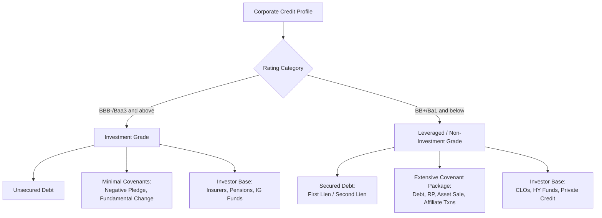
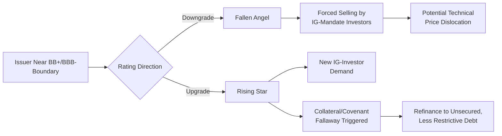

## Investment Grade versus Leveraged Credit Profiles

### Definition and Purpose

Investment grade and leveraged (non-investment grade, or "high-yield") credit profiles represent two structurally distinct categories of corporate credit risk, separated by the BBB-/Baa3 rating boundary (S&P/Fitch and Moody's, respectively). This boundary is not merely a labeling convention — it drives materially different financing structures, documentation conventions, investor bases, and analytical frameworks.

**Key Points**

- **Investment grade (IG)** issuers are generally characterized by lower leverage, stronger and more diversified cash flow generation, greater scale, and lower perceived default probability, typically financed with unsecured debt on a "covenant-lite" (in the IG sense — minimal, high-threshold covenants) basis.
- **Leveraged (non-investment grade)** issuers — including most private-equity-sponsored buyouts, smaller-cap companies, and companies with higher business or financial risk — are typically financed with secured debt, more extensive covenant packages, and are the primary constituents of the syndicated leveraged loan and high-yield bond markets.

### Comparative Framework

| Dimension | Investment Grade | Leveraged/Non-Investment Grade |
| --- | --- | --- |
| Typical rating range | BBB-/Baa3 and above | BB+/Ba1 and below |
| Typical leverage (Debt/EBITDA) | Generally below 3.0x–3.5x (highly sector-dependent) | Generally 4.0x–7.0x+ (sponsor-driven LBOs often at the higher end) |
| Typical security | Unsecured | Secured (first lien, often with second lien or unsecured layers) |
| Typical covenant structure | Minimal negative covenants; few or no maintenance financial covenants | Extensive negative covenant package; maintenance covenants common in revolvers, cov-lite common in institutional term loans |
| Primary debt instruments | Unsecured notes, commercial paper, revolving credit facilities | Term loan B, second lien loans, senior secured/unsecured high-yield notes |
| Primary investor base | Insurance companies, pension funds, IG-focused bond funds, banks | CLOs, leveraged loan mutual funds, high-yield bond funds, private credit/direct lenders, hedge funds |
| Typical use of ratings | Regulatory capital treatment, IG-mandate eligibility | Loan/bond pricing grids, CLO eligibility criteria, capital structure benchmarking |
| Documentation style | Shorter, more standardized (often based on established MTN/EMTN programs) | Highly negotiated, deal-specific, extensive defined terms |
| Rating agency methodology anchor | Business risk profile typically dominant relative to financial risk in the overall assessment | Financial risk profile (leverage/coverage) typically dominant given elevated debt levels |

[Inference] The specific leverage thresholds cited above are general market conventions and vary substantially by industry (e.g., regulated utilities and real estate frequently sustain higher leverage at investment-grade ratings than industrial or technology companies, given more stable/contracted cash flows) and by credit cycle.

### Structural and Documentation Differences

**Key Points**

**Security/Collateral**

- IG issuers typically borrow on an unsecured basis, reflecting lower perceived default risk and the negative signaling effect that granting security to one creditor class could have on remaining unsecured creditors and the issuer's broader capital markets access.
- Leveraged issuers typically grant comprehensive collateral packages (see prior chapter discussion of collateral packages and security interests) as compensation to lenders for materially higher default risk, directly improving expected recovery in a downside scenario.

**Covenant Package**

- IG credit agreements and indentures typically contain only a small number of negative covenants — commonly a negative pledge (restricting the incurrence of liens ranking ahead of the unsecured debt), a restriction on fundamental changes (mergers/consolidations), and a limitation on sale-and-leaseback transactions — with high, rarely-binding thresholds.
- Leveraged credit agreements contain the full negative covenant suite discussed throughout this chapter: debt incurrence, restricted payments, asset sales, affiliate transactions, and (in cov-heavy structures) maintenance financial covenants.

**Example**

An investment-grade industrial company's senior unsecured notes indenture might contain a single negative pledge covenant capped at a high threshold (e.g., restricting liens on principal properties exceeding 15–20% of consolidated net tangible assets), with no leverage or coverage-based incurrence tests at all. By contrast, a leveraged buyout's term loan B credit agreement for a similarly sized company might contain 8–12 distinct negative covenants with detailed basket structures, definitional carve-outs, and (if cov-lite) incurrence-based ratio tests replacing periodic maintenance covenants.

### Rating Agency Analytical Emphasis Differences

**Key Points**

- For **investment-grade issuers**, rating agency methodologies (as discussed in the prior chapter item) tend to place relatively greater emphasis on the **business risk profile** — industry structure, competitive position, scale, and diversification — because financial risk (leverage/coverage) is generally moderate and more stable across the rating category, making qualitative business factors more differentiating.
- For **leveraged issuers**, the **financial risk profile** (leverage, coverage, and liquidity) tends to dominate the analytical outcome, as elevated and often volatile leverage levels are the primary driver of default risk differentiation within the speculative-grade universe.
- **Financial policy** as a modifier carries particular weight for leveraged, sponsor-owned issuers — private equity ownership is generally associated with a more aggressive capital allocation posture (dividend recapitalizations, debt-funded acquisitions, opportunistic leverage increases), which agencies explicitly factor into the financial policy modifier or equivalent methodology component.

### Investor Base and Market Structure Implications

**Key Points**

- **Regulatory capital treatment**: Insurance companies and banks holding IG-rated debt generally benefit from materially lower regulatory capital charges than for equivalent holdings of non-investment-grade debt, creating strong structural demand for IG paper from these investor classes and correspondingly influencing pricing and structuring incentives for issuers seeking to remain (or become) investment grade.
- **CLO eligibility**: CLOs (the dominant buyer of institutional leveraged term loans) are structured with concentration limits, weighted average rating factor (WARF) tests, and other portfolio composition requirements specifically calibrated to the leveraged/speculative-grade universe — IG-rated loans are generally not the target asset class for CLO portfolios, reinforcing the market segmentation between the two credit categories.
- **Liquidity and trading conventions**: IG bonds generally trade in a more liquid, narrower bid-ask spread secondary market than leveraged loans or high-yield bonds, reflecting larger typical issue sizes, more standardized documentation, and a broader, more homogeneous buyer base.

### The "Crossover" Zone and Rating Transitions

**Key Points**

- The **BB+/BBB- boundary** (and its Moody's/Fitch equivalents) is often referred to as the "crossover" zone, and issuers near this threshold are subject to particular market attention because a rating migration across the boundary can trigger material practical consequences:
  - **Downgrade from IG to HY ("fallen angel")**: can trigger forced selling by IG-mandate-only investors (insurance companies, certain pension funds, IG-only bond index funds), often causing technical price dislocation independent of the underlying credit deterioration itself.
  - **Upgrade from HY to IG ("rising star")**: can trigger technical buying demand from IG-focused investors gaining new eligibility, and may allow the issuer to refinance secured, covenant-heavy debt with cheaper, less restrictive unsecured IG-style debt — often prompting a deliberate strategic push by issuers to achieve or maintain IG status once within reach.
- Some credit agreements and indentures explicitly incorporate **collateral/covenant fallaway provisions** (discussed in the prior chapter item on collateral packages) that automatically release security and/or suspend certain covenants upon achieving investment-grade ratings from a specified number of agencies, formally linking the rating crossover event to a contractual change in the debt's structural terms.

### Capital Structure Design Implications

**Example**

A company operating at 3.2x leverage with stable, diversified cash flows and a strong competitive position might be structured entirely with unsecured revolving credit and unsecured notes, targeting and maintaining a BBB- or higher rating to access the deepest, lowest-cost segment of the debt capital markets.

The same company, if acquired in a leveraged buyout and recapitalized to 6.5x leverage to fund the transaction, would necessarily transition to a leveraged credit profile: existing unsecured notes might be tendered for or refinanced, a new secured term loan B and/or second lien facility would be layered in with a full collateral package and negative covenant suite, and the company's investor base would shift from IG-focused institutional buyers to CLOs, leveraged loan funds, and high-yield investors.

[Speculation] Whether a specific issuer targets IG or leveraged status as a strategic capital structure objective depends on ownership structure (public/strategic vs. private equity), growth and M&A strategy, and management's risk tolerance — the decision is rarely purely a function of current financial metrics alone, as strategic and ownership considerations often dominate the choice.

### Distinguishing Analytical Vocabulary

**Key Points**

- Investment-grade analysis often references "credit profile stability" and "through-the-cycle" leverage tolerance, reflecting the longer investment horizon and lower risk tolerance of the typical IG investor base.
- Leveraged credit analysis places greater emphasis on "base case vs. downside case" scenario modeling, refinancing risk at specific maturity dates, and near-term catalyst analysis (asset sales, dividend recaps, sponsor exit timing), reflecting the shorter horizon, higher volatility, and event-risk sensitivity characteristic of the speculative-grade universe.

**Conclusion**

The investment grade / leveraged credit distinction is far more than a rating label — it reflects fundamentally different capital structures (unsecured vs. secured), covenant philosophies (minimal vs. extensive), investor bases (regulated institutional capital vs. CLOs/high-yield funds), and analytical frameworks (business-risk-weighted vs. financial-risk-weighted). For capital structuring professionals, correctly identifying which side of this boundary a transaction sits on — or anticipating a potential crossover — is foundational to designing appropriate security, covenant, and pricing structures, and to understanding the practical market and regulatory forces that shape investor demand at each end of the credit spectrum.

**Related Topics**

- Credit Rating Agency Methodologies: S&P, Moody's, and Fitch
- Key Credit Metrics: Leverage, Coverage, and Liquidity Ratios
- Covenant-Lite Structuring and Market Evolution
- Collateral Packages and Security Interests
- Fallen Angels and Rising Stars: Rating Transition Dynamics
- CLO Structures and Institutional Loan Investor Base
- Negative Pledge Covenants in Investment-Grade Documentation
- Dividend Recapitalizations and Sponsor Capital Allocation Strategy