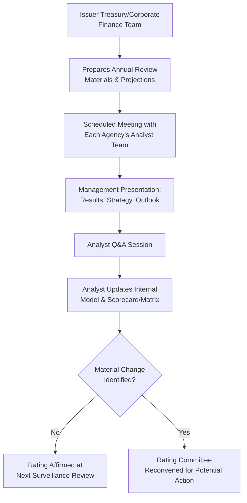
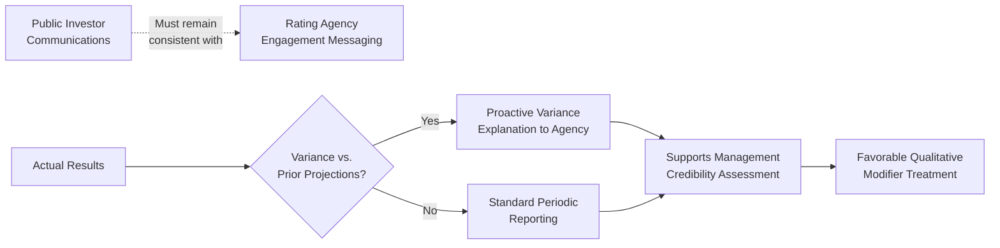

## Rating Agency Presentations and Issuer Engagement

### Definition and Purpose

Rating agency presentations and issuer engagement encompass the full set of communications, materials, and interactions through which an issuer manages its relationship with credit rating agencies — spanning the initial new issuance rating process (see prior chapter item), ongoing periodic surveillance reviews, and event-driven engagement triggered by material transactions or credit developments.

**Key Points**

- Effective issuer engagement is not a one-time event tied only to a new issuance — it is an ongoing relationship management function, typically owned by the treasury or corporate finance team, that materially influences how an agency's analyst team interprets financial results, understands strategic context, and calibrates judgment-based modifiers within its methodology.
- While rating agencies base their opinions on independent analysis and are prohibited from being unduly influenced by issuer advocacy, the quality, clarity, and completeness of issuer-provided information and context can meaningfully affect how favorably discretionary/qualitative factors (financial policy, management and governance, business risk narrative) are assessed within the agency's methodology framework.

### The Annual/Periodic Review Meeting

**Key Points**

Beyond the new-issuance management presentation, most rated issuers maintain a **recurring annual (or more frequent) review meeting** with each engaged rating agency's analyst team, covering:

1. Full-year (or trailing-twelve-month) financial results and variance versus prior guidance/projections
2. Updated financial projections and underlying assumptions for the forward period
3. Strategic developments (M&A activity, new product launches, restructuring initiatives, refinancing plans)
4. Capital allocation priorities and any changes to stated financial policy
5. Industry and competitive landscape updates relevant to the business risk assessment

**Example**

A leveraged issuer's annual rating agency review might be structured as: (i) a 30–45 minute management presentation covering the prior year's results and forward outlook, (ii) a detailed Q&A session addressing analyst follow-up questions on specific line items or covenant compliance trends, and (iii) a private discussion of any anticipated near-term financing activity (e.g., an upcoming refinancing of a maturing tranche, or a contemplated acquisition) that may not yet be public but is relevant to the agency's forward-looking assessment.

### Event-Driven Engagement

**Key Points**

Beyond scheduled periodic reviews, issuers are generally expected to proactively engage rating agencies around material events, including:

- Announced M&A transactions (acquisitions, divestitures, mergers)
- New debt issuances or material refinancing transactions
- Significant earnings variance from prior guidance or agency expectations
- Management changes at the CEO/CFO level
- Litigation, regulatory, or ESG-related developments with potential financial impact
- Changes in ownership structure (e.g., a sponsor exit via IPO, or a new leveraged buyout)

**Example**

Upon announcing a debt-funded acquisition that will materially increase pro forma leverage, an issuer would typically hold a dedicated call with each rating agency shortly after (or concurrent with) the public announcement, providing pro forma financial projections, integration and synergy assumptions, and anticipated deleveraging timeline — informing the agency's decision on whether to place the rating on CreditWatch/Rating Watch, affirm with a revised outlook, or take immediate rating action.

### CreditWatch, Rating Watch, and Outlook Communications

**Key Points**

- When an agency places a rating on **CreditWatch** (S&P terminology) or **Rating Watch** (Fitch terminology) — or, at Moody's, under **"review for upgrade/downgrade"** — this signals a heightened probability of near-term rating action (commonly resolved within 90 days, though this varies by agency policy and situation complexity), typically triggered by a specific pending event (an announced but unclosed M&A transaction, a pending refinancing, or a material pending disclosure).
- Issuers under CreditWatch/Rating Watch/Review typically engage in more frequent, targeted communication with the analyst team specifically addressing the triggering event and its likely resolution timeline, since the designation itself signals to the market that a change is under active consideration.
- **Outlook** designations (Positive/Stable/Negative/Developing) reflect a longer-term (typically 1–2 year) directional view and are generally addressed through the standard periodic review cycle rather than requiring dedicated interim engagement, absent a specific triggering event.

### Confidentiality and Material Non-Public Information (MNPI) Considerations

**Key Points**

- Issuer engagement with rating agencies frequently involves sharing information that has not yet been publicly disclosed (e.g., preliminary quarterly results ahead of public release, or details of a not-yet-announced transaction) — this is permissible under applicable securities regulation frameworks (e.g., Regulation FD in the U.S.) because rating agencies are typically treated under a specific regulatory exemption allowing confidential disclosure for rating purposes, provided the agency's own confidentiality and information-handling policies are followed.
- [Unverified — jurisdiction-specific] The precise scope and conditions of any such regulatory exemption (e.g., Regulation FD's rating agency exclusion in the U.S.) should be verified against current securities law guidance for the specific jurisdiction and disclosure context, as issuer counsel typically manages compliance around what information can be shared, when, and under what confidentiality protocols.
- Issuers must ensure that any material non-public information shared with a rating agency remains confidential and is not inadvertently used or disclosed by the agency in a manner that would constitute selective disclosure to the broader market ahead of the issuer's own public announcement.

### Building an Effective Issuer Engagement Program

**Key Points**

Common elements of a well-run issuer rating agency engagement program include:

1. **Consistent messaging discipline**: Ensuring that financial policy statements, leverage targets, and strategic priorities communicated to rating agencies are consistent with public investor communications (earnings calls, investor presentations) to avoid analyst confusion or perceived inconsistency that could undermine credibility.
2. **Proactive variance explanation**: When actual results diverge from prior projections shared with the agency, proactively explaining the variance (rather than waiting for the agency to raise it) supports a more favorable qualitative assessment of management credibility and forecasting discipline.
3. **Scenario-based forward guidance**: Providing base case and downside case projections (rather than only a single base case) helps the analyst team stress-test the credit profile using management's own assumptions, potentially reducing reliance on the agency's own more conservative default assumptions.
4. **Relationship continuity**: Maintaining consistent points of contact (typically the CFO and treasurer) across the analyst relationship supports institutional knowledge transfer and reduces the risk of losing important qualitative context during analyst team transitions (which occur periodically as agencies rotate coverage assignments).

### Materials Typically Prepared for Issuer Engagement

| Material Type | Purpose | Typical Frequency |
| --- | --- | --- |
| Management presentation deck | Business overview, strategy, financial results and outlook | Annual (or per event) |
| Financial model/projections | Forward-looking base case (and often downside case) financial forecasts | Annual update, refreshed per major event |
| Pro forma capitalization table | Post-transaction debt structure for new issuance or M&A-related engagement | Per transaction |
| Compliance/reporting package | Historical financial statements, covenant compliance certificates (where relevant to agency review) | Quarterly/annual |
| Talking points memo | Internal alignment document ensuring consistent messaging across management team members present at the meeting | Per meeting |

### Distinction Between Solicited and Unsolicited Ratings

**Key Points**

- A **solicited rating** involves active issuer engagement, cooperation, and payment of fees to the rating agency, with the issuer providing non-public information and participating in management presentations as described above.
- An **unsolicited rating** is assigned by an agency without issuer participation, typically based solely on publicly available information — these ratings are generally clearly labeled as unsolicited (per agency policy and, in many jurisdictions, regulatory disclosure requirements) and may be viewed with some skepticism by investors given the absence of management engagement and non-public information access.
- [Inference] Unsolicited ratings are relatively uncommon for privately negotiated leveraged loan and high-yield transactions specifically (where issuer cooperation is generally a practical necessity to access the syndicated market), and somewhat more common in the sovereign and certain public company contexts where an agency may initiate coverage independent of issuer request.

### Practical Impact on Capital Structuring and Syndication Timing

**Key Points**

- Issuer engagement quality and timing directly affect the **syndication timeline** discussed in the prior chapter item — delays in providing complete information packages, scheduling management presentations, or responding to analyst follow-up questions can push back the rating committee timeline and, correspondingly, the broader deal marketing and pricing schedule.
- For deals involving a **rating-sensitive pricing grid** (margin/spread stepping up or down based on achieved rating level) or **collateral/covenant fallaway triggers** tied to rating levels, ongoing issuer engagement quality has direct, quantifiable economic consequences — a well-managed relationship that supports timely, well-informed rating decisions can materially affect borrowing costs and covenant flexibility over the life of the facility.

**Conclusion**

Rating agency presentations and issuer engagement represent an ongoing relationship management discipline that extends well beyond the initial new issuance rating process, encompassing periodic reviews, event-driven communication, and careful management of confidential information sharing. While rating agencies maintain independent analytical judgment, the quality, consistency, and proactivity of issuer engagement can meaningfully influence the qualitative and judgment-based components of rating methodologies — financial policy assessment, management and governance evaluation, and the credibility afforded to forward-looking projections — making disciplined issuer engagement a practical, economically consequential function within broader capital structuring and syndication management.

**Related Topics**

- Corporate Credit Rating Process for New Issuances
- Credit Rating Agency Methodologies: S&P, Moody's, and Fitch
- CreditWatch, Rating Watch, and Outlook Designations
- Rating-Sensitive Pricing Grids in Credit Agreements
- Collateral and Covenant Fallaway Triggers Tied to Rating Levels
- Regulation FD and Selective Disclosure Considerations
- Solicited versus Unsolicited Credit Ratings
- Investor Relations and Capital Markets Communication Strategy