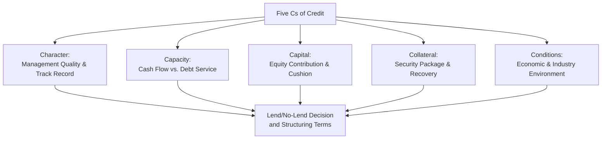
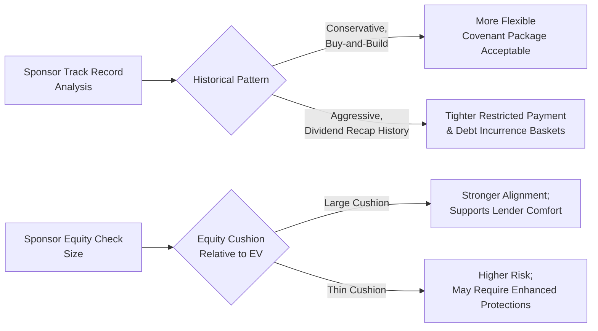
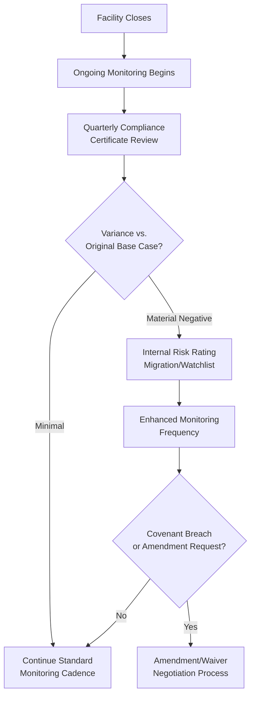

## Credit Analysis from the Lender's Perspective

### Definition and Purpose

Credit analysis from the lender's perspective is the underwriting-oriented evaluation process through which banks, institutional term loan investors, private credit funds, and other creditors assess a prospective borrower's ability and willingness to repay debt, in order to make lend/no-lend decisions, size and price facilities appropriately, and structure covenant and collateral protections commensurate with the assessed risk.

**Key Points**

- Lender credit analysis differs meaningfully from rating agency analysis (discussed earlier in this chapter) in orientation: rating agencies produce a relative, published opinion for a broad market audience, while individual lenders conduct proprietary, often more granular underwriting analysis directly tied to their own internal risk appetite, portfolio concentration limits, and pricing/return targets.
- Lender analysis is fundamentally organized around answering two linked questions: (1) **capacity** — can the borrower generate sufficient cash flow to service the proposed debt under a plausible range of scenarios, and (2) **downside protection** — if capacity assumptions prove wrong, what is the lender's likely recovery given the proposed structure, collateral, and covenant package.

### The Traditional "Five Cs of Credit" Framework

A foundational, widely taught framework for organizing lender credit analysis, still broadly applicable to corporate and leveraged lending despite its origins in more traditional commercial banking:

1. **Character**: Management team quality, track record, integrity, and reputation — including prior experience managing leverage through economic cycles and history of engagement with lenders/investors.
2. **Capacity**: The borrower's cash flow-generating capability relative to proposed debt service — the core quantitative analysis (see leverage/coverage ratio discussion earlier in this chapter).
3. **Capital**: The borrower's (and, in a sponsor-backed transaction, the sponsor's) equity contribution and overall capital structure composition — a larger equity cushion generally signals stronger sponsor alignment and provides a larger loss-absorption buffer ahead of debt.
4. **Collateral**: The security package available to the lender in a downside/default scenario (see prior chapter discussion of collateral packages and security interests).
5. **Conditions**: The broader economic, industry, and competitive conditions affecting the borrower's business, including cyclicality and sensitivity to macro factors (interest rates, commodity prices, consumer spending).

**Key Points**

- While originally developed for traditional commercial and consumer lending, the Five Cs framework remains a useful organizing structure for leveraged and syndicated lending, though institutional lenders typically apply substantially more quantitative rigor (detailed cash flow modeling, scenario/sensitivity analysis, comparable transaction benchmarking) within each category than the framework's traditional application suggests.

### Cash Flow Modeling and Scenario Analysis

**Key Points**

Institutional lenders typically build (or review sponsor/arranger-provided) detailed financial models incorporating:

1. **Base case projections**: Management's expected operating and financial performance, typically over a 3–5 year forward period matching the proposed facility's tenor.
2. **Downside/stress case projections**: A more conservative scenario reflecting plausible adverse developments (revenue decline, margin compression, delayed synergy realization, working capital stress), used to test whether the borrower can still service debt (or, at minimum, avoid a maintenance covenant breach or liquidity crisis) under stress.
3. **Sensitivity analysis**: Isolated variation of individual key assumptions (e.g., revenue growth rate, EBITDA margin, capital expenditure level) to identify which variables most materially affect leverage, coverage, and liquidity outcomes — informing which covenant protections and reporting requirements are most important to negotiate.

**Example**

A lender underwriting a term loan B for a business services company might build a base case assuming 6% annual revenue growth and stable 22% EBITDA margins, alongside a downside case assuming flat revenue and 200 basis points of margin compression (reflecting input cost inflation or pricing pressure). If the downside case shows FCCR falling to 1.05x (versus a 1.10x covenant threshold) in year two, the lender may negotiate a larger required equity cushion, tighter restricted payment baskets, or enhanced reporting/information rights to gain earlier visibility into performance trends before a potential covenant breach.

$$\text{Downside FCCR} = \frac{\text{Downside EBITDA} - \text{Unfinanced Capex} - \text{Cash Taxes}}{\text{Cash Interest} + \text{Scheduled Amortization}}$$

### Structuring Response to Identified Risks

**Key Points**

Credit analysis findings directly translate into specific structuring decisions:

| Identified Risk | Typical Structural Response |
| --- | --- |
| High customer/revenue concentration | Enhanced reporting on top customer performance; tighter change-of-control or key contract assignment provisions |
| Cyclical/volatile EBITDA | Larger covenant cushions; springing (rather than always-on) maintenance covenants; larger minimum liquidity requirements |
| Weak collateral coverage (asset-light business) | Reliance on cash flow-based (rather than asset-based) lending structure; enhanced equity cushion requirement; tighter restricted payment/investment baskets |
| Aggressive sponsor financial policy | Tighter restricted payment baskets; MFN protection (see prior chapter item); minimum guarantor coverage tests |
| Management/track record uncertainty | Enhanced information rights and reporting frequency; board observer rights (in direct lending); more conservative initial covenant thresholds |
| Refinancing/maturity wall risk | Shorter tenor with tighter amortization; springing maturity provisions tied to other debt refinancing |

### Comparable Transaction and Relative Value Analysis

**Key Points**

- Lenders benchmark proposed pricing, leverage, and covenant terms against recently closed comparable transactions (similar industry, size, leverage profile, and sponsor/issuer type) to assess whether proposed terms are consistent with prevailing market conditions, or whether the deal is being marketed at aggressive (borrower-favorable) or conservative (lender-favorable) terms relative to the current market.
- This relative value analysis directly informs a lender's decision on whether to participate in a syndicated facility at the terms offered, or to push back (individually or collectively with other syndicate members) for tighter terms before committing.

### Sponsor and Ownership Structure Assessment

**Key Points**

For private-equity-sponsored transactions specifically, lender analysis places particular emphasis on:

1. **Sponsor track record**: Historical performance of the sponsor's prior portfolio companies, including default/restructuring history and typical holding period/exit strategy patterns.
2. **Alignment of interest**: Size of the sponsor's equity investment relative to enterprise value (a larger equity check generally signals stronger alignment and provides greater loss-absorption cushion ahead of debt).
3. **Anticipated capital allocation behavior**: Whether the sponsor has a history of aggressive dividend recapitalizations, add-on acquisitions funded with incremental debt, or other leverage-increasing actions during the hold period — directly informing how tightly restricted payment and debt incurrence covenants should be negotiated.

### Distinguishing Bank/Balance Sheet Lender Analysis from Institutional/CLO Investor Analysis

| Dimension | Bank/Balance Sheet Lender | Institutional Term Loan Investor (CLO, Loan Fund) |
| --- | --- | --- |
| Hold strategy | Often intends to hold to maturity or amortize down | May trade the position actively in the secondary market |
| Primary risk management tool | Covenant compliance, ongoing relationship monitoring, ability to negotiate amendments | Portfolio diversification, secondary market liquidity, reliance on agent bank/administrative agent for compliance monitoring |
| Depth of individual credit analysis per position | Typically deep, given larger individual hold size and direct relationship | Varies — may rely more heavily on arranger-provided materials, rating agency opinions, and third-party research given portfolio scale |
| Typical facility type | Revolving credit facilities, amortizing term loans | Institutional term loan B (bullet maturity, minimal amortization) |
| Covenant preference | Often prefers maintenance covenants for earlier warning | Generally more accepting of cov-lite structures (see prior chapter item) given portfolio-level risk management approach |

[Inference] These distinctions reflect general market tendencies rather than fixed rules — individual institutional investors (particularly larger CLO managers and credit-focused hedge funds) frequently conduct credit analysis with a depth comparable to traditional bank underwriting, and the degree of analytical rigor applied varies significantly by investor type, position size, and house investment process.

### Ongoing Monitoring Post-Closing

**Key Points**

Lender credit analysis does not conclude at closing — ongoing portfolio monitoring typically includes:

1. **Compliance certificate review**: Quarterly (or as specified) review of borrower-submitted financial covenant compliance calculations against credit agreement definitions.
2. **Variance analysis**: Comparing actual results against the original underwriting base case to identify emerging trends before they manifest as covenant breaches.
3. **Watchlist/risk rating migration**: Internal risk rating systems (distinct from, though often informed by, public agency ratings) that flag credits for enhanced monitoring frequency as performance deteriorates.
4. **Amendment and waiver request evaluation**: Assessing borrower requests for covenant relief, incremental debt capacity, or other amendments against the original underwriting thesis and current credit trajectory.

### Practical Integration with Capital Structuring

**Key Points**

- Lender credit analysis findings directly shape the negotiated terms of the credit agreement across every dimension discussed in this course: collateral scope, covenant tightness, pricing (including MFN protection), guarantor coverage requirements, and restricted/unrestricted subsidiary designation flexibility.
- Understanding how lenders analyze credit is essential for capital structuring professionals on the issuer/sponsor side — anticipating which risk factors will draw the most lender scrutiny allows more efficient pre-emptive structuring (e.g., proactively offering enhanced reporting or a modestly larger equity cushion) to achieve more favorable pricing and covenant flexibility in return.

**Conclusion**

Credit analysis from the lender's perspective combines traditional qualitative judgment (the Five Cs framework, sponsor track record assessment) with rigorous quantitative modeling (base case and downside scenario cash flow analysis, comparable transaction benchmarking) to inform lend/no-lend decisions and structuring terms. Unlike rating agency analysis, which produces a published, standardized opinion for a broad market audience, lender analysis is proprietary and directly actionable — translating identified risks into specific negotiated protections across pricing, covenants, collateral, and reporting — and continues throughout the life of the facility via ongoing compliance monitoring and risk rating migration processes.

**Related Topics**

- Key Credit Metrics: Leverage, Coverage, and Liquidity Ratios
- Investment Grade versus Leveraged Credit Profiles
- Collateral Packages and Security Interests
- Most-Favored-Nation and Pro Rata Sharing Protections
- Sponsor Due Diligence and Private Equity Track Record Analysis
- Compliance Certificates and Financial Reporting Covenants
- Amendment and Waiver Negotiation Dynamics
- CLO Structures and Institutional Loan Investor Base