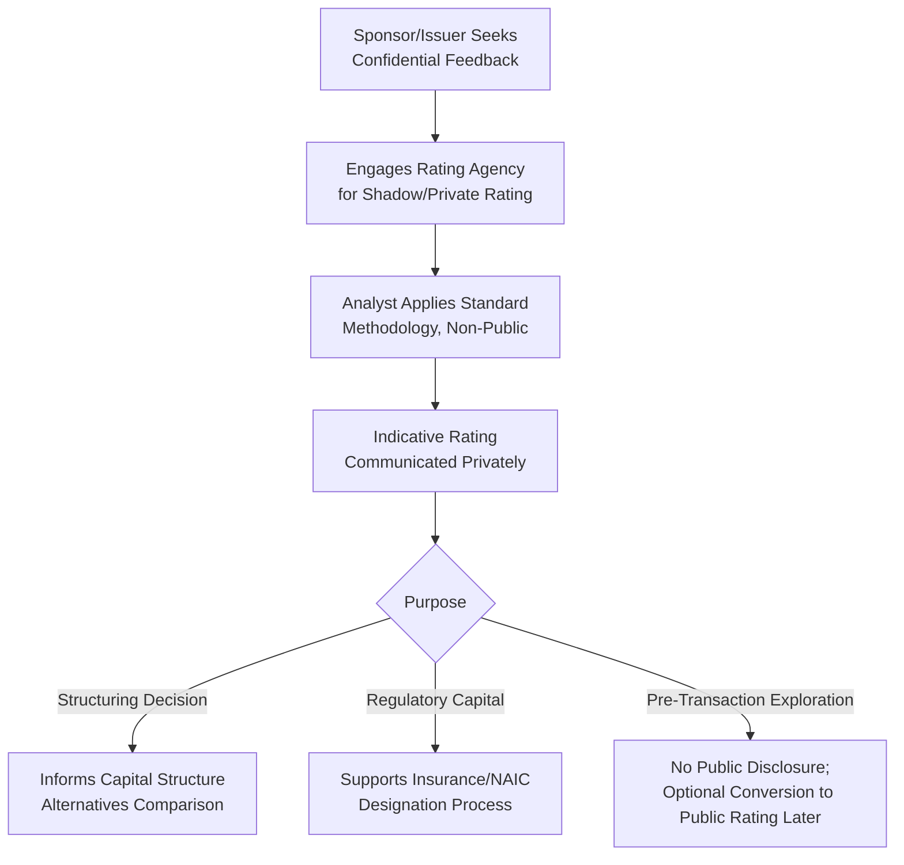
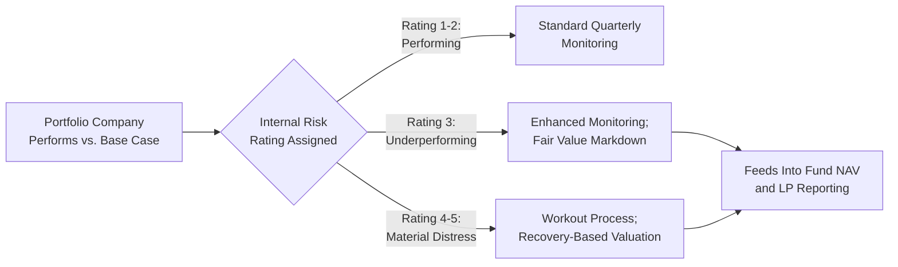

## Shadow Ratings and Private Credit Risk Assessment

### Definition and Purpose

Shadow ratings and private credit risk assessment refer to confidential, non-published creditworthiness evaluations conducted either by traditional rating agencies (as "private" or "indicative" ratings) or by private credit lenders/investors themselves (as internal proprietary risk ratings), used to inform capital structure decisions, portfolio management, and regulatory/investor reporting without triggering a public rating disclosure.

**Key Points**

- A **shadow rating** (sometimes called a private rating, confidential rating, or indicative rating) is typically prepared using the same or similar methodology as a public rating agency rating, but the outcome is disclosed only to the requesting party (the issuer, sponsor, or in some cases a specific investor) rather than published to the broader market.
- **Private credit risk assessment** more broadly encompasses the internal underwriting and risk-rating frameworks used by direct lenders, business development companies (BDCs), and private credit funds — many of which do not rely on traditional public rating agencies at all for their core underwriting decisions, particularly in the middle market where borrowers are frequently unrated.

### Why Shadow Ratings Are Used

**Key Points**

Shadow ratings serve several distinct practical purposes:

1. **Pre-transaction structuring guidance**: A sponsor evaluating alternative capital structures for a prospective leveraged buyout (e.g., comparing 5.5x vs. 6.5x leverage, or a first-lien-only structure vs. a first lien/second lien split) can obtain confidential indicative feedback on the likely rating outcome of each alternative before committing to a public rating mandate or finalizing transaction terms.
2. **Insurance company and regulatory capital purposes**: Insurance companies investing in private placements or unrated private credit instruments often require a shadow/private rating from an NRSRO specifically to support regulatory capital charge determinations (e.g., NAIC designations in the U.S. insurance regulatory framework), even though the instrument itself is never publicly rated or traded.
3. **Avoiding public disclosure**: Issuers may prefer confidential feedback during exploratory financing discussions, before deciding whether to proceed with a public or broadly syndicated transaction that would necessitate public rating disclosure.
4. **BDC and private fund portfolio valuation/reporting**: Business development companies and private credit funds are subject to periodic fair value reporting requirements (particularly under U.S. fund accounting and SEC disclosure frameworks for registered BDCs), and shadow ratings or internally-assigned risk ratings often support the credit risk component of these valuations.

### NAIC Designations and the Private Letter Rating Ecosystem

**Key Points**

- In the U.S. insurance regulatory context, the National Association of Insurance Commissioners (NAIC) maintains a designation system (NAIC 1 through NAIC 6, broadly correlating to rating agency letter grades) used to determine risk-based capital charges for insurance company bond and structured credit holdings.
- For privately placed or unrated instruments, insurance companies frequently obtain either: (a) a private/shadow rating directly from an NRSRO that maps to an NAIC designation equivalent, or (b) a formal credit assessment through the NAIC's own Securities Valuation Office (SVO) or a designated Private Letter Rating (PLR) process.
- [Unverified — regulatory framework subject to change] The specific mechanics, required documentation, and division of responsibility between NRSRO private ratings and the NAIC's own filing exempt/PLR processes have been subject to ongoing regulatory review and refinement; current NAIC guidance and SVO procedures should be consulted directly for any specific transaction requiring this analysis, as this area has seen meaningful regulatory attention in recent years regarding the appropriate role of rating agencies versus the NAIC's own credit assessment capabilities.

### Private Credit Internal Risk Rating Frameworks

**Key Points**

Direct lenders and private credit funds — which dominate middle-market and, increasingly, larger-cap leveraged lending — typically maintain proprietary internal risk rating systems rather than relying primarily on public agency ratings, reflecting the frequently unrated status of their borrower base. Common features include:

1. **Numeric or letter-grade internal scale**: Often a simplified scale (e.g., 1–5 or 1–10) mapping loosely to public rating agency conventions but calibrated to the fund's own historical loss experience and risk appetite.
2. **Quarterly or more frequent internal review**: Given typically smaller, more concentrated portfolios than large syndicated loan investors, private credit funds often conduct more frequent and granular credit monitoring per position, including direct management engagement and, in many cases, board observer rights.
3. **Fair value mark-to-model process**: Since private credit instruments generally lack an active secondary trading market, internal risk ratings feed directly into quarterly fair value determinations (required for fund NAV calculation and, for registered BDCs, SEC reporting), often through a scoring methodology that adjusts a base yield/discount rate assumption based on the assigned internal risk grade.

**Example**

A direct lending fund's internal risk rating framework might use a 1–5 scale: "1" (performing, no concerns, priced near par), "2" (performing, minor watch items), "3" (underperforming versus underwriting case, enhanced monitoring), "4" (material underperformance, workout discussions likely), "5" (default/non-accrual, valued based on recovery analysis). A portfolio company initially underwritten at leverage of 5.5x and rated "1" that subsequently experiences EBITDA decline pushing leverage to 7.0x against a downside case that assumed a floor of 6.0x might be downgraded internally to "3," triggering both enhanced monitoring frequency and a fair value markdown in the fund's quarterly NAV calculation.

### Distinguishing Shadow Ratings from Public Ratings

| Dimension | Public Rating | Shadow/Private Rating | Internal Private Credit Risk Rating |
| --- | --- | --- | --- |
| Disclosure | Published to market | Confidential to requesting party | Internal to the lending institution/fund only |
| Methodology basis | Agency's standard published methodology | Same/similar agency methodology, applied confidentially | Proprietary, fund/institution-specific framework |
| Typical use case | Public bond issuance, broadly syndicated loans | Insurance regulatory capital, pre-transaction structuring guidance | Ongoing portfolio monitoring, NAV/fair value determination |
| Governed by NRSRO regulatory framework | Yes | Generally yes (same agency governance applies, though disclosure differs) | No — not an NRSRO product |
| Update frequency | Per agency surveillance policy (periodic + event-driven) | Per engagement terms, often less frequent absent ongoing relationship | Typically quarterly, tied to fund reporting cycles |

### Middle Market and Unrated Borrower Dynamics

**Key Points**

- A substantial portion of middle-market leveraged borrowers financed by direct lenders and private credit funds are **entirely unrated** by traditional NRSROs, reflecting the smaller deal sizes, lower public market profile, and cost/administrative burden of obtaining and maintaining a public rating relative to the transaction's overall financing cost.
- [Inference] This dynamic has contributed to the significant growth of the private credit asset class over the past decade, as direct lenders have developed underwriting and monitoring capabilities specifically designed to assess credit risk without relying on public agency ratings, filling a financing gap for borrowers below the scale threshold where public rating and broadly syndicated market access is cost-effective.
- Even where a shadow rating is obtained for a specific regulatory purpose (e.g., an insurance company co-investor requiring an NAIC-mappable designation), the direct lender/agent in the transaction typically continues to rely primarily on its own internal underwriting and risk rating framework for ongoing portfolio management purposes.

### Interaction with Capital Structuring Decisions

**Key Points**

- Shadow ratings obtained during pre-transaction structuring directly inform decisions such as: optimal leverage level to preserve a target rating category, whether a second-lien tranche materially impairs the first-lien tranche's relative rating/recovery outcome, and whether a proposed collateral package or guarantee scope achieves a meaningfully different notching outcome than an alternative structure.
- For private credit-financed transactions without any rating agency involvement at all, the "shadow rating" function is effectively performed entirely through the lead lender's/agent's internal underwriting process — meaning structuring decisions (leverage sizing, covenant design, pricing) are directly negotiated based on the lender's own proprietary risk assessment rather than benchmarked against any published or quasi-published rating outcome.

**Example**

A sponsor evaluating a $200,000,000 unitranche financing from a direct lending fund for a middle-market acquisition (too small for cost-effective broadly syndicated/public rating agency engagement) would not obtain any shadow or public rating at all — instead, the direct lender's internal credit committee process (applying its own proprietary Five Cs-style analysis, as discussed in the prior chapter item, calibrated to the fund's own historical default and loss experience) serves as the functional equivalent of the rating and underwriting process, directly determining pricing, leverage tolerance, and covenant structure without any external rating agency benchmark.

**Conclusion**

Shadow ratings and private credit risk assessment serve the critical function of providing creditworthiness evaluation and structuring guidance in situations where a public, disclosed rating is either unnecessary, premature, or not cost-effective relative to transaction size. Whether obtained confidentially from a traditional NRSRO for regulatory or structuring purposes, or performed entirely through a private credit lender's proprietary internal risk rating framework, these mechanisms fill an essential gap in the credit ecosystem — particularly in the rapidly growing middle-market and direct lending segments — allowing capital structuring decisions to be informed by rigorous credit analysis even absent the cost, timeline, and public disclosure requirements associated with a traditional public rating.

**Related Topics**

- Corporate Credit Rating Process for New Issuances
- Credit Analysis from the Lender's Perspective
- Investment Grade versus Leveraged Credit Profiles
- NAIC Designations and Insurance Regulatory Capital Frameworks
- Business Development Companies (BDCs) and Fund Structure Regulation
- Direct Lending and Middle-Market Credit Documentation Standards
- Fair Value Reporting and NAV Calculation for Private Credit Funds
- Unitranche Financing Structures