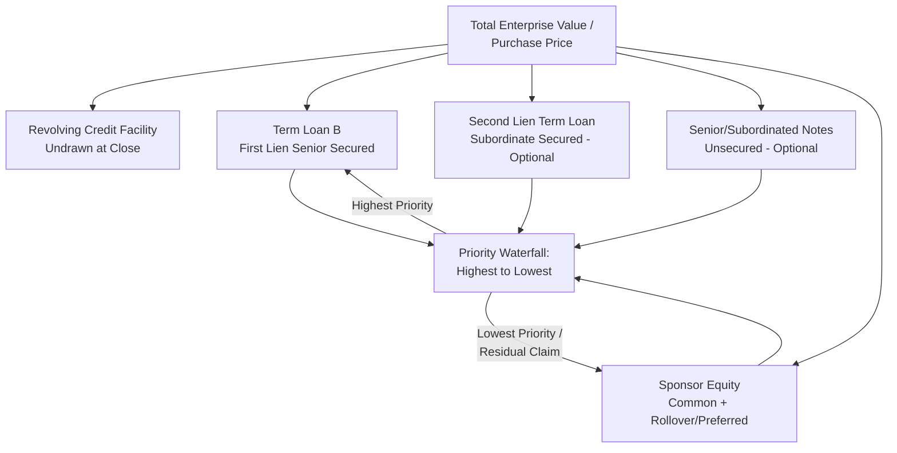
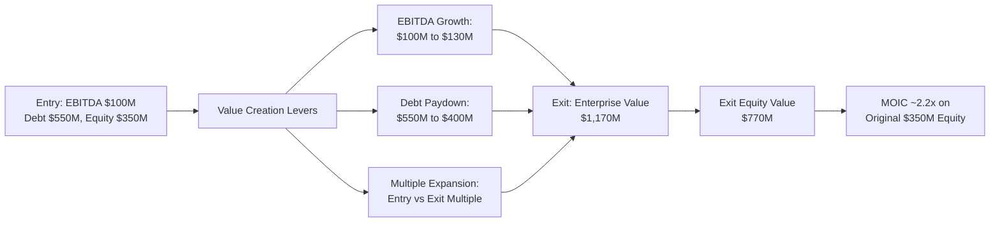
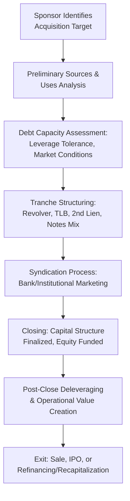

## Leveraged Buyout Capital Structure Basics

### Definition and Purpose

A leveraged buyout (LBO) capital structure is the layered financing framework used to acquire a company (or a controlling stake) using a substantial proportion of borrowed funds relative to equity, with the acquired company's own assets and cash flows serving as the primary source of debt repayment and collateral. Designing the capital structure is the central financial engineering exercise of an LBO transaction.

**Key Points**

- The core economic logic of an LBO capital structure is to use debt to amplify equity returns: by financing a large portion of the purchase price with debt (which has a fixed, generally lower cost than equity), the sponsor's equity check is smaller relative to the total transaction value, magnifying the percentage return on that equity if the business performs as underwritten.
- This amplification effect cuts both ways — leverage increases equity return potential in a successful scenario but also increases the risk of equity value impairment (or complete loss) in a downside scenario, since debt service and principal repayment obligations are fixed regardless of business performance.

### Typical LBO Capital Structure Layers

An LBO capital structure is typically arranged in a "stack" from lowest cost/highest priority (top) to highest cost/lowest priority (bottom):

| Layer | Typical Cost | Typical Priority | Typical % of Total Capitalization |
| --- | --- | --- | --- |
| Revolving Credit Facility | Lowest (senior secured pricing) | Senior secured, first lien | 0% drawn at close (committed but typically undrawn) |
| Term Loan B (First Lien) | Low-moderate | Senior secured, first lien | 35–50% |
| Second Lien Term Loan | Moderate-high | Senior secured, second lien | 0–15% (not present in all deals) |
| Senior (Unsecured) Notes / Subordinated Debt | High | Unsecured or structurally subordinated | 0–20% (not present in all deals) |
| Sponsor Equity (Common + any Preferred/Rollover) | Highest (required return) | Most subordinated (residual claim) | 30–45% |

[Inference] The specific percentage ranges above reflect general historical market conventions for broadly syndicated leveraged buyouts and vary substantially by credit cycle, sponsor risk appetite, deal size, and industry — equity contribution percentages in particular have fluctuated meaningfully across market cycles (generally rising during periods of tighter debt market conditions and compressing during periods of abundant, cheap leverage).

### Sources and Uses of Funds

**Key Points**

Every LBO capital structure is built from a "sources and uses" analysis, which must balance exactly:

**Uses of Funds** (what the money pays for):

1. Purchase of target equity (equity purchase price)
2. Refinancing of existing target debt (if not assumed)
3. Transaction fees and expenses (financing fees, advisory fees, legal fees)
4. Original issue discount (OID) on new debt, if applicable

**Sources of Funds** (where the money comes from):

1. New debt facilities (revolver, term loan, second lien, notes, as applicable)
2. Sponsor equity contribution
3. Rollover equity (existing management or seller equity reinvested into the new structure)
4. Cash on the target's balance sheet (if permitted to be used to fund the transaction)

**Example**

A hypothetical LBO with a $1,000,000,000 enterprise value might have the following sources and uses:

| Uses | Amount | Sources | Amount |
| --- | --- | --- | --- |
| Purchase of Equity | $850,000,000 | Term Loan B (4.5x EBITDA) | $450,000,000 |
| Refinance Existing Debt | $100,000,000 | Second Lien Term Loan (1.0x EBITDA) | $100,000,000 |
| Transaction Fees & OID | $50,000,000 | Sponsor Equity | $450,000,000 |
| **Total Uses** | **$1,000,000,000** | **Total Sources** | **$1,000,000,000** |

Assuming $100,000,000 of trailing EBITDA, this structure reflects total leverage of 5.5x (Term Loan B plus Second Lien), with sponsor equity representing 45% of total sources — a moderately conservative (higher equity) structure relative to some historical market conventions cited above.

$$\text{Total Leverage} = \frac{450{,}000{,}000 + 100{,}000{,}000}{100{,}000{,}000} = 5.5x$$

### Purchase Price Multiple and Leverage Relationship

**Key Points**

- LBO purchase prices are typically expressed as a multiple of trailing or forward EBITDA (e.g., "8.5x EBITDA"), and the capital structure's leverage level is a direct function of how much of that purchase price multiple is financed with debt versus equity.
- The relationship between purchase price multiple, debt multiple, and implied equity multiple is a foundational LBO mechanic:

$$\text{Equity Multiple} = \text{Purchase Price Multiple} - \text{Total Debt Multiple}$$

**Example**

If a target is acquired at 9.0x EBITDA, and the capital structure includes 5.5x of total debt (as in the example above, adjusted for illustration), the implied equity contribution multiple is:

$$9.0x - 5.5x = 3.5x \text{ EBITDA}$$

On $100,000,000 of EBITDA, this implies a $350,000,000 equity check funding the 3.5x gap, plus any additional equity required to cover transaction fees, OID, and refinancing of existing debt not captured in the simple purchase-price-multiple framework (as reflected in the more detailed sources and uses table above).

### Return Drivers: How Leverage Amplifies Equity Returns

**Key Points**

The core mechanic through which leverage amplifies sponsor equity returns operates through three channels:

1. **Leverage/multiple arbitrage**: Using debt to fund a larger portion of the purchase price reduces the absolute equity dollars invested, so any given increase in equity value (from EBITDA growth or multiple expansion) represents a larger percentage return on the smaller equity base.
2. **Deleveraging**: As the company generates free cash flow and pays down debt principal over the holding period, equity value increases (all else equal) simply from the reduction in debt outstanding — sometimes called "debt paydown" or "deleveraging" value creation.
3. **EBITDA growth and multiple expansion**: Operational improvements (revenue growth, margin expansion) and/or an increase in the exit valuation multiple relative to the entry multiple directly increase enterprise value, which accrues disproportionately to the equity holder given the fixed nature of debt claims.

**Example**

Using simplified illustrative figures: a sponsor invests $350,000,000 of equity at entry (as calculated above) into a company acquired at 9.0x EBITDA ($900,000,000 enterprise value on $100,000,000 EBITDA) with $550,000,000 of debt. If, over a 5-year holding period, EBITDA grows to $130,000,000, the exit multiple remains 9.0x (no multiple expansion), and $150,000,000 of debt is paid down (reducing debt to $400,000,000):

$$\text{Exit Enterprise Value} = 130{,}000{,}000 \times 9.0x = 1{,}170{,}000{,}000$$

$$\text{Exit Equity Value} = 1{,}170{,}000{,}000 - 400{,}000{,}000 = 770{,}000{,}000$$

$$\text{Equity Multiple (MOIC)} = \frac{770{,}000{,}000}{350{,}000{,}000} \approx 2.2x$$

This illustrates how EBITDA growth ($100M → $130M) combined with debt paydown ($550M → $400M), even without any multiple expansion, produces a materially higher percentage return on the equity investment than the underlying business's own growth rate — the leverage amplification effect. [Inference] This is a simplified illustrative calculation; actual LBO return modeling incorporates additional factors including interim cash flow distributions/recapitalizations, management incentive equity dilution, transaction fees on exit, and tax considerations.

### Rollover Equity and Management Incentive Structures

**Key Points**

- **Rollover equity** refers to existing shareholders (often founders or senior management) reinvesting a portion of their pre-transaction proceeds into the new post-LBO equity structure, rather than fully cashing out — this reduces the sponsor's required cash equity contribution and signals continued alignment/confidence from those closest to the business.
- **Management incentive plans (MIPs)** typically reserve a pool of equity (commonly 8–15% of the fully diluted post-transaction equity, subject to significant deal-specific variation) for key management, often structured with vesting and performance-based hurdles tied to the sponsor achieving a minimum return threshold — aligning management's economic incentives with the sponsor's return objectives over the holding period.

### Debt Tranche Selection and Structuring Considerations

**Key Points**

The specific mix of debt tranches (revolver, first lien term loan, second lien, notes) in a given LBO capital structure is determined by several factors, each discussed in greater depth elsewhere in this course:

1. **Cost of capital optimization**: Balancing the lower coupon of secured debt against the greater covenant flexibility (and higher cost) of unsecured/subordinated tranches.
2. **Market capacity and investor appetite**: The size of the institutional term loan market versus the high-yield bond market at the time of syndication influences which instruments can be efficiently placed at scale.
3. **Covenant flexibility needs**: Sponsors anticipating future add-on acquisitions or dividend recapitalizations may favor structures (e.g., cov-lite term loan B with generous incremental facility capacity) that preserve future flexibility, even at a modest pricing premium.
4. **Rating and structuring feedback**: As discussed earlier in this chapter, sponsors frequently obtain shadow rating feedback to compare the relative rating/pricing outcomes of alternative tranche structures before finalizing the capital structure.

### The LBO Capital Structure Lifecycle

**Conclusion**

Leveraged buyout capital structure design is the foundational financial engineering discipline underlying private equity value creation, combining a layered debt stack (revolver, term loan B, and optionally second lien or subordinated notes) with a sponsor equity contribution sized to balance leverage amplification benefits against downside risk. Understanding the sources-and-uses framework, the relationship between purchase price multiple and debt/equity split, and the three core value creation levers (leverage/multiple arbitrage, deleveraging, and EBITDA growth/multiple expansion) provides the essential foundation for the more detailed covenant, collateral, and credit analysis topics addressed throughout this course.

**Related Topics**

- Debt Tranche Selection: Term Loan B, Second Lien, and High-Yield Notes
- Collateral Packages and Security Interests
- Covenant-Lite Structuring and Market Evolution
- Dividend Recapitalizations and Sponsor Capital Allocation Strategy
- Purchase Price Multiples and Valuation Methodologies in M&A
- Management Incentive Plans and Equity Rollover Structures
- Exit Strategies: Sale, IPO, and Recapitalization Dynamics
- Shadow Ratings and Private Credit Risk Assessment