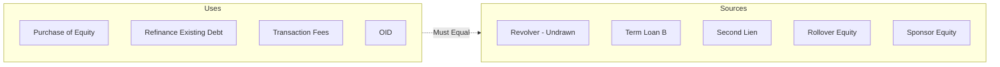
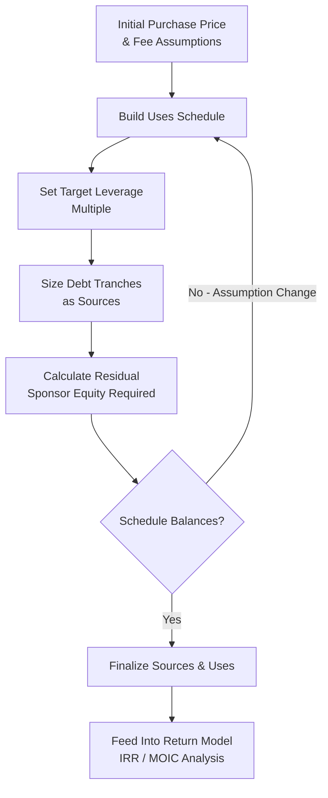

## Sources and Uses of Funds Analysis

### Definition and Purpose

Sources and uses of funds analysis is the foundational financial schedule that identifies and reconciles every dollar required to complete a transaction (the "uses") against every dollar of capital raised or contributed to fund it (the "sources"), ensuring the two totals balance exactly. It is the first quantitative output produced in structuring any leveraged transaction — an LBO, a refinancing, a dividend recapitalization, or an M&A financing — and forms the basis for subsequent capital structure, covenant, and pricing decisions.

**Key Points**

- The sources and uses schedule must always balance: total sources must equal total uses to the dollar, since it represents a complete accounting of the transaction's cash flows at closing.
- While conceptually simple, the schedule requires careful definitional precision — particularly around fee treatment, minimum cash requirements, and rollover equity valuation — because errors or ambiguities directly affect the sizing of the debt and equity components.

### Standard Components of "Uses"

**Key Points**

The uses side identifies every cash outlay required to close the transaction:

1. **Purchase price / equity consideration**: The amount paid to acquire the target's equity (in an LBO or M&A context) or, in a refinancing, the amount required to redeem/repay existing debt instruments.
2. **Refinancing of existing debt**: Repayment of the target's (or issuer's) existing debt that is not being assumed or rolled into the new structure, including any prepayment premiums or make-whole amounts.
3. **Transaction fees and expenses**:
   - Financing fees (arrangement/underwriting fees paid to banks for structuring and syndicating new debt, typically expressed as a percentage of facility size)
   - Advisory fees (investment banking fees for M&A/sell-side or buy-side advisory)
   - Legal fees (transaction counsel for both debt and equity documentation)
   - Other transaction costs (accounting/tax due diligence, insurance, printing/administrative costs)
4. **Original issue discount (OID)**: The discount at which new debt is issued relative to par (e.g., debt issued at 99 generates $99 of proceeds per $100 of face value, with the $1 difference representing a use of funds that must be covered by additional sources).
5. **Minimum cash / working capital funding**: An amount set aside to ensure the post-transaction company has sufficient operating cash, particularly relevant when existing cash balances are being used to fund the transaction itself (a "cash-free, debt-free" purchase price adjustment mechanism is common in M&A).
6. **Escrow or holdback amounts**: Funds set aside to satisfy potential post-closing purchase price adjustments or indemnification claims under the acquisition agreement.

### Standard Components of "Sources"

**Key Points**

The sources side identifies every source of capital funding the uses:

1. **New debt facilities**: Proceeds from each new debt tranche (revolving credit facility draw if any, term loan B, second lien term loan, senior/subordinated notes), typically shown at gross face amount with OID separately reflected as a use (or, alternatively, shown net of OID as a source — conventions vary by transaction).
2. **Sponsor equity contribution**: New cash equity invested by the financial sponsor (or, in a strategic acquisition, by the acquirer).
3. **Rollover equity**: Value of existing shareholder or management equity reinvested into the post-transaction capital structure rather than cashed out — this is a non-cash source but must still be reflected to balance the schedule, since it reduces the amount of new cash purchase price/equity required.
4. **Cash on hand / balance sheet cash**: Existing cash at the target (or issuer) used to fund a portion of the transaction, subject to any agreed minimum cash requirement being preserved.
5. **Seller financing / deferred consideration**: In some transactions, a portion of the purchase price is deferred via a seller note or earnout structure, effectively serving as a source of financing provided by the seller rather than a third-party lender or the buyer's equity.

### Illustrative Sources and Uses Schedule

**Example**

A leveraged buyout with a $1,200,000,000 enterprise value, $120,000,000 of trailing EBITDA, and $80,000,000 of existing target debt to be refinanced:

| Uses | Amount ($M) |  | Sources | Amount ($M) |
| --- | --- | --- | --- | --- |
| Purchase of Target Equity | 1,050 |  | Revolving Credit Facility (undrawn at close) | 0 |
| Refinance Existing Debt | 80 |  | Term Loan B (4.0x EBITDA) | 480 |
| Financing Fees (1.5% of new debt) | 9 |  | Second Lien Term Loan (1.0x EBITDA) | 120 |
| Advisory & Legal Fees | 25 |  | Rollover Equity (Management) | 45 |
| OID (0.5 points on $600M new debt) | 3 |  | Sponsor Equity | 522 |
| **Total Uses** | **1,167** |  | **Total Sources** | **1,167** |

$$\text{Total Leverage} = \frac{480 + 120}{120} = 5.0x$$

$$\text{Sponsor Equity \%} = \frac{522}{1{,}167} \approx 44.7\%$$

This schedule demonstrates the mechanical reconciliation: total uses of $1,167,000,000 are funded precisely by total sources of $1,167,000,000, with the debt tranches sized at a targeted 5.0x total leverage and the remaining funding gap filled by rollover and new sponsor equity.

### OID and Fee Treatment Nuances

**Key Points**

- **OID treatment**: Some sources and uses schedules present new debt "gross" (at face value) as a source, with OID shown separately as a use of funds; others present debt "net" of OID as the source, with no separate OID line item. Both conventions are used in practice, and the choice affects how the schedule is read line-by-line, though the net funding result is identical.
- **Financing fee capitalization**: Financing fees are typically capitalized and amortized over the life of the related debt facility for accounting purposes, but for sources and uses purposes at closing, they represent an immediate cash use funded by the transaction's sources — the accounting treatment (capitalize and amortize) and the cash sources-and-uses treatment (fund at closing) are distinct concepts that should not be conflated.
- [Inference] Financing fee percentages vary by facility type, deal size, and market conditions — institutional term loan arrangement fees, second lien fees, and high-yield bond underwriting fees each carry different typical fee ranges, and current market fee levels should be benchmarked against recent comparable transactions rather than assumed from a fixed historical rate.

### Interaction with Debt Sizing and Leverage Targets

**Key Points**

- The sources and uses schedule is typically built **iteratively** with the debt capacity/leverage analysis: an initial leverage target (e.g., "5.0x total leverage") is used to size the debt tranches, and the sponsor equity check is calculated as the residual amount needed to balance total sources against total uses.
- Changes to any use-side assumption (e.g., higher-than-expected transaction fees, a larger required minimum cash balance, or an increased purchase price following a competitive bid process) directly flow through to either increase the required debt (if leverage capacity allows) or increase the required sponsor equity check (if debt capacity is already at its negotiated or market-clearing maximum).

$$\text{Sponsor Equity (Residual)} = \text{Total Uses} - \text{Total Debt Sources} - \text{Rollover Equity} - \text{Other Non-Sponsor Sources}$$

**Example**

If, in the schedule above, a competing bidder forces the purchase price up by $50,000,000 (to $1,100,000,000) and the sponsor is unwilling to increase total leverage beyond 5.0x, the entire $50,000,000 increase in total uses must be absorbed by a larger sponsor equity check (increasing from $522,000,000 to approximately $572,000,000), since the debt sources remain fixed at the leverage-capped amount.

### Minimum Cash and "Cash-Free, Debt-Free" Conventions

**Key Points**

- Many M&A and LBO transactions are structured on a "cash-free, debt-free" basis: the purchase price is calculated assuming the target delivers at closing with no excess cash and no debt (both are effectively swept/repaid as part of the transaction), with a negotiated minimum operating cash amount left in the business to fund ongoing operations.
- This convention directly affects the sources and uses schedule: if the target's actual cash balance at closing exceeds the agreed minimum, the excess cash may be treated as an additional source (reducing required debt or equity); if it is below the minimum, additional sources must be raised to fund the shortfall (a "cash true-up" or purchase price adjustment mechanism).

### Sensitivity and Scenario Analysis in Sources and Uses

**Key Points**

Because the schedule directly determines leverage, equity check size, and consequently expected sponsor returns, practitioners routinely build sensitivity tables varying key assumptions:

1. Purchase price multiple (base case vs. upside/downside bid scenarios)
2. Debt quantum and pricing (reflecting potential market conditions at the time of actual syndication versus initial underwriting assumptions)
3. Fee levels (particularly OID, which can vary meaningfully based on market conditions at actual pricing/allocation)
4. Rollover equity assumptions (management's willingness/ability to roll a larger or smaller percentage of their proceeds)

**Example**

A sponsor might model three purchase price scenarios (8.5x, 9.0x, and 9.5x EBITDA) against a fixed 5.0x leverage assumption, observing that the required equity check and resulting implied IRR/MOIC vary meaningfully across scenarios — directly informing the maximum price the sponsor is willing to bid in a competitive process while still achieving target investment returns.

### Role in the Broader Transaction Process

**Key Points**

- The sources and uses schedule is typically the first exhibit presented in a confidential information memorandum (CIM) or lender presentation, giving prospective lenders and investors an immediate, concise view of transaction size, leverage, and equity contribution before they engage with the more detailed credit analysis discussed elsewhere in this course.
- Lenders scrutinize the sources and uses schedule specifically for the **sponsor equity percentage**, viewing a larger equity contribution as a positive alignment and downside-protection signal (as discussed in the lender credit analysis chapter item) — the "capital" component of the Five Cs framework is, in practice, read directly off this schedule.
- Rating agencies similarly reference the sources and uses schedule when assessing pro forma leverage and capital structure for new issuance ratings, as discussed in the prior chapter's coverage of the corporate rating process.

**Conclusion**

Sources and uses of funds analysis is the essential reconciliation schedule underlying every leveraged transaction, translating the qualitative deal structure into a precise, balanced accounting of where every dollar comes from and where it goes. Its outputs — implied leverage, sponsor equity percentage, and fee/OID treatment — directly inform capital structure decisions, lender and rating agency risk assessment, and sponsor return modeling, making disciplined, iteratively-tested construction of this schedule a foundational skill in capital structuring and syndication work.

**Related Topics**

- Leveraged Buyout Capital Structure Basics
- Key Credit Metrics: Leverage, Coverage, and Liquidity Ratios
- Original Issue Discount (OID) and All-in Yield Calculations
- Purchase Price Multiples and Valuation Methodologies in M&A
- Management Incentive Plans and Equity Rollover Structures
- Credit Analysis from the Lender's Perspective
- Confidential Information Memoranda and Lender Marketing Materials
- IRR and MOIC: Sponsor Return Metrics in Leveraged Transactions