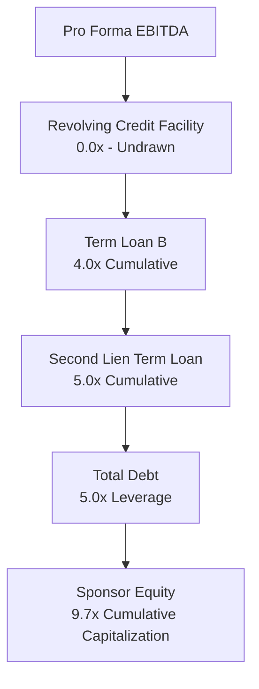
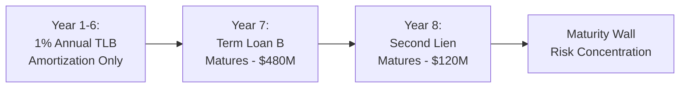
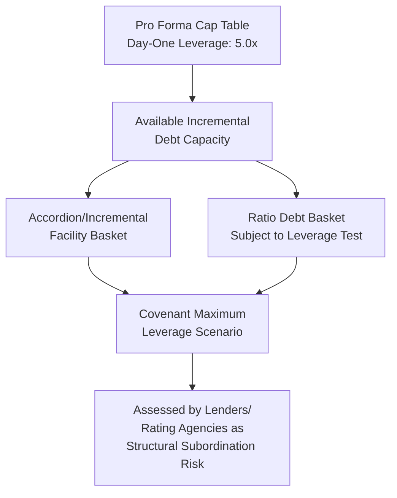

## Pro Forma Capitalization Table Construction

### Definition and Purpose

A pro forma capitalization table ("pro forma cap table") is the schedule presenting an issuer's complete debt and equity structure as it will exist immediately following a proposed transaction — an LBO, refinancing, acquisition, or recapitalization — showing each instrument's principal amount, ranking, maturity, and pricing side by side with the historical (pre-transaction) capitalization for comparison.

**Key Points**

- Distinct from the sources and uses schedule (which reconciles transaction cash flows at closing), the pro forma capitalization table presents the resulting balance sheet structure — the standing debt and equity instruments and their terms — as they will appear immediately after closing and going forward.
- The pro forma cap table is a primary exhibit in lender presentations, rating agency submissions, and internal credit committee materials, since it provides an immediate visual summary of leverage, priority ranking, and maturity profile.

### Standard Structure and Components

**Key Points**

A pro forma capitalization table is typically organized as a layered stack from most senior/lowest cost (top) to most subordinated/highest cost (bottom), with columns showing:

1. Instrument name/tranche
2. Principal amount (face value)
3. Maturity date
4. Pricing (coupon/spread, e.g., SOFR + margin, or fixed coupon for notes)
5. Ranking/security (first lien, second lien, unsecured, subordinated)
6. Leverage multiple (both standalone and cumulative through that layer)

**Example**

A pro forma capitalization table for a post-LBO issuer with $120,000,000 of pro forma EBITDA might be presented as:

| Instrument | Amount ($M) | Maturity | Pricing | Ranking | Leverage (x) | Cumulative Leverage (x) |
| --- | --- | --- | --- | --- | --- | --- |
| Revolving Credit Facility (undrawn) | 0 (100 committed) | 5 years | SOFR + 375 bps | First Lien Senior Secured | 0.0x | 0.0x |
| Term Loan B | 480 | 7 years | SOFR + 400 bps | First Lien Senior Secured | 4.0x | 4.0x |
| Second Lien Term Loan | 120 | 8 years | SOFR + 725 bps | Second Lien Secured | 1.0x | 5.0x |
| **Total Debt** | **600** |  |  |  |  | **5.0x** |
| Sponsor Equity | 567 | N/A | N/A | Common Equity | 4.7x | 9.7x |
| **Total Capitalization** | **1,167** |  |  |  |  | **9.7x** |

$$\text{Total Debt Leverage} = \frac{600}{120} = 5.0x$$

$$\text{Total Capitalization Multiple (incl. Equity)} = \frac{1{,}167}{120} \approx 9.7x$$

This structure directly mirrors the sources side of the sources and uses schedule discussed in the prior chapter item, but is presented as a standing capital structure rather than a transaction funding reconciliation.

### Historical vs. Pro Forma Presentation

**Key Points**

Cap tables are frequently presented with side-by-side historical and pro forma columns to highlight the transaction's impact:

| Instrument | Historical ($M) | Adjustments ($M) | Pro Forma ($M) |
| --- | --- | --- | --- |
| Existing Revolver | 15 | (15) | 0 |
| Existing Term Loan | 200 | (200) | 0 |
| New Term Loan B | — | 480 | 480 |
| New Second Lien | — | 120 | 120 |
| Total Debt | 215 | 385 | 600 |
| Total Equity | 300 | 267 | 567 |

**Key Points**

- The "Adjustments" column isolates precisely which instruments are being refinanced/extinguished and which new instruments are being incurred, providing lenders and analysts a clear audit trail from the pre-transaction to post-transaction capital structure.
- This presentation format is standard in rating agency new issuance submissions (as discussed in the prior chapter's coverage of the rating process) and in lender/CIM (confidential information memorandum) marketing materials, since it directly demonstrates the leverage and structural change resulting from the proposed transaction.

### Maturity Profile and Weighted Average Life Analysis

**Key Points**

Beyond the instrument-by-instrument listing, a complete pro forma cap table analysis typically includes a maturity profile view, showing the schedule of principal repayment obligations across future years — critical for assessing refinancing risk and identifying potential "maturity wall" concentrations.

$$\text{Weighted Average Life (WAL)} = \sum_{t} \left( t \times \frac{\text{Principal Due in Year } t}{\text{Total Principal}} \right)$$

**Example**

If a pro forma capital structure has $480,000,000 of Term Loan B maturing in year 7 and $120,000,000 of Second Lien maturing in year 8 (with no scheduled amortization other than the standard 1% per annum on the term loan B, a common institutional term loan convention), the maturity profile would show minimal near-term repayment obligations (only the small annual amortization) followed by two concentrated maturities in years 7 and 8 — directly informing refinancing risk assessment and the timing of anticipated future capital markets activity.

### Fully Diluted Equity Capitalization

**Key Points**

For the equity side of the pro forma cap table, a "fully diluted" presentation is standard, incorporating not just issued common equity but also:

1. **Management incentive plan (MIP) equity/options**: Reserved equity pool for management incentives (discussed in the prior chapter item on LBO capital structure), typically shown on a fully diluted, as-if-exercised or as-if-vested basis.
2. **Rollover equity**: Existing shareholder equity reinvested into the new structure, valued at the transaction price per share/unit.
3. **Preferred equity or preferred-like instruments**: If the structure includes preferred equity (common in growth equity or structured minority investments), shown separately given its distinct priority and return characteristics relative to common equity.

**Example**

A fully diluted equity capitalization table might show: Sponsor Common Equity (85% fully diluted ownership), Management Rollover/MIP Pool (12% fully diluted, subject to vesting), and Minority Co-Investor Equity (3% fully diluted) — with a footnote clarifying the vesting schedule and performance hurdles applicable to the MIP pool, since unvested management equity is often excluded from "current" ownership percentages but included in "fully diluted" figures for return modeling purposes.

### Leverage Multiple Presentation Conventions

**Key Points**

- **Standalone (tranche-level) leverage**: The multiple represented by a single tranche in isolation (e.g., "Second Lien Term Loan represents 1.0x of leverage").
- **Cumulative (through-the-stack) leverage**: The running total leverage multiple inclusive of all more senior tranches plus the tranche in question (e.g., "Total Secured Leverage of 5.0x" inclusive of both first and second lien).
- **Net leverage variant**: Cumulative leverage reduced by unrestricted cash, as discussed in the earlier chapter item on key credit metrics — often shown as an additional column or footnote to the gross leverage presentation.
- This layered leverage presentation directly supports the notching analysis discussed in the rating process chapter item, allowing a reader to immediately identify the leverage cushion (or lack thereof) benefiting any given tranche from the more subordinated capital below it.

### Interaction with Covenant Baskets and Incremental Capacity

**Key Points**

- The pro forma capitalization table is typically accompanied by, or cross-referenced against, a summary of **available incremental debt capacity** under the credit agreement's accordion/incremental facility provisions — showing how much additional debt could be layered into the structure without requiring existing lender consent, directly relevant to assessing future dilution/structural subordination risk for existing lenders.
- Lenders and rating agencies use the pro forma cap table in conjunction with the covenant package (debt incurrence baskets, discussed in earlier chapter items) to assess not just the day-one leverage picture, but the maximum leverage the issuer could reach through permitted covenant capacity alone, absent any further consent — sometimes referred to as assessing leverage on a "covenant maximum" or "fully levered" basis in addition to the actual pro forma figure.

### Practical Use Cases Across the Transaction Lifecycle

| Use Case | How the Pro Forma Cap Table Is Used |
| --- | --- |
| Lender/CIM marketing materials | Provides immediate leverage and structure overview to prospective syndicate lenders |
| Rating agency submission | Supports notching analysis and leverage-based methodology inputs (see rating process chapter item) |
| Credit committee memoranda | Summarizes proposed structure for internal approval alongside credit analysis findings |
| Ongoing covenant compliance reporting | Updated periodically to reflect actual outstanding balances versus original pro forma assumptions |
| M&A/refinancing scenario modeling | Compares alternative capital structure scenarios (e.g., different debt/equity splits) side by side |

**Conclusion**

Pro forma capitalization table construction translates the sources and uses transaction funding analysis into a standing, forward-looking view of an issuer's complete debt and equity structure — ranking, pricing, maturity, and leverage multiples layered from most senior to most subordinated. Properly constructed, it serves as the central reference exhibit across lender marketing, rating agency engagement, and ongoing credit monitoring, and when paired with incremental capacity and maturity profile analysis, provides essential visibility into both the current leverage position and the potential future evolution of the capital structure.

**Related Topics**

- Sources and Uses of Funds Analysis
- Leveraged Buyout Capital Structure Basics
- Key Credit Metrics: Leverage, Coverage, and Liquidity Ratios
- Debt Incurrence Covenants and Ratio Debt Baskets
- Incremental Facilities and Accordion Provisions
- Corporate Credit Rating Process for New Issuances
- Management Incentive Plans and Equity Rollover Structures
- Maturity Wall Risk and Refinancing Strategy