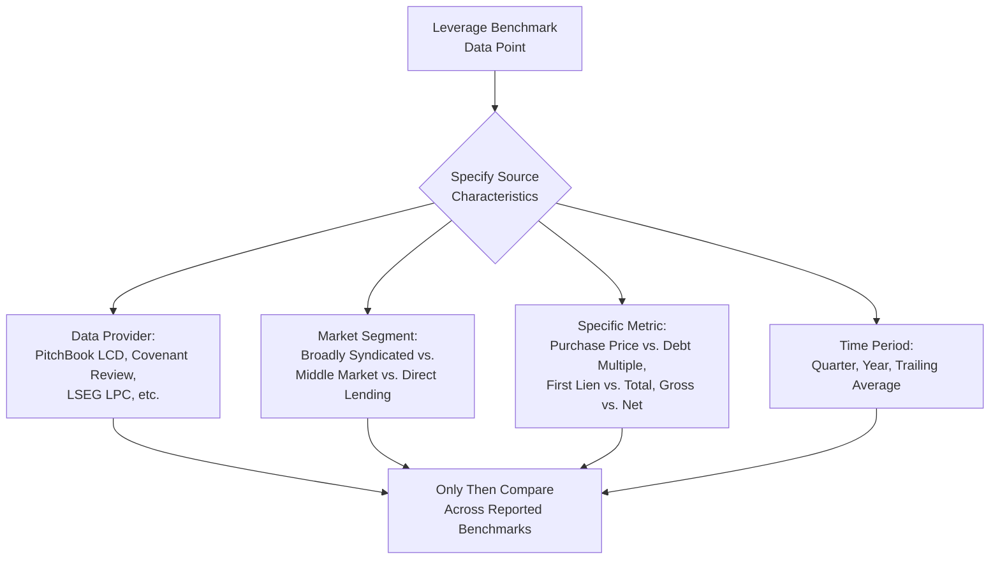
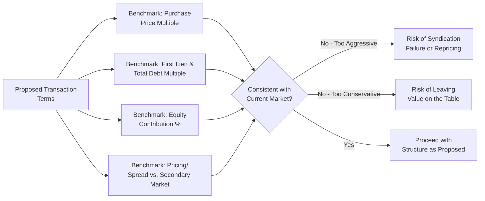

## Leverage Multiples and Market Convention Benchmarks

### Definition and Purpose

Leverage multiples and market convention benchmarks are the standardized reference points — total debt/EBITDA, first lien/EBITDA, purchase price/EBITDA, and equity contribution percentages — used by market participants to calibrate proposed transaction terms against prevailing conditions in the leveraged loan and high-yield markets. These benchmarks are inherently time-sensitive, shifting materially across credit cycles based on interest rate levels, investor risk appetite, and regulatory conditions.

**Key Points**

- Unlike the structural mechanics covered elsewhere in this course (covenant definitions, collateral frameworks, rating methodologies), leverage multiple benchmarks are **empirical market data points** that change continuously — any specific figure cited should be understood as a snapshot subject to revision, not a fixed rule.
- [Unverified — highly time-sensitive] Given the rapid pace of change in these benchmarks, any specific multiple cited in this section should be corroborated against current league table data (e.g., PitchBook LCD, Covenant Review, LSEG LPC) before being relied upon for an active transaction.

### Core Benchmark Categories

**Key Points**

Market participants track several distinct leverage-related benchmarks, each serving a different analytical purpose:

1. **Purchase price multiple (EV/EBITDA)**: The total enterprise value paid for a target, expressed as a multiple of EBITDA — a valuation benchmark, not strictly a leverage benchmark, but directly determines the required debt/equity split for a given leverage target.
2. **First lien debt multiple**: First lien secured debt as a multiple of EBITDA — the primary benchmark tracked for institutional term loan B sizing.
3. **Total debt multiple**: All debt (first lien plus second lien, subordinated notes, etc.) as a multiple of EBITDA.
4. **Equity contribution multiple/percentage**: The sponsor's equity check, expressed either as a multiple of EBITDA or as a percentage of total sources — often described as the inverse or residual of the leverage benchmark, since equity commonly fills the gap between the purchase price multiple and the debt multiple achievable in the prevailing market.

$$\text{Equity Multiple} = \text{Purchase Price Multiple} - \text{Total Debt Multiple}$$

(as introduced in the earlier chapter item on LBO capital structure basics)

### Recent Market Data Points (as reported, subject to volatility)

**Key Points**

[Unverified — reflects specific reporting periods and data sources cited; figures diverge across providers and market segments and should not be treated as a single settled benchmark]

Recent industry reporting has cited materially different figures depending on the data source, market segment, and time period measured:

- One 2026 dataset (covering leveraged loan-financed buyouts broadly) reported an average EBITDA purchase price multiple of 11.1x for LBOs financed through the syndicated loan market, up slightly from 11x in 2024, with financial leverage in buyout deals increasing to around 2.2x as interest rates fell, though this remains below levels seen for much of the 2010s (around 2.5x). [Inference] The 2.2x/2.5x figures in this source likely refer specifically to a debt/EBITDA leverage sub-component (e.g., senior or total debt) rather than a market-wide multiple across all deal types, given the material difference from the total debt multiples cited in other sources below — the exact metric definition should be confirmed against the original source. [opalesque](https://www.opalesque.com/712921/Green_shoots_emerge_in_private_equity_but_exit292.html)
- A separate 2025–2026 dataset focused on the broadly syndicated leveraged loan market reported LBO purchase multiples of just over 8.0x in a recent quarter, down from 12.0x and 13.0x in the comparable quarters of the two prior years, with pro forma adjusted debt for M&A deals at approximately 4.1x first-lien and 4.4x total debt, and LBO-specific first-lien and total debt multiples of approximately 4.6x and 4.6x respectively. [hellenicshippingnews](https://www.hellenicshippingnews.com/?p=1109882)
- A related industry newsletter cited an average pro forma adjusted debt multiple for M&A deals backed by broadly syndicated loans of 4.6x in the final quarter of a recent year, up from 4.4x in the prior quarter, with expectations that leverage multiples would continue rising following the rollback of post-2008 leveraged lending guidance restricting bank loans to borrowers with leverage exceeding 6.0x. [goodwinlaw](https://www.goodwinlaw.com/en/insights/newsletters/2026/01/newsletters-practices-df-debt-download-012226)

**Key Points on Interpreting Divergent Data**

- These figures illustrate why leverage benchmarks must always be sourced with clear specification of: (a) the data provider and methodology, (b) the specific market segment (broadly syndicated vs. middle market vs. direct lending), (c) the specific metric (purchase price multiple vs. debt multiple, first lien vs. total, gross vs. net), and (d) the precise time period measured.
- [Inference] The material divergence between the roughly 8x and roughly 11x purchase price multiples cited above for overlapping time periods likely reflects differences in underlying deal sample composition (e.g., large-cap vs. broader market, or differing treatment of add-on acquisitions versus platform LBOs) rather than a genuine contradiction — this type of definitional and sample divergence is common across leveraged finance data providers and underscores the importance of consulting primary source methodology notes.

### Regulatory and Structural Drivers of Benchmark Shifts

**Key Points**

- A significant driver of leverage benchmark movement is regulatory guidance affecting bank lending capacity. In late 2025/early 2026, U.S. banking regulators (the FDIC and OCC) lifted leveraged lending guidance that had limited banks' ability to make loans to borrowers with leverage exceeding 6.0x, with market participants anticipating banks would compete more aggressively against private credit lenders as a result. [goodwinlaw](https://www.goodwinlaw.com/en/insights/newsletters/2026/01/newsletters-practices-df-debt-download-012226)
- Following this regulatory shift, banks had already booked over $65 billion of debt tied to leveraged buyouts for 2026 as of the source's reporting date, illustrating how regulatory changes can produce rapid shifts in bank participation and, potentially, leverage capacity in the broadly syndicated market. [goodwinlaw](https://www.goodwinlaw.com/en/insights/newsletters/2026/01/newsletters-practices-df-debt-download-012226)
- [Speculation] Whether this regulatory easing produces a sustained increase in average leverage multiples, or is offset by other market forces (rate environment, investor risk appetite, macroeconomic conditions), cannot be determined from a single reporting period and would require observing multiple subsequent quarters of data.

### Interest Rate Environment and Yield Benchmarks

**Key Points**

- Leverage capacity and coverage ratio headroom are directly linked to the prevailing interest rate environment, since debt service cost (and therefore serviceable leverage at a given coverage threshold) moves inversely with base rates.
- One dataset noted secondary market B-rated leveraged loan yields to maturity around 8.1% with the federal funds rate at approximately 3.8%, while new-issue leveraged loans financing 2025 buyout deals priced at an average yield of approximately 7.3%. [opalesque](https://www.opalesque.com/712921/Green_shoots_emerge_in_private_equity_but_exit292.html)
- [Inference] As base rates decline, the same fixed-charge coverage ratio covenant threshold supports higher debt quantum for a given EBITDA base, which is one plausible mechanical explanation (alongside investor risk appetite and regulatory factors) for why leverage benchmarks have historically tended to drift upward during periods of falling or low interest rates and compress during periods of rate increases.

### Sector and Deal-Size Variation

**Key Points**

- Leverage benchmarks vary substantially by industry sector: asset-heavy, stable-cash-flow sectors (e.g., regulated utilities, certain healthcare and business services subsectors) have historically supported higher sustainable leverage than cyclical or capital-light sectors, echoing the sector-specific leverage tolerance discussed in the earlier chapter item on investment grade versus leveraged credit profiles.
- Deal size also correlates with typical leverage and purchase multiple levels: large-cap, broadly syndicated transactions have historically commanded higher purchase price multiples than middle-market transactions, reflecting the scale premium, greater strategic buyer competition, and deeper institutional capital market access available to larger issuers. Separately, in the lower middle market (main street segment, deals generally under $50 million in enterprise value), a industry survey tracking Q2 data from 2023 through 2026 showed purchase price multiples across size bands generally in the 2.0x–5.8x range (expressed as multiples of SDE for the smallest deals and EBITDA for larger ones within that segment), with the multiple generally increasing with deal size within the segment — illustrating that "market" leverage and purchase multiples differ substantially depending on which segment of the market (mega-cap broadly syndicated vs. lower middle market) is being referenced. [ibba](https://www.ibba.org/wp-content/uploads/2026/08/mp-highlights-q2-2026.pdf)

| Segment | Typical Multiple Basis | General Historical Pattern |
| --- | --- | --- |
| Mega-cap / broadly syndicated LBO | EV/EBITDA, Debt/EBITDA | Highest purchase multiples and deepest capital market access; most sensitive to CLO and broadly syndicated investor demand |
| Middle market (institutional/BDC) | EV/EBITDA | Moderate multiples; increasing reliance on direct lending/unitranche structures |
| Lower middle market ("Main Street") | EV/SDE (smallest) transitioning to EV/EBITDA | Lowest absolute multiples; more bank/seller-financing reliant |

### Practical Application: Benchmarking a Proposed Transaction

**Key Points**

When structuring a new transaction, practitioners typically benchmark proposed terms against recent comparable transactions along several dimensions simultaneously:

1. **Purchase price multiple** relative to recent comparable sector transactions
2. **First lien and total debt multiples** relative to recent comparable-size, comparable-sector syndicated or direct-lending transactions
3. **Equity contribution percentage** relative to current market norms for the relevant segment
4. **Pricing (spread/yield)** relative to current secondary market trading levels and recent new-issue pricing for comparably rated/sized credits

**Example**

A sponsor structuring a middle-market technology services LBO would benchmark the proposed purchase price (e.g., 10.5x EBITDA) against recent comparable technology services transactions, the proposed first lien leverage (e.g., 4.5x) against recent comparable-sector direct lending or broadly syndicated deals, and the proposed pricing (e.g., SOFR + 550 bps) against recent new-issue and secondary market levels for similarly-rated, similarly-sized credits — adjusting the structure if any dimension appears meaningfully out of line with current market conditions, since an off-market structure risks either leaving value on the table (if too conservative) or failing to syndicate successfully (if too aggressive).

**Conclusion**

Leverage multiples and market convention benchmarks provide the essential empirical reference points against which any specific proposed transaction's purchase price, debt quantum, and equity contribution are calibrated — but unlike the structural and definitional topics covered elsewhere in this course, these benchmarks are inherently volatile, varying by market segment, sector, deal size, data provider methodology, and macroeconomic/regulatory conditions. Effective capital structuring requires not memorizing a fixed multiple, but understanding which benchmark category is relevant to a given transaction, sourcing current data from reputable providers with clear methodology disclosure, and recognizing the regulatory and interest rate dynamics (such as the 2025–2026 leveraged lending guidance rollback and prevailing rate environment) that drive benchmark shifts over time.

**Related Topics**

- Leveraged Buyout Capital Structure Basics
- Sources and Uses of Funds Analysis
- Pro Forma Capitalization Table Construction
- Key Credit Metrics: Leverage, Coverage, and Liquidity Ratios
- Covenant-Lite Structuring and Market Evolution
- Leveraged Lending Guidance and Regulatory Oversight
- Direct Lending and Middle-Market Credit Documentation Standards
- Investment Grade versus Leveraged Credit Profiles