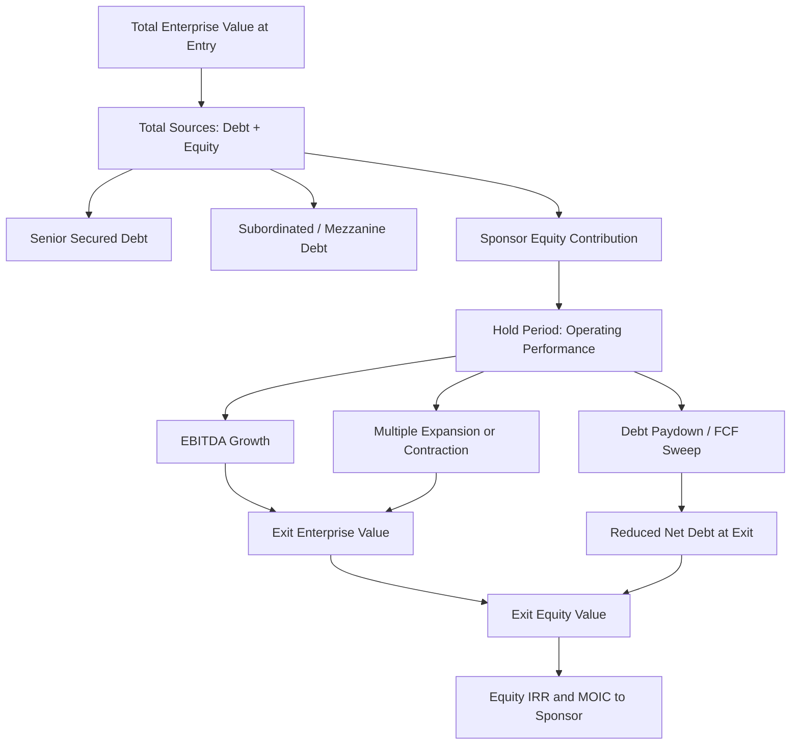

## Sponsor Equity Contribution and Return Requirements

### Overview

Sponsor equity contribution refers to the portion of a leveraged buyout (LBO) or acquisition financing structure funded by the financial sponsor's (private equity firm's) own equity capital, as distinct from the debt layers (senior secured, second lien, mezzanine, etc.) and any co-investor or management capital. Return requirements refer to the underwriting thresholds — typically expressed as internal rate of return (IRR) and multiple on invested capital (MOIC) — that the sponsor's equity check must clear to justify the investment relative to its cost of capital, fund mandate, and risk profile.

These two concepts are structurally linked: the equity contribution size determines leverage (and therefore risk and debt capacity), while the return requirement determines the maximum price the sponsor can pay and the minimum operational/exit performance needed to hit target returns.

### Role of Sponsor Equity in Capital Structure

**Key Points**

- Sponsor equity sits at the bottom of the capital structure (most subordinated, first-loss capital), absorbing losses before any debt tranche
- Typical equity contribution ranges 30%–50% of total sources in a standard LBO, though this varies by market cycle, sector, and credit availability
- Equity percentage is inversely related to leverage: Total Sources = Debt + Equity + (Management Rollover, if applicable)
- Higher equity contributions reduce financial risk (lower leverage multiples) but also reduce potential equity IRR, since less leverage means less amplification of returns

The standard sources and uses framework:

$$\text{Uses} = \text{Purchase Price} + \text{Refinanced Debt} + \text{Transaction Fees} + \text{OID/Discount}$$

$$\text{Sources} = \text{Senior Debt} + \text{Subordinated Debt} + \text{Sponsor Equity} + \text{Rollover Equity}$$

Sponsor equity is typically the "plug" — it is sized as the residual needed to balance sources and uses once debt capacity (set by leverage covenants, rating agency guidance, or lender appetite) is determined.

### Determining the Equity Check Size

**Example**

Consider an LBO with the following parameters:

| Item | Amount ($mm) | Multiple of EBITDA |
| --- | --- | --- |
| LTM EBITDA | 100 | 1.0x |
| Purchase Price (EV) | 800 | 8.0x |
| Senior Secured Debt | 400 | 4.0x |
| Subordinated Debt | 150 | 1.5x |
| Transaction Fees | 25 | — |
| Total Uses | 825 | — |
| Total Debt | 550 | 5.5x |
| **Sponsor Equity (plug)** | **275** | **2.75x** |

Here, sponsor equity funds approximately 33% of total sources ($275mm / $825mm), consistent with typical market ranges for a mid-leverage deal.

### Sources of Sponsor Equity

**Key Points**

- **Fund equity**: capital drawn from the sponsor's limited partners (LPs) via capital calls against committed capital
- **Co-investment equity**: additional capital from LPs or third parties investing alongside the fund, typically on the same terms, used to reduce single-fund concentration or to fill a check size beyond fund investment limits
- **Management rollover**: existing management equity reinvested into the new entity, aligning incentives and reducing the cash equity check required from the fund
- **Preferred equity / structured equity**: a hybrid layer (sometimes provided by a different capital source) that sits between debt and common equity, carrying a fixed coupon or preferred return before common equity participates

### Return Requirements: IRR and MOIC

**Key Points**

- **IRR (Internal Rate of Return)**: the discount rate at which the net present value (NPV) of all cash flows (equity in, equity out via dividends/exit) equals zero; sensitive to holding period
- **MOIC (Multiple on Invested Capital)**: total cash returned divided by total cash invested, ignoring time value of money
- Sponsors typically target **20%–25%+ gross IRR** and **2.5x–3.0x+ MOIC** over a typical 4–7 year holding period, though thresholds vary by fund strategy (growth equity vs. traditional buyout vs. distressed) and market environment
- Net returns to LPs are lower than gross returns due to management fees (typically 2% of committed capital) and carried interest (typically 20% of profits above a hurdle rate, often 8%)

The IRR is the rate $r$ solving:

$$0 = -E_0 + \sum_{t=1}^{n} \frac{CF_t}{(1+r)^t} + \frac{E_n}{(1+r)^n}$$

Where $E_0$ is the initial equity investment, $CF_t$ are interim cash distributions (dividends, dividend recaps), and $E_n$ is the equity value realized at exit in year $n$.

MOIC is simply:

$$\text{MOIC} = \frac{\sum CF_t + E_n}{E_0}$$

### Value Creation Levers Driving Equity Returns

**Key Points**

Sponsor equity returns in an LBO are typically decomposed into three levers:

1. **EBITDA growth** — organic growth, margin expansion, and add-on acquisitions (bolt-ons) increase the exit EBITDA base
2. **Multiple expansion/contraction** — the difference between the entry EV/EBITDA multiple and the exit multiple; this is largely market/sector-driven and considered the least controllable lever
3. **Debt paydown (deleveraging)** — free cash flow generated by the business is used to amortize debt, increasing the equity value directly without any change in enterprise value

**Example**

Using the deal above, assume a 5-year hold with the following exit assumptions:

| Item | Entry (Year 0) | Exit (Year 5) |
| --- | --- | --- |
| EBITDA | $100mm | $140mm |
| EV/EBITDA Multiple | 8.0x | 8.0x |
| Enterprise Value | $800mm | $1,120mm |
| Total Debt | $550mm | $300mm (after paydown) |
| Equity Value | $275mm (net of fees) | $820mm |

$$\text{MOIC} = \frac{820}{275} = 2.98x$$

$$\text{IRR} \approx (2.98)^{1/5} - 1 \approx 24.4\%$$

Decomposing the value creation:

- EBITDA growth contribution: ($140mm − $100mm) × 8.0x = $320mm
- Multiple change contribution: $0 (flat multiple assumed)
- Debt paydown contribution: $550mm − $300mm = $250mm
- Total equity value creation: $320mm + $250mm = $570mm (matches $820mm − $275mm ≈ $545mm, with residual attributable to fee/OID timing nuances) [Inference]

### Sensitivity of Returns to Leverage and Equity Check Size

**Key Points**

- Because equity is the residual, smaller equity checks (higher leverage) amplify both upside and downside IRR for a given operating outcome
- Lenders and rating agencies impose practical ceilings on leverage (e.g., total debt/EBITDA covenants, leveraged lending guidance), which indirectly sets a floor on required equity contribution
- Post-Global Financial Crisis regulatory guidance (in the U.S., interagency Leveraged Lending Guidance) generally flagged total leverage above 6.0x EBITDA as warranting scrutiny, influencing market norms on debt capacity and thus equity sizing [Unverified — specific thresholds and enforcement have varied over time and by jurisdiction]

**Example: Equity check sensitivity**

Holding all operating assumptions constant, varying leverage changes required equity and resulting IRR:

| Total Debt/EBITDA | Debt ($mm) | Equity ($mm) | Exit Equity Value ($mm) | MOIC | Approx. IRR |
| --- | --- | --- | --- | --- | --- |
| 4.5x | 450 | 375 | 720 | 1.92x | ~14.0% |
| 5.5x | 550 | 275 | 820 | 2.98x | ~24.4% |
| 6.5x | 650 | 175 | 920 | 5.26x | ~40.0% |

This table illustrates the leverage amplification effect: identical operating performance produces materially different equity returns depending on the debt/equity split. [Behavior may vary based on actual amortization schedules, cash sweep mechanics, and refinancing assumptions.]

### Preferred Equity and Return Waterfalls

**Key Points**

- In structures with preferred equity or multiple common equity classes (e.g., sponsor vs. management), a **distribution waterfall** governs the order and rate at which proceeds are allocated at exit
- A typical waterfall: (1) return of preferred capital plus accrued preferred return/coupon, (2) return of common capital, (3) pro-rata split of residual proceeds, sometimes subject to a **catch-up** provision and **promote/carried interest** tiers
- Management often receives a **ratchet** or **sweet equity** structure — a disproportionate share of upside above certain IRR/MOIC hurdles — to incentivize outperformance

### Equity Commitment Letters and Certainty of Funds

**Key Points**

- In acquisition financing, sponsors typically provide an **Equity Commitment Letter (ECL)** to the target/seller as part of the financing package, representing a binding (or conditional) commitment to fund the equity portion at closing
- ECLs are often paired with **debt commitment letters** from lended (bridge/underwritten commitments) to give sellers confidence in "certainty of funds"
- Sponsors may negotiate **equity backstop** or **limited guarantee** provisions capping their liability if the deal fails to close for reasons outside their control

### Common Pitfalls and Practical Considerations

**Key Points**

- Overestimating exit multiple (assuming multiple expansion) is a frequent source of return underperformance when market conditions shift
- Underestimating the equity check needed due to fee/expense leakage (transaction costs, OID, breakage fees) can create funding gaps late in a process
- Covenant headroom must be modeled carefully; tight coverage ratios at close leave little room for operating underperformance before triggering defaults, which can impair equity value even before insolvency
- Dividend recapitalizations (raising incremental debt post-close to fund a distribution to equity holders) can be used to return capital early and boost IRR, but increase leverage and refinancing risk

### Simplified Sponsor Equity Return Flow

### Sources and Uses Waterfall (svg_diagram)

<svg xmlns="http://www.w3.org/2000/svg" viewBox="0 0 700 380">
\<style\>
.lbl{font-family:Arial,sans-serif;font-size:13px;fill:#1a1a1a;}
.hdr{font-family:Arial,sans-serif;font-size:15px;font-weight:bold;fill:#1a1a1a;}
.small{font-family:Arial,sans-serif;font-size:11px;fill:#333333;}
\</style\>
<text x="350" y="25" text-anchor="middle" class="hdr">Sponsor Equity Contribution and Return Requirements (svg_diagram)</text>

<text x="150" y="55" text-anchor="middle" class="hdr">Sources</text>

<rect x="60" y="65" width="180" height="60" fill="`#2c5f8a`" stroke="`#1a1a1a`" />

<text x="150" y="100" text-anchor="middle" class="lbl" fill="white">Senior Debt (4.0x)</text>

<rect x="60" y="125" width="180" height="35" fill="#4a7fa8" stroke="#1a1a1a" />
<text x="150" y="147" text-anchor="middle" class="lbl" fill="white">Sub Debt (1.5x)</text>
<rect x="60" y="160" width="180" height="90" fill="#8fae6a" stroke="#1a1a1a" />
<text x="150" y="200" text-anchor="middle" class="lbl">Sponsor Equity</text>
<text x="150" y="218" text-anchor="middle" class="lbl">(2.75x / ~33%)</text>

<text x="150" y="270" text-anchor="middle" class="small">Total Sources: $825mm</text>

<line x1="260" y1="160" x2="330" y2="160" stroke="#1a1a1a" stroke-width="2" marker-end="url(#arrow)" />

<text x="500" y="55" text-anchor="middle" class="hdr">Uses</text>

<rect x="410" y="65" width="180" height="150" fill="`#c98a3d`" stroke="`#1a1a1a`" />

<text x="500" y="140" text-anchor="middle" class="lbl">Purchase Price</text>

<text x="500" y="158" text-anchor="middle" class="lbl">(EV: $800mm)</text>

<rect x="410" y="215" width="180" height="35" fill="#d9a668" stroke="#1a1a1a" />
<text x="500" y="237" text-anchor="middle" class="lbl">Fees / OID ($25mm)</text>

<text x="500" y="270" text-anchor="middle" class="small">Total Uses: $825mm</text>

<line x1="60" y1="300" x2="640" y2="300" stroke="#999999" stroke-width="1" />
<text x="350" y="325" text-anchor="middle" class="small">Equity IRR ≈ 24.4% | MOIC ≈ 2.98x (5-yr hold, EBITDA growth + debt paydown, flat multiple)</text>
<text x="350" y="345" text-anchor="middle" class="small">Illustrative example — actual returns depend on entry/exit multiples, leverage, and operating performance</text>
</svg>

**Related Topics**

- LBO Model Construction and Circular Reference Handling (Debt Schedules, Cash Sweeps)
- Debt Capacity Analysis and Leverage Covenant Structuring
- Management Incentive Plans (MIPs), Sweet Equity, and Ratchet Structures
- Dividend Recapitalization Mechanics and Risk
- Preferred Equity Structuring and Waterfall Modeling
- Equity Commitment Letters and Certain Funds Provisions in M&A
- Fund Economics: Management Fees, Carried Interest, and LP/GP Alignment
- Exit Strategy Analysis: Strategic Sale vs. Secondary Buyout vs. IPO