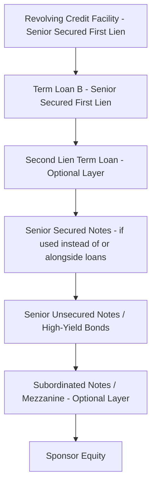

## Choosing Between Bonds and Loans in Leveraged Structures

### Overview

In leveraged finance, issuers (typically sub-investment-grade corporates or sponsor-backed portfolio companies) fund acquisitions, refinancings, and recapitalizations using a mix of leveraged loans and high-yield bonds. Although both instruments sit below investment-grade debt in credit quality, they differ materially in structure, investor base, covenant packages, pricing mechanics, and flexibility. The choice between them — or the blend of both — is a core capital structuring decision that affects cost of capital, call flexibility, security position, and execution risk.

### Core Structural Differences

**Key Points**

- **Seniority and security**: Leveraged (term) loans are typically senior secured, sitting at the top of the capital structure with a first-priority lien on collateral; high-yield bonds are often senior unsecured or subordinated, ranking behind secured loans in a liquidation waterfall
- **Interest rate basis**: Loans are typically floating-rate, priced as a spread over a reference rate (historically LIBOR, now predominantly SOFR plus a credit spread adjustment or straight SOFR); bonds are typically fixed-rate coupons
- **Amortization**: Term Loan B (TLB) tranches — the dominant institutional loan product — typically require only nominal amortization (e.g., 1% per annum) with a bullet at maturity; high-yield bonds are non-amortizing bullet instruments
- **Call protection**: Loans generally have soft call protection only (e.g., 101 soft call for 6 months post-issuance, sometimes none at all); bonds carry structured call schedules (typically non-call for the first half of the bond's life, then a step-down premium schedule, e.g., NC-2 then call at 103, 101.5, 100 for an 8-year bond)
- **Investor base**: Loans are held by institutional investors — CLOs (collateralized loan obligations), loan mutual funds, and banks; bonds are held by high-yield mutual funds, insurance companies, hedge funds, and retail-facing funds
- **Trading and settlement**: Loans settle on a T+7 (or longer) basis via the LSTA (Loan Syndications and Trading Association) framework in the U.S. and trade over-the-counter with less standardization; bonds settle faster (T+2 typically) and trade in a more liquid secondary market with public price discovery via TRACE

### Comparative Summary Table

| Feature | Leveraged (Term) Loan | High-Yield Bond |
| --- | --- | --- |
| Seniority | Senior secured (typically first lien) | Senior unsecured / subordinated |
| Rate type | Floating (SOFR + spread) | Fixed coupon |
| Amortization | Minimal (~1%/yr), bullet at maturity | None (bullet) |
| Call protection | Soft call (101, 6–12 months) or none | Hard call schedule (NC-period + premiums) |
| Typical tenor | 5–7 years | 7–10 years |
| Documentation | Credit Agreement (bank-style covenants) | Indenture (bond covenants, incurrence-based) |
| Registration | Private (no SEC registration) | Often Rule 144A with registration rights, or public |
| Prepayment flexibility | High — freely prepayable, often no penalty after soft call | Lower — locked in during NC period, make-whole or premium required |
| Primary investor base | CLOs, loan funds, banks | HY mutual funds, insurance cos, hedge funds |
| Covenant style | Increasingly covenant-lite (incurrence-based, few maintenance tests) | Incurrence-based (bond-style baskets and carve-outs) |

### Covenant Structures Compared

**Key Points**

- **Maintenance covenants**: tested on a regular (typically quarterly) basis regardless of company action; historically a feature of traditional bank loans but largely eliminated from institutional TLBs in the "covenant-lite" era
- **Incurrence covenants**: tested only when the company takes a specific action (issuing debt, paying a dividend, making an acquisition); the dominant covenant style in both high-yield bonds and modern covenant-lite loans
- Bond indentures typically include restrictive covenants around: limitation on indebtedness, limitation on restricted payments (dividends, redemptions), limitation on liens, limitation on asset sales, change of control puts (typically at 101% of par), and limitation on transactions with affiliates
- Loan credit agreements historically retained a springing maintenance covenant (e.g., a net leverage test triggered only when revolver utilization exceeds a threshold, such as 35%–40%), even in otherwise covenant-lite structures

### Pricing and Cost of Capital Considerations

**Key Points**

- Because loans are secured and floating-rate, they typically command a lower all-in spread than unsecured bonds of the same issuer, all else equal, reflecting the reduced credit risk from collateral backing
- Bonds' fixed-rate nature provides interest rate certainty over the life of the instrument, which can be valuable in rising-rate environments; floating-rate loans expose issuers to rate risk unless hedged (e.g., via interest rate caps or swaps)
- Loan pricing is quoted as a spread (e.g., SOFR + 375 bps) with an **Original Issue Discount (OID)** — loans are often issued at 99 or 99.5 (a discount to par), effectively increasing the yield to the lender
- Bond pricing is quoted as a coupon (fixed %) determined at issuance based on the yield-to-worst investors require, factoring in call schedule optionality

**Example: Blended Cost of Capital Calculation**

Assume a capital structure with:

- $400mm Term Loan B at SOFR + 400 bps (SOFR = 4.30%, OID amortized adds ~15 bps) → all-in cost ≈ 8.45%
- $200mm Senior Unsecured Notes at a fixed 9.25% coupon

$$\text{Weighted Average Cost of Debt} = \frac{(400 \times 8.45\%) + (200 \times 9.25\%)}{600} = \frac{33.8 + 18.5}{600} \approx 8.72\%$$

This blended structure allows the sponsor to access cheaper, floating-rate secured capital for the bulk of financing while using unsecured bonds to extend duration and preserve collateral capacity for future incremental debt.

### Flexibility and Prepayment Considerations

**Key Points**

- Loans offer far greater prepayment flexibility, which matters for sponsors expecting an early exit (sale, IPO, refinancing) since bonds may require paying a **make-whole premium** (a Treasury-based penalty compensating bondholders for lost interest) if redeemed during the non-call period
- The relative absence of call protection on loans is a trade-off: loan investors (largely CLOs with reinvestment mandates) accept this because loan pricing can float upward if the issuer's credit improves are less likely, but repricing transactions (lowering the spread on an existing loan without a full refinancing) are common and cheap to execute
- **Repricing risk** is a loan-specific dynamic: issuers can repeatedly "reprice" a TLB downward in spread terms with minimal fees (often just a 1% soft call premium or none at all), a flexibility unavailable to bond issuers absent a full tender/redemption

### Determining the Optimal Mix

**Key Points**

Sponsors and their advisors typically weigh the following factors in constructing the debt stack:

1. **Expected holding period**: shorter expected holds favor loans (prepayable without penalty) over bonds (locked-in call schedules); a sponsor targeting a 3-year exit will minimize hard-call bond exposure
2. **Collateral availability and first-lien capacity**: if the business has substantial tangible/intangible assets to pledge, secured loan capacity can be maximized before layering in unsecured bonds
3. **Market conditions and relative execution windows**: the loan market (driven by CLO formation and retail loan fund flows) and the bond market (driven by broader fixed income demand) can have divergent windows of receptivity; issuers often size tranches opportunistically based on which market is "open" and offers the tightest pricing at the time of syndication
4. **Rate view and hedging cost**: if an issuer/sponsor has a strong view that rates will rise, fixed-rate bonds reduce interest rate risk; if floating-rate exposure is acceptable or hedged, loans may be cheaper
5. **Ratings agency and disclosure considerations**: bonds (especially public or 144A-with-registration-rights bonds) typically require issuer or family ratings from agencies (Moody's, S&P, Fitch) and ongoing periodic reporting; purely private loan-only structures can sometimes avoid public ratings, reducing disclosure burden [Inference — practice varies by deal size, sponsor preference, and whether a broadly syndicated loan requires a rating for CLO eligibility]
6. **Structural subordination needs**: sponsors may deliberately use unsecured bonds to preserve first-lien loan capacity as "dry powder" for future incremental facilities (via incremental/accordion baskets) without needing bondholder consent

### Typical Capital Structure Stacking Order

### Hybrid Approach: Unitranche and Direct Lending Alternatives

**Key Points**

- In the middle market, **unitranche facilities** — a single blended-rate loan combining first- and second-lien economics into one tranche — have grown as an alternative to the traditional loan/bond split, typically provided by direct lenders (private credit funds) rather than syndicated to CLOs or bond investors
- Unitranche structures simplify the capital structure (single lender or small club, single set of documents/covenants) at the cost of typically higher blended pricing versus a fully syndicated loan/bond structure, reflecting the illiquidity premium and credit/underwriting flexibility direct lenders provide
- The growth of private credit has been a notable secular trend affecting the traditional loan-versus-bond decision, as issuers below a certain size increasingly bypass the broadly syndicated market altogether [Unverified — the precise market share shift is time- and cycle-dependent and should be checked against current market data for a specific analysis]

### Practical Decision Framework (svg_diagram)

<svg xmlns="http://www.w3.org/2000/svg" viewBox="0 0 700 420">
\<style\>
.lbl{font-family:Arial,sans-serif;font-size:12px;fill:#1a1a1a;}
.hdr{font-family:Arial,sans-serif;font-size:15px;font-weight:bold;fill:#1a1a1a;}
.node{fill:#eef3f8;stroke:#2c5f8a;stroke-width:1.5;}
.decision{fill:#fdf1dc;stroke:#c98a3d;stroke-width:1.5;}
\</style\>
<text x="350" y="24" text-anchor="middle" class="hdr">Choosing Between Bonds and Loans in Leveraged Structures (svg_diagram)</text>
<rect x="270" y="45" width="160" height="45" rx="6" class="decision" />
<text x="350" y="72" text-anchor="middle" class="lbl">Financing Need Identified</text>
<line x1="350" y1="90" x2="350" y2="115" stroke="#1a1a1a" stroke-width="1.5" />
<rect x="230" y="115" width="240" height="55" rx="6" class="decision" />
<text x="350" y="138" text-anchor="middle" class="lbl">Sufficient tangible/intangible</text>
<text x="350" y="154" text-anchor="middle" class="lbl">collateral for first-lien capacity?</text>
<line x1="290" y1="170" x2="150" y2="210" stroke="#1a1a1a" stroke-width="1.5" />
<line x1="410" y1="170" x2="550" y2="210" stroke="#1a1a1a" stroke-width="1.5" />
<text x="200" y="195" class="lbl">Yes</text>
<text x="470" y="195" class="lbl">Limited</text>
<rect x="60" y="210" width="180" height="55" rx="6" class="node" />
<text x="150" y="233" text-anchor="middle" class="lbl">Prioritize Term Loan B</text>
<text x="150" y="249" text-anchor="middle" class="lbl">(secured, floating, prepayable)</text>
<rect x="460" y="210" width="180" height="55" rx="6" class="node" />
<text x="550" y="233" text-anchor="middle" class="lbl">Consider Unsecured Bonds</text>
<text x="550" y="249" text-anchor="middle" class="lbl">or Second Lien</text>
<line x1="150" y1="265" x2="150" y2="290" stroke="#1a1a1a" stroke-width="1.5" />
<rect x="60" y="290" width="180" height="55" rx="6" class="decision" />
<text x="150" y="313" text-anchor="middle" class="lbl">Short expected hold</text>
<text x="150" y="329" text-anchor="middle" class="lbl">(sale/refi in 2-3 yrs)?</text>
<line x1="240" y1="317" x2="330" y2="317" stroke="#1a1a1a" stroke-width="1.5" />
<text x="270" y="310" class="lbl">Yes</text>
<rect x="330" y="290" width="180" height="55" rx="6" class="node" />
<text x="420" y="313" text-anchor="middle" class="lbl">Favor Loan-Heavy Structure</text>
<text x="420" y="329" text-anchor="middle" class="lbl">(minimize call protection cost)</text>
<line x1="150" y1="345" x2="150" y2="370" stroke="#1a1a1a" stroke-width="1.5" />
<text x="150" y="390" text-anchor="middle" class="lbl">Longer hold / rate-hedging</text>
<text x="150" y="405" text-anchor="middle" class="lbl">need → Layer in Fixed-Rate Bonds</text>
</svg>

**Related Topics**

- Original Issue Discount (OID) and Effective Yield Calculations
- Covenant-Lite Loan Structures and Springing Maintenance Covenants
- High-Yield Bond Call Schedules and Make-Whole Premium Mechanics
- CLO Formation and Institutional Loan Demand Dynamics
- Second Lien and Unitranche Structuring in Middle-Market Deals
- Interest Rate Hedging for Floating-Rate Debt (Caps, Swaps, Collars)
- Incremental Facilities, Accordion Baskets, and Incurrence Covenant Mechanics
- Direct Lending and Private Credit Market Structures