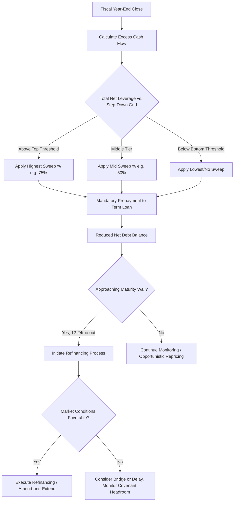

## Debt Paydown, Cash Flow Sweeps, and Refinancing Dynamics

### Overview

Debt paydown mechanics govern how leveraged issuers reduce outstanding indebtedness over time, whether through scheduled amortization, discretionary prepayments, or mandatory cash flow sweeps. Refinancing dynamics describe the process and timing considerations for replacing existing debt with new instruments — driven by maturity walls, repricing opportunities, covenant relief needs, or capital structure optimization. Together these mechanics are central to modeling leveraged capital structures, since the pace of deleveraging directly drives equity value creation in an LBO and materially affects credit risk over the life of a loan or bond.

### Scheduled Amortization

**Key Points**

- **Term Loan A (TLA)** facilities, typically held by banks, carry meaningful scheduled amortization — often 5%–10% per annum, sometimes structured on a step-up schedule (e.g., 5%/5%/10%/10%/15%/65% over a 6-year term)
- **Term Loan B (TLB)** facilities, the dominant institutional leveraged loan product, carry only nominal amortization — typically 1% per annum of original principal, paid quarterly (0.25% per quarter), with the balance due as a bullet at maturity
- **High-yield bonds** are non-amortizing; 100% of principal is due at maturity (bullet structure)
- **Revolving credit facilities (RCFs)** have no scheduled amortization but are typically undrawn or partially drawn, with any outstanding balance subject to full repayment at facility maturity or upon a cash flow sweep trigger

### Mandatory Cash Flow Sweeps

**Key Points**

- A cash flow sweep (or "excess cash flow sweep," ECF sweep) is a mandatory prepayment mechanism in a credit agreement requiring the borrower to apply a defined percentage of "excess cash flow" toward debt paydown, typically applied annually after fiscal year-end
- Excess cash flow is generally defined as: Consolidated Net Income + non-cash charges (D&A, non-cash comp) − scheduled debt amortization − unfinanced capital expenditures − cash taxes − increases in net working capital − permitted restricted payments, though the precise definition is heavily negotiated and varies by credit agreement [Behavior may vary based on specific credit agreement definitions and negotiated carve-outs]
- Sweep percentages are commonly **step-down structures** tied to leverage ratios — for example: 75% of ECF swept if total net leverage > 4.0x, stepping down to 50% if leverage is between 3.0x–4.0x, and 25% (or 0%) if leverage falls below 3.0x
- Sweeps are usually applied pro rata across term loan tranches (or sometimes solely to the most senior/nearest-maturity tranche, depending on documentation) and typically allow the borrower to use voluntary prepayments made during the year as a dollar-for-dollar credit against the mandatory sweep obligation

**Example: Excess Cash Flow Sweep Calculation**

| Line Item | Amount ($mm) |
| --- | --- |
| Net Income | 40 |
| (+) D&A | 30 |
| (–) Scheduled Amortization | 5 |
| (–) Unfinanced CapEx | 15 |
| (–) Cash Taxes | 8 |
| (–) Increase in NWC | 4 |
| **Excess Cash Flow** | **38** |

If total net leverage is 4.5x (above the 4.0x threshold), the sweep percentage is 75%:

$$\text{Mandatory Prepayment} = 38 \times 75\% = \$28.5\text{mm}$$

### Voluntary Prepayments

**Key Points**

- Term loans are generally freely prepayable at par (subject only to breakage costs on floating-rate funding periods and any applicable soft call premium — commonly 101% of par if prepaid within 6–12 months of closing via a repricing transaction, sometimes waived entirely for non-repricing prepayments)
- High-yield bonds are far more restrictive: most are non-callable for a defined period (e.g., "NC-4" on an 8-year bond means non-callable for 4 years), after which a step-down call premium schedule applies (e.g., 104%, 102%, 100% at successive anniversaries)
- Bonds redeemed during the non-call period require a **make-whole premium**, calculated to compensate holders for the present value of remaining coupon payments through the first call date, typically discounted at a Treasury rate plus a fixed spread (e.g., T+50 bps)
- Some high-yield indentures include an **equity clawback** provision, permitting redemption of up to 35%–40% of the bonds using proceeds from a qualified equity offering, usually within the first three years, at a premium equal to the coupon rate

### Refinancing Triggers and Dynamics

**Key Points**

Refinancing activity in leveraged capital structures is typically driven by one or more of the following:

1. **Maturity wall management**: issuers proactively refinance well ahead of maturity (often 12–24 months prior) to avoid a "maturity wall" scenario where approaching debt maturities create refinancing risk, particularly if credit markets tighten
2. **Repricing for cost savings**: in a loan-only context, borrowers can "reprice" an existing TLB — reducing the spread over the reference rate — without extending maturity or increasing the facility size, typically executed cheaply (a 101 soft call premium is often the only cost, and even that is frequently waived in strong technical markets)
3. **Covenant relief / amend-and-extend**: issuers facing covenant pressure may negotiate an amendment (with consent fees to lenders) to loosen financial covenants, or execute an "amend-and-extend" transaction pushing out maturity in exchange for a modest spread increase
4. **Opportunistic market conditions**: tightening credit spreads or improved issuer credit ratings can make refinancing economically attractive even absent an approaching maturity, locking in lower borrowing costs
5. **Capital structure simplification**: refinancing can be used to eliminate a complex multi-tranche structure (e.g., replacing a second lien loan and mezzanine notes with a single new unsecured bond) to reduce documentation complexity and intercreditor friction

### Refinancing Mechanics: Repricing vs. Full Refinancing vs. Amend-and-Extend

| Transaction Type | What Changes | Typical Cost | Consent Required |
| --- | --- | --- | --- |
| Repricing | Spread only (lower cost) | Soft call premium (often 101 or waived) | Majority lenders (often via "yank-a-bank" for non-consenting lenders) |
| Amend-and-Extend | Maturity extended, often spread increases | Consent/extension fee to participating lenders | Lenders opting to extend (non-extending lenders can be replaced) |
| Full Refinancing | Entirely new facility/instrument replaces old debt | New OID, arrangement fees, breakage costs, possible make-whole on bonds | New lender/investor syndicate; old debt repaid in full |

### Impact of Deleveraging on Equity Value

**Key Points**

- Debt paydown (whether scheduled, swept, or voluntary) directly increases equity value in a leveraged structure without requiring any change in enterprise value, since:

$$\text{Equity Value} = \text{Enterprise Value} - \text{Net Debt}$$

- This is the "deleveraging" component of LBO returns discussed alongside EBITDA growth and multiple expansion; all else equal, faster debt paydown accelerates equity value creation and de-risks the capital structure by improving coverage ratios over time
- Aggressive cash flow sweeps can, however, constrain the issuer's financial flexibility (less cash available for growth capex, acquisitions, or dividends), creating a tension between rapid deleveraging and strategic reinvestment — a trade-off sponsors and management negotiate during credit agreement documentation

**Example: Sensitivity of Equity Value to Sweep Aggressiveness**

Assume EBITDA and multiple are held constant (Enterprise Value = $1,000mm at exit in Year 5), with beginning debt of $550mm and Year 5 free cash flow generation of $250mm cumulative:

| Sweep Scenario | Debt Paid Down (Cumulative) | Ending Net Debt | Exit Equity Value |
| --- | --- | --- | --- |
| Low sweep (25%) | $62.5mm | $487.5mm | $512.5mm |
| Moderate sweep (50%) | $125mm | $425mm | $575mm |
| High sweep (75%) | $187.5mm | $362.5mm | $637.5mm |

This illustrates that, holding operating performance constant, more aggressive mandatory sweeps directly transfer value to equity holders by accelerating deleveraging — though the unswept cash in low-sweep scenarios may instead fund growth investments that could increase EBITDA (and thus enterprise value) by more than the foregone paydown, a dynamic not captured in this simplified table. [Inference — actual outcomes depend on the marginal return on reinvested capital versus the cost of debt]

### Debt Paydown and Refinancing Decision Flow

### Cash Flow Sweep Waterfall (svg_diagram)

<svg xmlns="http://www.w3.org/2000/svg" viewBox="0 0 700 340">
\<style\>
.lbl{font-family:Arial,sans-serif;font-size:12px;fill:#1a1a1a;}
.hdr{font-family:Arial,sans-serif;font-size:15px;font-weight:bold;fill:#1a1a1a;}
.box{fill:#eef3f8;stroke:#2c5f8a;stroke-width:1.5;}
.arrow{stroke:#1a1a1a;stroke-width:1.5;marker-end:url(#ah);}
\</style\>
<text x="350" y="24" text-anchor="middle" class="hdr">Debt Paydown, Cash Flow Sweeps, and Refinancing Dynamics (svg_diagram)</text>
<rect x="30" y="50" width="150" height="45" rx="6" class="box" />
<text x="105" y="77" text-anchor="middle" class="lbl">Net Income + D&amp;A</text>
<line x1="180" y1="72" x2="230" y2="72" class="arrow" />
<rect x="230" y="50" width="180" height="45" rx="6" class="box" />
<text x="320" y="70" text-anchor="middle" class="lbl">Less: Amort, CapEx,</text>
<text x="320" y="86" text-anchor="middle" class="lbl">Cash Taxes, ΔNWC</text>
<line x1="410" y1="72" x2="460" y2="72" class="arrow" />
<rect x="460" y="50" width="180" height="45" rx="6" class="box" />
<text x="550" y="77" text-anchor="middle" class="lbl">= Excess Cash Flow (ECF)</text>
<line x1="550" y1="95" x2="550" y2="130" class="arrow" />
<rect x="400" y="130" width="240" height="55" rx="6" class="box" />
<text x="520" y="153" text-anchor="middle" class="lbl">Apply Step-Down Sweep %</text>
<text x="520" y="169" text-anchor="middle" class="lbl">(based on Net Leverage Ratio)</text>
<line x1="520" y1="185" x2="520" y2="220" class="arrow" />
<rect x="400" y="220" width="240" height="45" rx="6" class="box" />
<text x="520" y="247" text-anchor="middle" class="lbl">Mandatory Prepayment to Debt</text>
<line x1="400" y1="242" x2="230" y2="242" class="arrow" />
<rect x="30" y="220" width="170" height="45" rx="6" class="box" />
<text x="115" y="238" text-anchor="middle" class="lbl">Reduced Net Debt</text>
<text x="115" y="254" text-anchor="middle" class="lbl">→ Increased Equity Value</text>
<line x1="115" y1="265" x2="115" y2="290" class="arrow" />
<text x="115" y="310" text-anchor="middle" class="lbl">Improved Leverage Ratio</text>
<text x="115" y="325" text-anchor="middle" class="lbl">→ Lower Sweep % Next Period</text>
</svg>

**Related Topics**

- LBO Debt Schedule Construction and Circularity (Cash Sweep/Interest Expense Loop)
- Original Issue Discount (OID) and Soft Call Premium Mechanics
- Amend-and-Extend Transactions and Lender Consent Dynamics
- Covenant Headroom Analysis and Financial Maintenance Test Modeling
- Make-Whole Premium and Equity Clawback Provisions in High-Yield Indentures
- Working Capital Modeling and Its Effect on Excess Cash Flow Definitions
- Maturity Wall Analysis and Proactive Refinancing Strategy
- Intercreditor Agreements in Multi-Tranche Debt Structures