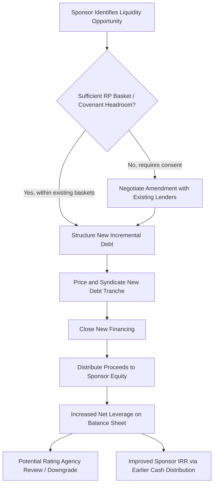

## Dividend Recapitalizations

### Overview

A dividend recapitalization ("dividend recap") is a transaction in which a leveraged company raises incremental debt — or refinances existing debt at a larger size — specifically to fund a cash distribution to its equity holders, most commonly the financial sponsor in a private-equity-owned portfolio company. Unlike an operating dividend funded from free cash flow, a dividend recap is debt-funded: the company's balance sheet leverage increases while ownership and enterprise value are unaffected, allowing the sponsor to extract liquidity (and partially realize returns) without a full or partial exit.

### Mechanics and Structure

**Key Points**

- The company issues new debt (an incremental term loan, an add-on to an existing bond, or an entirely new tranche) sized to fund the dividend plus associated fees and expenses
- Proceeds flow to equity holders pro rata according to their ownership stakes, typically structured as a special cash dividend or, in some structures, a redemption of a portion of preferred/common equity
- The transaction is distinct from a refinancing: a pure refinancing replaces existing debt at similar or improved terms without net new leverage; a dividend recap explicitly increases net leverage relative to pre-transaction levels
- Execution typically requires either (a) sufficient covenant headroom/capacity under existing credit agreements (via a "restricted payments" basket or incremental debt basket) or (b) a full amendment/consent process with existing lenders to permit the incremental debt and the distribution

### Sources and Uses of a Dividend Recap

**Example**

| Uses | Amount ($mm) | Sources | Amount ($mm) |
| --- | --- | --- | --- |
| Dividend to Sponsor Equity | 150 | New Incremental Term Loan | 165 |
| Transaction Fees / OID | 15 |  |  |
| **Total Uses** | **165** | **Total Sources** | **165** |

Pre-transaction: EBITDA $100mm, Existing Debt $400mm (4.0x)

Post-transaction: Existing Debt $400mm + New Debt $165mm = $565mm (5.65x)

$$\text{Leverage Increase} = \frac{565}{100} - \frac{400}{100} = 1.65x$$

The sponsor receives $150mm of liquidity while enterprise value and equity ownership percentage remain unchanged; the increase in leverage is borne entirely by the capital structure (and, ultimately, existing/new debt holders and remaining equity value).

### Impact on Sponsor Returns (IRR/MOIC)

**Key Points**

- A dividend recap generates an interim cash distribution ($CF_t$ in the IRR formula) earlier in the holding period, which — because of the time value of money — can meaningfully increase IRR even if total exit proceeds (dividend + final exit equity value) are held constant relative to a no-dividend scenario
- MOIC impact is more nuanced: extracting cash via debt increases near-term distributions but reduces the equity value realized at eventual exit (since exit enterprise value less the now-higher net debt yields a smaller residual equity value), so total MOIC may be similar or slightly lower than a hold-to-exit-only scenario, while IRR is often meaningfully improved due to earlier cash return

**Example: IRR Impact Comparison**

Assume $275mm initial equity investment, 5-year hold, Year 5 exit equity value of $820mm absent any recap.

*Scenario A — No Dividend Recap:*

$$\text{MOIC} = \frac{820}{275} = 2.98x \quad \text{IRR} \approx 24.4\%$$

*Scenario B — $150mm Dividend Recap at Year 3, reducing Year 5 exit equity value to $670mm (due to incremental debt and interest carry):*

$$\text{MOIC} = \frac{150 + 670}{275} = 2.98x \quad \text{(illustrative, held constant for comparison)}$$

$$0 = -275 + \frac{150}{(1+r)^3} + \frac{670}{(1+r)^5}$$

Solving iteratively, $r \approx 26.1\%$ [Inference — approximate solution; exact IRR requires iterative/numerical solving, e.g., via Excel's XIRR or IRR function]

This illustrates the general principle that pulling forward cash distributions tends to improve IRR even when total dollar proceeds are comparable, due to time value of money — though the specific outcome is sensitive to the assumed cost of the incremental debt and its drag on exit equity value.

### Lender and Credit Considerations

**Key Points**

- From a lender/creditor perspective, dividend recaps are viewed unfavorably in isolation since they increase leverage without any corresponding increase in enterprise value or cash flow generation capacity — the transaction is purely distributive rather than value-accretive to the business
- Rating agencies (Moody's, S&P) frequently downgrade or place issuers on negative watch following announced dividend recaps, reflecting the weakened credit profile from higher leverage and the signal of aggressive sponsor behavior
- Credit agreements typically restrict dividend recaps via **Restricted Payments (RP) covenants**, which cap dividends/distributions based on: (a) a fixed-dollar basket (e.g., $50mm general RP basket), (b) a "builder basket" that accrues based on retained cumulative net income (typically 50% of cumulative net income since closing), and/or (c) an unlimited RP capacity if a specified leverage ratio (a "leverage-based RP condition," e.g., total net leverage below 4.0x) is satisfied on a pro forma basis
- Because covenant-lite loan structures often have generous or leverage-conditional RP baskets, dividend recaps have become increasingly common and easier to execute in strong credit markets, drawing periodic scrutiny from regulators and market commentators regarding aggregate leveraged lending risk [Unverified — the degree of regulatory scrutiny and market frequency fluctuates by credit cycle and should be checked against current market commentary for time-sensitive analysis]

### Timing Considerations

**Key Points**

Sponsors typically consider dividend recaps under specific conditions:

1. **Strong credit market conditions**: tight credit spreads and high investor demand for leveraged loans/bonds make incremental debt issuance cheap and easy to place
2. **Improved company performance**: EBITDA growth since the original LBO creates covenant headroom and incremental debt capacity without breaching leverage thresholds lenders will accept
3. **Uncertain or delayed exit timeline**: when a strategic sale, IPO, or secondary buyout is not imminent, a dividend recap allows partial return realization while the sponsor continues to hold the asset
4. **Fund-level liquidity needs**: sponsors may pursue a recap to return capital to LPs, satisfy fund-level distribution targets, or manage overall fund IRR reporting metrics ahead of a subsequent fundraise

### Risks and Criticisms

**Key Points**

- Increases financial risk and reduces covenant cushion, potentially constraining the company's ability to withstand operating downturns or pursue growth investments
- Can strain relationships with existing lenders/bondholders who did not anticipate the additional leverage at the time of their original investment, particularly if executed shortly after the initial financing (sometimes termed a "quick flip" dividend recap)
- Has drawn public and regulatory criticism in cases where recaps are followed by company distress or bankruptcy, as creditors may argue the distribution was extracted at the expense of the company's long-term solvency — though dividend recaps executed within covenant limits and with appropriate corporate approvals are a standard and legal capital markets practice [Inference — legal outcomes in disputed cases are fact-specific and jurisdiction-dependent; this is not a legal conclusion]

### Dividend Recap Transaction Flow

### Dividend Recap Effect on Capital Structure (svg_diagram)

<svg xmlns="http://www.w3.org/2000/svg" viewBox="0 0 700 360">
\<style\>
.lbl{font-family:Arial,sans-serif;font-size:12px;fill:#1a1a1a;}
.hdr{font-family:Arial,sans-serif;font-size:15px;font-weight:bold;fill:#1a1a1a;}
.small{font-family:Arial,sans-serif;font-size:11px;fill:#333333;}
\</style\>
<text x="350" y="24" text-anchor="middle" class="hdr">Dividend Recapitalizations (svg_diagram)</text>

<text x="175" y="55" text-anchor="middle" class="lbl" font-weight="bold">Before Recap</text>

<rect x="90" y="70" width="170" height="70" fill="`#2c5f8a`" stroke="`#1a1a1a`" />

<text x="175" y="110" text-anchor="middle" class="lbl" fill="white">Existing Debt</text>

<text x="175" y="128" text-anchor="middle" class="lbl" fill="white">$400mm (4.0x)</text>

<rect x="90" y="140" width="170" height="110" fill="#8fae6a" stroke="#1a1a1a" />
<text x="175" y="195" text-anchor="middle" class="lbl">Sponsor Equity</text>
<text x="175" y="213" text-anchor="middle" class="lbl">$275mm</text>

<text x="175" y="270" text-anchor="middle" class="small">EV: $675mm | Leverage: 4.0x</text>

<line x1="280" y1="150" x2="340" y2="150" stroke="#1a1a1a" stroke-width="2" marker-end="url(#arr)" />
<text x="310" y="140" text-anchor="middle" class="small">+$165mm</text>
<text x="310" y="170" text-anchor="middle" class="small">new debt</text>

<text x="525" y="55" text-anchor="middle" class="lbl" font-weight="bold">After Recap</text>

<rect x="440" y="70" width="170" height="120" fill="`#2c5f8a`" stroke="`#1a1a1a`" />

<text x="525" y="115" text-anchor="middle" class="lbl" fill="white">Total Debt</text>

<text x="525" y="133" text-anchor="middle" class="lbl" fill="white">$565mm (5.65x)</text>

<rect x="440" y="190" width="170" height="60" fill="#8fae6a" stroke="#1a1a1a" />
<text x="525" y="215" text-anchor="middle" class="lbl">Residual Equity Value</text>
<text x="525" y="233" text-anchor="middle" class="lbl">$275mm (unchanged basis)</text>

<text x="525" y="270" text-anchor="middle" class="small">EV: $675mm (unchanged) | Sponsor received $150mm cash</text>

<line x1="60" y1="300" x2="640" y2="300" stroke="#999999" stroke-width="1" />
<text x="350" y="325" text-anchor="middle" class="small">Enterprise value is unchanged — leverage increases and equity's residual claim shifts to reflect distributed cash</text>
</svg>

**Related Topics**

- Restricted Payments Covenants and Builder Basket Mechanics
- Incremental Debt and Accordion Facility Structuring
- IRR vs. MOIC Trade-offs in Interim Distribution Scenarios
- Rating Agency Methodology for Leveraged Issuers Post-Recap
- Covenant-Lite Documentation and RP Basket Negotiation
- Fund-Level Liquidity Management and LP Distribution Timing
- Amend-and-Extend vs. New Money Incremental Debt Issuance
- Case Studies in Dividend Recap-Related Credit Stress