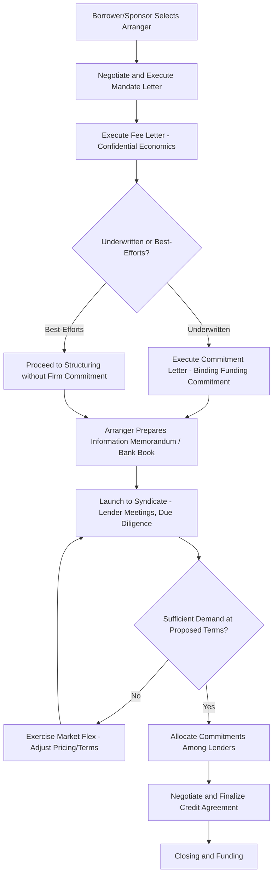

## Mandate Letters and Engagement of Arrangers

### Overview

A mandate letter is the foundational legal document by which a borrower (or sponsor, in an LBO context) formally engages an investment bank or group of banks to act as arranger(s) for a debt financing. The mandate letter establishes the arranger's role, scope of work, fee structure, and key commercial terms before the full credit agreement or indenture is negotiated. Alongside the mandate letter, a companion **commitment letter** (when the arranger is also underwriting/funding the facility) and a **fee letter** typically govern the economics and certainty-of-funds mechanics of the transaction. Understanding this documentation sequence is essential to grasping how syndicated loan transactions move from initial engagement to closing.

### Key Parties and Roles

**Key Points**

- **Borrower/Sponsor**: the entity seeking financing, which engages the arranger(s) to structure, syndicate, and (often) underwrite the debt
- **Lead Arranger(s) / Bookrunner(s)**: the investment bank(s) engaged to structure the transaction, market it to potential lenders, and build the syndicate; often called "Mandated Lead Arrangers" (MLAs) or "Joint Lead Arrangers" (JLAs) when multiple banks share the role
- **Administrative Agent**: the bank designated to administer the credit agreement post-closing (handling payments, notices, and lender coordination), which may or may not be the same institution as the lead arranger
- **Underwriters**: arrangers who commit to fund the full facility amount themselves (bridging the gap before final syndication), bearing "market flex" and "syndication risk" if the loan cannot be placed on the anticipated terms
- **Co-Managers / Participating Lenders**: additional institutions joining the syndicate at a lower fee tier and with lesser structuring input, typically brought in during general syndication

### Structure and Content of a Mandate Letter

**Key Points**

A typical mandate letter includes the following core components:

1. **Engagement and exclusivity**: confirms the borrower's engagement of the named arranger(s), often on an exclusive basis (i.e., the borrower agrees not to engage competing arrangers for the same financing during the mandate period)
2. **Transaction summary/term sheet reference**: outlines or incorporates by reference a summary of indicative terms (facility size, tranching, tenor, pricing ranges, security package) — typically attached as an exhibit
3. **Syndication strategy provisions**: describes the arranger's right to determine syndication strategy, timing, and the composition of the lender group, often including "titling" rights (who receives named roles like joint bookrunner)
4. **Market flex language**: grants the arranger the contractual right to modify pricing, structure, and terms of the facility (within specified parameters) if necessary to achieve successful syndication — a critical risk-transfer mechanism from arranger to borrower
5. **Fee arrangements**: references the separate fee letter (often kept confidential and delivered alongside, but separate from, the mandate letter itself to preserve confidentiality of economics from other syndicate members)
6. **Conditions precedent to underwriting/closing**: outlines diligence, documentation, and market conditions that must be satisfied before the arranger's commitment becomes binding
7. **Indemnification and expense reimbursement**: the borrower typically agrees to indemnify the arranger for losses arising from the engagement and to reimburse reasonable expenses (legal fees, due diligence costs) regardless of whether the transaction closes
8. **Term/expiration**: mandate letters typically include an expiration date, after which the arranger's commitment (if underwritten) lapses absent an extension

### Market Flex Mechanics

**Key Points**

- Market flex provisions allow the arranger to adjust pricing (spread, OID), reallocate tranche sizes between term loan and revolver, add or tighten covenants, or adjust other structural terms in order to achieve a successful syndication if initial investor demand is insufficient at the originally proposed terms
- Flex is typically bounded by pre-negotiated caps (e.g., "up to 50 bps of additional spread flex" or "up to 100 bps of OID flex") agreed in the fee letter or a flex letter, protecting the borrower from unlimited repricing risk while giving the arranger commercial flexibility to clear the market
- The existence and scope of flex rights is a heavily negotiated point, particularly for sponsor-backed deals where the sponsor seeks to cap potential cost increases to preserve underwritten LBO economics

### Mandate Letter vs. Commitment Letter vs. Credit Agreement

| Document | Purpose | Binding Nature | Typical Timing |
| --- | --- | --- | --- |
| Mandate Letter | Engages arranger(s) for structuring and syndication | Engagement/exclusivity terms binding; underwriting commitment (if any) often in a separate commitment letter | At the outset of the financing process |
| Commitment Letter | Arranger's binding commitment to fund (fully or on a "best efforts" basis) | Binding, subject to conditions precedent (CPs) | Shortly after or concurrent with mandate letter, especially in M&A-driven financings |
| Fee Letter | Sets out arranger/lender fees (underwriting fee, arrangement fee, ticking fee, flex parameters) | Binding; typically confidential, not shared with broad syndicate | Concurrent with mandate/commitment letters |
| Credit Agreement | Definitive, fully negotiated legal document governing the loan | Fully binding | At closing, following syndication |

### Underwritten vs. Best-Efforts Syndication

**Key Points**

- **Fully underwritten deal**: the arranger(s) commit to fund the entire facility amount at signing (typically required in competitive M&A processes where the seller needs "certainty of funds"), bearing the risk that the loan cannot be syndicated at the anticipated terms; the arranger earns an underwriting fee compensating for this risk
- **Best-efforts (or "club") deal**: the arranger agrees only to use reasonable efforts to place the facility with lenders, without a firm commitment to fund any shortfall; more common in situations without acute financing certainty requirements (e.g., refinancings, non-competitive processes) or in smaller "club deals" among a small group of relationship lenders
- The choice between underwritten and best-efforts structures materially affects the arranger's fee (underwriting compensates for balance sheet and market risk) and the borrower's execution certainty

### Typical Fee Components

**Key Points**

- **Arrangement/structuring fee**: compensation for structuring and negotiating the transaction, typically a percentage of total facility size (varies by deal complexity and market conditions)
- **Underwriting fee**: additional compensation for the arranger's commitment to fund, compensating for balance sheet usage and syndication risk
- **Ticking fee**: a fee paid on committed but undrawn amounts during the period between commitment and closing/funding, compensating lenders for capital reserved but not yet deployed
- **Upfront/OID fees to syndicate lenders**: paid to lenders joining the syndicate, often expressed as a percentage of their commitment, distinct from fees retained by the arranger for its structuring role
- Exact fee percentages are deal-specific and vary with market conditions, credit quality, and deal complexity, so no single benchmark applies universally [Unverified — fee levels are proprietary/deal-specific and fluctuate meaningfully with market conditions]

### Sequence from Mandate to Closing

### Documentation and Fee Flow Structure (svg_diagram)

<svg xmlns="http://www.w3.org/2000/svg" viewBox="0 0 700 340">
\<style\>
.lbl{font-family:Arial,sans-serif;font-size:12px;fill:#1a1a1a;}
.hdr{font-family:Arial,sans-serif;font-size:15px;font-weight:bold;fill:#1a1a1a;}
.box{fill:#eef3f8;stroke:#2c5f8a;stroke-width:1.5;}
.conf{fill:#fdf1dc;stroke:#c98a3d;stroke-width:1.5;}
\</style\>
<text x="350" y="24" text-anchor="middle" class="hdr">Mandate Letters and Engagement of Arrangers (svg_diagram)</text>
<rect x="30" y="55" width="180" height="55" rx="6" class="box" />
<text x="120" y="78" text-anchor="middle" class="lbl">Borrower / Sponsor</text>
<text x="120" y="94" text-anchor="middle" class="lbl">(Financing Need)</text>
<line x1="210" y1="82" x2="270" y2="82" stroke="#1a1a1a" stroke-width="1.5" marker-end="url(#a2)" />
<text x="240" y="72" text-anchor="middle" class="lbl">Mandate</text>
<rect x="270" y="55" width="180" height="55" rx="6" class="box" />
<text x="360" y="78" text-anchor="middle" class="lbl">Lead Arranger(s) /</text>
<text x="360" y="94" text-anchor="middle" class="lbl">Bookrunner(s)</text>
<line x1="360" y1="110" x2="360" y2="140" stroke="#1a1a1a" stroke-width="1.5" marker-end="url(#a2)" />
<rect x="240" y="140" width="240" height="50" rx="6" class="conf" />
<text x="360" y="160" text-anchor="middle" class="lbl">Fee Letter (Confidential)</text>
<text x="360" y="176" text-anchor="middle" class="lbl">Arrangement, Underwriting, Flex Terms</text>
<line x1="450" y1="82" x2="640" y2="82" stroke="#1a1a1a" stroke-width="1.5" marker-end="url(#a2)" />
<text x="560" y="72" text-anchor="middle" class="lbl">Syndicate to</text>
<rect x="500" y="55" width="150" height="55" rx="6" class="box" />
<text x="575" y="78" text-anchor="middle" class="lbl">Participating</text>
<text x="575" y="94" text-anchor="middle" class="lbl">Lenders / CLOs</text>
<line x1="575" y1="110" x2="575" y2="140" stroke="#1a1a1a" stroke-width="1.5" marker-end="url(#a2)" />
<rect x="480" y="140" width="190" height="50" rx="6" class="box" />
<text x="575" y="160" text-anchor="middle" class="lbl">Upfront/OID Fees to</text>
<text x="575" y="176" text-anchor="middle" class="lbl">Syndicate Lenders</text>
<line x1="120" y1="110" x2="120" y2="230" stroke="#1a1a1a" stroke-width="1.5" marker-end="url(#a2)" />
<rect x="30" y="230" width="180" height="55" rx="6" class="box" />
<text x="120" y="253" text-anchor="middle" class="lbl">Reimburses Expenses</text>
<text x="120" y="269" text-anchor="middle" class="lbl">and Indemnifies Arranger</text>

<text x="350" y="315" text-anchor="middle" class="lbl">Documentation flow: Mandate Letter → Fee Letter → (Commitment Letter, if underwritten) → Credit Agreement</text>

</svg>

**Related Topics**

- Commitment Letters and Certain Funds Provisions in Acquisition Financing
- Market Flex Provisions and Flex Letter Negotiation
- Information Memorandum (IM) and Confidential Information Memorandum (CIM) Preparation
- Underwritten vs. Best-Efforts Deal Structuring
- Bookrunner Titling and League Table Credit Allocation
- Administrative Agent Roles and Post-Closing Loan Administration
- Syndication Strategy and Lender Targeting (Pro Rata vs. Institutional Tranches)
- Confidentiality and Information Barriers in Syndicated Lending