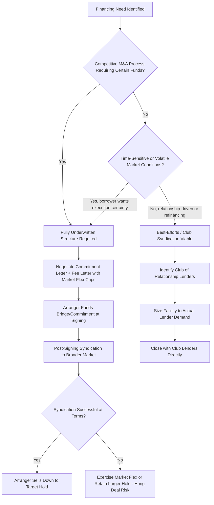

## Underwritten Deals versus Best-Efforts Club Syndication

### Overview

Syndicated loan transactions are generally structured under one of two primary risk-allocation models: **fully underwritten deals**, where the arranger bank(s) commit to fund the entire facility at signing and bear the risk of placing it with investors afterward, and **best-efforts (club) syndications**, where the arranger agrees only to use reasonable efforts to place the facility without guaranteeing the full amount will be raised on the proposed terms. The choice between these models has significant implications for execution certainty, pricing, fee economics, and the allocation of market risk between borrower and arranger.

### Fully Underwritten Deals

**Key Points**

- The lead arranger(s) contractually commit — via a binding commitment letter — to fund the entire facility amount themselves at closing, regardless of whether general syndication to other lenders has been completed
- This structure provides the borrower (or sponsor, in an M&A context) with **certainty of funds**, a critical requirement in competitive acquisition processes where sellers require assurance that financing will not fall through
- The arranger bears **syndication risk** (also called "hung deal" or "bridge" risk): if market conditions deteriorate or investor demand is weaker than anticipated between commitment and closing, the arranger may be forced to sell down the loan at a discount, retain a larger hold position than intended, or exercise market flex to adjust pricing/terms to clear the market
- Underwriting fees compensate arrangers for this balance sheet usage and market risk, and are typically higher than fees in a best-efforts structure, reflecting the risk transfer from borrower to arranger
- Common in **leveraged buyouts** and other M&A-driven financings where the acquisition agreement's financing condition (or lack thereof, in a "certain funds" jurisdiction/structure) requires the buyer to demonstrate committed financing at signing

### Best-Efforts (Club) Syndication

**Key Points**

- The arranger(s) agree only to use commercially reasonable efforts to syndicate the facility to a group of lenders, without a firm commitment to fund any unplaced portion
- If the facility cannot be fully placed at the proposed terms, the deal size may be reduced, pricing adjusted, or the transaction restructured — with the borrower bearing this execution risk rather than the arranger
- Often structured as a **club deal**: a small, pre-identified group of relationship lenders (sometimes as few as 3–10 banks) who each commit to fund a portion of the facility directly, without the broader marketing and price-discovery process of a widely syndicated transaction
- More common in situations where financing certainty is less time-critical: refinancings, amend-and-extend transactions, or transactions among lenders with existing relationships with the borrower
- Fees are typically lower than underwritten deals since the arranger bears substantially less risk

### Comparative Summary

| Feature | Fully Underwritten | Best-Efforts / Club |
| --- | --- | --- |
| Funding commitment | Arranger commits to fund 100% at signing | No firm commitment; sized to actual demand |
| Execution certainty | High — critical for competitive M&A processes | Lower — deal terms may flex based on demand |
| Syndication risk bearer | Arranger (bank) | Borrower |
| Typical fee level | Higher (compensates for underwriting risk) | Lower (reflects reduced risk transfer) |
| Market flex provisions | Extensive, pre-negotiated flex caps | Less relevant; terms set closer to actual demand |
| Typical use case | LBOs, competitive M&A, "certain funds" requirements | Refinancings, amend-and-extend, relationship lending |
| Lender group | Broad syndication post-underwriting | Pre-identified club of relationship lenders |
| Balance sheet impact on arranger | Temporary hold of full facility until syndicated | Minimal — arranger holds only its own allocation |

### Syndication Risk and "Hung Deals"

**Key Points**

- A "hung deal" (or "hung bridge") occurs when an underwritten facility cannot be successfully syndicated at the anticipated terms, forcing arrangers to either retain a larger-than-intended hold, sell at a discount to par in the secondary market, or extend the syndication period
- Notable periods of market dislocation (e.g., the 2008 financial crisis, and periodic volatility episodes since) have produced high-profile instances where banks were left holding underwritten commitments substantially above their intended final hold positions, sometimes realizing losses on eventual sell-down [Inference — specific historical loss figures vary by transaction and are not restated here without source verification]
- To mitigate this risk, arrangers negotiate **market flex provisions** (pricing, OID, and structural flex within pre-agreed caps) into the commitment/fee letter, allowing them to adjust terms to clear the market without needing fresh borrower consent for each change
- **Flex caps** are a key negotiating point for sponsors: a tightly capped flex package limits the arranger's ability to increase pricing, protecting the sponsor's underwritten LBO return assumptions, while arrangers seek wider flex to protect against syndication risk

### Fee Economics Comparison

**Example**

Assume a $500mm term loan facility:

| Component | Underwritten Deal | Best-Efforts / Club Deal |
| --- | --- | --- |
| Underwriting Fee | 1.00% × $500mm = $5.0mm | Not applicable |
| Arrangement Fee | 0.50% × $500mm = $2.5mm | 0.35% × $500mm = $1.75mm |
| Total Arranger Economics (illustrative) | ~$7.5mm | ~$1.75mm |

[Inference — these percentages are illustrative only; actual fee levels are deal-specific, confidential, and vary substantially with market conditions, credit quality, and relative negotiating leverage]

The materially higher fee in the underwritten scenario reflects compensation for the arranger's assumption of full funding risk and potential mark-to-market/sell-down losses if syndication conditions weaken between signing and closing.

### Certain Funds and M&A Context

**Key Points**

- In jurisdictions and transaction types requiring "certain funds" provisions (common in UK/European public company takeovers and increasingly standard in competitive U.S. sponsor-backed M&A), the buyer must demonstrate that financing is fully committed and not subject to conditions beyond the buyer's control (other than customary conditions like accuracy of representations and absence of a material adverse change)
- This requirement effectively mandates a fully underwritten structure (or a bond bridge facility, in cases where a permanent bond financing is intended but not yet placed), since a best-efforts structure cannot provide the requisite certainty
- A **bridge facility** is frequently used in this context: arrangers underwrite a bridge loan (often with a "market flex"-heavy structure and time-based fee step-ups incentivizing prompt refinancing) that provides certain funds at signing, with the intention of refinancing the bridge into a permanent term loan or bond shortly after closing

### Decision Framework: Choosing Between Structures

### Risk Allocation Comparison (svg_diagram)

<svg xmlns="http://www.w3.org/2000/svg" viewBox="0 0 700 320">
\<style\>
.lbl{font-family:Arial,sans-serif;font-size:12px;fill:#1a1a1a;}
.hdr{font-family:Arial,sans-serif;font-size:15px;font-weight:bold;fill:#1a1a1a;}
.box{fill:#eef3f8;stroke:#2c5f8a;stroke-width:1.5;}
.risk{fill:#f8dede;stroke:#a83232;stroke-width:1.5;}
\</style\>
<text x="350" y="24" text-anchor="middle" class="hdr">Underwritten Deals vs. Best-Efforts Club Syndication (svg_diagram)</text>

<text x="175" y="55" text-anchor="middle" class="lbl" font-weight="bold">Fully Underwritten</text>

<rect x="60" y="70" width="230" height="50" rx="6" class="box" />

<text x="175" y="98" text-anchor="middle" class="lbl">Arranger commits 100% of facility</text>

<line x1="175" y1="120" x2="175" y2="150" stroke="#1a1a1a" stroke-width="1.5" />
<rect x="60" y="150" width="230" height="60" rx="6" class="risk" />
<text x="175" y="175" text-anchor="middle" class="lbl">Syndication Risk borne by Arranger</text>
<text x="175" y="193" text-anchor="middle" class="lbl">(hung deal / sell-down risk)</text>
<line x1="175" y1="210" x2="175" y2="240" stroke="#1a1a1a" stroke-width="1.5" />
<rect x="60" y="240" width="230" height="50" rx="6" class="box" />
<text x="175" y="268" text-anchor="middle" class="lbl">Higher fees; used for certain-funds M&amp;A</text>

<text x="525" y="55" text-anchor="middle" class="lbl" font-weight="bold">Best-Efforts / Club</text>

<rect x="410" y="70" width="230" height="50" rx="6" class="box" />

<text x="525" y="98" text-anchor="middle" class="lbl">Arranger uses reasonable efforts only</text>

<line x1="525" y1="120" x2="525" y2="150" stroke="#1a1a1a" stroke-width="1.5" />
<rect x="410" y="150" width="230" height="60" rx="6" class="risk" />
<text x="525" y="175" text-anchor="middle" class="lbl">Execution Risk borne by Borrower</text>
<text x="525" y="193" text-anchor="middle" class="lbl">(deal may downsize/reprice)</text>
<line x1="525" y1="210" x2="525" y2="240" stroke="#1a1a1a" stroke-width="1.5" />
<rect x="410" y="240" width="230" height="50" rx="6" class="box" />
<text x="525" y="268" text-anchor="middle" class="lbl">Lower fees; used for refinancings/clubs</text>
</svg>

**Related Topics**

- Bridge Facilities and Refinancing into Permanent Capital
- Market Flex Provisions and Flex Cap Negotiation
- Certain Funds Requirements in Cross-Border M&A Financing
- Fee Letters and Confidential Economics in Syndicated Lending
- Hung Deal Case Studies and Secondary Market Sell-Down Dynamics
- Relationship Lending and Club Deal Structuring in Middle-Market Finance
- Mandate Letters and Arranger Engagement Terms
- CLO and Institutional Investor Demand Cycles Affecting Syndication Risk