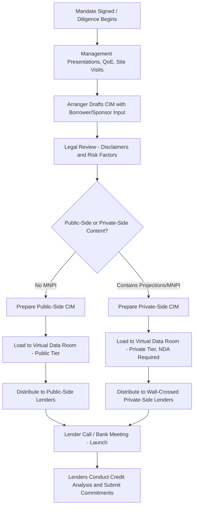

## Information Memorandum and Confidential Information Memorandum Preparation

### Overview

The Information Memorandum (IM) and Confidential Information Memorandum (CIM) are the core marketing and disclosure documents used by arrangers to solicit lender participation in a syndicated loan. These documents present the borrower's business, financial performance, industry position, and proposed transaction terms to prospective lenders, serving both a marketing function (generating investor demand) and a disclosure function (providing the information base upon which lenders conduct credit analysis and make commitment decisions). In the U.S. leveraged loan market, the distinction between "public-side" and "private-side" versions of these documents is a critical structural feature driven by securities law and information-barrier considerations.

### Purpose and Function

**Key Points**

- Serves as the primary due diligence document for prospective syndicate lenders, replacing the need for each lender to conduct independent, duplicative diligence directly with the borrower
- Functions as a liability-shifting and disclosure document: arrangers rely on the accuracy of information provided by the borrower/sponsor, with appropriate disclaimers limiting arranger liability for the content's accuracy
- Distributed to prospective lenders during the syndication process, typically via a virtual data room, alongside the draft credit agreement and other diligence materials
- The nomenclature varies by market convention: "CIM" is more commonly used in the U.S. leveraged loan/high-yield market, while "IM" or "Information Memorandum" is more common in European and international loan markets, though usage overlaps considerably

### Public-Side vs. Private-Side Documentation

**Key Points**

This is one of the most structurally important features of CIM preparation in the U.S. institutional loan market:

- **Public-side (or "public-facing") version**: contains no material non-public information (MNPI) about the borrower and is designed for lenders (particularly those affiliated with entities that also trade the borrower's public securities, such as bonds or, if applicable, equity) who wish to remain "public" and unrestricted in trading the borrower's securities
- **Private-side version**: contains full financial projections, detailed business plans, management guidance, and other MNPI, distributed only to lenders who agree to be restricted ("wall-crossed") from trading the borrower's public securities for as long as they hold the MNPI
- Institutional term loan investors (CLOs, loan funds) frequently prefer to remain public-side to preserve trading flexibility across the capital structure (e.g., trading the borrower's bonds or public equity), which has driven arrangers to develop increasingly robust public-side CIMs that provide sufficient credit information without crossing into MNPI
- This bifurcation is largely specific to U.S. leveraged loan practice, reflecting the fact that loans are not treated as "securities" under U.S. federal securities law in the same manner as bonds, creating this distinctive public/private information-wall structure [Inference — this reflects general market practice and LSTA-influenced convention; specific legal characterization can vary and is not a substitute for legal advice]

### Core Contents of a CIM

**Key Points**

A typical CIM/IM includes the following sections:

1. **Executive summary / transaction overview**: purpose of the financing, transaction structure, sponsor background (if applicable), proposed use of proceeds
2. **Investment considerations / key strengths**: arranger- and management-prepared narrative on the credit's strengths (e.g., market position, recurring revenue base, margin profile, management track record)
3. **Industry overview**: market size, growth trends, competitive dynamics, and the borrower's positioning within its sector
4. **Business description**: products/services, customer base, geographic footprint, operational infrastructure, key contracts
5. **Management team**: biographies and track records of key executives, often a focal point for sponsor-backed deals where management retention/incentivization matters to credit assessment
6. **Historical financial performance**: typically 3 years of historical financials (income statement, balance sheet, cash flow), often adjusted for pro forma add-backs (synergies, one-time costs) common in sponsor-driven credit stories
7. **Financial projections** (private-side only): forward-looking model, typically 3–5 years, including projected EBITDA, leverage de-levering path, and key operating assumptions
8. **Summary of proposed terms**: a term sheet outlining facility size, tranching, pricing, tenor, security, covenants, and other material terms — often mirroring or referencing the draft credit agreement
9. **Risk factors**: disclosure of material risks to the credit, industry, or transaction, analogous to (though typically less exhaustive than) risk factor sections in public securities offering documents

### CIM Preparation Process and Roles

**Key Points**

- The arranger, working closely with the borrower/sponsor and their advisors (investment bankers, accountants, legal counsel), leads drafting of the CIM, though management and sponsor deal teams typically provide substantial input on business description and projections
- Due diligence sessions (management presentations, site visits, Quality of Earnings (QoE) reports from accounting advisors) feed directly into the CIM's financial and business content
- Legal counsel reviews the CIM for appropriate disclaimers, including standard language noting that the arranger has not independently verified the information, that projections are inherently uncertain, and that lenders should conduct their own independent credit analysis
- The CIM is typically finalized shortly before "launch" — the point at which the transaction is formally presented to the syndicate via a lender call or in-person bank meeting

### Distribution and Data Room Mechanics

**Key Points**

- CIMs and related diligence materials (credit agreement drafts, QoE reports, management presentations) are typically hosted in a virtual data room (VDR), commonly through platforms used across the industry, with access tiers segregating public-side and private-side materials
- Prospective lenders typically execute a **non-disclosure agreement (NDA)** before receiving access to the private-side CIM and detailed financial projections, given the sensitivity of MNPI contained within
- Access logs and wall-crossing procedures are maintained to ensure private-side lenders are properly tracked and can be "cleansed" (removed from restricted status) once the information becomes public or is no longer material (e.g., after allocations are finalized and the deal closes, or after the information is otherwise disclosed)

### CIM vs. Prospectus/Offering Memorandum (Bond Context)

**Key Points**

- In a parallel or alternative high-yield bond offering, the analogous document is an **Offering Memorandum (OM)** (for a Rule 144A private placement) or a full **prospectus** (for a registered public offering), which carries more extensive securities-law-driven disclosure obligations, including formal risk factor sections and, in registered offerings, potential liability under securities laws for material misstatements or omissions
- Loan CIMs are generally understood in the market to carry a lighter disclosure and liability framework than bond offering documents, reflecting loans' distinct treatment under securities law, though borrowers/arrangers still take care to ensure accuracy given reputational and contractual liability exposure [Inference — general market understanding; not a definitive legal characterization]
- In deals combining both loan and bond tranches (a common capital structure), separate CIM and OM/prospectus documents are typically prepared in parallel, often sharing significant common content (business description, historical financials) while differing in projection disclosure and risk factor depth

### CIM Preparation and Distribution Workflow

### Public-Side vs. Private-Side Information Flow (svg_diagram)

<svg xmlns="http://www.w3.org/2000/svg" viewBox="0 0 700 340">
\<style\>
.lbl{font-family:Arial,sans-serif;font-size:12px;fill:#1a1a1a;}
.hdr{font-family:Arial,sans-serif;font-size:15px;font-weight:bold;fill:#1a1a1a;}
.box{fill:#eef3f8;stroke:#2c5f8a;stroke-width:1.5;}
.wall{fill:#f8dede;stroke:#a83232;stroke-width:1.5;}
\</style\>
<text x="350" y="24" text-anchor="middle" class="hdr">Information Memorandum and CIM Preparation (svg_diagram)</text>
<rect x="270" y="45" width="160" height="45" rx="6" class="box" />
<text x="350" y="72" text-anchor="middle" class="lbl">Master CIM Content</text>
<line x1="350" y1="90" x2="350" y2="115" stroke="#1a1a1a" stroke-width="1.5" />
<rect x="200" y="115" width="300" height="20" class="wall" />
<text x="350" y="130" text-anchor="middle" class="lbl">Information Wall</text>
<line x1="270" y1="135" x2="150" y2="170" stroke="#1a1a1a" stroke-width="1.5" />
<line x1="430" y1="135" x2="550" y2="170" stroke="#1a1a1a" stroke-width="1.5" />
<rect x="60" y="170" width="180" height="90" rx="6" class="box" />
<text x="150" y="195" text-anchor="middle" class="lbl" font-weight="bold">Public-Side CIM</text>
<text x="150" y="215" text-anchor="middle" class="lbl">No MNPI / Projections</text>
<text x="150" y="233" text-anchor="middle" class="lbl">Business + Historical Financials</text>
<text x="150" y="251" text-anchor="middle" class="lbl">→ Unrestricted Lenders</text>
<rect x="460" y="170" width="180" height="90" rx="6" class="box" />
<text x="550" y="195" text-anchor="middle" class="lbl" font-weight="bold">Private-Side CIM</text>
<text x="550" y="215" text-anchor="middle" class="lbl">Full Projections + MNPI</text>
<text x="550" y="233" text-anchor="middle" class="lbl">NDA / Wall-Crossing Required</text>
<text x="550" y="251" text-anchor="middle" class="lbl">→ Restricted Lenders</text>

<text x="350" y="295" text-anchor="middle" class="lbl">Private-side lenders are restricted from trading borrower's public securities</text>

<text x="350" y="313" text-anchor="middle" class="lbl">while in possession of material non-public information (MNPI)</text>

</svg>

**Related Topics**

- Material Non-Public Information (MNPI) and Wall-Crossing Procedures
- Quality of Earnings (QoE) Reports and Diligence Coordination
- Virtual Data Room Management in Syndicated Lending
- Rule 144A Offering Memorandum and Prospectus Disclosure Standards
- Bank Meetings and Lender Presentations in Syndication Launch
- Pro Forma Adjustments and EBITDA Add-Backs in Marketing Materials
- Arranger Liability and Disclaimer Standards in Loan Documentation
- Cleansing Procedures for Wall-Crossed Lenders Post-Closing