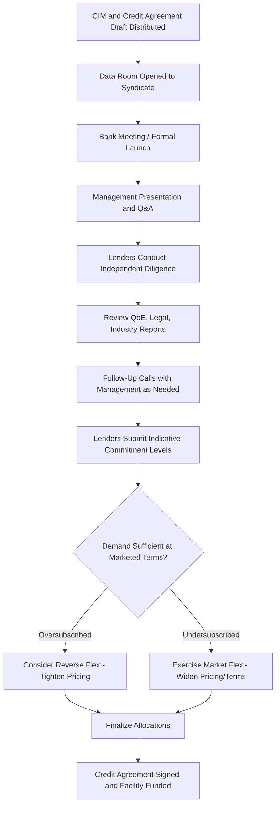

## Lender Due Diligence and Bank Meetings

### Overview

Lender due diligence is the process by which prospective syndicate participants — banks, CLOs, loan funds, and other institutional investors — independently evaluate a borrower's creditworthiness before committing capital to a syndicated facility. Bank meetings (also called lender meetings, roadshows, or "deal launches") are the formal presentations at which the arranger and borrower/sponsor introduce the transaction to the broader lending syndicate, marking the transition from private structuring to public marketing of the deal. Together, these processes bridge the gap between the CIM's written disclosure and the direct, often live, interaction lenders use to finalize credit views and commitment sizing.

### Purpose of Lender Due Diligence

**Key Points**

- Enables each prospective lender to form an independent credit view, since — unlike a bilateral loan — syndicate members are not typically involved in the granular deal structuring and must rely on a combination of the CIM, management interaction, and their own analysis
- Reduces information asymmetry between the borrower/sponsor (and arranger, who has typically conducted extensive diligence already) and the broader syndicate, who join later in the process with less direct access to management
- Supports the "arm's length" nature of syndicated lending: while the arranger provides disclaimers limiting its liability for information accuracy, lenders are expected to have conducted sufficient diligence to support their own credit decisions
- For CLOs in particular, robust documentation of the diligence process supports compliance with CLO indenture requirements and rating agency criteria regarding portfolio credit quality

### Stages and Components of Lender Due Diligence

**Key Points**

1. **CIM/IM review**: the baseline written disclosure package (business description, financials, projections for private-side lenders, proposed terms)
2. **Data room access**: supplementary materials including historical financial statements, Quality of Earnings (QoE) reports, customer/supplier contracts, legal and regulatory disclosures, insurance information, and IT/cybersecurity due diligence materials
3. **Management presentations**: live or recorded sessions where borrower/sponsor management presents the business plan, financial projections, and strategic rationale, typically followed by a Q&A session
4. **Site visits**: for certain industries (manufacturing, real estate, retail), lenders or their representatives may conduct on-site visits to verify operational claims
5. **Third-party diligence reports**: independent accountant (QoE), legal, environmental, insurance, and IT diligence reports commissioned by the sponsor/arranger and made available to the syndicate to support their independent review
6. **Credit agreement review**: legal and structuring diligence on the draft credit agreement, including covenant packages, definitions (particularly EBITDA add-back definitions), and intercreditor arrangements in multi-tranche structures
7. **Rating agency reports** (if applicable): public or private ratings from Moody's, S&P, or Fitch, which many institutional lenders (particularly CLOs, subject to indenture-mandated minimum rating requirements) rely upon as part of their investment process

### Bank Meetings: Structure and Purpose

**Key Points**

- A bank meeting (or lender call, in a virtual format increasingly standard post-2020) is the formal launch event where the arranger and borrower/sponsor management present the transaction to the assembled syndicate
- Typically structured as: (1) arranger opening remarks on transaction structure and syndication strategy, (2) management presentation covering business overview, financial performance, and strategic outlook, (3) sponsor commentary (in LBO contexts) on investment thesis and value creation plan, (4) live or submitted Q&A session
- The bank meeting date typically marks the formal "launch" of syndication, after which the arranger begins soliciting formal commitments from the syndicate within a defined timeline (commonly 1–3 weeks for broadly syndicated institutional loans, shorter for repricings or amend-and-extend transactions)
- Separate meetings or breakout sessions are sometimes held for public-side versus private-side lenders, given the differing scope of financial disclosure (projections) permissible to each group

### Timeline: From Launch to Allocation

**Example**

| Day | Activity |
| --- | --- |
| Day 0 | Bank meeting / formal launch; CIM and credit agreement draft distributed |
| Day 1–7 | Lenders conduct diligence, review data room, submit follow-up questions |
| Day 7–10 | Lender calls/one-on-ones with management as needed; term sheet Q&A |
| Day 10–14 | Commitment deadline ("comeback date"); lenders submit indicative commitment levels |
| Day 14–17 | Arranger evaluates orders; determines if market flex is required |
| Day 17–21 | Final allocations communicated to syndicate; credit agreement finalized |
| Day 21+ | Closing and funding |

[Inference — this timeline is illustrative and reflects general market convention for a broadly syndicated institutional term loan; actual timelines vary significantly based on deal complexity, market conditions, and whether the facility is fully underwritten versus best-efforts]

### Key Diligence Focus Areas for Lenders

**Key Points**

- **EBITDA quality and add-backs**: scrutiny of proposed EBITDA adjustments (synergies, one-time costs, pro forma cost savings) that affect leverage calculations and covenant compliance; aggressive add-back definitions are a frequent point of lender pushback and negotiation
- **Cash flow sustainability**: analysis of free cash flow generation capacity relative to debt service, amortization, and capex requirements
- **Industry and competitive positioning**: assessment of secular tailwinds/headwinds, customer concentration, and competitive moat sustainability
- **Management track record**: particularly relevant in sponsor-backed deals, where lenders evaluate management's history of execution against prior plans and the sponsor's track record with similar investments
- **Covenant package adequacy**: for lenders with more conservative mandates, the presence or absence of maintenance covenants, and the size of negotiated baskets (restricted payments, incremental debt, investments) relative to market norms
- **Legal and structural diligence**: security package completeness, intercreditor terms in multi-tranche structures, and any unusual or aggressive definitions in the credit agreement

### Role of Due Diligence in Pricing and Allocation Decisions

**Key Points**

- Strong lender demand emerging from a well-received bank meeting and diligence process can lead the arranger to tighten pricing (reverse flex) — reducing the spread or OID from initially marketed levels — reflecting an oversubscribed order book
- Conversely, tepid demand or negative diligence findings can trigger market flex in the borrower-unfavorable direction (wider spread, higher OID, tighter covenants) to attract sufficient commitments
- Lender due diligence findings can also influence final allocation decisions: the arranger typically has discretion (subject to any allocation mechanics agreed with the borrower) to favor lenders viewed as more likely to be reliable long-term holders, sometimes scaling back or excluding orders viewed as purely opportunistic/flip-oriented

### Due Diligence and Bank Meeting Sequence

### Due Diligence Information Flow (svg_diagram)

<svg xmlns="http://www.w3.org/2000/svg" viewBox="0 0 700 340">
\<style\>
.lbl{font-family:Arial,sans-serif;font-size:12px;fill:#1a1a1a;}
.hdr{font-family:Arial,sans-serif;font-size:15px;font-weight:bold;fill:#1a1a1a;}
.box{fill:#eef3f8;stroke:#2c5f8a;stroke-width:1.5;}
.center{fill:#8fae6a;stroke:#1a1a1a;stroke-width:1.5;}
\</style\>
<text x="350" y="24" text-anchor="middle" class="hdr">Lender Due Diligence and Bank Meetings (svg_diagram)</text>
<rect x="270" y="140" width="160" height="60" rx="6" class="center" />
<text x="350" y="165" text-anchor="middle" class="lbl">Bank Meeting</text>
<text x="350" y="183" text-anchor="middle" class="lbl">(Formal Launch)</text>
<rect x="40" y="50" width="160" height="50" rx="6" class="box" />
<text x="120" y="72" text-anchor="middle" class="lbl">CIM / IM Review</text>
<text x="120" y="88" text-anchor="middle" class="lbl">(Public/Private Side)</text>
<line x1="150" y1="100" x2="290" y2="150" stroke="#1a1a1a" stroke-width="1.5" marker-end="url(#a3)" />
<rect x="40" y="250" width="160" height="50" rx="6" class="box" />
<text x="120" y="272" text-anchor="middle" class="lbl">Data Room / QoE</text>
<text x="120" y="288" text-anchor="middle" class="lbl">Third-Party Reports</text>
<line x1="150" y1="250" x2="290" y2="195" stroke="#1a1a1a" stroke-width="1.5" marker-end="url(#a3)" />
<rect x="500" y="50" width="160" height="50" rx="6" class="box" />
<text x="580" y="72" text-anchor="middle" class="lbl">Management Q&amp;A</text>
<text x="580" y="88" text-anchor="middle" class="lbl">Follow-Up Calls</text>
<line x1="550" y1="100" x2="410" y2="150" stroke="#1a1a1a" stroke-width="1.5" marker-end="url(#a3)" />
<rect x="500" y="250" width="160" height="50" rx="6" class="box" />
<text x="580" y="272" text-anchor="middle" class="lbl">Rating Agency /</text>
<text x="580" y="288" text-anchor="middle" class="lbl">Credit Agreement Review</text>
<line x1="550" y1="250" x2="410" y2="195" stroke="#1a1a1a" stroke-width="1.5" marker-end="url(#a3)" />
<line x1="350" y1="200" x2="350" y2="230" stroke="#1a1a1a" stroke-width="1.5" marker-end="url(#a3)" />
<text x="350" y="320" text-anchor="middle" class="lbl">Synthesized Credit View → Commitment Level Submitted by Lender</text>
</svg>

**Related Topics**

- Quality of Earnings (QoE) Reports and EBITDA Add-Back Scrutiny
- Reverse Flex and Oversubscription Dynamics in Syndication
- CLO Investment Criteria and Rating Agency Reliance
- Allocation Mechanics and Arranger Discretion in Syndicated Deals
- Management Presentation Best Practices in Sponsor-Backed Transactions
- Covenant Package Benchmarking Against Market Precedent
- Virtual Data Room Structuring for Multi-Tranche Financings
- Credit Agreement Legal Diligence and Intercreditor Review