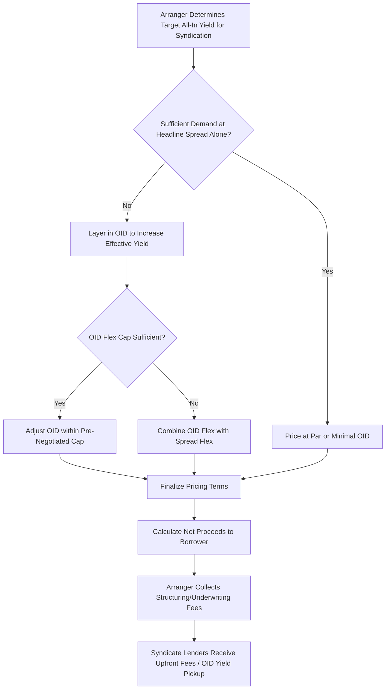

## Original Issue Discount and Fee Structuring

### Overview

Original Issue Discount (OID) is the mechanism by which loans and bonds are issued below their face (par) value, effectively increasing the yield to the investor beyond the stated coupon or spread. Fee structuring encompasses the broader set of upfront and ongoing fees paid by the borrower to arrangers and syndicate lenders as compensation for structuring, underwriting, and providing capital. Together, OID and fees are the primary levers arrangers use — alongside the stated interest rate — to price a syndicated facility competitively and to compensate the syndicate appropriately for risk, all while managing the borrower's effective cost of capital and headline pricing optics.

### OID Mechanics

**Key Points**

- OID is expressed as a discount to par at which the loan or bond is issued — for example, a loan "issued at 99" means investors pay $99 for every $100 of face value, receiving the full $100 at maturity (or upon prepayment)
- The discount effectively increases the lender's yield above the stated spread, since the lender's return includes both the coupon/spread payments and the capital appreciation from $99 to $100 (or par) over the life of the instrument (or to the expected prepayment/call date)
- From the borrower's perspective, OID reduces net proceeds received at closing (the borrower receives $99 per $100 of principal but owes the full $100 face amount), effectively representing a financing cost paid upfront rather than through the ongoing coupon
- OID is typically used alongside, rather than instead of, spread adjustments as a market flex tool — arrangers can widen OID (e.g., from 99.5 to 99.0) to increase effective yield to attract sufficient investor demand without changing the headline spread

### Effective Yield Calculation

**Example**

Consider a $100mm Term Loan B with a stated spread of SOFR + 400 bps, issued at 99 OID, with an expected average life of 4 years (reflecting anticipated prepayment ahead of the stated 7-year maturity):

$$\text{OID Yield Pickup} \approx \frac{100 - 99}{4} = 0.25\% \text{ per annum (approximate, straight-line)}$$

$$\text{Effective All-In Spread} \approx 400 \text{ bps} + 25 \text{ bps} = 425 \text{ bps over SOFR}$$

A more precise calculation would use a yield-to-maturity (or yield-to-expected-life) methodology, discounting the actual cash flow stream (spread payments plus the $1 per $100 capital gain at repayment) at the effective yield rate, rather than the straight-line approximation shown above. [Inference — straight-line approximation is a simplification; actual market convention uses discounted cash flow-based yield calculations, particularly for pricing comparisons across facilities with different average lives]

### Why Arrangers Use OID Instead of Pure Spread Adjustments

**Key Points**

- **Headline pricing optics**: a facility marketed at "SOFR + 400, OID 99" may be perceived more favorably by some market participants than an equivalent-yield facility marketed at a higher headline spread (e.g., "SOFR + 425, OID 100"), even though the effective yield to lenders is similar — this optic-driven preference has historically influenced how arrangers structure pricing flex
- **CLO and structural considerations**: certain institutional investors (particularly CLOs, subject to indenture-based weighted average spread (WAS) tests) may have structural incentives tied to the stated spread level rather than the all-in yield including OID, making spread level and OID level distinct levers with different investor impacts
- **Flexibility in market flex negotiations**: OID and spread are often subject to separate, pre-negotiated flex caps in the fee/flex letter (e.g., "up to 50 bps of spread flex and up to 1 point of additional OID flex"), giving arrangers multiple discrete tools to calibrate pricing to clear market demand

### Core Fee Categories in Syndicated Lending

**Key Points**

1. **Arrangement/structuring fee**: paid to the lead arranger(s) for structuring and negotiating the transaction, typically calculated as a percentage of total facility commitments
2. **Underwriting fee**: additional compensation to arrangers who commit to fund the full facility amount, compensating for balance sheet usage and syndication risk (see prior discussion of underwritten vs. best-efforts structures)
3. **Upfront fee to syndicate lenders**: paid to participating lenders (beyond the arranger) as an inducement to join the syndicate, often expressed as a percentage of each lender's committed amount and sometimes functionally similar in economic effect to OID (both increase the lender's effective yield)
4. **Ticking fee**: paid on committed but undrawn/unfunded amounts during the period between commitment and closing, compensating lenders for reserved capital
5. **Commitment fee** (revolver-specific): an ongoing fee paid on the undrawn portion of a revolving credit facility throughout its life, distinct from a one-time ticking fee
6. **Amendment/consent fee**: paid to lenders in connection with amendments, waivers, or amend-and-extend transactions, compensating for the lender's agreement to modify existing terms
7. **Agency fee**: an ongoing annual fee paid to the administrative agent for post-closing loan administration services

### OID and Fees Combined: Total Cost of Capital Example

**Example**

| Component | Amount/Rate | Dollar Impact ($mm, on $300mm facility) |
| --- | --- | --- |
| Stated Spread | SOFR + 375 bps | Ongoing interest cost |
| OID | 99.5 (0.5 points) | $1.5mm reduction in net proceeds |
| Arrangement Fee | 1.25% of facility | $3.75mm |
| Legal/Diligence Expenses | Fixed | $1.0mm (illustrative) |
| **Total Upfront Cost** |  | **$6.25mm** |
| **Net Proceeds to Borrower** |  | **$293.75mm** (on $300mm face amount) |

$$\text{Effective Upfront Cost} = \frac{6.25}{300} \approx 2.08\%\text{ of face amount}$$

This upfront cost is in addition to the ongoing spread paid over the life of the facility, and is typically amortized for accounting/tax purposes over the expected life of the debt rather than expensed entirely at closing. [Behavior may vary based on applicable accounting standards (e.g., US GAAP vs. IFRS) and specific debt issuance cost capitalization rules]

### Fee Letter Confidentiality

**Key Points**

- Fee letters are typically kept confidential and separate from the mandate letter and the broader CIM/credit agreement distributed to the syndicate, since fee economics are commercially sensitive and could affect competitive dynamics among arrangers or influence lender behavior if disclosed
- The fee letter typically also houses the detailed **market flex parameters** (caps on spread flex, OID flex, and structural flex), which are similarly sensitive and not shared with the broader syndicate ahead of time
- In multi-arranger deals (joint bookrunners), fee-sharing arrangements among the arranger group are negotiated separately and are generally not disclosed to the borrower in granular detail beyond the aggregate fee the borrower pays

### OID Amortization for Yield and Accounting Purposes

**Key Points**

- From a lender's accounting/tax perspective, OID is typically amortized (accreted) over the life of the instrument (or expected life, if prepayment is anticipated), recognized as additional interest income over time rather than entirely at issuance or repayment
- From a borrower's perspective, debt issuance costs (including OID and arrangement fees) are typically capitalized and amortized as an adjustment to the effective interest rate over the life of the debt for financial reporting purposes, rather than expensed immediately, under standard debt issuance cost accounting conventions [Behavior may vary based on the applicable accounting framework and specific facts of the debt instrument]

### Fee and OID Structuring Flow

### Yield Components Breakdown (svg_diagram)

<svg xmlns="http://www.w3.org/2000/svg" viewBox="0 0 700 320">
\<style\>
.lbl{font-family:Arial,sans-serif;font-size:12px;fill:#1a1a1a;}
.hdr{font-family:Arial,sans-serif;font-size:15px;font-weight:bold;fill:#1a1a1a;}
.small{font-family:Arial,sans-serif;font-size:11px;fill:#333333;}
\</style\>
<text x="350" y="24" text-anchor="middle" class="hdr">Original Issue Discount and Fee Structuring (svg_diagram)</text>

<text x="150" y="55" text-anchor="middle" class="lbl" font-weight="bold">Issued at $99 per $100</text>

<rect x="60" y="70" width="180" height="180" fill="`#eef3f8`" stroke="`#2c5f8a`" stroke-width="1.5" />

<rect x="60" y="70" width="180" height="145" fill="#2c5f8a" />
<text x="150" y="145" text-anchor="middle" class="lbl" fill="white">Net Proceeds</text>
<text x="150" y="163" text-anchor="middle" class="lbl" fill="white">$99mm</text>
<rect x="60" y="215" width="180" height="35" fill="#c98a3d" />
<text x="150" y="237" text-anchor="middle" class="lbl" fill="white">OID Gap: $1mm</text>
<line x1="240" y1="150" x2="320" y2="150" stroke="#1a1a1a" stroke-width="2" marker-end="url(#ar)" />
<text x="530" y="55" text-anchor="middle" class="lbl" font-weight="bold">Lender Receives at Repayment</text>

<rect x="440" y="70" width="180" height="180" fill="`#8fae6a`" stroke="`#1a1a1a`" stroke-width="1.5" />

<text x="530" y="140" text-anchor="middle" class="lbl">Full $100mm Face Value</text>

<text x="530" y="160" text-anchor="middle" class="lbl">+ Spread Payments</text>

<text x="530" y="180" text-anchor="middle" class="lbl">over Loan Life</text>

<text x="530" y="205" text-anchor="middle" class="small">Yield = Spread + OID Pickup</text>

<text x="350" y="290" text-anchor="middle" class="small">Borrower pays $100mm face amount but receives only $99mm net of OID — the $1mm gap increases lender's effective yield</text>

</svg>

**Related Topics**

- Market Flex Mechanics: Spread, OID, and Structural Flex Caps
- CLO Weighted Average Spread (WAS) Tests and Structural Investor Constraints
- Debt Issuance Cost Capitalization and Effective Interest Rate Accounting
- Ticking Fees and Commitment Fees on Undrawn Revolving Facilities
- Fee-Sharing Arrangements Among Joint Bookrunners
- Repricing Transactions and Soft Call Premium Interaction with OID
- Yield-to-Maturity vs. Yield-to-Worst Calculations for Discounted Instruments
- Amendment and Consent Fee Structuring in Credit Agreement Modifications