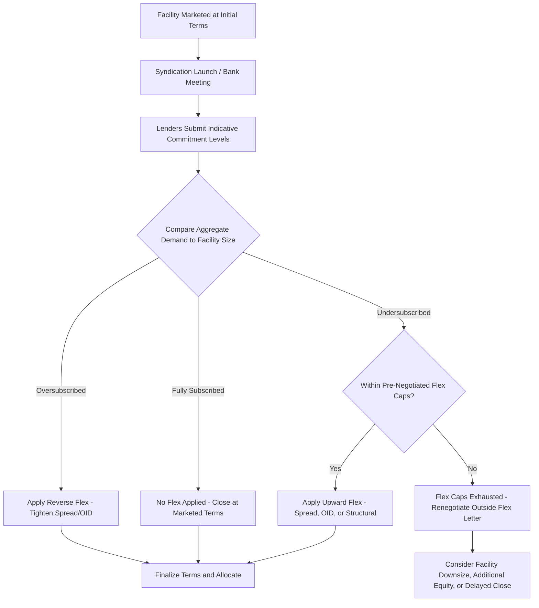

## Market Flex Provisions and Pricing Flex

### Overview

Market flex provisions are contractual rights, negotiated between arrangers and borrowers in the fee/commitment letter, that permit the arranger to modify pricing, structure, and certain terms of a syndicated facility after signing but before final closing, in order to achieve successful syndication. Flex provisions are the primary mechanism by which arrangers manage syndication risk in underwritten transactions, allowing them to respond to actual investor demand without needing to renegotiate the entire deal or risk a failed syndication. Understanding flex mechanics is central to grasping how underwritten commitments translate into final, market-clearing loan terms.

### Purpose and Rationale

**Key Points**

- When an arranger underwrites a facility, it commits to fund the full amount at initially proposed terms before knowing with certainty whether the broader syndicate will accept those terms — flex provisions bridge this gap by allowing post-signing adjustment
- Without flex rights, an arranger facing insufficient demand at the marketed terms would face a binary choice: retain the full underwritten amount on its own balance sheet (a "hung deal") or attempt to renegotiate the entire transaction with the borrower from scratch, both of which are costly and disruptive
- Flex provisions instead give the arranger a pre-agreed, bounded toolkit to adjust terms unilaterally (or with limited additional borrower consent) to clear the market, preserving deal certainty for the borrower while protecting the arranger from open-ended syndication risk

### Types of Flex

**Key Points**

1. **Interest rate/spread flex**: the right to increase (or, in strong markets, decrease — "reverse flex") the interest rate spread over the reference rate, typically bounded by a maximum cap (e.g., "up to 50 bps of upward flex")
2. **OID flex**: the right to adjust the original issue discount at which the facility is priced, functioning as an alternative or complementary yield-enhancement tool to spread flex
3. **Structural/tranche flex**: the right to reallocate amounts between facility tranches (e.g., shifting commitments from a term loan to a revolver, or between a term loan B and a second lien tranche) to match investor appetite for different risk/seniority profiles
4. **Covenant flex**: the right to tighten (from the borrower's perspective) covenant terms — reducing baskets, adding maintenance tests, or tightening definitions — if lenders demand stronger protections to support the deal
5. **Maturity/amortization flex**: less common, but some flex letters include limited rights to adjust facility tenor or amortization schedule
6. **Market flex on high-yield bonds**: functionally similar concepts exist in bond bridge facilities, where "securities demand" or "flex" provisions allow the arranger/initial purchaser to adjust the terms of a permanent bond financing that will take out a bridge loan

### Flex Caps and Negotiation Dynamics

**Key Points**

- Flex rights are not unlimited: borrowers (particularly sophisticated sponsors) negotiate caps on the magnitude of permissible flex in each category, set out in the fee letter or a separate "flex letter" or "market flex letter"
- Typical negotiated caps might include, for example, an upward spread flex cap of 50–75 bps and an OID flex cap of 1–2 points, though exact levels are transaction-specific and influenced by market conditions, credit quality, and relative negotiating leverage between sponsor and arranger [Unverified — specific flex cap levels are proprietary and vary substantially by deal and market cycle]
- Sponsors with significant negotiating leverage (large, repeat clients; highly sought-after transactions) can typically negotiate tighter flex caps, limiting the arranger's ability to materially alter underwritten economics
- In weaker credit markets or for lower-quality credits, arrangers typically insist on wider flex caps (or, in extreme cases, "unlimited flex" or a right to convert the underwritten commitment into a best-efforts structure) to protect against syndication failure risk

### Reverse Flex

**Key Points**

- Reverse flex (or "positive flex") occurs when investor demand significantly exceeds the facility size at the originally marketed terms — an oversubscribed order book — allowing the arranger to tighten pricing (reduce spread and/or increase OID toward par) in the borrower's favor
- Reverse flex is generally viewed positively by the market as a signal of strong credit reception and can meaningfully reduce the borrower's cost of capital relative to initially marketed terms
- Some flex letters explicitly cap the magnitude of reverse flex as well (protecting lenders who submitted orders at the original terms from having pricing tightened excessively before allocation), though reverse flex caps are typically less contentious than upward flex caps given the borrower-favorable direction

### Illustrative Flex Scenario

**Example**

Assume a $400mm Term Loan B is initially marketed at SOFR + 400 bps, OID 99.5, with negotiated flex caps of +75 bps spread flex and 1.5 points additional OID flex.

| Scenario | Outcome | Flex Applied |
| --- | --- | --- |
| Strong demand (oversubscribed 1.5x) | Reverse flex | Spread reduced to SOFR + 375 bps, OID tightened to 99.75 |
| Moderate demand (fully subscribed at initial terms) | No flex needed | SOFR + 400 bps, OID 99.5 (as marketed) |
| Weak demand (undersubscribed) | Upward flex applied, within cap | Spread increased to SOFR + 450 bps (within 75 bps cap), OID widened to 99.0 (within 1.5 point cap) |
| Severe undersubscription | Flex cap insufficient | Arranger may need borrower consent for additional changes beyond cap, or retain larger hold position |

In the "severe undersubscription" scenario, if the pre-negotiated flex caps are exhausted and the facility still cannot be placed, the arranger and borrower typically must renegotiate outside the original flex letter framework — potentially involving reduced facility size, additional equity contribution from the sponsor, or a delayed/restructured transaction timeline.

### Flex and the Borrower's Underwritten Economics

**Key Points**

- For sponsors executing an LBO, the underwritten financing terms (before flex) are typically used to model expected returns in the investment committee approval and purchase price determination; upward flex that increases borrowing costs directly reduces expected equity returns if not otherwise offset
- This dynamic creates strong sponsor incentive to negotiate tight flex caps at the mandate stage, since a wide, largely unconstrained flex right effectively transfers significant pricing risk from the arranger back to the sponsor despite the "underwritten" characterization of the commitment
- Conversely, arrangers use the flex cap negotiation as a key point of leverage during mandate discussions, sometimes offering tighter caps in exchange for other favorable terms (higher fees, exclusivity provisions, or additional ancillary business mandates)

### Flex Decision and Application Flow

### Flex Cap Boundaries (svg_diagram)

<svg xmlns="http://www.w3.org/2000/svg" viewBox="0 0 700 320">
\<style\>
.lbl{font-family:Arial,sans-serif;font-size:12px;fill:#1a1a1a;}
.hdr{font-family:Arial,sans-serif;font-size:15px;font-weight:bold;fill:#1a1a1a;}
.small{font-family:Arial,sans-serif;font-size:11px;fill:#333333;}
\</style\>
<text x="350" y="24" text-anchor="middle" class="hdr">Market Flex Provisions and Pricing Flex (svg_diagram)</text>
<line x1="80" y1="180" x2="620" y2="180" stroke="#1a1a1a" stroke-width="2" />
<text x="350" y="205" text-anchor="middle" class="lbl">Spread (bps over SOFR)</text>
<line x1="200" y1="160" x2="200" y2="200" stroke="#a83232" stroke-width="2" />
<text x="200" y="150" text-anchor="middle" class="small">Reverse Flex Floor</text>
<text x="200" y="225" text-anchor="middle" class="lbl">325 bps</text>
<rect x="200" y="170" width="200" height="20" fill="#8fae6a" opacity="0.5" />
<line x1="325" y1="150" x2="325" y2="210" stroke="#2c5f8a" stroke-width="3" />
<text x="325" y="140" text-anchor="middle" class="lbl" font-weight="bold">Marketed: 400 bps</text>
<line x1="475" y1="160" x2="475" y2="200" stroke="#a83232" stroke-width="2" />
<text x="475" y="150" text-anchor="middle" class="small">Upward Flex Cap</text>
<text x="475" y="225" text-anchor="middle" class="lbl">475 bps (+75bps cap)</text>
<rect x="200" y="170" width="275" height="20" fill="none" stroke="#c98a3d" stroke-width="1" stroke-dasharray="4,2" />

<text x="350" y="270" text-anchor="middle" class="small">Arranger can flex pricing anywhere within the pre-negotiated band</text>

<text x="350" y="288" text-anchor="middle" class="small">without requiring fresh borrower consent for each adjustment</text>

</svg>

**Related Topics**

- Underwritten Deals and Syndication Risk Allocation
- OID and Fee Structuring as Complementary Pricing Tools
- Fee Letters and Flex Letter Negotiation Dynamics
- CLO Demand Cycles and Their Effect on Flex Outcomes
- Bond Bridge Facilities and Securities Demand Provisions
- LBO Underwriting Assumptions and Sensitivity to Financing Cost Changes
- Sponsor Negotiating Leverage in Mandate and Flex Letter Terms
- Facility Downsizing and Equity Backstop Mechanisms in Failed Syndications