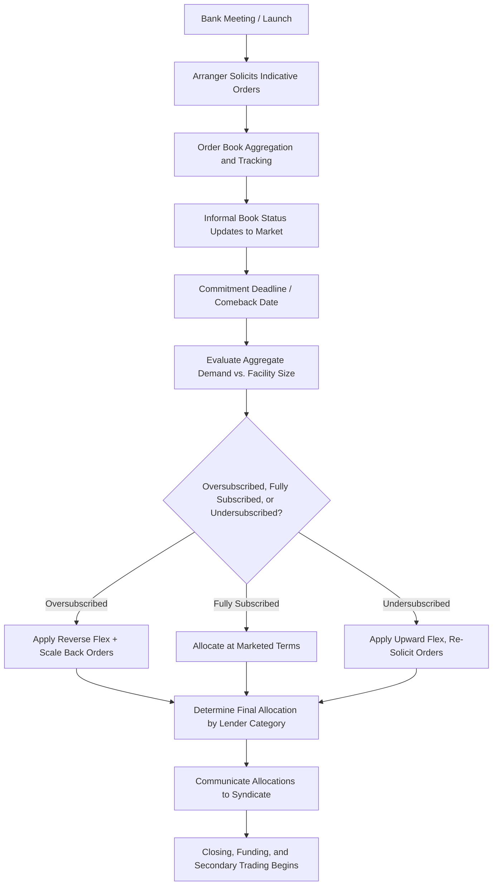

## Bookbuilding and Allocation Strategies

### Overview

Bookbuilding is the process by which arrangers solicit, aggregate, and evaluate indicative commitment levels from prospective syndicate lenders during the syndication period, culminating in final allocation decisions that determine how much of the facility each lender ultimately receives. While borrowed conceptually from equity capital markets bookbuilding practices, loan syndication bookbuilding has distinct mechanics shaped by the relationship-driven, less liquid nature of the loan market and the arranger's dual role as both underwriter and syndicate manager. Allocation strategy — how the arranger decides to distribute the facility among competing lender orders — is a critical and sometimes contentious element of syndication, balancing borrower preferences, lender relationships, and long-term market considerations.

### The Bookbuilding Process

**Key Points**

1. **Order solicitation**: following the bank meeting/launch, the arranger circulates the facility terms and solicits indicative (non-binding, though often treated as good-faith) commitment levels from prospective lenders
2. **Order book aggregation**: the arranger's syndication desk tracks incoming orders, typically maintaining a real-time or periodically updated "book" showing aggregate demand relative to facility size
3. **Book status communication**: arrangers often provide the market with informal updates on book status (e.g., "the deal is well oversubscribed," "the book is covered") to build momentum and encourage additional orders, particularly for time-sensitive commitment deadlines
4. **Commitment deadline ("comeback" date)**: a formal deadline by which lenders must submit final, more firmly held commitment levels, after which the arranger evaluates the full order book
5. **Flex determination**: based on aggregate demand relative to facility size, the arranger determines whether reverse flex, no flex, or upward flex is warranted (see prior discussion of market flex mechanics)
6. **Final allocation**: the arranger determines each lender's final allocated commitment amount, which may be scaled back from the amount originally ordered if the book is oversubscribed, or, less commonly, requested to increase if underwritten and further capacity is needed

### Order Types and Investor Behavior

**Key Points**

- **Anchor orders**: large, early commitments from key relationship lenders or the arranger's own affiliated funds, which help establish market momentum and signal credit quality to the broader syndicate
- **Institutional (CLO/loan fund) orders**: typically the largest source of demand in the broadly syndicated loan market, often price-sensitive and influenced by structural constraints (e.g., CLO reinvestment period status, portfolio diversification requirements, weighted average spread tests)
- **Pro rata bank orders**: commercial banks participating in the revolver and/or amortizing term loan tranche (TLA), often motivated by broader relationship considerations (ancillary business, deposit relationships) rather than pure yield optimization
- **"Flippers" vs. "buy-and-hold" investors**: some institutional orders are placed by investors intending to trade out of the position shortly after allocation and initial secondary trading (capturing OID/fee-driven upside), while others represent genuine buy-and-hold demand; arrangers and borrowers may have preferences regarding the mix of these investor types in the final syndicate

### Allocation Strategy Considerations

**Key Points**

- **Oversubscription scaling**: when the order book significantly exceeds the facility size, the arranger must decide how to scale back individual orders — common approaches include pro rata scaling (reducing all orders proportionally), tiered scaling (favoring larger or more "sticky" orders), or discretionary allocation based on relationship value
- **Relationship and reciprocity considerations**: arrangers often favor lenders with strong existing relationships with the borrower/sponsor (e.g., relationship banks providing ancillary services, or lenders who have supported prior transactions), reflecting the ongoing, repeat-player nature of the syndicated loan market
- **Discouraging "flipper" allocations**: borrowers and arrangers sometimes seek to limit allocations to investors perceived as likely to sell quickly in the secondary market, preferring buy-and-hold investors who provide more stable, long-term capital and reduce post-closing secondary market volatility, though this preference must be balanced against the practical need to fill the order book
- **Titling and league table credit**: allocation decisions can also be influenced by reciprocal arrangements among banks regarding "bookrunner" or "co-manager" titling, which affects league table rankings used in competitive pitching for future mandates
- **Borrower input on allocation**: while the arranger typically holds primary discretion over allocation, borrowers/sponsors — particularly larger, more sophisticated ones — often negotiate the right to review or provide input on the final allocation list, especially regarding excluded or heavily scaled-back lenders

### Illustrative Allocation Scenario

**Example**

Assume a $500mm Term Loan B receives the following order book at the comeback date:

| Lender Category | Orders Submitted ($mm) | % of Total Orders |
| --- | --- | --- |
| Anchor/Relationship Lenders | 150 | 20% |
| CLO/Institutional Investors | 450 | 60% |
| Pro Rata Bank Group | 100 | 13% |
| Opportunistic/Flip-Oriented Orders | 50 | 7% |
| **Total Orders Submitted** | **750** | **100%** |

With the book covered at 1.5x the $500mm facility size, the arranger might apply a discretionary allocation approach:

| Lender Category | Orders Submitted ($mm) | Final Allocation ($mm) | Scale-Back |
| --- | --- | --- | --- |
| Anchor/Relationship Lenders | 150 | 150 | 0% (full allocation preserved) |
| CLO/Institutional Investors | 450 | 270 | ~40% scale-back |
| Pro Rata Bank Group | 100 | 65 | 35% scale-back |
| Opportunistic/Flip-Oriented Orders | 50 | 15 | 70% scale-back |
| **Total Allocated** |  | **500** |  |

This illustrates a common allocation pattern: anchor/relationship orders are preserved at or near full size, while institutional and, particularly, opportunistic orders bear a disproportionate share of the scale-back — reflecting the arranger's discretion to shape the final syndicate composition. [Inference — this is an illustrative allocation pattern reflecting general market tendencies; actual allocation methodology varies by arranger, deal, and borrower preference]

### Reverse Inquiry and Post-Allocation Secondary Trading

**Key Points**

- Following allocation and closing, secondary market trading in the loan typically begins promptly, allowing investors who were scaled back (or excluded) during primary allocation to acquire positions in the secondary market, and allowing "flipper" investors to exit positions acquired at OID
- **Reverse inquiry** refers to unsolicited investor interest expressed after a facility has been announced or launched, sometimes accommodated by modestly upsizing the facility (if borrower needs and covenant capacity permit) to capture additional attractive demand
- The pattern and pricing of early secondary trading (trading "up" to a premium above OID issue price, or trading "down" to a discount) is often viewed as a signal of syndication success and can affect the borrower's and arranger's reputation in the market for future transactions

### Bookbuilding and Allocation Workflow

### Order Book Composition and Scale-Back (svg_diagram)

<svg xmlns="http://www.w3.org/2000/svg" viewBox="0 0 700 340">
\<style\>
.lbl{font-family:Arial,sans-serif;font-size:12px;fill:#1a1a1a;}
.hdr{font-family:Arial,sans-serif;font-size:15px;font-weight:bold;fill:#1a1a1a;}
.small{font-family:Arial,sans-serif;font-size:11px;fill:#333333;}
\</style\>
<text x="350" y="24" text-anchor="middle" class="hdr">Bookbuilding and Allocation Strategies (svg_diagram)</text>

<text x="175" y="55" text-anchor="middle" class="lbl" font-weight="bold">Orders Submitted ($750mm)</text>

<rect x="80" y="70" width="190" height="30" fill="`#2c5f8a`" />

<text x="175" y="90" text-anchor="middle" class="lbl" fill="white">Anchor: $150mm</text>

<rect x="80" y="100" width="190" height="90" fill="`#4a7fa8`" />

<text x="175" y="150" text-anchor="middle" class="lbl" fill="white">CLO/Institutional: $450mm</text>

<rect x="80" y="190" width="190" height="20" fill="`#8fae6a`" />

<text x="175" y="204" text-anchor="middle" class="lbl">Pro Rata: $100mm</text>

<rect x="80" y="210" width="190" height="10" fill="`#c98a3d`" />

<text x="175" y="235" text-anchor="middle" class="small">Opportunistic: $50mm</text>

<line x1="280" y1="150" x2="340" y2="150" stroke="#1a1a1a" stroke-width="2" marker-end="url(#a4)" />
<text x="310" y="140" text-anchor="middle" class="small">Scale</text>
<text x="310" y="170" text-anchor="middle" class="small">Back</text>

<text x="525" y="55" text-anchor="middle" class="lbl" font-weight="bold">Final Allocation ($500mm)</text>

<rect x="430" y="70" width="190" height="30" fill="`#2c5f8a`" />

<text x="525" y="90" text-anchor="middle" class="lbl" fill="white">Anchor: $150mm (0% cut)</text>

<rect x="430" y="100" width="190" height="54" fill="`#4a7fa8`" />

<text x="525" y="130" text-anchor="middle" class="lbl" fill="white">CLO: $270mm (~40% cut)</text>

<rect x="430" y="154" width="190" height="13" fill="`#8fae6a`" />

<text x="525" y="180" text-anchor="middle" class="small">Pro Rata: $65mm (35% cut)</text>

<rect x="430" y="167" width="190" height="3" fill="`#c98a3d`" />

<text x="525" y="200" text-anchor="middle" class="small">Opportunistic: $15mm (70% cut)</text>

<text x="350" y="290" text-anchor="middle" class="small">Relationship/anchor orders typically preserved; opportunistic and price-sensitive</text>

<text x="350" y="308" text-anchor="middle" class="small">orders bear a disproportionate share of scale-back in oversubscribed books</text>

</svg>

**Related Topics**

- Market Flex Provisions and Their Interaction with Bookbuilding Outcomes
- CLO Structural Constraints and Their Influence on Institutional Demand
- Secondary Market Loan Trading and LSTA Settlement Conventions
- Reverse Inquiry and Facility Upsizing Mechanics
- League Table Credit and Bookrunner Titling Negotiations
- Relationship Lending Dynamics in Pro Rata Bank Syndicates
- Anchor Order Solicitation and Pre-Marketing Strategy
- Lender Due Diligence and Its Influence on Order Sizing