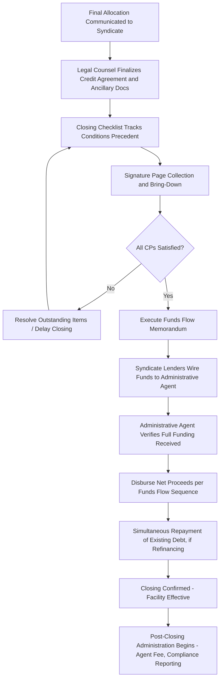

## Closing Mechanics and Funding Coordination

### Overview

Closing mechanics encompass the final legal, operational, and administrative steps required to transform a fully negotiated and allocated syndicated facility into a funded, effective loan. Funding coordination refers specifically to the process of collecting, verifying, and disbursing funds among the borrower, administrative agent, and syndicate lenders on the closing date, ensuring that all conditions precedent are satisfied and that funds flow correctly and simultaneously (or in the proper sequence) to consummate the transaction. This stage represents the culmination of the mandate, marketing, and allocation process, converting negotiated commitments into an executed, funded credit facility.

### Conditions Precedent (CPs) to Closing

**Key Points**

- Conditions precedent are the contractual requirements that must be satisfied (or waived by the requisite lenders) before the credit agreement becomes effective and funds are advanced
- Common CPs in a syndicated facility include: execution of definitive credit agreement and security documents, delivery of officer's certificates and corporate authorization documents (board resolutions, good standing certificates), delivery of legal opinions from borrower's counsel, completion and perfection of the security package (UCC filings, mortgages, pledge agreements), satisfaction of "know your customer" (KYC) and anti-money laundering (AML) requirements by lenders, absence of a material adverse change (MAC) in the borrower's business since a specified date, and payment of fees due at closing
- In acquisition financings, CPs are often structured with reference to "certain funds" principles (discussed in underwritten deal structuring), limiting the CPs that could otherwise allow lenders to walk away from a signed commitment based on conditions within the buyer's control or ordinary market fluctuations
- For multi-tranche or multi-currency facilities, CPs may include tranche-specific conditions (e.g., specific collateral perfection requirements for a particular jurisdiction in a cross-border deal)

### Documentation Finalization

**Key Points**

- Following allocation, legal counsel for the arranger/administrative agent and the borrower finalize the definitive credit agreement, incorporating any final negotiated terms, flex adjustments, and lender-specific comments gathered during the syndication process
- Ancillary documents are finalized in parallel, including: security agreements, intercreditor agreements (in multi-tranche structures), guarantee agreements from subsidiary guarantors, and any required local-law security documents for cross-border collateral
- **Signature pages** are typically collected electronically in advance of the scheduled closing date/time, with counsel coordinating a "signature page bring-down" process to confirm all required parties have executed before funds are released
- A **closing checklist** (or "closing agenda") is maintained by legal counsel, tracking each required document, condition, and responsible party, serving as the master coordination tool for the closing process

### Funding Flow Mechanics

**Key Points**

- On the closing date, syndicate lenders wire their respective allocated commitment amounts to the administrative agent, who aggregates the funds before disbursing the net proceeds to the borrower (net of any fees payable at closing, including OID, upfront fees, and legal expenses reimbursed at closing)
- The administrative agent plays a central coordinating role: verifying all lender funds have been received before releasing proceeds, ensuring conditions precedent have been satisfied by all relevant parties, and managing the mechanics of any concurrent transactions (e.g., simultaneous repayment of existing debt being refinanced)
- In refinancing transactions, funding is often structured to occur simultaneously with the repayment/payoff of existing debt, requiring careful coordination between the new administrative agent and the agent for the debt being repaid to ensure liens are released and new liens are perfected without a gap in collateral coverage
- For acquisition financings, funding is typically coordinated to occur simultaneously with (or immediately preceding) the closing of the underlying M&A transaction, often involving escrow arrangements or funds-flow memoranda that map out the precise sequence and timing of each wire transfer

### Funds Flow Memorandum

**Key Points**

- A funds flow memorandum (or "sources and uses memorandum" at the closing stage) is a detailed document, typically prepared by legal counsel or the financial advisor, mapping out every cash movement required to consummate the transaction — from lender funding, through the administrative agent, to the borrower, and on to any sellers, existing creditors being repaid, or fee recipients
- This document is critical in complex transactions (e.g., LBOs involving simultaneous debt financing, equity contribution, and purchase price payment to a seller) where multiple cash flows must be sequenced and reconciled precisely to ensure the transaction closes cleanly
- Typical funds flow steps in an LBO closing: (1) lenders wire debt proceeds to administrative agent, (2) sponsor wires equity contribution to a holding company or escrow account, (3) combined proceeds are wired to pay the seller the purchase price, (4) any existing target debt is simultaneously repaid from proceeds, (5) fees and expenses are paid to arrangers, legal counsel, and other transaction parties from the aggregated proceeds

### Illustrative Funds Flow Example

**Example**

| Step | Party | Action | Amount ($mm) |
| --- | --- | --- | --- |
| 1 | Syndicate Lenders → Administrative Agent | Wire debt proceeds | 550 |
| 2 | Sponsor → Escrow/HoldCo | Wire equity contribution | 275 |
| 3 | Administrative Agent → Escrow/HoldCo | Wire net debt proceeds (after OID/fees) | 540 |
| 4 | Escrow/HoldCo → Seller | Pay purchase price | 800 |
| 5 | Escrow/HoldCo → Existing Lenders | Repay/refinance existing target debt | 0 (if none) |
| 6 | Escrow/HoldCo → Arrangers/Advisors | Pay remaining transaction fees | 15 |

This simplified example illustrates how debt and equity proceeds converge before flowing to the seller, with the precise sequencing and simultaneous timing coordinated to ensure no party is exposed to settlement risk (e.g., the seller receiving payment before confirming receipt of all required funds).

### Post-Closing Administrative Matters

**Key Points**

- Following closing, the administrative agent takes on ongoing responsibilities including: maintaining the register of lenders and their respective commitments/loans outstanding, processing interest and principal payments, coordinating amendment and waiver requests, and administering any assignment/participation transfers as lenders trade positions in the secondary market
- The administrative agent typically charges an annual **agency fee** for these ongoing services, separate from the upfront arrangement/underwriting fees paid at closing
- Security perfection matters (UCC continuation filings, periodic collateral confirmations) require ongoing administrative attention post-closing, often coordinated through collateral agent functions (which may be held by the same or a different institution than the administrative agent)
- Post-closing, the credit agreement typically requires the borrower to deliver ongoing compliance certificates (confirming covenant compliance) and periodic financial reporting to the administrative agent for distribution to the lender group

### Closing and Funding Coordination Sequence

### Closing Day Funds Flow (svg_diagram)

<svg xmlns="http://www.w3.org/2000/svg" viewBox="0 0 700 360">
\<style\>
.lbl{font-family:Arial,sans-serif;font-size:12px;fill:#1a1a1a;}
.hdr{font-family:Arial,sans-serif;font-size:15px;font-weight:bold;fill:#1a1a1a;}
.box{fill:#eef3f8;stroke:#2c5f8a;stroke-width:1.5;}
.small{font-family:Arial,sans-serif;font-size:11px;fill:#333333;}
\</style\>
<text x="350" y="24" text-anchor="middle" class="hdr">Closing Mechanics and Funding Coordination (svg_diagram)</text>
<rect x="30" y="60" width="150" height="50" rx="6" class="box" />
<text x="105" y="90" text-anchor="middle" class="lbl">Syndicate Lenders</text>
<line x1="180" y1="85" x2="260" y2="85" stroke="#1a1a1a" stroke-width="1.5" marker-end="url(#a5)" />
<text x="220" y="75" text-anchor="middle" class="small">$550mm</text>
<rect x="30" y="140" width="150" height="50" rx="6" class="box" />
<text x="105" y="170" text-anchor="middle" class="lbl">Sponsor Equity</text>
<line x1="180" y1="165" x2="260" y2="130" stroke="#1a1a1a" stroke-width="1.5" marker-end="url(#a5)" />
<text x="220" y="160" text-anchor="middle" class="small">$275mm</text>
<rect x="260" y="90" width="180" height="50" rx="6" class="box" />
<text x="350" y="110" text-anchor="middle" class="lbl">Administrative Agent</text>
<text x="350" y="126" text-anchor="middle" class="lbl">/ Escrow / HoldCo</text>
<line x1="440" y1="115" x2="520" y2="115" stroke="#1a1a1a" stroke-width="1.5" marker-end="url(#a5)" />
<text x="480" y="105" text-anchor="middle" class="small">$800mm</text>
<rect x="520" y="90" width="150" height="50" rx="6" class="box" />
<text x="595" y="120" text-anchor="middle" class="lbl">Seller</text>
<line x1="350" y1="140" x2="350" y2="200" stroke="#1a1a1a" stroke-width="1.5" marker-end="url(#a5)" />
<rect x="260" y="200" width="180" height="50" rx="6" class="box" />
<text x="350" y="222" text-anchor="middle" class="lbl">Arrangers / Legal /</text>
<text x="350" y="238" text-anchor="middle" class="lbl">Advisor Fees ($15mm)</text>

<text x="350" y="290" text-anchor="middle" class="lbl">All wires coordinated to occur simultaneously per the funds flow memorandum,</text>

<text x="350" y="308" text-anchor="middle" class="lbl">avoiding settlement gaps between debt funding, equity contribution, and seller payment</text>

</svg>

**Related Topics**

- Certain Funds Provisions and Conditions Precedent Limitations in M&A Financing
- Intercreditor Agreements and Collateral Perfection in Multi-Tranche Closings
- Administrative Agent Duties and Post-Closing Loan Administration
- KYC/AML Compliance Requirements for Syndicate Lenders
- Security Perfection Mechanics (UCC Filings, Mortgages, Pledge Agreements)
- Secondary Market Assignment and Participation Transfer Procedures
- Escrow Arrangements and Simultaneous Closing Risk Mitigation
- Compliance Certificate and Ongoing Financial Reporting Obligations