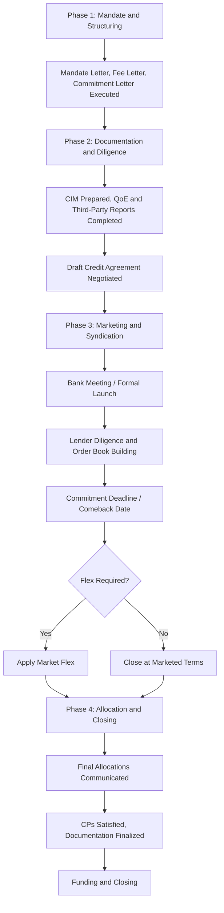

## Syndication Timeline from Mandate to Close

### Overview

The syndication timeline from mandate to close represents the end-to-end sequence of activities required to move a leveraged loan transaction from initial arranger engagement through final funding. While individual deal timelines vary based on transaction complexity, market conditions, and whether the facility is underwritten or best-efforts, understanding the typical phasing and duration of each stage provides a framework for anticipating execution risk, coordinating advisor workstreams, and setting realistic expectations for borrowers, sponsors, and lenders alike.

### Overall Timeline Framework

**Key Points**

- A typical broadly syndicated institutional term loan transaction, from mandate signing to closing/funding, spans approximately **4 to 8 weeks**, though acquisition-driven financings with regulatory approval requirements or complex cross-border elements can extend considerably longer [Inference — general market convention; actual timelines are highly deal-specific and sensitive to market volatility, credit complexity, and antitrust/regulatory conditions]
- Repricing transactions and amend-and-extend deals, which involve less extensive marketing and diligence, can execute considerably faster — sometimes within 1–2 weeks — given the more limited scope of changes to existing, already-diligenced credit
- Acquisition financings are often structured with the debt financing timeline running in parallel with, and ultimately keyed to, the underlying M&A transaction timeline (signing to closing), which itself may be extended by regulatory approvals (antitrust, CFIUS, sector-specific approvals)

### Phase 1: Mandate and Structuring (Typically 1–3 Weeks)

**Key Points**

- Borrower/sponsor selects and engages arranger(s) via mandate letter negotiation and execution
- Fee letter negotiated concurrently, including flex parameters and fee economics
- If underwritten, commitment letter negotiated and executed, providing certain funds for M&A purposes
- Initial due diligence begins: management presentations to the arranger's internal credit committee, preliminary financial modeling, and structuring discussions regarding tranching, security package, and covenant framework
- Legal counsel for both arranger and borrower begin drafting the credit agreement based on agreed term sheet parameters

### Phase 2: Documentation and Diligence (Typically 2–4 Weeks)

**Key Points**

- CIM/IM preparation, incorporating business description, historical and projected financials, and proposed transaction terms
- Third-party diligence reports commissioned and completed (Quality of Earnings, legal, environmental, insurance, IT/cybersecurity as applicable)
- Draft credit agreement circulated for arranger and borrower counsel review and negotiation of key terms
- Data room populated and access protocols established (public-side/private-side segregation, NDA execution requirements)
- Rating agency process initiated, if applicable, including rating agency presentations and preliminary rating indications

### Phase 3: Marketing and Syndication (Typically 2–3 Weeks)

**Key Points**

- Bank meeting/formal launch to the broader syndicate, including management presentation and Q&A
- Lenders conduct independent due diligence, review data room materials, and submit follow-up questions
- Order book building as lenders submit indicative commitment levels
- Commitment deadline ("comeback date") set, typically 1–2 weeks after launch
- Arranger evaluates aggregate demand and determines whether market flex (upward or reverse) is warranted

### Phase 4: Allocation and Closing (Typically 1–2 Weeks)

**Key Points**

- Final allocation decisions communicated to syndicate lenders
- Credit agreement and ancillary documents finalized incorporating any flex adjustments and final negotiated points
- Closing checklist completed, conditions precedent satisfied, signature pages collected
- Funds flow memorandum executed on closing date, with syndicate lenders wiring funds to the administrative agent and net proceeds disbursed per the transaction's funding sequence
- Post-closing administrative processes begin (agency fee commencement, compliance reporting cadence established)

### Illustrative End-to-End Timeline

**Example**

| Week | Phase | Key Activities |
| --- | --- | --- |
| Week 1 | Mandate | Mandate letter, fee letter, commitment letter (if underwritten) executed |
| Week 2 | Structuring/Diligence Begins | Term sheet finalized, initial diligence, credit agreement drafting begins |
| Week 3–4 | Documentation | CIM drafted, QoE and third-party reports completed, data room populated |
| Week 5 | Launch | Bank meeting held, syndication formally launched |
| Week 6 | Marketing | Lender diligence, follow-up calls, order book building |
| Week 7 | Comeback/Allocation | Commitment deadline, flex determination, final allocations communicated |
| Week 8 | Closing | Documentation finalized, CPs satisfied, funding and closing |

[Inference — this 8-week illustrative timeline reflects a moderately complex broadly syndicated transaction under normal market conditions; simpler repricings can compress to 1–2 weeks, while complex cross-border LBOs with regulatory approval requirements can extend to several months]

### Factors That Compress or Extend the Timeline

**Key Points**

Factors that tend to **compress** the timeline:

- Repricing or amend-and-extend transactions building on existing, already-diligenced credit agreements
- Strong existing lender relationships reducing incremental diligence needs
- Favorable market conditions with high investor demand, reducing the need for extended marketing periods
- Smaller, less complex capital structures with a single tranche and straightforward security package

Factors that tend to **extend** the timeline:

- Cross-border transactions requiring multi-jurisdictional security perfection and local counsel coordination
- Regulatory approval requirements (antitrust/competition clearance, CFIUS, industry-specific regulatory approvals) in acquisition financings
- Complex multi-tranche structures requiring intercreditor agreement negotiation among different creditor classes
- Volatile or uncertain market conditions requiring extended marketing periods or repeated re-launches
- First-time issuers without an existing credit agreement template, requiring more extensive from-scratch documentation negotiation
- Rating agency processes, particularly for first-time issuers requiring initial corporate family ratings

### Parallel Workstreams in an Acquisition Financing Context

**Key Points**

- In LBO/M&A-driven financings, the debt syndication timeline typically runs in parallel with several other workstreams: the underlying M&A purchase agreement negotiation, equity commitment letter negotiation with the sponsor, and (if applicable) antitrust/regulatory approval processes
- The debt financing is often structured to achieve "certain funds" status well ahead of the anticipated M&A closing date, with the actual syndication and marketing process potentially continuing after signing but concluding before or concurrent with the M&A closing
- This parallel structuring means the "mandate to close" timeline for the debt financing is often keyed less to independent market-driven timing and more to the underlying M&A transaction's expected closing date, with the arranger managing syndication pace to align with that target

### End-to-End Syndication Timeline

### Mandate-to-Close Timeline Overview (svg_diagram)

<svg xmlns="http://www.w3.org/2000/svg" viewBox="0 0 700 300">
\<style\>
.lbl{font-family:Arial,sans-serif;font-size:12px;fill:#1a1a1a;}
.hdr{font-family:Arial,sans-serif;font-size:15px;font-weight:bold;fill:#1a1a1a;}
.small{font-family:Arial,sans-serif;font-size:10px;fill:#333333;}
\</style\>
<text x="350" y="24" text-anchor="middle" class="hdr">Syndication Timeline from Mandate to Close (svg_diagram)</text>
<line x1="50" y1="150" x2="650" y2="150" stroke="#1a1a1a" stroke-width="2" />
<rect x="50" y="130" width="120" height="40" fill="#2c5f8a" />
<text x="110" y="155" text-anchor="middle" class="lbl" fill="white">Mandate</text>
<text x="110" y="185" text-anchor="middle" class="small">Weeks 1-2</text>
<rect x="170" y="130" width="180" height="40" fill="#4a7fa8" />
<text x="260" y="155" text-anchor="middle" class="lbl" fill="white">Documentation/Diligence</text>
<text x="260" y="185" text-anchor="middle" class="small">Weeks 2-5</text>
<rect x="350" y="130" width="180" height="40" fill="#8fae6a" />
<text x="440" y="155" text-anchor="middle" class="lbl">Marketing/Syndication</text>
<text x="440" y="185" text-anchor="middle" class="small">Weeks 5-7</text>
<rect x="530" y="130" width="120" height="40" fill="#c98a3d" />
<text x="590" y="155" text-anchor="middle" class="lbl" fill="white">Allocation/Close</text>
<text x="590" y="185" text-anchor="middle" class="small">Weeks 7-8</text>

<text x="110" y="115" text-anchor="middle" class="small">Mandate Letter</text>

<text x="260" y="115" text-anchor="middle" class="small">CIM, QoE, Credit Agreement</text>

<text x="440" y="115" class="small" text-anchor="middle">Bank Meeting, Order Book</text>

<text x="590" y="115" text-anchor="middle" class="small">Funding</text>

<text x="350" y="240" text-anchor="middle" class="lbl">Illustrative 8-week timeline — compresses for repricings, extends for cross-border or regulatory-dependent deals</text>

</svg>

**Related Topics**

- Mandate Letters and Commitment Letter Negotiation Timing
- CIM/IM Preparation and Diligence Coordination Timelines
- Bank Meetings and Lender Due Diligence Process Duration
- Market Flex Application Timing Relative to Comeback Dates
- Certain Funds Timelines in Acquisition Financing Contexts
- Regulatory Approval Processes and Their Effect on Financing Timelines
- Amend-and-Extend and Repricing Transaction Execution Speed
- Rating Agency Process Timing for First-Time Issuers