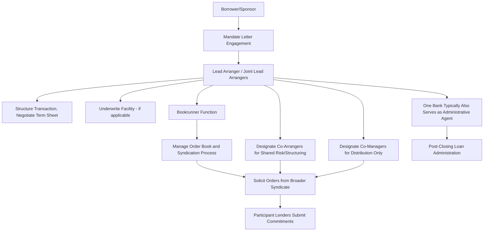

## Lead Arranger, Bookrunner, and Co-Arranger Roles

### Overview

Syndicated loan transactions typically involve a hierarchy of arranger roles and titles, each carrying distinct responsibilities, economic entitlements, and market prestige. While terminology and precise duties vary somewhat by transaction and market convention, the core distinction is between the banks that structure and lead the deal (lead arrangers and bookrunners) and those with more limited roles (co-arrangers, co-managers, and participants). Understanding this role hierarchy is essential to interpreting deal documentation, fee allocation, and the practical division of labor across a syndicate.

### Lead Arranger

**Key Points**

- The lead arranger (sometimes titled "Mandated Lead Arranger" or MLA) is the bank (or banks, in a joint-lead structure) engaged by the borrower under the mandate letter to structure, negotiate, and lead the syndication of the facility
- Primary responsibilities include: negotiating the term sheet and credit agreement with the borrower, conducting or coordinating due diligence, preparing (or overseeing preparation of) the CIM/IM, determining syndication strategy, and managing the bookbuilding and allocation process
- In underwritten deals, the lead arranger typically also serves as the underwriter, committing to fund the full facility amount at signing and bearing syndication risk (subject to market flex provisions)
- Multiple lead arrangers are common in larger transactions — a "Joint Lead Arranger" (JLA) structure distributes structuring responsibilities and underwriting risk across several banks, often reflecting the borrower's relationship banking group or a deliberate risk-sharing arrangement for very large facilities

### Bookrunner

**Key Points**

- The bookrunner (or "joint bookrunner" when shared among multiple banks) is specifically responsible for managing the bookbuilding process — soliciting and tracking lender orders, communicating book status to the market, and making allocation recommendations
- In many transactions, the lead arranger and bookrunner roles are held by the same bank(s), but the titles are conceptually distinct: "lead arranger" emphasizes the structuring/underwriting function, while "bookrunner" emphasizes the marketing/syndication execution function
- "Left lead" (or "left bookrunner") typically refers to the bank listed first (traditionally on the left side) of the credit agreement's cover page or term sheet, generally signifying the bank with primary administrative and economic responsibility among the bookrunner group, often also serving as administrative agent
- Bookrunner titling carries reputational and league table significance: banks compete for bookrunner (as opposed to lesser co-manager) titles because league table credit — used in industry rankings of arranger market share — significantly influences future mandate competitiveness

### Co-Arranger and Co-Manager Roles

**Key Points**

- Co-arrangers (or "arrangers," without the "lead" designation) typically hold a secondary tier of involvement — often participating in structuring discussions and potentially taking a meaningful underwriting position, but without the primary decision-making authority held by the lead arranger(s)
- Co-managers occupy a further tier below co-arrangers, generally limited to a marketing/distribution role: helping to place the facility with lenders in their network without significant input into structuring or documentation negotiation
- These secondary titles are sometimes awarded to banks as part of relationship management (rewarding banks with meaningful ancillary business relationships with the borrower) or as compensation for taking a portion of underwriting risk in a shared syndication structure, even without a central structuring role
- Titling conventions and the precise line between "co-arranger" and "co-manager" responsibilities vary by market and by individual transaction documentation, so the specific duties associated with any given title should be confirmed against the actual mandate/fee letter rather than assumed from title alone [Unverified — titling conventions are market-practice-driven rather than governed by a single universal standard, and usage varies across institutions and jurisdictions]

### Comparative Role Summary

| Role | Structuring Input | Underwriting Risk | Bookbuilding Responsibility | Typical Fee Tier |
| --- | --- | --- | --- | --- |
| Lead Arranger (MLA) | High — leads negotiation | High (if underwritten) | Often combined with bookrunner role | Highest |
| Bookrunner | Moderate to high | Varies — depends if also lead arranger | Primary — manages order book | High |
| Co-Arranger | Moderate | Moderate — often takes partial underwriting | Limited | Middle |
| Co-Manager | Low | Low to none | Distribution/placement only | Lower |
| Participant Lender | None | None (joins post-launch) | None — submits order only | Standard syndicate fee/OID |

### Administrative Agent as a Distinct Function

**Key Points**

- The administrative agent role — responsible for post-closing loan administration, payment processing, and lender coordination — is conceptually distinct from the arranger/bookrunner roles, though frequently held by the same institution as the left lead arranger/bookrunner
- The administrative agent's duties and liability are governed by specific provisions in the credit agreement (the "agency" article), which typically limits the agent's obligations to largely ministerial/administrative functions and disclaims broader fiduciary duties to the syndicate beyond what is explicitly stated
- Collateral agent (responsible for holding and administering security interests on behalf of the secured lenders) is a further distinct role, again often but not necessarily held by the same institution as the administrative agent, particularly in complex multi-tranche structures with intercreditor arrangements

### Multi-Bank Deal Structure Example

**Example**

Consider a $750mm Term Loan B syndication with the following role structure:

| Bank | Role | Underwriting Commitment ($mm) |
| --- | --- | --- |
| Bank A | Left Lead Arranger / Left Bookrunner / Administrative Agent | 300 |
| Bank B | Joint Lead Arranger / Joint Bookrunner | 250 |
| Bank C | Joint Lead Arranger / Joint Bookrunner | 200 |
| Bank D | Co-Manager | 0 (post-launch participant only) |

In this structure, Banks A, B, and C share primary structuring responsibility and underwriting risk as joint lead arrangers/bookrunners, with Bank A holding the additional administrative agent role (and typically the largest single underwriting commitment, reflecting its "left" position). Bank D joins purely as a distribution participant without structuring input or underwriting exposure.

### Role Hierarchy and Responsibility Flow

### Syndicate Role Hierarchy (svg_diagram)

<svg xmlns="http://www.w3.org/2000/svg" viewBox="0 0 700 380">
\<style\>
.lbl{font-family:Arial,sans-serif;font-size:12px;fill:#1a1a1a;}
.hdr{font-family:Arial,sans-serif;font-size:15px;font-weight:bold;fill:#1a1a1a;}
.tier1{fill:#2c5f8a;stroke:#1a1a1a;stroke-width:1.5;}
.tier2{fill:#4a7fa8;stroke:#1a1a1a;stroke-width:1.5;}
.tier3{fill:#8fae6a;stroke:#1a1a1a;stroke-width:1.5;}
.tier4{fill:#c98a3d;stroke:#1a1a1a;stroke-width:1.5;}
\</style\>
<text x="350" y="24" text-anchor="middle" class="hdr">Lead Arranger, Bookrunner, and Co-Arranger Roles (svg_diagram)</text>
<rect x="220" y="45" width="260" height="45" rx="6" class="tier1" />
<text x="350" y="72" text-anchor="middle" class="lbl" fill="white">Lead Arranger(s) / Bookrunner(s)</text>
<line x1="350" y1="90" x2="350" y2="115" stroke="#1a1a1a" stroke-width="1.5" />
<rect x="220" y="115" width="260" height="45" rx="6" class="tier2" />
<text x="350" y="142" text-anchor="middle" class="lbl" fill="white">Co-Arrangers (Shared Structuring/Risk)</text>
<line x1="350" y1="160" x2="350" y2="185" stroke="#1a1a1a" stroke-width="1.5" />
<rect x="220" y="185" width="260" height="45" rx="6" class="tier3" />
<text x="350" y="212" text-anchor="middle" class="lbl">Co-Managers (Distribution Only)</text>
<line x1="350" y1="230" x2="350" y2="255" stroke="#1a1a1a" stroke-width="1.5" />
<rect x="220" y="255" width="260" height="45" rx="6" class="tier4" />
<text x="350" y="282" text-anchor="middle" class="lbl" fill="white">Participant Lenders</text>

<text x="350" y="330" text-anchor="middle" class="lbl">Structuring authority, underwriting risk, and fee tier</text>

<text x="350" y="348" text-anchor="middle" class="lbl">decrease moving down the hierarchy</text>

</svg>

**Related Topics**

- Mandate Letters and the Formal Engagement of Arranger Roles
- Administrative Agent and Collateral Agent Duties Post-Closing
- League Table Methodology and Bookrunner Credit Allocation
- Fee-Sharing Arrangements Among Joint Bookrunners
- Underwritten Deals and Risk Allocation Across Multiple Lead Arrangers
- Bookbuilding and Allocation Strategy Execution by the Bookrunner
- Relationship Banking Considerations in Co-Manager Title Awards
- Intercreditor Roles in Multi-Tranche, Multi-Agent Structures