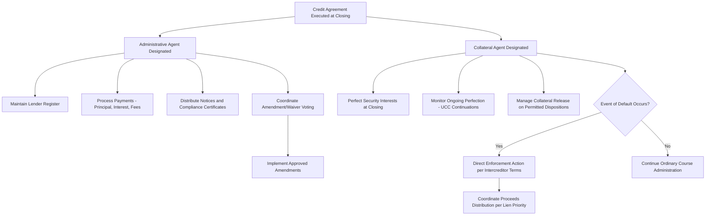

## Administrative Agent and Collateral Agent Functions

### Overview

The administrative agent and collateral agent are contractually designated roles within a syndicated credit agreement responsible for the ongoing operational administration of the loan and the management of the security package, respectively. While a single institution frequently holds both roles — often the lead left arranger from the original syndication — the two functions are legally and operationally distinct, particularly in complex multi-tranche capital structures with intercreditor arrangements. These agent roles exist to solve a coordination problem inherent in syndicated lending: with potentially dozens or hundreds of individual lenders (especially as loans trade in the secondary market), a single point of contact and administration is necessary for the facility to function efficiently.

### Administrative Agent: Core Functions

**Key Points**

- **Payment processing**: receives principal and interest payments from the borrower and distributes them pro rata to syndicate lenders according to their respective commitments/holdings; also processes fee payments (commitment fees, ticking fees, agency fees) and facilitates borrowings/draws under revolving facilities
- **Lender register maintenance**: maintains the official record of lenders and their respective loan amounts outstanding, which is updated as lenders trade positions via assignments (see secondary market discussion) or participations
- **Notices and communications**: serves as the conduit for formal notices between the borrower and the syndicate — borrowing requests, prepayment notices, covenant compliance certificates, financial reporting, and any notices of default
- **Amendment and waiver coordination**: manages the process of soliciting and tabulating lender consent for amendments, waivers, and other actions requiring lender approval under the credit agreement's voting provisions (which often require majority lenders, or in some cases unanimous or supermajority consent depending on the provision being amended)
- **Compliance monitoring facilitation**: receives and distributes periodic compliance certificates and financial statements from the borrower, though the agent's role here is typically administrative/ministerial rather than involving independent verification of the borrower's compliance

### Administrative Agent: Legal and Fiduciary Framework

**Key Points**

- Credit agreements typically include an extensive "Agency" article that defines and, importantly, **limits** the administrative agent's duties and liability — the agent generally owes only the specific duties explicitly enumerated in the credit agreement, and disclaims any broader fiduciary duty to the syndicate beyond those express obligations
- This limited-duty framework reflects the practical reality that the administrative agent is compensated modestly (via the agency fee) relative to the scale of the facility it administers, and is generally not expected to conduct independent credit analysis or monitoring on behalf of the syndicate beyond passing through information received from the borrower
- The agent is typically entitled to rely on notices, certificates, and other communications it reasonably believes to be genuine, and is generally indemnified by the lenders (pro rata) for actions taken in its capacity as agent, absent gross negligence or willful misconduct
- Agents can typically resign upon notice, triggering a process for the borrower (with lender consent, or lender designation absent borrower agreement in some structures) to appoint a successor administrative agent

### Collateral Agent: Core Functions

**Key Points**

- The collateral agent holds and administers the security interests granted by the borrower and any guarantors on behalf of the secured lenders, serving as the named secured party of record on security agreements, mortgages, UCC financing statements, and other collateral documentation
- Responsibilities include: coordinating the initial perfection of security interests at closing (UCC filings, mortgage recordings, stock pledge certificate possession, control agreements over deposit/securities accounts), monitoring ongoing perfection requirements (UCC continuation filings, after-acquired collateral perfection), and managing collateral release procedures in connection with permitted asset sales or dispositions
- In an event of default and subsequent enforcement action, the collateral agent typically directs and coordinates the exercise of remedies against collateral on behalf of the secured lender group, subject to the voting/direction mechanics specified in the credit agreement (and any applicable intercreditor agreement)
- The collateral agent's role becomes especially significant, and often distinct in identity from the administrative agent, in multi-tranche capital structures (e.g., first lien/second lien structures) where an intercreditor agreement governs the relative rights and priorities of different creditor classes with respect to shared collateral

### Administrative Agent vs. Collateral Agent: Comparative Summary

| Feature | Administrative Agent | Collateral Agent |
| --- | --- | --- |
| Primary function | Payment processing, notices, lender coordination | Security interest holding and perfection |
| Key documents governed | Credit agreement (agency article) | Security agreements, intercreditor agreements |
| Day-to-day activity | High — ongoing payment/notice administration | Low in ordinary course; high during default/enforcement |
| Typically held by | Left lead arranger from original syndication | Often same institution, but can differ in multi-tranche deals |
| Fee structure | Annual agency fee | May be separate or bundled with administrative agency fee |
| Role in default scenario | Coordinates lender communications and voting | Directs enforcement action against collateral |

### Intercreditor Considerations in Multi-Tranche Structures

**Key Points**

- In capital structures with multiple secured creditor classes (e.g., first lien term loan and second lien term loan, or first lien loans alongside first lien notes), an **intercreditor agreement** governs the relative priority of liens, standstill periods restricting junior lienholders from independently exercising remedies, and the allocation of collateral proceeds in an enforcement scenario
- The collateral agent (or agents, if separate agents are appointed for each lien tranche) operates within the framework established by the intercreditor agreement, which typically grants the first lien collateral agent primary control over enforcement decisions during a defined standstill period applicable to junior lienholders
- Structuring the collateral agent role appropriately in these multi-tranche scenarios is a significant legal diligence point for lenders, since the practical value of a security interest depends heavily on the priority and control rights established under the applicable intercreditor framework, not merely the nominal existence of a lien

### Agent Succession and Resignation

**Key Points**

- Credit agreements typically permit the administrative agent (and separately, the collateral agent, if a distinct institution) to resign upon notice to the borrower and lenders, whereupon a successor agent process is triggered
- Successor agent appointment typically requires borrower consent (often not to be unreasonably withheld, absent a default) combined with lender approval or, in some structures, majority lender designation if the borrower and departing agent cannot agree on a successor within a specified period
- Agent resignation and successor appointment can introduce operational friction and delay, particularly for collateral agent transitions requiring re-execution or assignment of security documents to the successor collateral agent

### Administrative and Collateral Agent Functional Flow

### Agent Roles and Information Flow (svg_diagram)

<svg xmlns="http://www.w3.org/2000/svg" viewBox="0 0 700 340">
\<style\>
.lbl{font-family:Arial,sans-serif;font-size:12px;fill:#1a1a1a;}
.hdr{font-family:Arial,sans-serif;font-size:15px;font-weight:bold;fill:#1a1a1a;}
.box{fill:#eef3f8;stroke:#2c5f8a;stroke-width:1.5;}
.center{fill:#8fae6a;stroke:#1a1a1a;stroke-width:1.5;}
\</style\>
<text x="350" y="24" text-anchor="middle" class="hdr">Administrative Agent and Collateral Agent Functions (svg_diagram)</text>
<rect x="30" y="130" width="150" height="50" rx="6" class="box" />
<text x="105" y="160" text-anchor="middle" class="lbl">Borrower</text>
<line x1="180" y1="145" x2="260" y2="145" stroke="#1a1a1a" stroke-width="1.5" marker-end="url(#a6)" />
<text x="220" y="135" text-anchor="middle" class="lbl" font-size="10">Payments/Notices</text>
<rect x="260" y="90" width="180" height="60" rx="6" class="center" />
<text x="350" y="115" text-anchor="middle" class="lbl">Administrative Agent</text>
<text x="350" y="133" text-anchor="middle" class="lbl">Payments, Register, Notices</text>
<line x1="440" y1="120" x2="520" y2="120" stroke="#1a1a1a" stroke-width="1.5" marker-end="url(#a6)" />
<rect x="520" y="90" width="150" height="60" rx="6" class="box" />
<text x="595" y="115" text-anchor="middle" class="lbl">Syndicate Lenders</text>
<text x="595" y="133" text-anchor="middle" class="lbl">(Pro Rata Distribution)</text>
<line x1="180" y1="175" x2="260" y2="220" stroke="#1a1a1a" stroke-width="1.5" marker-end="url(#a6)" />
<text x="220" y="200" text-anchor="middle" class="lbl" font-size="10">Grants Security</text>
<rect x="260" y="220" width="180" height="60" rx="6" class="center" />
<text x="350" y="245" text-anchor="middle" class="lbl">Collateral Agent</text>
<text x="350" y="263" text-anchor="middle" class="lbl">Perfection, Enforcement</text>
<line x1="440" y1="250" x2="520" y2="180" stroke="#1a1a1a" stroke-width="1.5" marker-end="url(#a6)" />
<text x="500" y="220" text-anchor="middle" class="lbl" font-size="10">Secures</text>

<text x="350" y="315" text-anchor="middle" class="lbl">Often the same institution holds both roles, but structures may separate</text>

<text x="350" y="330" text-anchor="middle" class="lbl">them in multi-tranche deals governed by an intercreditor agreement</text>

</svg>

**Related Topics**

- Intercreditor Agreements and Lien Priority in Multi-Tranche Structures
- Amendment and Waiver Voting Mechanics Under Credit Agreements
- Secondary Market Assignment and Lender Register Updates
- Security Perfection Requirements Across Jurisdictions (UCC, Mortgages, Control Agreements)
- Agent Resignation and Successor Agent Appointment Procedures
- Event of Default and Remedies Enforcement Coordination
- Lead Arranger and Bookrunner Roles in the Original Syndication
- Standstill Periods and Junior Lienholder Rights in Enforcement Scenarios