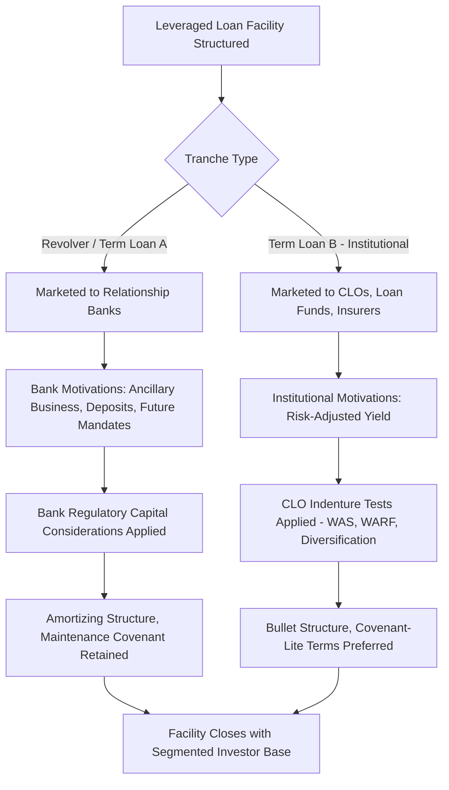

## Participant Banks versus Institutional Investors

### Overview

Syndicated loan facilities are held by a diverse group of lenders whose participation mechanisms, investment motivations, and structural constraints differ substantially depending on whether they are commercial/relationship banks or non-bank institutional investors. Understanding this distinction — particularly the growing role of institutional investors, especially CLOs, in the leveraged loan market — is central to understanding modern syndication dynamics, pricing behavior, and covenant negotiation, since these two investor categories often have divergent priorities that shape deal structuring.

### Participant Banks: Characteristics and Motivations

**Key Points**

- Traditional commercial banks participate in syndicated facilities both as lead arrangers/underwriters and as pro rata syndicate members, particularly in revolving credit facilities and amortizing term loan (TLA) tranches
- Bank participation is often motivated by **relationship considerations** beyond pure yield optimization: banks frequently value ancillary business opportunities with the borrower — cash management services, foreign exchange, treasury services, deposit relationships, and future capital markets mandates (equity or debt underwriting)
- Banks are subject to **regulatory capital requirements** (e.g., Basel III risk-weighted asset frameworks) that affect the economics of holding leveraged loans on balance sheet, generally making banks more cost-sensitive to holding lower-rated, higher-risk-weighted credits for extended periods compared to unregulated institutional investors
- Banks typically prefer **floating-rate, senior secured** exposure (aligning with their funding cost structure) and often gravitate toward the revolving credit facility and pro rata term loan tranches rather than the institutional term loan B tranche, which is more heavily distributed to non-bank investors

### Institutional Investors: Characteristics and Motivations

**Key Points**

- **Collateralized Loan Obligations (CLOs)** represent the largest category of institutional demand in the broadly syndicated leveraged loan market, functioning as structured vehicles that pool leveraged loans and issue tranched securities to investors, with the CLO manager actively selecting and managing the underlying loan portfolio
- **Loan mutual funds and ETFs** provide retail and institutional investors exposure to leveraged loans through pooled vehicles, subject to their own liquidity management considerations given the relatively illiquid nature of the underlying loan asset class relative to fund redemption terms
- **Insurance companies** invest in leveraged loans as part of a broader fixed-income allocation strategy, often with longer investment horizons and less immediate liquidity pressure than mutual funds
- **Hedge funds and distressed/opportunistic credit funds** participate both in primary syndication and, particularly, in secondary market trading, sometimes specializing in stressed or distressed credits where their return objectives and risk tolerance differ meaningfully from traditional buy-and-hold institutional investors
- Institutional investors are generally motivated primarily by **risk-adjusted yield optimization** rather than ancillary relationship considerations, making their demand more directly sensitive to pricing, structure, and covenant terms relative to comparable credits in the market

### CLO Structural Constraints and Their Market Impact

**Key Points**

- CLOs operate under indenture-based constraints that significantly influence their loan purchasing behavior, including: minimum diversification requirements (limiting concentration in any single obligor or industry), weighted average spread (WAS) tests (requiring the portfolio to maintain a minimum average spread level), and weighted average rating factor (WARF) tests (limiting overall portfolio credit risk)
- During a CLO's **reinvestment period** (typically the first 4–5 years of the CLO's life), the manager can actively trade the portfolio, reinvesting principal proceeds from repaid or sold loans into new loan purchases; after the reinvestment period ends, CLOs generally must use principal proceeds to pay down their own liabilities rather than reinvest, reducing new-issue demand from "seasoned" CLOs
- These structural features mean CLO demand for new loan issuance can fluctuate based on the aggregate reinvestment capacity of CLOs currently within their reinvestment periods, a factor that arrangers and market participants monitor as an indicator of technical demand strength in the broadly syndicated loan market [Unverified — the precise magnitude of CLO reinvestment capacity at any given time is a market-data-dependent figure that should be checked against current CLO market statistics for time-sensitive analysis]

### Comparative Summary: Banks vs. Institutional Investors

| Feature | Participant Banks | Institutional Investors (CLOs, Funds, Insurers) |
| --- | --- | --- |
| Primary motivation | Relationship + yield | Risk-adjusted yield optimization |
| Typical tranche preference | Revolver, Term Loan A (amortizing) | Term Loan B (institutional, bullet) |
| Regulatory constraints | Basel III capital requirements | Indenture-based (CLOs); fund-specific (mutual funds) |
| Sensitivity to price/structure | Moderate — relationship can offset pricing | High — direct return-driven decision |
| Typical holding period | Often long-term, relationship-driven | Varies — CLOs often longer-term within reinvestment period; hedge funds more opportunistic |
| Secondary market trading activity | Lower — relationship holders trade less frequently | Higher — active secondary market participation, especially hedge funds |

### Impact on Deal Structuring and Tranching

**Key Points**

- The differing preferences of bank versus institutional investors are a key driver of the typical bifurcated tranche structure in leveraged loan facilities: a smaller, amortizing Term Loan A and revolving facility marketed primarily to relationship banks, alongside a larger, bullet-maturity, minimally-amortizing Term Loan B marketed primarily to CLOs and other institutional investors
- Covenant packages often differ between these tranches even within the same overall credit facility — TLA facilities held by banks have historically retained more maintenance covenant protections, while TLB tranches marketed to institutional investors have increasingly moved toward covenant-lite structures, reflecting differing risk tolerance and negotiating leverage between these investor bases
- Pricing also frequently differs between TLA and TLB tranches for the same borrower, with the specific spread relationship varying by credit and market conditions rather than following a fixed universal pattern [Unverified — relative TLA/TLB pricing dynamics shift with market conditions and should not be assumed to follow a constant relationship]

### Investor Base Composition Example

**Example**

Consider a hypothetical $600mm leveraged loan financing with a bifurcated structure:

| Tranche | Size ($mm) | Primary Investor Base | Structural Features |
| --- | --- | --- | --- |
| Revolving Credit Facility | 100 | Relationship Banks | Springing maintenance covenant, floating rate |
| Term Loan A | 150 | Relationship Banks | 5-10% annual amortization, maintenance covenant |
| Term Loan B | 350 | CLOs, Loan Funds, Insurance Cos | 1% annual amortization, covenant-lite (incurrence-based) |

This structure reflects the market's typical segmentation: banks anchor the shorter-dated, amortizing, more protected tranches reflecting their relationship-driven and capital-constrained investment approach, while institutional investors absorb the larger, longer-dated, less protected institutional tranche in pursuit of yield.

### Investor Base Segmentation and Tranche Matching

### Investor Base Segmentation by Tranche (svg_diagram)

<svg xmlns="http://www.w3.org/2000/svg" viewBox="0 0 700 340">
\<style\>
.lbl{font-family:Arial,sans-serif;font-size:12px;fill:#1a1a1a;}
.hdr{font-family:Arial,sans-serif;font-size:15px;font-weight:bold;fill:#1a1a1a;}
.small{font-family:Arial,sans-serif;font-size:11px;fill:#333333;}
\</style\>
<text x="350" y="24" text-anchor="middle" class="hdr">Participant Banks versus Institutional Investors (svg_diagram)</text>

<text x="175" y="55" text-anchor="middle" class="lbl" font-weight="bold">Bank-Held Tranches</text>

<rect x="60" y="70" width="230" height="45" fill="`#2c5f8a`" />

<text x="175" y="97" text-anchor="middle" class="lbl" fill="white">Revolver ($100mm)</text>

<rect x="60" y="115" width="230" height="60" fill="#4a7fa8" />
<text x="175" y="140" text-anchor="middle" class="lbl" fill="white">Term Loan A ($150mm)</text>
<text x="175" y="158" text-anchor="middle" class="lbl" fill="white">Amortizing, Maintenance Cov.</text>

<text x="175" y="200" text-anchor="middle" class="small">Held by: Relationship Banks</text>

<text x="525" y="55" text-anchor="middle" class="lbl" font-weight="bold">Institutional-Held Tranche</text>

<rect x="410" y="70" width="230" height="105" fill="`#8fae6a`" />

<text x="525" y="115" text-anchor="middle" class="lbl">Term Loan B ($350mm)</text>

<text x="525" y="135" text-anchor="middle" class="lbl">Bullet, Covenant-Lite</text>

<text x="525" y="155" text-anchor="middle" class="lbl">1% Annual Amortization</text>

<text x="525" y="200" text-anchor="middle" class="small">Held by: CLOs, Loan Funds, Insurers</text>

<line x1="60" y1="230" x2="640" y2="230" stroke="#999999" stroke-width="1" />
<text x="350" y="255" text-anchor="middle" class="small">Bank tranches: relationship-driven, more protective covenants</text>
<text x="350" y="273" text-anchor="middle" class="small">Institutional tranche: yield-driven, larger size, less restrictive terms</text>
</svg>

**Related Topics**

- CLO Structure, Reinvestment Periods, and Indenture Test Mechanics
- Basel III Capital Requirements and Bank Loan Portfolio Management
- Covenant-Lite Loan Structures and Investor Base Influence on Terms
- Secondary Market Trading Behavior Across Investor Categories
- Term Loan A vs. Term Loan B Structuring and Pricing Differentials
- Loan Mutual Fund and ETF Liquidity Management Considerations
- Hedge Fund and Distressed Credit Investor Strategies in Secondary Markets
- Relationship Banking and Ancillary Business Considerations in Syndication