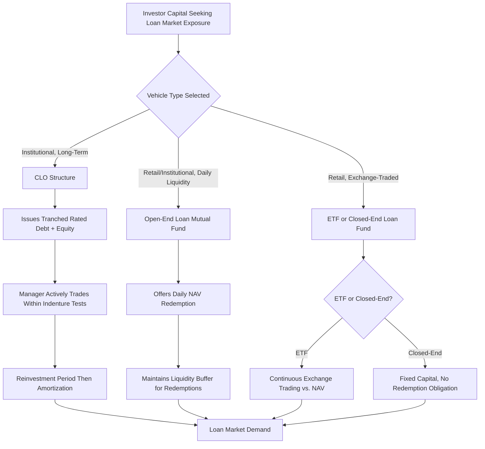

## CLOs, Loan Mutual Funds, and Retail Loan Funds as Buyers

### Overview

Non-bank institutional demand for leveraged loans is channeled primarily through three structurally distinct vehicle types: Collateralized Loan Obligations (CLOs), open-end loan mutual funds, and retail-oriented loan funds (including exchange-traded funds and closed-end funds). Each vehicle type pools capital from a different investor base and operates under distinct structural constraints — reinvestment mechanics, liquidity terms, and regulatory frameworks — that shape how and when they participate in primary syndication and secondary market trading. Because these vehicles collectively represent the dominant source of demand for institutional term loan tranches, understanding their structural mechanics is essential to understanding loan market technical conditions and pricing behavior.

### Collateralized Loan Obligations (CLOs)

**Key Points**

- A CLO is a special purpose vehicle that purchases a diversified portfolio of leveraged loans (typically 150–300+ individual credits) and finances that portfolio by issuing multiple tranches of rated debt securities (from AAA down to unrated/equity) with a defined waterfall for interest and principal distributions
- CLO equity investors (typically the CLO manager itself, alongside third-party equity investors) retain the residual cash flows after all rated debt tranches are paid, effectively representing a leveraged bet on the underlying loan portfolio's performance
- The CLO **reinvestment period** (typically 4–5 years from CLO closing) allows the CLO manager to actively trade the portfolio — buying new loans with principal proceeds from repayments or sales — after which the CLO enters an **amortization period** where principal proceeds must generally be used to pay down the CLO's own rated liabilities rather than reinvest
- CLO indentures impose portfolio-level tests that constrain the manager's purchasing behavior: **diversification tests** (limiting concentration by obligor and industry), **weighted average spread (WAS) tests** (requiring the portfolio to maintain a minimum blended spread level), **weighted average rating factor (WARF) tests** (limiting aggregate credit risk), and **overcollateralization (OC) tests** (requiring asset value to exceed liability tranches by specified cushions)
- CLOs represent the single largest buyer category in the U.S. broadly syndicated leveraged loan market, meaning CLO formation volume (new CLO issuance) and the aggregate reinvestment capacity of existing CLOs within their reinvestment periods are closely monitored indicators of technical demand strength [Unverified — specific market share percentages fluctuate over time and should be verified against current market data for time-sensitive analysis]

### Open-End Loan Mutual Funds

**Key Points**

- Open-end loan mutual funds pool capital from retail and institutional investors, offering daily (or periodic) subscription and redemption at net asset value (NAV), similar to conventional open-end mutual funds investing in other asset classes
- A structural tension exists between the fund's redemption terms (often daily liquidity) and the underlying asset class's relative illiquidity (loans trade over-the-counter with settlement periods historically longer than equities or even high-yield bonds, per LSTA market conventions), creating potential liquidity mismatch risk during periods of heavy redemption activity
- To manage this mismatch, loan mutual funds typically maintain a cash/liquid asset buffer, may utilize lines of credit for temporary liquidity needs, and in stressed market conditions have occasionally employed liquidity management tools such as redemption gates or swing pricing, subject to applicable fund regulatory frameworks [Inference — specific liquidity management tool availability and usage depends on the fund's jurisdiction, structure, and applicable securities regulations, and should not be assumed uniform across all funds]
- Loan mutual funds generally participate in primary syndication for new-issue loans while also engaging in secondary market purchases and sales to manage portfolio composition and liquidity needs

### Retail-Oriented Loan Funds (ETFs and Closed-End Funds)

**Key Points**

- Loan-focused exchange-traded funds (ETFs) provide intraday-tradable retail access to a diversified loan portfolio, with the ETF's market price theoretically tracking (though sometimes deviating from, particularly during stress periods) the fund's underlying NAV given the loan asset class's settlement lag relative to the ETF's continuous trading
- Closed-end loan funds raise a fixed pool of capital at inception (via an initial public offering of fund shares) and do not offer ongoing redemption at NAV, instead trading on an exchange at a market price that may reflect a premium or discount to underlying NAV — this structure avoids the liquidity mismatch risk inherent in open-end vehicles, since the fund itself is not obligated to meet investor redemptions from its underlying illiquid loan portfolio
- Some closed-end loan funds employ **leverage** (via bank credit facilities, preferred shares, or other structural leverage) to enhance the yield distributed to common shareholders, introducing additional risk and return variability beyond the underlying loan portfolio's unlevered performance
- These retail-accessible vehicles have historically broadened the leveraged loan investor base beyond traditional institutional and CLO buyers, though their aggregate share of total market demand is generally smaller than CLOs [Unverified — relative market share among vehicle types shifts with market cycles and retail investor sentiment]

### Comparative Structural Summary

| Feature | CLOs | Open-End Loan Mutual Funds | Closed-End/ETF Loan Funds |
| --- | --- | --- | --- |
| Investor base | Institutional (CLO debt/equity investors) | Retail and institutional | Retail (exchange-traded) and institutional |
| Liquidity terms | Locked structure; no investor-level redemption of underlying vehicle | Daily/periodic redemption at NAV | ETF: continuous exchange trading; Closed-end: exchange trading, no NAV redemption |
| Liquidity mismatch risk | Low — structure matched to illiquid assets | Higher — daily liquidity vs. illiquid loans | Lower for closed-end (no redemption obligation); ETF has its own dynamics |
| Portfolio management constraints | Extensive indenture tests (WAS, WARF, diversification, OC) | Fund prospectus limits, regulatory liquidity rules | Fund-specific mandate; closed-end may employ leverage |
| Reinvestment/duration | Defined reinvestment then amortization period | Perpetual (ongoing fund) | Perpetual (ongoing fund) |
| Typical holding behavior | Buy-and-hold within reinvestment period, subject to trading for credit/test management | More active trading to manage liquidity/redemptions | Varies; closed-end can hold longer given no redemption pressure |

### Illustrative CLO Portfolio Test Framework

**Example**

| Test | Requirement (Illustrative) | Purpose |
| --- | --- | --- |
| Diversification (obligor limit) | No single obligor > 2% of portfolio (illustrative) | Limits concentration risk |
| Industry concentration | No single industry > 15% of portfolio (illustrative) | Diversifies sector exposure |
| Weighted Average Spread (WAS) | Minimum 3.25% average spread (illustrative) | Ensures adequate cash flow to service CLO liabilities |
| Weighted Average Rating Factor (WARF) | Maximum threshold consistent with target rating profile (illustrative) | Limits aggregate portfolio credit risk |
| Overcollateralization (OC) | Asset value must exceed each rated tranche's OC threshold | Protects senior tranche holders; breach triggers cash flow diversion |

[Inference — these figures are illustrative examples of the types of tests CLO indentures typically include; actual test levels are indenture-specific and vary by CLO vintage, manager, and rating agency requirements]

### Buyer Vehicle Structural Comparison Flow

### Loan Buyer Vehicle Structures (svg_diagram)

<svg xmlns="http://www.w3.org/2000/svg" viewBox="0 0 700 360">
\<style\>
.lbl{font-family:Arial,sans-serif;font-size:12px;fill:#1a1a1a;}
.hdr{font-family:Arial,sans-serif;font-size:15px;font-weight:bold;fill:#1a1a1a;}
.small{font-family:Arial,sans-serif;font-size:10px;fill:#333333;}
.box{fill:#eef3f8;stroke:#2c5f8a;stroke-width:1.5;}
\</style\>
<text x="350" y="24" text-anchor="middle" class="hdr">CLOs, Loan Mutual Funds, and Retail Loan Funds as Buyers (svg_diagram)</text>
<rect x="30" y="55" width="200" height="110" rx="6" class="box" />
<text x="130" y="78" text-anchor="middle" class="lbl" font-weight="bold">CLO</text>
<text x="130" y="98" text-anchor="middle" class="small">Tranched debt + equity</text>
<text x="130" y="115" text-anchor="middle" class="small">Reinvestment period</text>
<text x="130" y="132" text-anchor="middle" class="small">Indenture tests (WAS/WARF/OC)</text>
<text x="130" y="150" text-anchor="middle" class="small">Locked structure, no redemption</text>
<rect x="250" y="55" width="200" height="110" rx="6" class="box" />
<text x="350" y="78" text-anchor="middle" class="lbl" font-weight="bold">Open-End Loan Fund</text>
<text x="350" y="98" text-anchor="middle" class="small">Daily NAV subscription/redemption</text>
<text x="350" y="115" text-anchor="middle" class="small">Liquidity buffer required</text>
<text x="350" y="132" text-anchor="middle" class="small">Potential liquidity mismatch</text>
<text x="350" y="150" text-anchor="middle" class="small">Gates/swing pricing tools</text>
<rect x="470" y="55" width="200" height="110" rx="6" class="box" />
<text x="570" y="78" text-anchor="middle" class="lbl" font-weight="bold">ETF / Closed-End Fund</text>
<text x="570" y="98" text-anchor="middle" class="small">Exchange-traded shares</text>
<text x="570" y="115" text-anchor="middle" class="small">ETF: NAV tracking risk</text>
<text x="570" y="132" text-anchor="middle" class="small">Closed-end: no redemption obligation</text>
<text x="570" y="150" text-anchor="middle" class="small">May employ structural leverage</text>
<line x1="130" y1="165" x2="130" y2="220" stroke="#1a1a1a" stroke-width="1.5" />
<line x1="350" y1="165" x2="350" y2="220" stroke="#1a1a1a" stroke-width="1.5" />
<line x1="570" y1="165" x2="570" y2="220" stroke="#1a1a1a" stroke-width="1.5" />
<line x1="130" y1="220" x2="570" y2="220" stroke="#1a1a1a" stroke-width="1.5" />
<rect x="250" y="220" width="200" height="45" rx="6" fill="#8fae6a" stroke="#1a1a1a" stroke-width="1.5" />
<text x="350" y="248" text-anchor="middle" class="lbl">Aggregate Leveraged Loan Demand</text>

<text x="350" y="300" text-anchor="middle" class="small">Each vehicle type's structural constraints shape when and how it participates</text>

<text x="350" y="316" text-anchor="middle" class="small">in primary syndication versus secondary market trading</text>

</svg>

**Related Topics**

- CLO Waterfall Mechanics and Equity Tranche Return Dynamics
- Weighted Average Spread and Rating Factor Test Calculations
- Liquidity Management Tools in Open-End Fund Regulatory Frameworks
- Secondary Market Loan Trading and LSTA Settlement Standards
- CLO Formation Volume as a Technical Demand Indicator
- Overcollateralization Test Breaches and Cash Flow Diversion Mechanics
- Retail Investor Access to Leveraged Loans Through Fund Structures
- Institutional versus Bank Investor Behavior in Loan Syndication