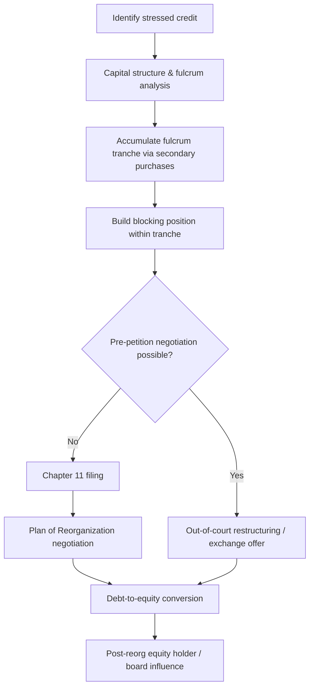

## Hedge Funds and Distressed Investors in Syndication

### Overview

Hedge funds and distressed debt investors occupy a distinct tier within the syndicated loan and bond market, differentiated from traditional bank lenders and long-only institutional investors (CLOs, mutual funds, insurance companies) by their return objectives, risk tolerance, holding periods, and influence over restructuring outcomes. These participants are typically classified under the broader "non-bank" or "shadow lending" umbrella and have become structurally important to primary syndication (as anchor orders for leveraged loans) and secondary/distressed trading (as controllers of fulcrum securities in workouts).

This document covers their taxonomy, economic motivations, syndication mechanics, legal/structural tools, and their behavior across the capital structure during both origination and restructuring.

### Taxonomy of Hedge Fund Strategies Relevant to Syndication

Not all hedge funds participate in syndication the same way. Strategy type dictates where in the process — and where in the capital structure — a fund will engage.

- **Performing credit / leveraged loan funds**: Buy at par or near-par in primary syndication, similar to CLOs but with more flexible mandates (can hold second lien, unitranche, or covenant-lite paper without ratings constraints).
- **Distressed debt funds**: Target securities trading at a discount to par (commonly below 80 cents), seeking either a trading profit on recovery, or control of the reorganized equity via a loan-to-own strategy.
- **Special situations / event-driven funds**: Trade around discrete catalysts — earnings misses, covenant breaches, ratings downgrades, M&A-driven refinancing — often without holding to maturity or default.
- **Credit opportunities / multi-strategy funds**: Rotate across performing, stressed, and distressed tranches opportunistically based on relative value.
- **Loan-to-own funds**: A specialized distressed subset explicitly seeking to convert debt into control equity through the restructuring process, rather than simply trading the claim.

**Key Points**

- Strategy classification is not static — a single fund may buy a loan as "performing credit" and later be forced (or choose) to behave as a "distressed" holder if the credit deteriorates.
- Mandate flexibility (unconstrained by rating agency triggers, retail redemption pressure, or regulatory capital rules) is the primary structural advantage hedge funds have over banks and CLOs.

### Role in Primary Syndication

#### Anchor Orders and Price Discovery

In broadly syndicated loan (BSL) transactions, arrangers frequently seek an anchor order from a hedge fund or credit opportunities fund before or during the retail syndication phase. This serves several functions:

- Validates pricing and structure to the broader lender base ("if Fund X is in at OID 98, the deal is real").
- Allows the arranger to test flex terms (pricing, covenants, call protection) against a sophisticated counterparty before wider distribution.
- De-risks the underwriting commitment for the arranging bank(s), since a large anchor order reduces the residual amount that must be placed.

#### Flexible Capital for Complex or Sponsor-Driven Deals

Hedge funds are disproportionately represented in:

- **Cov-lite and covenant-flex structures**, where CLOs and banks may have internal restrictions.
- **Second lien and unitranche tranches**, which carry subordination risk that many regulated lenders avoid.
- **Bridge-to-bond or bridge-to-perm financings**, where the fund is compensated with higher spread/OID for taking short-term execution risk.
- **PIK toggle notes and payment-in-kind structures**, valued for optionality in stressed sponsor situations.

#### Direct Lending Overlap

Many multi-strategy hedge funds now operate direct lending arms that compete with, rather than participate in, traditional syndication — originating unitranche facilities bilaterally or via "club" syndicates of 2-5 funds. This has structurally reduced the addressable market for bank-led BSL syndication in the middle market.

### Distressed Investing Mechanics

#### Entry Points into the Capital Structure

Distressed funds typically build positions through:

1. **Secondary market purchases** from original lenders (banks, CLOs, retail funds) seeking to exit before default, often at a discount reflecting credit deterioration.
2. **Primary allocation followed by hold-through-distress**, less common but occurs when a fund's original performing-credit thesis breaks.
3. **Claims trading** in post-petition Chapter 11 scenarios, purchasing trade claims or deficiency claims at a further discount.

#### Fulcrum Security Analysis

The central analytical exercise for a distressed investor is identifying the **fulcrum security** — the tranche in the capital structure that is expected to convert into the majority of new equity in a reorganization, because enterprise value is insufficient to repay it in full but sufficient to provide some recovery.

$$EV = \sum_{i=1}^{n} \text{Claim}_i \times \text{Recovery Rate}_i$$

Where enterprise value ($EV$) is allocated sequentially by priority (absolute priority rule) until exhausted; the tranche at which recovery falls below 100% is the fulcrum.

**Example**

A company has $500M enterprise value with the following claims:

- First lien term loan: $300M (senior secured)
- Second lien notes: $250M (subordinated secured)
- Unsecured notes: $150M

Under strict absolute priority: first lien recovers 100% ($300M), leaving $200M for second lien ($250M claim → 80% recovery), and $0 for unsecured notes (0% recovery). The **second lien is the fulcrum security** — it absorbs the shortfall and is the class most likely to receive the bulk of new equity in the reorganized entity. Distressed funds pursuing a loan-to-own strategy would concentrate purchases in the second lien tranche.

#### Loan-to-Own Strategy Lifecycle

### Legal and Structural Tools Used by Distressed Investors

- **Blocking positions**: Acquiring at least 33.4% (one-third plus one dollar) of a voting class under most credit agreements, sufficient to block amendments requiring supermajority consent (e.g., collateral release, maturity extension in some agreements).
- **Ad hoc groups and steering committees**: Coalitions of similarly-situated creditors (often distressed funds) that negotiate collectively with the debtor, typically bound by a cooperation agreement and represented by a single set of restructuring counsel and financial advisors.
- **Restructuring Support Agreements (RSAs)**: Pre-negotiated agreements locking in creditor support for a plan of reorganization before or shortly after a bankruptcy filing, often with milestones and "fulcrum lock-up" provisions.
- **DIP (Debtor-in-Possession) financing**: Distressed funds frequently provide DIP loans to a company already in their capital structure, both to earn attractive DIP economics (fees, high coupon, priming liens) and to control the bankruptcy timeline.
- **Credit bidding**: Under Section 363(k) of the U.S. Bankruptcy Code, a secured creditor (or group) can bid its claim amount rather than cash in a Section 363 asset sale, a common loan-to-own mechanism to acquire the company's assets directly.
- **Cooperation agreements / anti-layering provisions**: Increasingly used by ad hoc groups to prevent a subset of lenders from participating in priming "liability management exercises" (LMEs) orchestrated by the sponsor or a rival creditor faction.

### Liability Management Exercises (LMEs) and Creditor-on-Creditor Conflict

A significant recent development is the rise of sponsor-driven LMEs — transactions such as "drop-down" financings, "uptiering" exchanges, and "double-dip" structures — which have reshaped how hedge funds engage in syndicated credits:

- **Uptiering transactions**: A subset of existing lenders provides new priming capital in exchange for improved (senior) lien priority, often executed via majority-lender amendment provisions that bind non-participating lenders (as seen in cases such as *Serta Simmons* and *TriMark*).
- **Drop-down financings**: The sponsor transfers valuable collateral or subsidiaries to an unrestricted subsidiary, then uses that entity to raise new debt structurally senior to existing creditors (as in *J.Crew* and *Envision Healthcare*).
- **Creditor-on-creditor violence**: Describes the resulting dynamic where hedge funds within the same nominal tranche split into competing factions — some participating in the priming transaction, others suing to block it — fundamentally altering the cooperative assumptions of traditional syndicated lending.

**Key Points**

- These transactions have driven demand for tighter "open market purchase" and "sacred rights" provisions in credit agreements to protect minority lenders from being primed without consent.
- [Inference] The prevalence of LMEs has likely increased the due diligence hedge funds perform on credit agreement provisions (particularly the definition of "unrestricted subsidiaries" and asset-transfer baskets) *before* taking a position, rather than only at the point of distress.

### Distressed Debt Valuation Approaches

| Method | Description | Typical Use Case |
| --- | --- | --- |
| Enterprise value / comparable multiples | Apply peer EV/EBITDA multiples to a normalized EBITDA estimate | Going-concern reorganizations |
| Liquidation analysis | Estimate asset-by-asset recovery in a hypothetical wind-down | Asset-heavy or terminally distressed cases |
| Yield-to-worst / trading-level analysis | Assess current market price against expected recovery and timeline | Secondary market entry/exit decisions |
| Option-based / contingent claims models | Treat debt and equity as options on firm value (Merton-style framework) | Complex capital structures with multiple tranches |

### Interaction with Other Syndicate Participants

- **Versus CLOs**: CLOs face reinvestment period constraints, rating-agency triggers (e.g., CCC bucket limits), and diversification tests that often force them to sell distressed positions — hedge funds are frequently the natural buyer of this CLO-driven selling pressure, sometimes referred to as "forced seller" dynamics.
- **Versus banks (agent/arranger)**: Banks generally seek to exit credit risk (via syndication or sale) as a name deteriorates, due to regulatory capital treatment (risk-weighted assets) and reputational concerns; hedge funds serve as the natural counterparty willing to absorb that risk at a discount.
- **Versus the sponsor**: Relationships range from cooperative (sponsor and fund aligned on an out-of-court amend-and-extend) to adversarial (sponsor executing a priming LME opposed by the ad hoc group).

### Illustrative Structure: Distressed Fund Position-Building (SVG)

<svg xmlns="http://www.w3.org/2000/svg" viewBox="0 0 760 340">
<text x="380" y="28" text-anchor="middle" font-size="16" font-weight="bold" fill="#1a1a1a">Distressed Fund Capital Structure Positioning (svg_diagram)</text>
<rect x="60" y="60" width="640" height="50" fill="#2c5f8a" stroke="#1a1a1a" />
<text x="380" y="90" text-anchor="middle" font-size="13" fill="#ffffff">First Lien Term Loan — $300M — 100% Recovery</text>
<rect x="60" y="120" width="640" height="50" fill="#c0392b" stroke="#1a1a1a" />
<text x="380" y="150" text-anchor="middle" font-size="13" fill="#ffffff">Second Lien Notes — $250M — 80% Recovery (FULCRUM)</text>
<rect x="60" y="180" width="640" height="50" fill="#7f8c8d" stroke="#1a1a1a" />
<text x="380" y="210" text-anchor="middle" font-size="13" fill="#ffffff">Unsecured Notes — $150M — 0% Recovery</text>
<line x1="60" y1="240" x2="700" y2="240" stroke="#1a1a1a" stroke-width="1" stroke-dasharray="4,4" />
<text x="380" y="260" text-anchor="middle" font-size="12" fill="#1a1a1a">Enterprise Value Line: $500M</text>
<path d="M710 145 L740 145 L740 165 L710 165" fill="none" stroke="#c0392b" stroke-width="2" />
<text x="745" y="158" font-size="11" fill="#c0392b">Distressed fund</text>
<text x="745" y="172" font-size="11" fill="#c0392b">target tranche</text>
</svg>

### Risk Factors and Practical Considerations

- **Illiquidity risk**: Distressed positions, particularly loan claims and bespoke restructuring instruments, can be difficult to exit before a restructuring event concludes.
- **Litigation and timeline risk**: Contested Chapter 11 cases (particularly those involving LME litigation) can extend holding periods well beyond initial underwriting assumptions.
- **Regulatory and disclosure constraints**: Funds serving on official or ad hoc committees may become restricted from trading the name due to receipt of material non-public information (MNPI), requiring careful information-wall management between restructuring and trading desks.
- [Unverified] Specific fund-level performance figures for loan-to-own strategies vary widely by vintage and are not standardized across data providers; any cited industry-wide IRR statistics should be treated as illustrative rather than authoritative.

### Related Topics

- CLO Structures and Reinvestment Constraints
- Amend-and-Extend Transactions
- Liability Management Exercises (Uptiering, Drop-Down, Double-Dip Structures)
- Absolute Priority Rule and Plan Confirmation Standards
- DIP Financing Structures and Priming Liens
- Claims Trading and Rule 3001(e) Transfer Mechanics
- Credit Agreement "Sacred Rights" and Protective Covenant Drafting
- Ad Hoc Group Formation and Cooperation Agreements