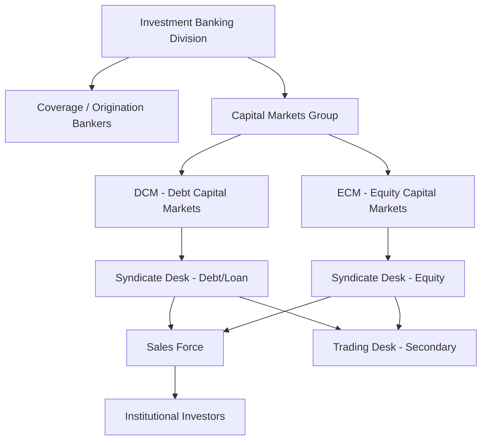
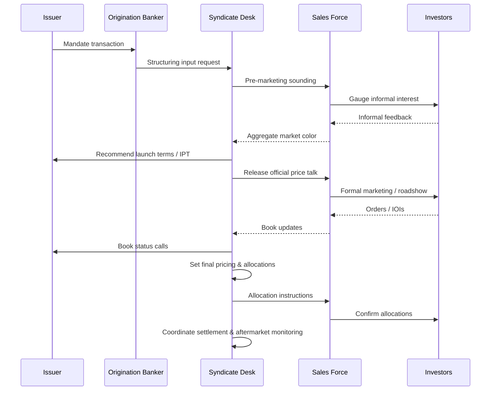

## Syndicate Desk Function within an Investment Bank

### Overview

The syndicate desk is the internal coordination function within an investment bank that sits at the intersection of the origination/coverage bankers, sales and trading, and capital markets execution teams. It is the mechanism through which a bank converts a mandated transaction (debt or equity) into a distributed, priced, and allocated security held by a diversified investor base. The desk exists because origination bankers who structure a deal with the issuer are not well-positioned to also gauge real-time investor demand, and sales/trading desks who talk to investors daily are not positioned to manage issuer relationships or legal/structuring judgment — syndicate bridges these two functions.

### Organizational Placement

**Key Points**

- Syndicate desks typically report within Capital Markets (DCM or ECM), not within Coverage Banking or Sales & Trading directly, though they function as a permanent liaison to both.
- Larger banks maintain separate syndicate functions for leveraged loans, investment-grade bonds, high-yield bonds, and equity (IPO/follow-on/convertible), each with distinct investor bases and mechanics, though junior staff frequently rotate across products.

### Core Functions

#### 1. Deal Structuring Input and Market Read

Before a mandate is finalized, syndicate provides real-time "market color" to origination bankers and the issuer:

- Indicative pricing levels based on recent comparable transactions.
- Assessment of investor appetite for specific structural features (covenant packages, tenor, call protection, security package).
- Guidance on optimal execution timing relative to macro conditions, technical factors (fund flows, calendar congestion), and competing new issue supply.

#### 2. Building the Order Book

During the marketing period (roadshow for equity, or the syndication/bookbuild period for debt), syndicate is responsible for:

- Receiving and logging indications of interest (IOIs) from the sales force and directly from large institutional accounts.
- Tracking the book in real time, segmented by investor type, order size, and price sensitivity (limit orders vs. market orders).
- Communicating book status back to the issuer, typically via periodic "book update" calls during the marketing period.

#### 3. Price Discovery and Setting Final Terms

Syndicate manages the mechanics of moving from initial price talk to final pricing:

- **Initial price talk (IPT)**: A wide indicative range released to gauge demand (e.g., "T+250-275" for a bond, or a price range for an IPO).
- **Revised guidance**: Narrower ranges published as the book fills, often accompanied by explicit "guidance is inside initial talk" language signaling strong demand.
- **Flex provisions** (loan market specific): Pre-negotiated ability for the arranger to adjust pricing (spread flex), original issue discount (OID flex), or structure (covenant flex) within a defined range without re-documenting the credit agreement, based on syndication results.
- **Final pricing / launch**: The syndicate desk, in consultation with origination and the issuer, sets the final coupon/spread/price at a level intended to clear the book while leaving reasonable aftermarket performance (avoiding both a broken deal and excessive "money left on the table").

#### 4. Allocation

Once the book is set, syndicate determines final allocations — one of the desk's most sensitive and judgment-intensive functions:

- **Allocation criteria** typically include: order size and timing (early orders sometimes favored), historical relationship with the bank, expected holding behavior (long-only "real money" vs. fast-money accounts), and issuer preferences (e.g., a desire for a diversified, stable long-term holder base).
- **Scaling back**: In an oversubscribed book, orders are typically reduced pro-rata within investor tiers rather than granted in full, with syndicate deciding the specific scale-back methodology.
- **Anchor order treatment**: Large anchor orders (see hedge fund/anchor investor participation) often receive preferential allocation certainty in exchange for having provided early price validation.

**Example**

A $500M high-yield bond is 3x oversubscribed with a $1.5B order book. Syndicate might allocate as follows: 60% to long-only asset managers (prioritized for aftermarket stability), 25% to hedge funds/crossover accounts (some of whom provided anchor orders), and 15% to retail-distribution accounts — with each tier scaled back proportionally to fit within the tier's target allocation percentage, rather than a flat pro-rata cut across all 1.5B of demand.

#### 5. Aftermarket Support and Stabilization

Post-pricing, syndicate coordinates with the trading desk on:

- **Stabilization/greenshoe mechanics** (equity): Managing the over-allotment option and any stabilizing bids in the secondary market during the stabilization period, subject to regulatory limits (e.g., SEC Regulation M in the U.S.).
- **Secondary market monitoring**: Tracking where the new issue trades relative to reoffer price ("breaking syndicate" — when the security trades below reoffer, often viewed as a signal of aggressive pricing or weak allocation discipline).
- **Issuer relationship management**: Reporting aftermarket performance back to the issuer as a factor in future capital markets access and relationship pricing.

### Debt Syndicate vs. Equity Syndicate: Key Differences

| Dimension | Debt (Loan/Bond) Syndicate | Equity Syndicate |
| --- | --- | --- |
| Primary pricing mechanism | Spread/OID flex within engagement letter parameters | Price range set via roadshow feedback, final price set night before pricing |
| Key document | Credit agreement / indenture, flex language in commitment letter | Underwriting agreement, prospectus |
| Typical marketing period | Days (loans) to ~1-2 weeks (high-yield bonds) | 1-2 week roadshow |
| Stabilization tool | Not applicable in the equity sense; secondary trading is organic | Greenshoe / over-allotment option |
| Investor base | CLOs, hedge funds, banks, insurance companies | Mutual funds, hedge funds, sovereign wealth funds, retail (via underwriters) |
| Ongoing structural flexibility | Flex provisions allow post-launch term changes | Price range adjustment pre-pricing; limited post-pricing flexibility |

### Syndicate Desk Workflow (End-to-End)

### Multi-Bookrunner Coordination (Joint Syndication)

For larger transactions with multiple bookrunners, an **admin agent** or **left-lead bookrunner** typically directs the overall syndicate process, but each participating bank's syndicate desk performs parallel functions:

- **Books crossing**: Coordinating combined order books across bookrunners without double-counting accounts that place orders through multiple banks.
- **Economics allocation among banks**: Distributing underwriting fees/gross spread among joint bookrunners per the engagement letter, separate from investor allocation.
- **Communication protocols**: Establishing which bank communicates official price talk and updates to the market ("left lead controls the calendar and official communications" is a common convention, though all joint books actively solicit orders).

**Key Points**

- [Inference] Coordination friction increases materially with bookrunner count; deals with 4+ joint bookrunners often designate a smaller "active" subset with primary syndicate responsibility, while others serve more passively for league table credit.

### Regulatory and Conduct Considerations

- **Chinese walls / information barriers**: Syndicate desks sit on the "public side" of the information barrier once a deal is announced, but must carefully manage pre-mandate market soundings under regulations such as the EU Market Abuse Regulation (MAR) "market sounding" regime, which requires specific disclosure and consent protocols before sharing inside information with potential investors.
- **Allocation fairness/conduct rules**: Regulators (e.g., FINRA in the U.S. for IPO allocations) impose rules against improper allocation practices such as "laddering" (conditioning allocation on aftermarket purchase commitments) or spinning (favorable allocations to executives in exchange for business).
- **Conflicts of interest**: When the underwriting bank's affiliated funds or trading desks seek allocations, information barrier and allocation policies must document arm's-length treatment.
- [Unverified] Specific regulatory thresholds and disclosure requirements vary by jurisdiction and are subject to periodic amendment; practitioners should verify current requirements against the applicable regulator's current rulebook rather than relying on general descriptions.

### Practical Skills and Metrics Syndicate Professionals Track

- **Oversubscription ratio**: Total demand ÷ deal size, used as a proxy for pricing tension and future flex potential.
- **Break performance**: Secondary market price movement in the first day(s) of trading relative to reoffer/issue price.
- **Investor diversification metrics**: Number of unique accounts, concentration of top-10 holders, split between "sticky" long-only capital and rotational/hedge fund capital.
- **League table credit allocation**: Internal and external credit for bookrunner role, influencing future mandate competitiveness.

### Related Topics

- Bookbuilding Mechanics and Price Talk Conventions
- Original Issue Discount (OID) and Flex Provisions in Leveraged Loans
- Greenshoe / Over-Allotment Option Mechanics
- Market Soundings and MAR Compliance
- Left-Lead vs. Joint Bookrunner Economics
- IPO Allocation Practices and Regulatory Constraints (Laddering, Spinning)
- Reverse Inquiry and Private Placement Syndication