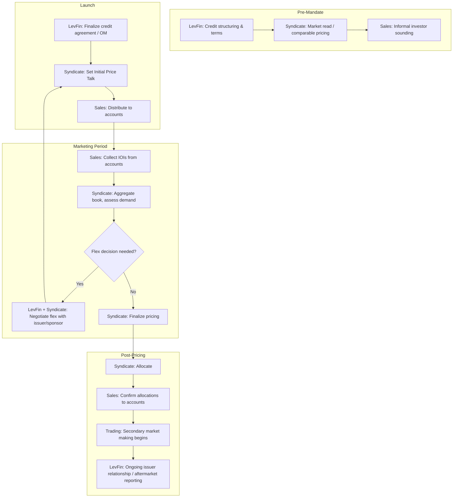

## Coordination between Syndicate, DCM/LevFin, and Sales and Trading

### Overview

The syndication of a debt transaction requires continuous coordination across three functionally distinct but interdependent desks: **DCM/LevFin** (origination and structuring), **Syndicate** (book management, pricing, and allocation), and **Sales and Trading** (investor distribution and secondary liquidity). Each function has a different primary stakeholder — DCM/LevFin serves the issuer, Syndicate serves the transaction process itself, and Sales and Trading serves the investor — and friction between these interests is a normal, managed feature of execution rather than a failure of the process. Understanding the division of labor and the handoff points between these desks is essential to understanding how a leveraged loan or bond deal actually moves from mandate to closing.

### Functional Roles Compared

| Function | Primary Stakeholder | Core Responsibility | Time Horizon |
| --- | --- | --- | --- |
| DCM (Debt Capital Markets) / LevFin (Leveraged Finance) | Issuer / Sponsor | Structuring, credit story, terms negotiation, engagement letter economics | Pre-mandate through close; ongoing relationship |
| Syndicate | The transaction / the firm's underwriting risk | Book building, price discovery, flex decisions, allocation | Launch through allocation/closing |
| Sales and Trading | Institutional investor accounts | Distribution, investor relationship management, secondary market making | Marketing period through perpetuity (secondary trading) |

**Key Points**

- LevFin specifically refers to the leveraged loan and high-yield origination function within DCM, typically covering sponsor-backed and below-investment-grade issuers; investment-grade DCM is often organizationally and culturally distinct.
- Sales desks are typically segmented by investor type (CLO sales, hedge fund sales, insurance/pension sales, retail-facing sales), each requiring differentiated messaging from syndicate.

### The Coordination Lifecycle

### Handoff Point 1: LevFin to Syndicate (Pre-Launch)

Before a deal is announced, LevFin bankers who have built the credit relationship transfer structuring context to syndicate:

- **Credit story and structuring rationale**: Why the covenant package, leverage level, and use of proceeds are appropriate for the credit — syndicate needs this to defend pricing to skeptical accounts.
- **Engagement letter terms**: Including any pre-agreed **flex provisions** (the range within which syndicate can adjust spread, OID, or terms without re-approval from the issuer/sponsor), which directly bound syndicate's later pricing authority.
- **Sponsor/issuer sensitivities**: E.g., a sponsor's reluctance to accept negative flex due to returns modeling, or an issuer's preference for a diversified vs. club-style lender base.

**Key Points**

- Flex provisions are the primary contractual mechanism translating LevFin's deal-negotiation authority into syndicate's real-time pricing authority — syndicate cannot exceed agreed flex without going back to LevFin to renegotiate directly with the issuer.

### Handoff Point 2: Syndicate to Sales (Marketing Period)

Once terms are set for launch, syndicate provides sales with the materials and parameters needed to solicit orders:

- **Term sheet / preliminary offering memorandum distribution** to the sales force for onward distribution to accounts.
- **Approved talking points**: Syndicate typically controls exactly what messaging sales can share about credit risk, structure rationale, and comparable transactions, particularly to maintain consistency and manage MNPI/public-side/private-side information barriers.
- **Order collection protocol**: Format, deadline, and minimum size for indications of interest (IOIs), and any tiering guidance (e.g., "anchor orders being prioritized").

Sales, in turn, feeds back to syndicate:

- **Real-time investor feedback**: Not just order size but qualitative pushback (e.g., "accounts want tighter covenants," or "leverage is a concern above 6x").
- **Order book composition**: Breakdown of orders by investor type, enabling syndicate to assess whether the book supports a stable aftermarket or is dominated by fast-money accounts likely to flip the position.

### Handoff Point 3: Syndicate to Trading (Post-Allocation)

Once the deal prices and allocates, responsibility shifts to the secondary trading desk:

- **Settlement and initial trading support**: Trading desks make markets in the new issue from day one, often referencing the reoffer price as an initial anchor.
- **Stabilization** (equity-specific, and analogous informal practices in debt): Coordinated buying/selling to support an orderly aftermarket, particularly if the deal "breaks" (trades below reoffer).
- **Feedback loop to syndicate and LevFin**: Aftermarket trading levels inform how the next deal from the same issuer, sector, or sponsor should be priced — a persistent feedback channel across the three desks.

### The Central Tension: Flex Decisions

Flex decisions are the clearest illustration of why three-way coordination is structurally necessary rather than a nice-to-have:

$$\text{Available Flex Capacity} = f(\text{Engagement Letter Terms}, \text{Book Demand}, \text{Issuer/Sponsor Tolerance})$$

- **Sales** reports that the book is undersubscribed at current price talk.
- **Syndicate** determines whether existing flex language permits widening the spread or increasing OID without further negotiation.
- **LevFin** must go back to the issuer/sponsor if the required adjustment exceeds pre-agreed flex, since this affects the sponsor's return model and may require board-level or investment-committee re-approval.

**Example**

A $400M term loan B is launched at S+375, OID 99, with negative flex of up to 50bps pre-agreed in the engagement letter. Sales reports the book is only 60% covered after three days of marketing. Syndicate determines that widening to S+400 (within the 50bps flex) is sufficient based on investor feedback relayed by sales, and executes the flex without needing to renegotiate with the sponsor — because the adjustment falls inside LevFin's pre-negotiated authority. Had the required move exceeded the agreed flex band, LevFin would have needed to return to the sponsor for a structural renegotiation (e.g., additional covenant protection or larger OID) before syndicate could re-launch.

### Information Flow and Barrier Management

- **Public side vs. private side**: Once syndicate and sales begin marketing a leveraged loan (frequently marketed with material non-public information, or MNPI, under private-side protocols), strict information barriers segregate these teams from public-side trading desks and equity research to prevent improper information flow.
- **Wall-crossing procedures**: When LevFin or syndicate needs input from a trading desk professional who is normally public-side, formal wall-crossing procedures (documented consent, trading restriction acknowledgment) are required.
- [Inference] The intensity of documentation around these handoffs has likely increased over time in response to regulatory scrutiny of loan market practices, particularly as leveraged loans have drawn increased attention regarding their treatment as securities versus commercial loans for disclosure purposes in various jurisdictions.

### Coordination Breakdown Scenarios and Their Consequences

| Breakdown Scenario | Typical Cause | Consequence |
| --- | --- | --- |
| Deal priced too aggressively | Syndicate underweights sales feedback on investor sensitivity | Break syndicate (aftermarket trades below reoffer), reputational cost with investors |
| Flex disputes with sponsor | LevFin over-promises terms to win mandate without syndicate market-read input | Delayed launch, competitive process risk (sponsor shops deal to competing bank) |
| Misallocation to fast-money accounts | Sales/Syndicate misjudge account behavior type during book-building | Poor aftermarket stability, "flipping" pressure on the new issue price |
| Information leakage | Inadequate wall-crossing discipline between private-side syndicate/LevFin teams and public-side trading | Regulatory exposure, potential MNPI trading violations |

### Committee Structures Supporting Coordination

Large banks formalize this coordination through standing committees rather than relying purely on ad hoc desk communication:

- **Commitment committee**: Cross-functional (including risk, LevFin, syndicate) approval body for underwriting commitments before a mandate is signed, assessing the bank's balance sheet exposure if the deal cannot be fully syndicated.
- **Pricing/launch committee**: Reviews and approves final terms before official launch, incorporating syndicate's market read and LevFin's issuer relationship considerations.
- **Allocation review**: In sensitive or oversubscribed deals, syndicate's proposed allocation may be reviewed jointly with sales management to confirm consistency with relationship-management priorities across the sales franchise.

### Related Topics

- Underwriting Commitment Committees and Balance Sheet Risk Assessment
- Flex Provisions and Engagement Letter Drafting
- Market Soundings and MNPI/Information Barrier Protocols
- Break Syndicate Dynamics and Aftermarket Performance Analysis
- Anchor Order Solicitation and Pre-Marketing Strategy
- Cross-Desk Committee Structures in Investment Banks