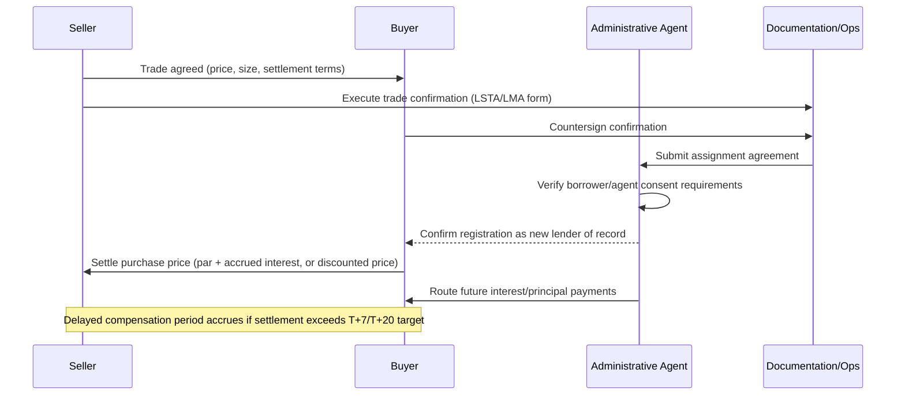
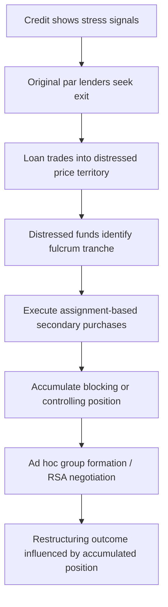

## Secondary Loan Trading and Distressed Debt Markets

### Overview

Secondary loan trading refers to the buying and selling of syndicated loan interests after initial allocation, distinct from the primary syndication process covered elsewhere in this chapter. Unlike publicly traded bonds and equities, syndicated loans (particularly leveraged loans) trade in a **dealer-intermediated, over-the-counter (OTC) market** with settlement mechanics, documentation, and price transparency norms that differ meaningfully from other fixed income asset classes. As loans deteriorate in credit quality, this same secondary market becomes the primary venue through which distressed debt investors build positions — making secondary trading mechanics foundational to understanding how control shifts occur in a restructuring.

### Market Structure

#### Trading Conventions: Par vs. Distressed

The market bifurcates trading protocols based on price level, with the industry-standard threshold generally set around **80-85 cents on the dollar**:

| Dimension | Par/Near-Par Trading | Distressed Trading |
| --- | --- | --- |
| Typical price range | Above ~90 (varies by desk convention) | Below ~80-85 |
| Settlement standard | T+7 (loan market standard, historically longer than bonds) | T+20 or longer; often T+7 par form but frequently delayed |
| Documentation | LSTA (US) / LMA (Europe) standard par documentation | LSTA/LMA distressed trade documentation with enhanced reps and indemnities |
| Due diligence expectation | Minimal; assumes clean credit file | Extensive; assumes potential litigation, workout, or bankruptcy exposure |
| Typical buyer profile | CLOs, loan mutual funds, banks | Distressed hedge funds, special situations funds, vulture funds |

**Key Points**

- The par/distressed threshold is a market convention, not a bright-line legal rule — different trading desks and documentation providers may apply slightly different cutoffs, and a credit can trade in a "stressed" gray zone (roughly 80-90) where either documentation form might be used depending on counterparty preference.
- [Inference] The wider settlement window for distressed trades (T+20+) likely reflects the additional diligence, documentation negotiation, and often bespoke indemnification language required when a loan's creditworthiness is in question, compared to the more standardized par settlement process.

#### Market Infrastructure and Standard-Setting Bodies

- **LSTA (Loan Syndications and Trading Association)**: U.S. trade association publishing standard trade confirmations, settlement documentation, and par/distressed trading conventions for the U.S. leveraged loan market.
- **LMA (Loan Market Association)**: European equivalent, publishing standardized documentation for both primary syndication and secondary trading in the European leveraged loan market.
- **Trade confirmation platforms**: Electronic platforms used to document and confirm secondary trades, reducing settlement failures and documentation disputes (specific platform names and features should be verified against current LSTA/LMA guidance, as vendor landscape evolves).

### Settlement Mechanics

#### Assignment vs. Participation

Two distinct legal mechanisms exist for transferring loan exposure, with materially different consequences:

- **Assignment**: Full legal transfer of the lender's rights and obligations under the credit agreement. The buyer becomes a lender of record, typically requires borrower and/or administrative agent consent (subject to negotiated consent thresholds and "deemed consent" timelines in the credit agreement), and grants full voting rights.
- **Participation**: The buyer purchases an economic interest from the seller (the original lender), but the seller remains the lender of record. The buyer has no direct voting rights or privity with the borrower and bears counterparty risk to the seller — relevant to a participant's recovery if the seller becomes insolvent.

**Key Points**

- Assignments are strongly preferred by distressed investors seeking to influence a restructuring, since only assignees (not participants) typically have direct voting rights under the credit agreement — a critical distinction for anyone building a blocking position or joining an ad hoc group.
- Consent requirements can meaningfully delay a distressed investor's ability to accumulate a position, particularly if the borrower has consent rights that it can use strategically to slow accumulation by an unfriendly holder.

#### Delayed Compensation

When settlement extends beyond the market-standard timeframe (T+7 for par trades under LSTA convention), a **delayed compensation** mechanism compensates the buyer for the time value of the delay:

$$\text{Delayed Compensation} = \text{Notional} \times \text{Applicable Rate} \times \frac{\text{Days Delayed}}{360}$$

This mechanism is designed to remove the economic incentive for a seller to delay settlement, since interest income during the delay period would otherwise accrue disproportionately to whichever party technically holds the position as lender of record.

### Price Discovery and Quotation

- **Dealer marks / indicative quotes**: Absent a centralized exchange, secondary loan prices are typically sourced from dealer marks, which can vary meaningfully across desks, particularly for illiquid or distressed names.
- **Bid-ask spreads**: Widen substantially as credit quality deteriorates — a par-priced, liquid broadly syndicated loan might trade with a spread of a fraction of a point, while a deeply distressed, thinly-held credit can show spreads of several points.
- **Loan pricing services**: Third-party services aggregate dealer marks to produce daily indicative pricing used for CLO NAV calculations, mutual fund pricing, and mark-to-market purposes.

**Example**

A leveraged loan trading at 97-97.5 (par/near-par) might show a 0.5-point bid-ask spread with multiple active dealers making markets. As the same credit deteriorates following a poor earnings quarter and drops to the low 70s, the spread might widen to 3-4 points, with only two or three distressed desks willing to commit capital, reflecting both genuine valuation uncertainty and reduced dealer risk appetite.

### From Secondary Trading to Distressed Positioning

The secondary market is the mechanism through which distressed investors execute the position-building strategies referenced elsewhere in this chapter:

- **Forced sellers**: CLOs facing rating-agency CCC-bucket limits, diversification test breaches, or reinvestment period expiry are common natural sellers into distressed price levels, regardless of their own fundamental view of ultimate recovery.
- **Claims trading in bankruptcy**: Once a Chapter 11 filing occurs, trading continues in the form of **claims trading**, governed by Bankruptcy Rule 3001(e), which requires filing evidence of the transfer with the bankruptcy court; distressed funds frequently continue to build or trim positions throughout the case.
- **Trading restrictions during restructuring**: Investors who join an official or ad hoc creditors' committee, or otherwise receive material non-public information (MNPI) about the debtor, are frequently restricted from further trading in the name absent a "cleansing" disclosure or specific trading protocols agreed with the debtor.

### Documentation Nuances Specific to Distressed Trades

- **"Big boy" letters**: Provisions (or standalone letters) in which a sophisticated buyer acknowledges it may be trading with a counterparty possessing superior information, and agrees not to pursue claims on that basis — common in distressed trades between sophisticated funds.
- **Enhanced representations**: Distressed trade confirmations typically include additional representations regarding the seller's knowledge of defaults, pending litigation, or plan negotiations, given the elevated risk of information asymmetry.
- **Purchase price adjustments**: Distressed trades often include mechanisms adjusting the purchase price for interest, fees, or recoveries received between trade date and settlement date, given the extended settlement windows involved.

### Regulatory and Structural Considerations

- **Loans as securities question**: Whether syndicated loans should be regulated as securities (subject to securities law disclosure regimes) has been a recurring debate in U.S. regulatory and litigation contexts; the prevailing market practice treats loans as distinct from securities for most regulatory purposes, though this remains an active area of legal development. [Unverified] The current state of relevant litigation and regulatory guidance should be checked against up-to-date sources, as this is an evolving area.
- **CLO eligibility constraints**: Many CLO indentures restrict holdings that trade below a certain price threshold or that have defaulted, structurally forcing sales into the distressed market at specific trigger points rather than based purely on fundamental view.
- **Best execution and dealer obligations**: Secondary loan dealers are generally not subject to the same best-execution regime as equity brokers, given the market's OTC, negotiated-price structure — a structural difference from more heavily regulated secondary markets.

### Related Topics

- LSTA/LMA Standard Trade Documentation and Confirmation Process
- Assignment vs. Participation: Legal and Economic Distinctions
- Claims Trading under Bankruptcy Rule 3001(e)
- CLO Reinvestment Tests and Forced Selling Dynamics
- Fulcrum Security Analysis and Loan-to-Own Strategy
- Ad Hoc Group Formation and Trading Restrictions During Restructuring