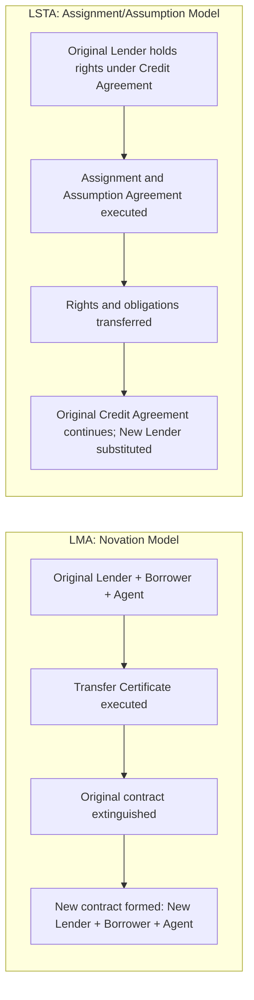

## LMA versus LSTA Documentation Standards

### Overview

The **Loan Market Association (LMA)** and the **Loan Syndications and Trading Association (LSTA)** are the two principal trade bodies producing standardized documentation for the syndicated loan market — the LMA primarily serving the European, Middle Eastern, and broader international market, and the LSTA serving the U.S. market. While both organizations pursue the same underlying goal (reducing negotiation friction and transaction costs through standardized templates), their documentation reflects different legal traditions, market conventions, and historical development paths. Understanding the divergence between the two frameworks is essential for any practitioner working on cross-border syndications or comparing credit agreement terms across jurisdictions.

### Organizational Scope and History

| Dimension | LMA | LSTA |
| --- | --- | --- |
| Primary jurisdiction | UK/Europe (English law-governed documents), also used across EMEA and adapted for other regions | United States (New York law-governed documents) |
| Founded | 1996 | 1995 |
| Governing law convention | English law | New York law |
| Membership base | Banks, institutional investors, law firms across Europe and internationally | Banks, institutional investors, law firms, primarily U.S.-focused |
| Primary document types | Investment grade, leveraged/developing markets, real estate finance, export finance, trading documentation | Investment grade, leveraged loan, distressed trading documentation, par/near-par trading documentation |

**Key Points**

- Some jurisdictions and deal types use LMA-style documentation adapted for local law (e.g., certain Asia-Pacific markets reference LMA-based precedents even outside England), meaning "LMA documentation" is sometimes used loosely to refer to English-law-style drafting conventions generally, not literally an LMA-published template.
- [Inference] The parallel founding dates and broadly similar missions of both associations likely reflect a common industry recognition in the mid-1990s that the growing scale of syndicated lending required standardized documentation to reduce transaction costs — a recognition that occurred roughly simultaneously on both sides of the Atlantic as loan syndication volumes grew.

### Governing Law and Legal Tradition Differences

The single most consequential distinction is the underlying legal system, which shapes drafting philosophy throughout:

- **English law (LMA)**: Common law tradition with strong reliance on the literal wording of the contract; courts are generally reluctant to imply terms not expressly stated, meaning LMA documents tend toward highly explicit, exhaustively defined provisions.
- **New York law (LSTA)**: Also common law, but with different doctrinal treatment of certain concepts (e.g., good faith obligations, remedies for breach, treatment of "material adverse change" clauses), and different bankruptcy law context — most significantly, US Chapter 11 concepts (automatic stay, cramdown, DIP financing structures) are baked into how LSTA-based credit agreements approach default and enforcement provisions, since American borrowers default into a specific well-developed bankruptcy regime.

### Key Structural and Terminology Differences

| Concept | LMA Convention | LSTA Convention |
| --- | --- | --- |
| Primary agreement name | "Facility Agreement" or "Facilities Agreement" | "Credit Agreement" |
| Lead arranger term | "Mandated Lead Arranger" (MLA) | "Arranger" / "Lead Arranger" |
| Agent terminology | "Agent" or "Facility Agent" | "Administrative Agent" |
| Default terminology | "Event of Default" (largely aligned) | "Event of Default" (largely aligned) |
| Financial covenant style | Historically more common to include maintenance covenants even in leveraged deals, though convergence with cov-lite has increased | Cov-lite (incurrence-only covenants) became market standard earlier and more broadly in the U.S. leveraged market |
| MAC/MAE clause treatment | Material Adverse Change clauses drafted with reference to English case law interpretation | Material Adverse Effect clauses interpreted against a body of Delaware/NY case law (e.g., the *IBP v. Tyson* line of reasoning on MAC clause invocation) |
| Yield protection / increased costs | Broadly similar concept, drafted differently | Broadly similar concept, drafted differently |
| Transfer mechanics | Novation-based, reflecting English law's approach to assignment | Assignment and assumption agreement, reflecting NY law's approach to assignment/participation |

**Key Points**

- [Inference] Cov-lite structures likely became entrenched earlier and more broadly in the U.S. leveraged loan market than in Europe due to the earlier and larger scale of institutional investor (CLO) participation in the U.S. market, which reduced reliance on maintenance covenants that were historically more valued by traditional relationship banks; the European leveraged market has substantially converged toward cov-lite over time but the convergence timeline and current relative prevalence should be verified against current market data given how quickly covenant practice evolves.

### Transfer Mechanics: Novation vs. Assignment/Assumption

This is one of the more technically significant divergences:

- **LMA (Novation)**: Under English law, a "transfer" of a loan is typically structured as a novation — the existing contract is extinguished and a new contract is created between the remaining lender(s), the borrower, and the new lender, with the new lender's obligations and rights arising fresh. This is formalized via a **Transfer Certificate**.
- **LSTA (Assignment and Assumption)**: The buyer takes an assignment of the seller's rights and an assumption of its obligations under the existing credit agreement via an **Assignment and Assumption Agreement**, without technically extinguishing and recreating the underlying contract.

**Example**

A European leveraged loan syndicated under LMA-style documentation is sold by Bank A to Fund B. The transaction is documented via a Transfer Certificate, technically creating a new set of contractual obligations between Fund B, the borrower, and the facility agent, replacing the prior arrangement with Bank A — even though commercially nothing about the loan terms has changed. A comparable U.S. term loan B sold by Bank A to Fund B under LSTA-style documentation is instead documented via an Assignment and Assumption Agreement, under which the original credit agreement remains in force and Fund B simply steps into Bank A's contractual position.

### Secondary Trading Documentation

Both associations publish secondary trading documentation, with broadly parallel but distinctly drafted concepts:

- **Par vs. distressed trade classification**: Both LMA and LSTA distinguish par/near-par trading (standardized, lighter representations) from distressed trading (enhanced due diligence representations, "big boy" acknowledgments, longer settlement windows) — the conceptual framework covered in secondary loan trading is broadly parallel across both markets, though specific documentation forms differ.
- **Settlement timelines**: Standard settlement conventions (T+7 for par, extended timelines for distressed) exist in both markets, though the specific market-standard day counts and delayed compensation mechanics are documented separately by each association and should be checked against current published guidelines, as these are periodically revised.
- **Confidentiality and information-sharing provisions**: Both frameworks address the treatment of confidential borrower information in secondary trading, but with different default assumptions about permitted disclosure to prospective purchasers, reflecting differences in each jurisdiction's approach to confidentiality obligations.

### Cross-Border and Convergence Considerations

- **Deals with cross-border syndicates**: A single leveraged buyout with both European and U.S.-based lenders may require careful drafting to bridge LMA and LSTA conventions, particularly around governing law choice, transfer mechanics, and tax gross-up provisions (given different withholding tax regimes).
- **"LMA-based, NY-law" hybrid documents**: Some deals use LMA-style structural conventions but layer in New York law governing provisions where the primary lender base or borrower jurisdiction favors it, creating hybrid documentation that requires careful reconciliation of terminology.
- **Convergence trends**: Market practice between the two frameworks has converged over time on many substantive points (cov-lite adoption, incremental facility/accordion mechanics, sustainability-linked loan provisions), even where specific drafting language and defined terms remain distinct.
- [Unverified] The precise current degree of substantive convergence versus continued divergence across specific covenant and provision types is a moving target subject to ongoing market evolution; practitioners should consult current LMA and LSTA published guidance and recent precedent documents rather than relying on a static comparison.

### Practical Implications for Practitioners

- **Due diligence checklists differ by jurisdiction**: A lawyer or credit analyst trained primarily on LSTA-style credit agreements needs to specifically adjust expectations when reviewing an LMA-style facility agreement, particularly around transfer mechanics, MAC clause interpretation, and covenant defaults tied to English law concepts (e.g., "insolvency" definitions referencing UK Insolvency Act provisions vs. U.S. Bankruptcy Code provisions).
- **Restructuring implications**: Because English law and U.S. bankruptcy law diverge substantially (e.g., UK schemes of arrangement and restructuring plans under the Companies Act 2006/Corporate Insolvency and Governance Act 2020 versus U.S. Chapter 11), the governing law and jurisdiction selected at origination has material downstream consequences if the credit later becomes distressed.
- **Sustainability-linked and ESG-related provisions**: Both LMA and LSTA (along with the Asia Pacific Loan Market Association, APLMA) have published guidance on sustainability-linked loan principles; specific current-form language should be checked against each association's latest published guidance, as this is an actively evolving area of documentation practice.

### Related Topics

- Novation vs. Assignment and Assumption: Legal Mechanics in Detail
- Cov-Lite Structures and Incurrence vs. Maintenance Covenants
- Material Adverse Change (MAC) Clause Interpretation and Case Law
- Cross-Border Syndication and Governing Law Selection
- UK Schemes of Arrangement vs. U.S. Chapter 11 Restructuring Mechanics
- Sustainability-Linked Loan Principles (LMA/LSTA/APLMA)