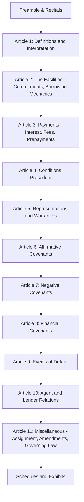
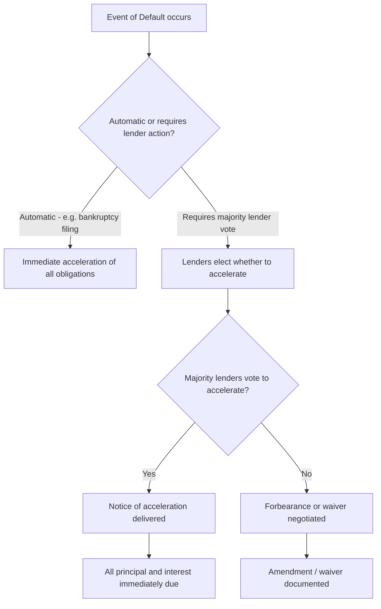

## Credit Agreement Structure and Key Provisions

### Overview

The credit agreement (or facility agreement, in LMA-style terminology) is the master contract governing a syndicated loan transaction. It defines the mechanics of borrowing and repayment, the rights and obligations of borrower and lenders, the covenant package constraining borrower behavior, and the remedies available upon default. A leveraged loan credit agreement for a mid-market or large-cap sponsor-backed deal commonly runs 150-300+ pages, reflecting the complexity of modern facility structures, extensive defined terms, and heavily negotiated covenant baskets. This document walks through the standard architecture and the most heavily negotiated provisions.

### Standard Document Architecture

**Key Points**

- Article numbering and exact structure vary by law firm precedent and deal type, but the sequence above reflects near-universal market convention across both LMA and LSTA-style documents.
- The definitions article is disproportionately important in modern leveraged loan agreements — many of the most consequential negotiated terms (e.g., "EBITDA," "Unrestricted Subsidiary," "Permitted Investments") are defined provisions that function as substantive covenant flexibility, not mere glossary entries.

### Section 1: Definitions and Interpretation

Modern credit agreements, particularly cov-lite leveraged facilities, concentrate enormous substantive weight in the definitions section:

- **EBITDA definition**: The add-backs and adjustments permitted in calculating EBITDA (for covenant compliance purposes) directly determine how much operational flexibility the borrower retains; "adjusted EBITDA" definitions with aggressive add-backs (projected cost synergies, restructuring charges, stock-based compensation) have been a persistent area of lender scrutiny.
- **Unrestricted Subsidiary designation**: Defines the borrower's ability to designate subsidiaries as outside the credit group's covenant restrictions, a mechanism at the center of many liability management exercises (LMEs) such as drop-down financings.
- **Permitted Indebtedness / Permitted Liens / Permitted Investments baskets**: Define carve-outs from the general negative covenant prohibitions, often expressed as the greater of a fixed dollar amount or a percentage of EBITDA (a "grower basket").

$$\text{Basket Capacity} = \max(\text{Fixed Dollar Amount}, \, X\% \times \text{EBITDA})$$

**Example**

A credit agreement might define a general debt basket as "the greater of $50 million and 25% of Consolidated EBITDA." If the company's EBITDA grows from $150M to $250M over the facility's life, the basket capacity grows from $50M (the fixed floor, since 25% of $150M = $37.5M is lower) to $62.5M (since 25% of $250M now exceeds the $50M floor) — meaning covenant flexibility increases automatically with company performance, without requiring lender consent to amend.

### Section 2: The Facilities

Describes the specific credit facilities being made available:

- **Term Loan A (TLA)**: Typically amortizing, often held by banks, shorter tenor, priced tighter.
- **Term Loan B (TLB)**: Institutional tranche, minimal amortization (typically 1%/year), held predominantly by CLOs and loan funds, priced wider than TLA.
- **Revolving Credit Facility (RCF)**: Committed but undrawn facility for working capital needs, subject to commitment fees on undrawn amounts.
- **Delayed-draw term loans (DDTL)**: Committed facilities drawable over a specified period, often used for pre-committed acquisition financing.
- **Incremental facilities / accordion**: Pre-negotiated mechanism allowing the borrower to raise additional debt (subject to conditions, often an incurrence-based leverage test or a "free and clear" basket) without requiring a full amendment process.

### Section 3: Interest, Fees, and Payment Mechanics

- **Interest rate benchmark**: Historically LIBOR-based; post-LIBOR transition, predominantly **Term SOFR** (Secured Overnight Financing Rate) in U.S. dollar facilities, often with a **credit spread adjustment (CSA)** layered on top to approximate historical LIBOR-SOFR basis, plus the negotiated margin/spread.

$$\text{All-In Rate} = \text{Term SOFR} + \text{CSA} + \text{Applicable Margin}$$

- **Original Issue Discount (OID)**: Loan issued below par (e.g., "99" or "98.5"), effectively increasing the lender's yield beyond the stated margin — a key primary syndication pricing lever.
- **Fee structure**: Includes upfront/arrangement fees, commitment fees on undrawn revolver capacity, agency fees, and (in some structures) prepayment/call protection premiums.
- **Call protection / soft call**: Common in institutional term loans as a "101 soft call" — a 1% premium payable if the loan is repriced (not fully repaid) within a specified period (typically 6 months) of closing, protecting lenders against near-term repricing risk without restricting a full refinancing or M&A-driven repayment.

### Section 4: Conditions Precedent

Conditions that must be satisfied before initial (and, for delayed-draw facilities, subsequent) funding:

- **Closing conditions**: Delivery of executed loan documents, legal opinions, officer's certificates, know-your-customer (KYC) documentation, perfection of collateral (UCC filings, mortgages, share pledges).
- **"SunGard" / "certain funds" provisions**: In sponsor-driven acquisition financings, a limited set of conditions (specific performance conditions rather than a broad MAC-out right) protecting the sponsor's ability to complete an announced acquisition even if the target's business deteriorates modestly between signing and closing — a heavily negotiated point balancing lender certainty-of-funds risk against sponsor execution risk.

### Section 5: Representations and Warranties

Standard representations cover corporate existence, authority, no conflicts, financial statement accuracy, litigation disclosure, compliance with law (including sanctions and anti-corruption provisions), and material contracts. These are typically brought down (re-confirmed) at each borrowing date, and a breach of a representation is itself commonly an Event of Default.

### Section 6 & 7: Affirmative and Negative Covenants

| Covenant Type | Examples | Purpose |
| --- | --- | --- |
| Affirmative | Financial reporting, insurance maintenance, compliance with law, maintenance of existence | Obligate the borrower to take specified actions |
| Negative | Restrictions on debt, liens, investments, dividends/restricted payments, asset sales, mergers, transactions with affiliates | Prohibit the borrower from taking specified actions absent basket capacity or lender consent |

**Key Points**

- **Restricted payments (dividend) baskets** are among the most negotiated negative covenants, since they govern the sponsor's ability to extract cash (dividends, management fees) from the company — directly affecting lender recovery prospects in a downside scenario.
- **Asset sale covenants** typically require that sale proceeds either be reinvested within a specified period or used to prepay debt, though negotiated exceptions (including the ability to reinvest in "similar business" assets broadly defined) have expanded considerably in borrower-friendly market conditions.

### Section 8: Financial Covenants — Maintenance vs. Incurrence

- **Maintenance covenants**: Tested every quarter regardless of borrower action (e.g., "Total Net Leverage Ratio shall not exceed 6.00x as of the last day of each fiscal quarter"), providing lenders an ongoing early-warning mechanism and a trigger for renegotiation even absent a payment default.
- **Incurrence covenants** ("cov-lite"): Only tested when the borrower takes a specific action (incurring debt, making a restricted payment, etc.), meaning a deteriorating credit can breach leverage thresholds without triggering an automatic default, so long as it takes no covenant-triggering action.
- **Springing covenants**: A hybrid structure common in revolver-only facilities — a maintenance leverage covenant applies only when revolver utilization exceeds a specified threshold (e.g., 35-40% drawn), giving lenders protection only when their actual exposure is meaningful.

**Key Points**

- The shift from maintenance-covenant-heavy structures to cov-lite has been one of the most significant multi-decade developments in leveraged loan documentation, driven substantially by the growth of CLOs and institutional investors relative to traditional relationship banks (see comparative discussion under LMA vs. LSTA documentation standards).

### Section 9: Events of Default

Standard categories include:

- **Payment default**: Failure to pay principal or interest when due (often with a short grace period for interest).
- **Covenant default**: Breach of an affirmative or negative covenant, sometimes with a cure period for certain covenants.
- **Cross-default / cross-acceleration**: Default under other material indebtedness, calibrated by threshold amount to avoid triggering acceleration for immaterial defaults elsewhere in the capital structure.
- **Insolvency/bankruptcy events**: Voluntary or involuntary bankruptcy filing, typically triggering automatic acceleration without requiring lender action (an "automatic" Event of Default, distinct from most other categories which require lender election).
- **Change of control**: Triggers a mandatory offer to prepay (in bond documentation) or an Event of Default (more common in loan documentation), protecting lenders against an unanticipated change in sponsor/ownership.
- **Material adverse effect (MAE) cross-reference**: Some agreements include ongoing MAE-based defaults, though this is less common as a standalone default trigger in modern cov-lite structures than as a closing condition.

### Section 10: Agent and Lender Relations

- **Administrative agent role**: Acts as the operational point of contact between borrower and lenders, administers payments, collateral, and notices, but generally owes limited fiduciary duties to lenders (a heavily negotiated and litigated point, particularly regarding agent liability in liability management exercises).
- **Voting thresholds**: Distinguishes matters requiring "Required Lenders" (typically a simple majority or 50.1%+ of commitments), from matters requiring unanimous or "affected lender" consent — commonly termed **sacred rights** (reductions to principal/interest, extensions of maturity, releases of all/substantially all collateral). Sacred rights provisions have been heavily renegotiated and tightened following high-profile LME litigation (see prior chapter discussion of uptiering and drop-down transactions).
- **Yield protection / increased costs / breakage provisions**: Protect lenders against regulatory capital changes, withholding tax changes, and funding cost mismatches.

### Section 11: Miscellaneous Provisions

- **Assignment and participation mechanics**: Governs how lenders may transfer their interests (see the detailed discussion under LMA vs. LSTA documentation standards for jurisdictional variation).
- **Amendment provisions**: Specifies voting thresholds for different amendment types, and increasingly includes anti-layering and "open market purchase" restrictions designed to prevent unilateral priming transactions by a subset of lenders.
- **Governing law and jurisdiction**: New York law dominates the U.S. leveraged loan market; English law dominates the European market, with material downstream consequences for restructuring mechanics.
- **Confidentiality provisions**: Govern permitted disclosure of borrower information to prospective assignees, participants, and regulators.

### Related Topics

- EBITDA Add-Back Negotiation and "Adjusted EBITDA" Practice
- Incremental Facilities, Accordion, and Incurrence-Based Debt Capacity
- SOFR Transition and Credit Spread Adjustment Mechanics
- Sacred Rights Provisions and Anti-Layering Protections
- Cov-Lite vs. Maintenance Covenant Structures
- Certain Funds Provisions in Acquisition Financing
- Restricted Payment Baskets and Dividend Recapitalization Mechanics