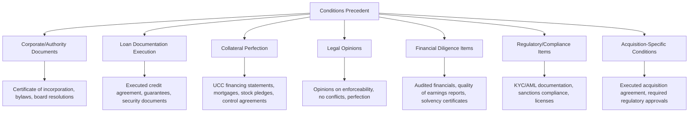
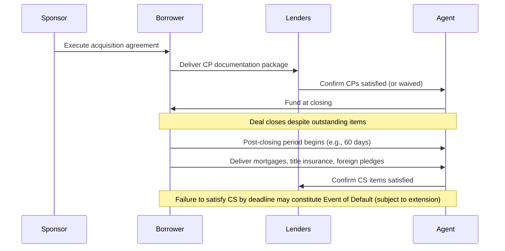

## Conditions Precedent and Conditions Subsequent

### Overview

Conditions precedent (CPs) and conditions subsequent (CSs) are the mechanisms by which a credit agreement governs the timing of lender obligations relative to borrower and third-party actions. Conditions precedent are requirements that must be satisfied **before** a lender is obligated to fund, while conditions subsequent are requirements the borrower agrees to satisfy **after** funding, typically within a specified post-closing period. This distinction — funding now with a promise to complete certain items later — has become a central execution tool in modern leveraged finance, allowing deals to close on tight M&A timelines without waiting for every administrative or perfection step to be finished.

### Conditions Precedent: Core Categories

#### Corporate and Authority Documents

Confirms the borrower and guarantors have the legal capacity and internal authorization to enter into the facility:

- Certificates of incorporation/formation and organizational documents (bylaws, operating agreements).
- Board resolutions or written consents authorizing the transaction.
- Incumbency certificates confirming the authority of signing officers.
- Good standing certificates from relevant jurisdictions of organization.

#### Loan Documentation Execution

- Fully executed credit agreement, guarantee agreements (from subsidiary guarantors), and intercreditor agreements (where multiple debt tranches or lien priorities exist).
- Security/pledge agreements creating the collateral package.
- Officer's certificates confirming accuracy of representations as of the closing date.

#### Collateral Perfection Requirements

- **UCC-1 financing statements** (U.S.) filed in appropriate jurisdictions to perfect security interests in personal property.
- **Mortgages/deeds of trust** for real property collateral, often requiring title insurance and surveys.
- **Control agreements** over deposit and securities accounts, required for perfection of security interests in those asset types under Article 9 of the UCC.
- **Stock/equity pledges** with delivery of original share certificates and executed stock powers (for certificated securities) — this specific requirement is frequently the subject of a "post-closing" carve-out, discussed below.

#### Legal Opinions

Outside counsel opinions confirming enforceability of the loan documents, absence of conflicts with other material agreements, due authorization, and (frequently) perfection of security interests — though perfection opinions are increasingly qualified or deferred given the administrative complexity of confirming perfection across multiple jurisdictions and asset types at closing.

#### Financial and Diligence Items

- Historical audited financial statements and, in sponsor-driven deals, **quality of earnings (QoE) reports** prepared by an accounting firm.
- **Solvency certificates**: An officer or third-party valuation firm certification that the borrower will be solvent, adequately capitalized, and able to pay debts as they come due immediately after the transaction — a critical protection against future fraudulent conveyance challenges to the loan in a subsequent bankruptcy.
- Pro forma financial projections demonstrating covenant compliance at closing.

#### Regulatory and Compliance Items

- **KYC/AML documentation**: Beneficial ownership certifications and related compliance documentation required under applicable anti-money laundering regulations.
- **Sanctions compliance representations**: Confirmation that no borrower, guarantor, or beneficial owner is a sanctioned person or located in a sanctioned jurisdiction.
- Required governmental/regulatory approvals or third-party consents specific to the borrower's industry (e.g., healthcare licensure, telecom regulatory approvals).

### Conditions Precedent in Acquisition Financing: The "Certain Funds" Concept

In sponsor-driven leveraged buyouts, a critical negotiated feature is limiting the lenders' ability to walk away from funding between signing the debt commitment letter and the closing of the underlying acquisition. This is addressed through **certain funds provisions** (sometimes called "SunGard conditions," after a widely referenced precedent transaction):

- **Limited condition structure**: The lenders' funding obligation is conditioned on a narrow, specifically enumerated list of conditions (specific performance conditions relating to the acquisition agreement, absence of a specified Material Adverse Effect as defined and interpreted per the acquisition agreement itself, and a small set of "specified representations"), rather than a broad, freely-interpretable MAC-out or general representation bring-down.
- **Purpose**: Provides the sponsor certainty of financing when competing for an acquisition in an auction process, since sellers require confidence that the buyer's financing will not evaporate due to an unrelated, minor issue discovered between signing and closing.
- **Lender risk**: Lenders bear increased execution risk under this structure, since their ability to refuse funding based on developments at the target company (short of a specifically-defined MAE) is contractually limited — a risk lenders price into the underwriting economics and term sheet during syndication.

**Key Points**

- [Inference] The certain funds structure likely became standard market practice in competitive sponsor-led M&A processes specifically because sellers would otherwise discount or reject bids backed by financing containing broad walk-away rights, making certain funds terms a competitive necessity for sponsors rather than a lender-favorable default position.

### Conditions Subsequent (Post-Closing Undertakings)

Conditions subsequent allow closing to occur on schedule while deferring administratively burdensome or time-consuming items to a post-closing period, typically 30, 60, or 90 days after closing (sometimes longer for specific items, subject to good-faith extension).

#### Common Conditions Subsequent Items

| Item | Typical Post-Closing Period | Rationale for Deferral |
| --- | --- | --- |
| Real property mortgages / title insurance | 60-90 days | Title searches, surveys, and local recording processes are time-intensive and jurisdiction-dependent |
| Landlord/bailee waivers | 60-90 days | Requires negotiation with third parties not party to the financing |
| Foreign subsidiary stock pledges | 90-120 days | Local law requirements for perfecting pledges over foreign equity can be complex and jurisdiction-specific |
| Control agreements over deposit/securities accounts | 60-90 days | Requires coordination with account banks, who may not prioritize execution on the borrower's closing timeline |
| Delivery of insurance certificates naming lenders as loss payee | 30-60 days | Insurance broker processing time |
| Post-closing organizational restructuring (e.g., guarantor additions) | Varies | May depend on completion of related corporate reorganization steps |

**Key Points**

- The rationale for deferring these items to conditions subsequent is almost always administrative or third-party-dependent timing, not a substantive negotiated concession — lenders generally still expect full compliance, just on a delayed timeline.
- Failure to satisfy a condition subsequent by its deadline is typically structured as an Event of Default (subject to good-faith extension provisions, often requiring lender consent not to be unreasonably withheld), giving lenders meaningful leverage to ensure follow-through even though funding has already occurred.

### Conditions Precedent vs. Conditions Subsequent: Comparative Framework

| Dimension | Conditions Precedent | Conditions Subsequent |
| --- | --- | --- |
| Timing | Must be satisfied before funding | Satisfied after funding, within a specified period |
| Consequence of non-satisfaction | Lenders not obligated to fund | Typically an Event of Default if deadline missed (subject to extension) |
| Typical content | Core enforceability, authority, and closing-critical items | Administratively complex or third-party-dependent perfection/compliance items |
| Negotiation focus | Scope limitation (especially in certain funds contexts) | Length of post-closing period, extension rights |
| Waiver mechanism | Can be waived by lenders (individually or via required lender vote) at or before closing | Can be extended or waived by lenders (individually or via required lender vote) after closing |

### Waiver Mechanics

Both CPs and CSs can typically be waived, though the practical dynamics differ:

- **CP waivers**: Occur under time pressure at or immediately before closing, when a minor item cannot be finalized in time; the arranger/agent typically has authority (per the credit agreement or commitment letter) to waive non-material CPs without requiring a full lender vote, while material CP waivers may require broader consent.
- **CS extensions**: More routine and less time-pressured, since the deal has already closed; agents commonly grant reasonable extensions for CS items delayed by legitimate administrative circumstances (e.g., a title company backlog), provided the borrower demonstrates good-faith progress.

**Example**

A sponsor acquiring a company with real estate across five jurisdictions needs to close the acquisition on a specific date to meet the purchase agreement's outside date. Obtaining mortgages and title insurance across all five properties before closing is impractical within the timeline. The credit agreement is structured so that the loan funds at closing based on satisfied CPs (corporate documents, UCC filings on personal property, executed guarantees), while the mortgages become conditions subsequent due within 90 days. If, after 90 days, two mortgages remain outstanding due to a slow title company in one jurisdiction, the borrower would typically request (and reasonably expect to receive) an extension from the agent, provided it can demonstrate the delay is administrative rather than a sign of broader non-compliance.

### Practical Risk Considerations

- **Perfection gap risk**: Between closing and CS satisfaction, lenders may have an unperfected or partially perfected security interest in certain collateral, creating a window of exposure if the borrower were to file for bankruptcy or a competing creditor were to perfect a claim during that gap.
- **Bring-down of representations**: CPs typically require representations to be true and correct (in all material respects, or in all respects for certain "specified representations" in a certain funds context) as of the closing date — the scope of this bring-down is itself heavily negotiated.
- [Unverified] Specific market-standard post-closing periods (30/60/90/120 days) vary by deal type, jurisdiction, and negotiating leverage, and should be verified against current precedent transactions rather than treated as fixed industry standards, since these periods are a function of negotiation rather than a codified rule.

### Related Topics

- Certain Funds Provisions and Limited Condition Acquisition Financing
- Collateral Perfection Mechanics under UCC Article 9
- Solvency Certificates and Fraudulent Conveyance Risk
- Material Adverse Effect (MAE) Clause Drafting and Interpretation
- Intercreditor Agreements and Lien Priority Structuring
- KYC/AML and Sanctions Compliance in Loan Documentation