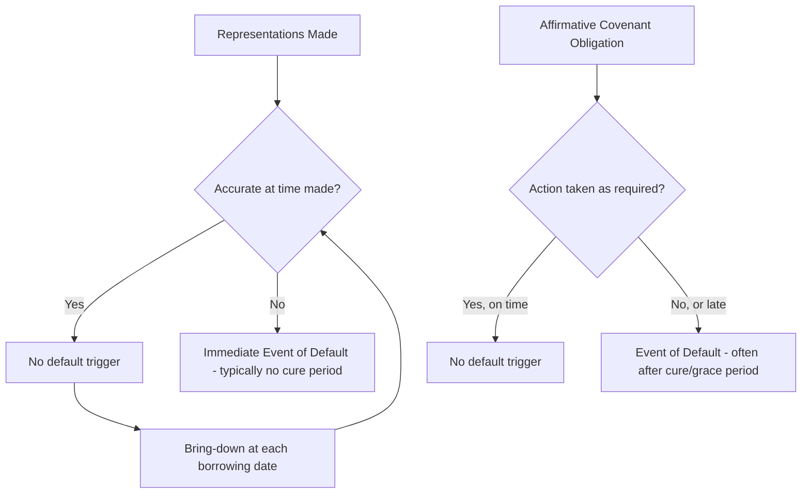
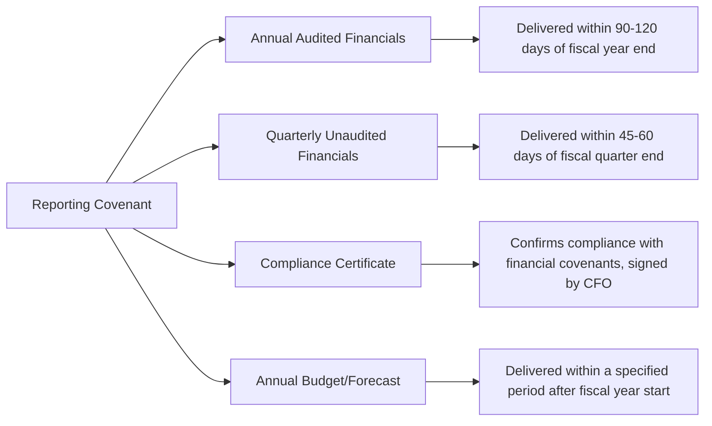

## Representations, Warranties, and Affirmative Covenants

### Overview

Representations and warranties, and affirmative covenants, are distinct but related contractual mechanisms in a credit agreement that allocate risk and information asymmetry between borrower and lenders. **Representations and warranties** are statements of fact made at a point in time (typically closing, and "brought down" — re-confirmed — at each subsequent borrowing), while **affirmative covenants** are ongoing promises to take specified future actions throughout the life of the facility. Both categories serve overlapping but distinct functions: representations primarily address information the lender relied upon in its initial credit decision, while affirmative covenants address the borrower's ongoing conduct and transparency obligations.

### Representations and Warranties: Purpose and Legal Effect

A representation that proves untrue when made (or when brought down) typically constitutes an immediate Event of Default, giving lenders an exit or renegotiation trigger distinct from a covenant breach, which often carries grace or cure periods. This distinction matters significantly in practice — misrepresentation claims can sometimes be pursued even after a facility has otherwise been performing, since they relate to the accuracy of information at a specific past date rather than ongoing conduct.

### Standard Categories of Representations and Warranties

| Category | Content | Risk Addressed |
| --- | --- | --- |
| Organization and authority | Valid existence, good standing, corporate power to enter agreement | Legal capacity risk |
| No conflicts / no violation | Transaction doesn't breach charter documents, other material contracts, or law | Enforceability risk |
| Due authorization / enforceability | Agreement properly authorized and constitutes valid, binding, enforceable obligation | Contract validity risk |
| Financial statements | Historical financials fairly present financial condition in accordance with GAAP/IFRS | Credit analysis reliability |
| No material adverse change | No MAC/MAE has occurred since a specified reference date | Ongoing creditworthiness |
| Litigation | Disclosure of pending or threatened litigation above a materiality threshold | Contingent liability risk |
| Compliance with law | Compliance with applicable laws, including environmental, labor, and sanctions/AML regulations | Regulatory/legal risk |
| Taxes | Tax returns filed, taxes paid, no material tax disputes | Tax liability risk |
| ERISA / pension | Compliance with pension plan funding and regulatory requirements (U.S.-specific) | Pension underfunding risk |
| Title to properties / collateral | Borrower owns, and where applicable has granted valid liens on, pledged collateral | Collateral value/enforceability risk |
| Intellectual property | Ownership or valid license rights to material IP | Business continuity risk |
| Environmental | No material environmental liabilities or non-compliance | Contingent environmental liability |
| Solvency | Borrower (and, following the transaction, the combined entity) is solvent | Fraudulent conveyance risk |
| Sanctions / anti-corruption | No sanctioned persons involved; compliance with FCPA/UK Bribery Act and equivalent regimes | Regulatory and reputational risk |
| Full disclosure | No material misstatement or omission in information provided to lenders | Overall information reliability |

**Key Points**

- The "full disclosure" representation functions as a catch-all, addressing gaps not captured by the more specific representations above — it is one of the most heavily negotiated provisions since an overly broad formulation can create liability for immaterial omissions.
- Materiality qualifiers ("in all material respects," "except as would not reasonably be expected to have a Material Adverse Effect") are pervasive throughout the representations section and are themselves subject to extensive negotiation, since they determine the practical threshold at which a misstatement becomes actionable.

### Bring-Down Mechanics

Representations are not simply made once at signing — they are re-affirmed at defined trigger points:

- **At closing**: The full representation set must be accurate for funding to occur (a condition precedent).
- **At each subsequent borrowing** (for revolving facilities or delayed-draw term loans): Typically only "specified representations" (a narrower, negotiated subset — organizational existence, authority, enforceability, and a small number of others) must be re-confirmed, rather than the full representation package, particularly in certain funds/limited condition structures common in acquisition financing.
- **Scope negotiation**: Borrowers generally push to narrow the bring-down scope over time (especially post-closing) to reduce the risk that an immaterial factual change blocks a future draw; lenders push to preserve broader bring-down obligations as an ongoing monitoring tool.

**Example**

A revolving credit facility closes with a full set of representations confirmed. Eighteen months later, the borrower wishes to draw on the revolver to fund working capital needs. Rather than re-confirming every representation in the original agreement (including, for instance, detailed environmental representations that would require fresh diligence), the credit agreement requires only the "specified representations" — organizational existence, power and authority, enforceability, and absence of conflicts — to be true at the time of the draw. This allows routine revolver utilization to proceed without triggering a full representation refresh each time, while preserving lenders' protection against a fundamental change in the borrower's legal standing.

### Affirmative Covenants: Purpose and Standard Categories

Affirmative covenants obligate the borrower to take ongoing actions throughout the facility's life, primarily serving transparency, asset-preservation, and administrative functions:

| Covenant | Content | Purpose |
| --- | --- | --- |
| Financial reporting | Delivery of quarterly/annual financials, compliance certificates, budgets | Ongoing credit monitoring |
| Notices of default/litigation | Prompt notification of Events of Default, material litigation, or other specified events | Early warning to lenders |
| Maintenance of existence | Preserve corporate existence and material licenses/permits | Business continuity |
| Payment of taxes | Timely payment of taxes and governmental charges (subject to good-faith contest rights) | Avoid tax liens competing with lender collateral |
| Maintenance of insurance | Maintain adequate insurance coverage, with lender named as loss payee/additional insured | Collateral value preservation |
| Maintenance of properties | Keep material properties in good working order | Collateral value preservation |
| Compliance with laws | Ongoing compliance with applicable laws and regulations | Regulatory risk mitigation |
| Books and records / inspection rights | Maintain adequate books and records; permit lender inspection and audits | Ongoing monitoring capability |
| Further assurances | Execute additional documents needed to perfect or maintain the security interest | Collateral perfection maintenance |
| Use of proceeds | Confirm proceeds used only for stated permitted purposes | Prevent diversion of loan proceeds |
| Additional guarantors/collateral | Obligation to add new material subsidiaries as guarantors/pledge new collateral | Maintain collateral coverage as the business grows |
| ERISA compliance | Ongoing compliance with pension funding obligations | Pension underfunding risk |

**Key Points**

- The "additional guarantors/collateral" covenant (sometimes called an "after-acquired property" or "springing guarantor" provision) is particularly significant in acquisitive businesses, since it ensures the collateral package and guarantor pool grow in step with the business rather than becoming stale over the facility's life.
- Financial reporting covenants typically specify not just the frequency and content of reports, but the required delivery method (e.g., electronic delivery via a designated platform) and any "deemed delivery" provisions (e.g., public filing with the SEC satisfying the delivery requirement for public borrowers).

### Financial Reporting Covenant Detail

- **Compliance certificates** are the mechanism through which maintenance covenant compliance (where applicable) is formally demonstrated, typically requiring a covenant compliance calculation (e.g., the leverage ratio calculation) certified by a financial officer alongside the periodic financial statements.
- **"Deemed compliance" / public filer exceptions**: Borrowers subject to SEC reporting requirements often negotiate that their public 10-K/10-Q filings satisfy the delivery requirement, avoiding duplicative reporting.

### Interaction Between Representations and Affirmative Covenants

While conceptually distinct, the two categories overlap and reinforce each other in practice:

- A representation that "no litigation exists that would reasonably be expected to have a Material Adverse Effect" is reinforced by an affirmative covenant requiring **prompt notice of new material litigation** — the representation addresses the historical snapshot, while the covenant addresses forward-looking disclosure.
- The **insurance representation** (confirming adequate coverage exists at closing) is reinforced by the **insurance maintenance covenant** (requiring the borrower to keep that coverage in place going forward).
- [Inference] This structural pairing likely reflects a deliberate drafting philosophy: representations establish the baseline factual premise on which the credit decision was made, while affirmative covenants ensure that premise doesn't silently erode over the life of a multi-year facility without lender visibility.

### Negotiation Dynamics and Market Trends

- **Materiality scrapes**: A drafting technique where "Material Adverse Effect" qualifiers are removed from individual representations but a single overarching representation states that no exceptions exist which, in the aggregate, would constitute a Material Adverse Effect — shifting from item-by-item materiality assessment to an aggregate assessment, generally viewed as borrower-favorable.
- **Knowledge qualifiers**: Representations increasingly qualified by "to the Borrower's knowledge," narrowing the borrower's exposure to representations about matters outside its actual awareness (e.g., certain third-party or historical matters).
- **Covenant "baskets" tied to reporting**: Financial reporting covenants increasingly interact with covenant compliance baskets (e.g., a basket only available if the borrower is in compliance with reporting obligations), linking transparency obligations to substantive covenant flexibility.
- [Unverified] The precise current market balance on scope of bring-down representations, knowledge qualifiers, and materiality scrape prevalence shifts with credit market conditions (borrower-friendly vs. lender-friendly cycles) and should be checked against recent precedent rather than treated as static.

### Related Topics

- Material Adverse Effect (MAE) Clause Drafting and Case Law Interpretation
- Negative Covenants and Basket Mechanics
- Financial Covenants: Maintenance vs. Incurrence Structures
- Solvency Certificates and Fraudulent Conveyance Risk
- Guarantor and Collateral "Springing" Obligations
- Certain Funds Provisions and Specified Representations in Acquisition Financing