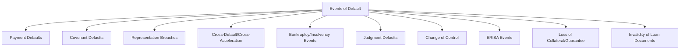
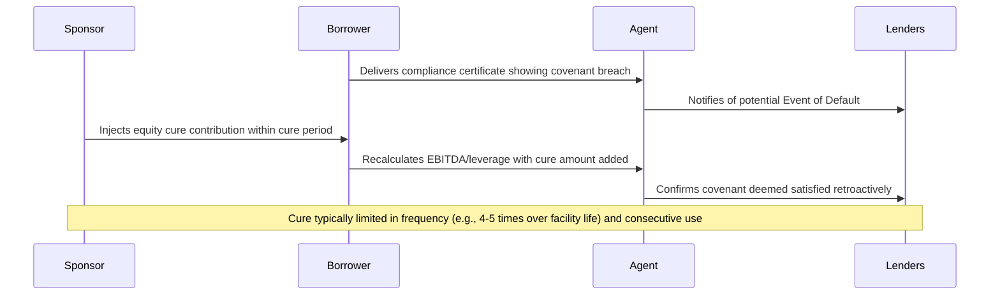
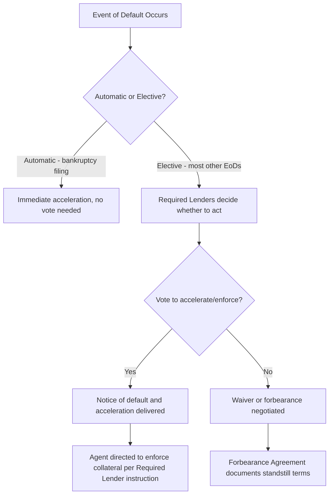

## Events of Default and Lender Remedies

### Overview

The Events of Default provisions and associated remedies section define the consequences of borrower non-compliance under a credit agreement — the mechanism that converts a covenant or payment breach into concrete lender rights. This section is the primary point at which a performing credit relationship can shift into a workout or restructuring dynamic, and its drafting directly determines how much control lenders have, how quickly they can act, and how much room the borrower has to cure a problem before facing acceleration or enforcement.

### Standard Categories of Events of Default

#### Payment Default

Failure to pay principal when due typically triggers immediate default with no grace period, reflecting the fundamental nature of the payment obligation. Failure to pay interest or fees is commonly subject to a short grace period (often 3-5 business days), acknowledging that administrative or mechanical payment failures are more likely than a genuine unwillingness or inability to pay.

#### Covenant Default

- **Financial covenant breach** (where maintenance covenants apply): Typically has no grace period once officially tested and confirmed via the compliance certificate, though the borrower may negotiate an "equity cure" right (discussed below).
- **Negative covenant breach**: Often has no cure period, given that many negative covenants (debt incurrence limits, lien restrictions) are binary — either the prohibited action occurred or it did not.
- **Affirmative covenant breach**: Frequently subject to a cure period (commonly 30 days, sometimes longer for less time-sensitive obligations like delivery of financial statements), reflecting the more administrative/ministerial nature of many affirmative obligations.

#### Representation Breach

A representation proving materially incorrect when made or brought down is typically an immediate Event of Default without a cure period, since (unlike an affirmative covenant) there is no future action the borrower can take to "cure" a factual misstatement about a past or present state of affairs — see the discussion of representations bring-down mechanics for detail.

#### Cross-Default and Cross-Acceleration

- **Cross-default**: A default under other material indebtedness (above a negotiated dollar threshold) constitutes an Event of Default under this facility, even absent acceleration of the other debt.
- **Cross-acceleration**: A narrower formulation — only an actual acceleration (not merely a default) of other material indebtedness triggers the Event of Default under this facility.

$$\text{Cross-Default Threshold} = \text{Negotiated Dollar Amount, calibrated to avoid immaterial trigger events}$$

**Key Points**

- Cross-acceleration is generally more borrower-friendly than cross-default, since it requires the other creditor to have taken affirmative action (acceleration) rather than merely for a default condition to exist, reducing the risk of a technical, unenforced default elsewhere in the capital structure cascading into this facility.
- The dollar threshold calibration is important: setting it too low risks triggering cross-default from immaterial disputes (e.g., a small trade payable dispute), while setting it too high could allow a genuinely material default elsewhere in the capital structure to go unaddressed under this facility.

#### Bankruptcy and Insolvency Events

- **Voluntary bankruptcy filing**: Typically an automatic Event of Default (no lender election required), immediately accelerating all obligations — though the practical effect of acceleration is often superseded by the automatic stay under Chapter 11 (U.S.) or equivalent insolvency moratoria in other jurisdictions.
- **Involuntary bankruptcy petition**: Often becomes an automatic Event of Default only if not dismissed within a specified period (e.g., 60 days), giving the borrower a window to contest a potentially abusive or unfounded involuntary filing before triggering default consequences.
- **Other insolvency indicia**: Appointment of a receiver, general assignment for benefit of creditors, and similar events under applicable insolvency law regimes (which vary significantly between English law, New York law, and other jurisdictions, per the LMA/LSTA documentation comparison).

#### Change of Control

Triggers an Event of Default (in loan documentation) or a mandatory repurchase offer (more common in bond indentures) if a specified ownership threshold is breached — protecting lenders against an unanticipated change in sponsor or ownership that may have been central to their original credit assessment.

#### Judgment Defaults

Unsatisfied final judgments above a negotiated threshold (not covered by insurance or adequately bonded/stayed pending appeal) constitute an Event of Default, addressing the risk that unrelated litigation exposure could impair the borrower's ability to service the facility.

### The Equity Cure Mechanism

A significant negotiated feature in sponsor-backed leveraged loans is the **equity cure right**, allowing the sponsor to inject additional equity capital to retroactively cure a financial covenant breach (where maintenance covenants apply):

**Key Points**

- Equity cure rights are typically limited: a maximum number of cures over the life of the facility (commonly 4-5), a limit on consecutive quarterly use (e.g., no more than 2 consecutive quarters), and a requirement that the cure amount be applied dollar-for-dollar to increase EBITDA (or decrease debt) for covenant calculation purposes only, not for any other purpose (e.g., not treated as cash for liquidity covenant purposes).
- [Inference] These limitations likely exist because an unlimited equity cure right would substantially undermine the practical value of a maintenance covenant as an early-warning and negotiating-leverage tool for lenders, since the sponsor could otherwise indefinitely paper over genuine credit deterioration.

### Remedies Following an Event of Default

| Remedy | Description | Typical Trigger Requirement |
| --- | --- | --- |
| Acceleration | Declaring all outstanding principal, accrued interest, and fees immediately due and payable | Majority/Required Lender vote (except automatic acceleration on bankruptcy) |
| Termination of commitments | Ending any further obligation to fund (relevant for revolvers/delayed-draw facilities) | Majority/Required Lender vote |
| Enforcement of collateral | Foreclosure, UCC Article 9 sale, or other collateral enforcement action | Often requires Required Lender direction to the agent |
| Default interest | Increased interest rate (commonly +2% over the applicable rate) applied during continuance of default | Automatic upon Event of Default, per credit agreement terms |
| Setoff rights | Lenders' contractual and common-law right to apply borrower deposits held at that lender against outstanding obligations | Available to individual lenders holding deposits, subject to sharing provisions |
| Specific performance / injunctive relief | Court-ordered compliance with specific covenants | Available in limited circumstances under governing law |

### Forbearance Agreements

Rather than immediately exercising acceleration and enforcement remedies, lenders frequently negotiate a **forbearance agreement** — a temporary standstill under which lenders agree not to exercise remedies for a specified period, subject to conditions:

- **Standstill period**: A defined window (weeks to months) during which lenders refrain from acceleration/enforcement.
- **Forbearance fee**: Compensation paid to lenders for agreeing to forbear, often coupled with a rate increase.
- **Milestones**: Specific borrower obligations during the forbearance period (e.g., engaging a financial advisor, delivering a business plan, pursuing a sale process), non-compliance with which terminates the forbearance early.
- **Reservation of rights**: Explicit lender acknowledgment that entering forbearance does not waive any existing default or right to pursue remedies once the forbearance period expires or milestones are missed.

**Example**

A borrower breaches its leverage covenant following a weak quarter. Rather than immediately accelerating (which would likely force a bankruptcy filing the lenders may not want to trigger given depressed asset values), the Required Lenders agree to a 90-day forbearance, during which the borrower must retain a restructuring advisor within 15 days, deliver a revised business plan within 45 days, and make interest payments on time. If the borrower fails to meet the 45-day milestone, the forbearance automatically terminates, and lenders retain full rights to accelerate and enforce as if the forbearance had never been granted.

### Sharing and Pro Rata Provisions

Multi-lender facilities include mechanisms ensuring that recoveries are shared proportionally among lenders within the same class/tranche, preventing one lender from obtaining an advantage through unilateral action (e.g., exercising setoff rights against deposits it happens to hold):

- **Sharing of payments clause**: A lender that receives a disproportionate payment (through setoff or otherwise) must purchase participations from other lenders to equalize recoveries pro rata.
- **Pro rata treatment covenant**: Generally prohibits payments to individual lenders outside the agreed pro rata sharing mechanism absent Required Lender or full lender consent, a protection increasingly relevant given the liability management exercises (uptiering, non-pro-rata "open market purchases") discussed in the context of creditor-on-creditor conflict.

### Interaction with Intercreditor Arrangements

In multi-tranche capital structures (first lien/second lien, or first lien/mezzanine), an **intercreditor agreement** governs how Events of Default and remedies interact across tranches:

- **Standstill periods**: Junior lienholders are typically restricted from exercising enforcement remedies for a specified period (commonly 90-180 days) after notice of default, allowing senior lenders to control the initial enforcement process.
- **Payment blockage/standstill notices**: Senior lenders (or, in some structures, senior unsecured noteholders relative to subordinated debt) can block payments to junior creditors during a payment default or, for a limited period, during other defaults.
- **Purchase option / "buy-out" rights**: Junior lenders often have a negotiated right to purchase the senior debt at par plus accrued interest following certain trigger events, providing a mechanism to take control of the enforcement process.

### Related Topics

- Forbearance Agreements and Restructuring Support Agreement (RSA) Transition
- Intercreditor Agreements and Standstill Mechanics
- Equity Cure Rights: Negotiation and Limitation Structures
- Pro Rata Sharing Provisions and Anti-Layering Protections
- Fulcrum Security Analysis in Distressed Restructuring
- Automatic Stay and Chapter 11 Interaction with Acceleration Rights