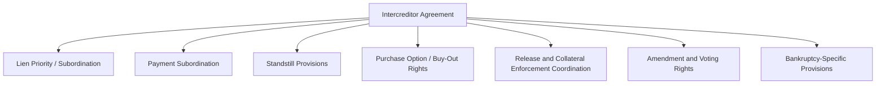
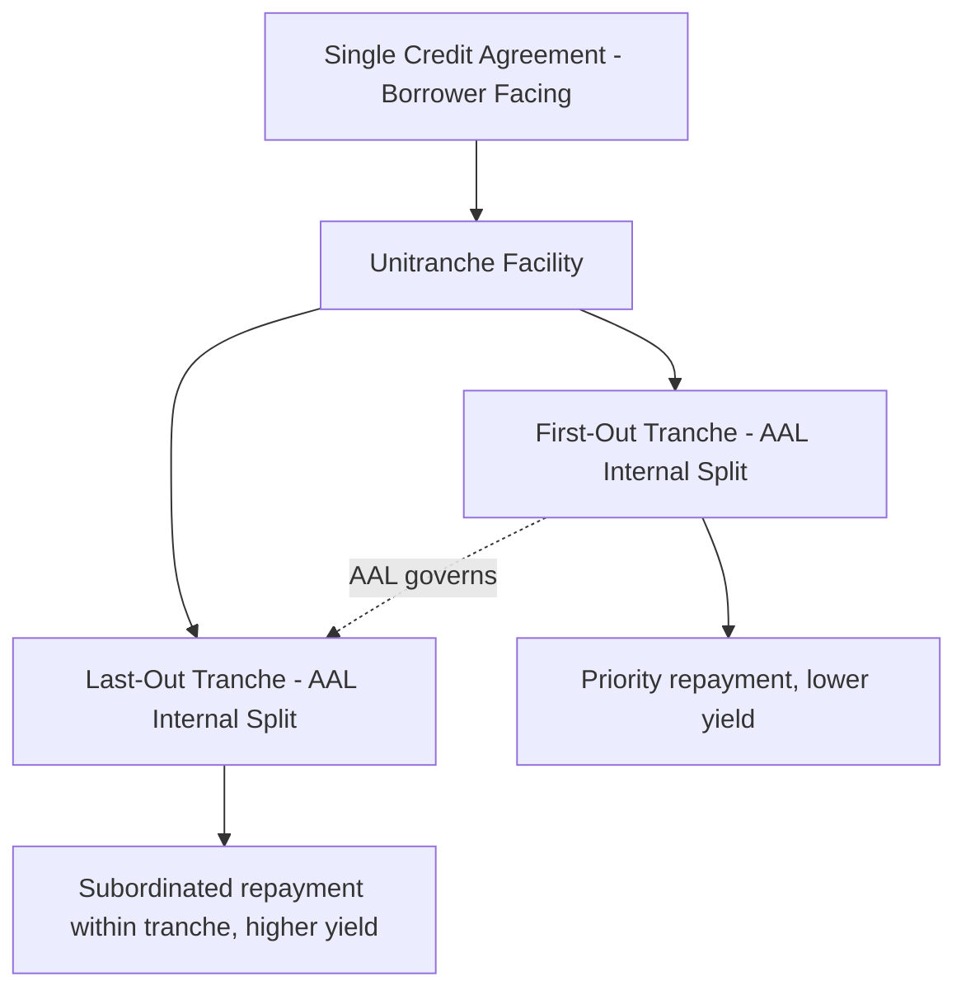

## Intercreditor Agreements and Agreements Among Lenders

### Overview

An intercreditor agreement governs the relative rights, priorities, and permitted actions between two or more classes of creditors holding claims against the same borrower — most commonly first lien and second lien lenders, or secured lenders and unsecured/subordinated noteholders. A closely related but distinct document, the **agreement among lenders (AAL)**, governs the relationship among lenders holding claims of the *same* priority (e.g., between a "first out" and "last out" tranche within a unitranche facility). Both documents exist because a credit agreement alone cannot adequately regulate the relationship between different creditor classes — that relationship requires a separate, specifically-negotiated contract to which the borrower is typically not even a primary party (in the case of a true intercreditor agreement).

### Intercreditor Agreements vs. Agreements Among Lenders

| Dimension | Intercreditor Agreement (ICA) | Agreement Among Lenders (AAL) |
| --- | --- | --- |
| Parties governed | Different priority classes (e.g., first lien vs. second lien; secured vs. unsecured) | Lenders within a single unitranche facility, split into first-out/last-out tranches |
| Borrower's role | Typically acknowledges but is not a primary contracting party | Often not a party at all; purely a lender-side agreement |
| Primary purpose | Establish lien priority, standstill periods, payment subordination | Allocate payment waterfall and control rights within a nominally single tranche |
| Typical trigger for use | Multi-tranche capital structures (first lien/second lien, secured/unsecured) | Unitranche facilities where a single credit agreement masks internal tranching |

**Key Points**

- A unitranche facility is often marketed to the borrower as a single, simplified loan with one set of terms and one administrative agent — the AAL is the mechanism that allows lenders internally to have differentiated economics (first-out gets priority repayment and lower yield; last-out is subordinated within the tranche and earns higher yield) without the borrower needing to negotiate or even see the internal split.

### Core Provisions of an Intercreditor Agreement



#### Lien Priority and Subordination

Establishes which creditor class has first claim to collateral proceeds upon enforcement:

$$\text{Recovery}_{\text{Second Lien}} = \max(0, \, \text{Collateral Proceeds} - \text{Claim}_{\text{First Lien}})$$

- **First lien lenders**: Entitled to collateral proceeds up to the full amount of their claim before second lien lenders receive anything from that collateral.
- **Second lien lenders**: Receive residual proceeds only after first lien claims are satisfied in full, but rank ahead of unsecured creditors.
- **"Silent second" structures**: A second lien lender that has agreed to particularly restrictive standstill and voting limitations, sometimes without even a seat at the negotiating table during enforcement — a more lender-unfriendly (for the second lien holder) variant used when second lien pricing reflects minimal negotiated protection.

#### Payment Subordination

Distinguishes lien subordination (priority in collateral) from payment subordination (priority in cash payments), which can operate independently:

- **Payment blockage/standstill notices**: Senior creditors can typically block payments to subordinated creditors for a specified period (often 179-180 days per payment blockage notice, subject to negotiated limits on frequency and cumulative duration) upon a payment or (in some structures) non-payment default.
- **Turnover provisions**: If a subordinated creditor improperly receives a payment during a blockage period or bankruptcy, it must turn that payment over to the senior creditor.

#### Standstill Provisions

Restrict junior lienholders from independently exercising enforcement remedies for a negotiated period after receiving notice of default, preserving the senior lender's ability to control the initial response to a credit deterioration:

```mermaid
sequenceDiagram
    participant Junior as Junior Lienholder
    participant Senior as Senior Lienholder
    participant Borrower

    Senior->>Junior: Notice of Event of Default delivered
    Note over Junior,Senior: Standstill Period begins (e.g., 90-180 days)
    Junior->>Junior: May not commence enforcement action during standstill
    Senior->>Borrower: Senior lender controls enforcement strategy
    alt Standstill period expires without resolution
        Junior->>Borrower: Junior lienholder may commence own enforcement action
    else Senior commences enforcement
        Senior->>Borrower: Senior enforcement proceeds; junior rights remain subordinate
    end
```

**Key Points**

- Standstill length is one of the most heavily negotiated intercreditor terms — first lien lenders push for longer standstills (more control, more time to manage the process on their preferred timeline), while second lien lenders push for shorter standstills (preserving their own leverage to act if senior lenders are perceived as moving too slowly or in a manner disadvantageous to junior recovery).
- [Inference] The specific standstill length negotiated in a given deal likely reflects the relative bargaining power of the second lien tranche at the time of syndication — a second lien tranche placed with sophisticated distressed-capable investors may negotiate materially shorter standstills than one placed as a smaller, more passive allocation.

#### Purchase Option / Buy-Out Rights

A negotiated right allowing junior lienholders to purchase the senior debt at par plus accrued interest (and sometimes a make-whole premium) following specified trigger events (e.g., acceleration, bankruptcy filing, or expiration of the standstill period):

- **Strategic purpose**: Allows a junior creditor confident in the underlying business's value to take control of the entire capital structure and enforcement process, effectively converting itself into the senior, controlling creditor.
- **Pricing mechanics**: Typically par plus accrued interest and unpaid fees, though the precise formula (including whether it includes prepayment premiums or make-whole amounts) is heavily negotiated.

#### Release Provisions and Enforcement Coordination

Governs what happens to junior liens when senior lenders release collateral (e.g., in connection with an asset sale) or foreclose:

- **Lien release coordination**: Junior liens are typically automatically released upon a senior lender-directed or senior lender-consented sale of collateral in connection with enforcement, ensuring a purchaser receives clean title.
- **Application of sale proceeds**: Specifies the waterfall for applying proceeds from a coordinated or senior-directed sale, generally senior claims first, then junior claims, then any residual to the borrower/equity.

#### Voting and Amendment Rights

- **Which class controls amendments to the credit agreements**: Generally each class votes independently on amendments to its own credit agreement, though the intercreditor agreement itself typically requires consent from both classes (or from senior lenders alone, on certain provisions) to amend.
- **DIP financing consent rights**: A significant modern battleground — intercreditor agreements increasingly specify in advance whether and how junior lienholders can consent to (or object to) priming DIP financing in a subsequent bankruptcy, an issue that has generated substantial litigation where the intercreditor agreement's language was ambiguous or silent.

### Bankruptcy-Specific Provisions

Given that intercreditor agreements are frequently tested precisely when a bankruptcy filing occurs, they typically include specific provisions addressing that scenario directly:

- **DIP financing acknowledgment**: Junior lienholders often pre-agree not to object to a senior lender-proposed DIP financing (including priming liens) up to specified parameters, and to provide only limited objection rights.
- **Adequate protection waivers/limitations**: Junior lienholders may pre-agree to limit their right to seek adequate protection (compensation for the diminution in collateral value during the case) under Bankruptcy Code Section 361 and related provisions, or to subordinate any adequate protection claim to senior lender recoveries.
- **Credit bidding rights**: Addresses whether and how each class can credit bid its claim in a Section 363 sale process, and whether one class's credit bid requires the consent of the other.
- **Plan support/voting provisions**: Some intercreditor agreements include (or are supplemented by separate restructuring support agreements) provisions addressing how each class will vote on a proposed plan of reorganization.

**Key Points**

- [Unverified] The enforceability of specific intercreditor provisions (particularly DIP consent waivers and adequate protection limitations) in bankruptcy has been the subject of contested litigation in various cases, and the degree to which courts will enforce pre-petition intercreditor agreement provisions against a dissenting junior creditor's statutory bankruptcy rights varies by jurisdiction and specific facts; current case law should be checked rather than assumed uniform.

### Agreements Among Lenders (AAL): Unitranche-Specific Mechanics



- **Payment waterfall allocation**: The AAL specifies how payments received under the single credit agreement (interest, principal, prepayments) are allocated between first-out and last-out lenders — first-out lenders generally receive priority on both current interest and principal repayment.
- **Voting control**: The AAL typically grants the first-out tranche (despite often being the smaller dollar amount) disproportionate or controlling voting rights over amendments and enforcement decisions, reflecting their senior economic position.
- **Borrower invisibility**: Because the AAL is a lender-side-only agreement, the borrower typically interacts with a single administrative agent under a single credit agreement, unaware of (or at least not contractually party to) the internal tranching arrangement — a key feature marketed as simplifying the borrower's experience relative to a traditional first lien/second lien structure.

**Example**

A $200M unitranche facility is internally split via an AAL into a $120M first-out tranche (priced at SOFR+450) and an $80M last-out tranche (priced at SOFR+750). The borrower sees a single $200M term loan on its balance sheet and interacts with one lender group under one credit agreement. If the borrower makes a $50M prepayment, the AAL's waterfall provisions direct that payment first to the first-out tranche until it is reduced to a specified threshold (or paid in full, depending on the negotiated waterfall), before any prepayment proceeds reach the last-out tranche — an allocation the borrower is not required to negotiate or even be aware of in detail.

### Practical Considerations for Practitioners

- **Silent vs. active second lien negotiation**: The degree of control and information rights afforded to a second lien class varies enormously by deal — practitioners should not assume a standard "second lien" position without reviewing the specific intercreditor agreement's standstill, voting, and information-sharing provisions.
- **Interaction with the underlying credit agreements**: The intercreditor agreement operates as an overlay contract; provisions in the underlying credit agreements (regarding sacred rights, required lender voting thresholds) must be read consistently with the intercreditor agreement to determine actual practical control in a stress scenario.
- **Amendment coordination risk**: Because senior and junior credit agreements are typically amended independently by their respective lender groups, practitioners must verify that any proposed amendment (e.g., a maturity extension or covenant relief amendment) does not inadvertently conflict with intercreditor agreement provisions requiring cross-class consent for certain changes.

### Related Topics

- Unitranche Financing Structures and First-Out/Last-Out Mechanics
- DIP Financing and Priming Lien Litigation
- Standstill Period Negotiation in Multi-Tranche Capital Structures
- Adequate Protection under Bankruptcy Code Section 361
- Credit Bidding Rights under Section 363(k)
- Silent Second Lien vs. Active Second Lien Structures