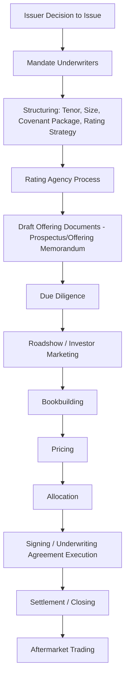
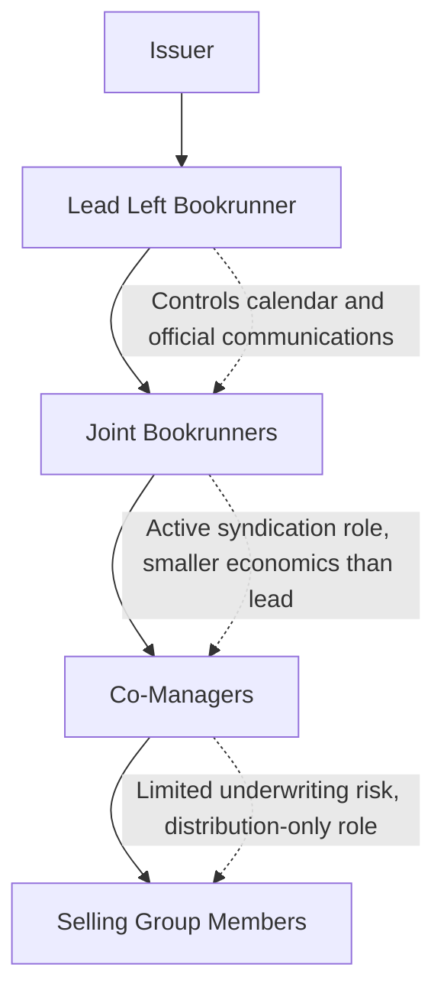

## Bond Issuance Process and Underwriting Syndicate Structure

### Overview

Bond issuance in the capital markets involves a distinct syndicate structure and process compared to syndicated loan origination, reflecting differences between securities offerings (subject to securities law disclosure and liability regimes) and private lending transactions (governed primarily by contract law under a credit agreement). This document covers the end-to-end bond issuance process, the roles within an underwriting syndicate, and the legal underwriting structures that allocate risk among syndicate members.

### The Bond Issuance Process: End-to-End

#### Mandate and Structuring

The issuer selects underwriter(s) — often through a competitive request for proposal (RFP) process for larger issuers, or based on existing relationship banking for smaller/frequent issuers — and works with the lead underwriter(s) to determine:

- **Instrument type**: Investment-grade bond, high-yield bond, convertible bond, or a hybrid structure.
- **Tenor and structure**: Bullet maturity vs. amortizing, fixed vs. floating rate, call protection provisions.
- **Rating strategy**: Whether to seek one, two, or three ratings (from Moody's, S&P, Fitch), since rating agency requirements and typical investor base access depend materially on rating category.
- **Use of proceeds**: Refinancing, acquisition financing, general corporate purposes, or (increasingly) specific-use bonds such as green or sustainability-linked bonds, which carry additional structuring and reporting considerations.

#### Documentation

- **Prospectus (registered offerings)** or **Offering Memorandum (Rule 144A/Regulation S private placements)**: The core disclosure document describing the issuer's business, financial condition, risk factors, and terms of the securities.
- **Indenture**: The governing contract between the issuer and a trustee (acting on behalf of bondholders), analogous in function to a credit agreement but reflecting bond market conventions and the trustee structure unique to public/144A debt.
- **Underwriting Agreement**: The contract between the issuer and the underwriting syndicate, discussed in detail below.

#### Due Diligence

Underwriters (and their counsel) conduct due diligence on the issuer to support the disclosure in the offering document and to establish a "due diligence defense" against potential securities law liability:

- **Business and legal due diligence**: Review of material contracts, litigation, corporate structure, and regulatory compliance.
- **Comfort letters**: Auditors provide comfort letters to underwriters confirming specified financial information in the offering document has been appropriately derived from the audited/reviewed financial statements.
- **Officer and director interviews (due diligence calls)**: Direct questioning of management regarding business risks, recent developments, and forward-looking statements.

### Underwriting Syndicate Roles

| Role | Underwriting Risk | Economics (Fee Share) | Typical Function |
| --- | --- | --- | --- |
| Lead Left Bookrunner | Full underwriting commitment | Largest share of gross spread | Controls documentation, official price talk communications, and overall process |
| Joint Bookrunner(s) | Full underwriting commitment (shared) | Meaningful share, less than lead left | Active syndication, investor solicitation, shares book-running responsibility |
| Co-Manager | Often limited or no underwriting commitment | Smaller, fixed fee share | Distribution support, relationship credit, limited structuring input |
| Selling Group Member | No underwriting commitment | Selling concession only | Pure distribution role, often invited late in the process |

**Key Points**

- "Lead left" refers to the bank listed on the far left of the cover page of the prospectus/offering memorandum — a position carrying prestige (league table credit) as well as the greatest control over deal execution and communications with the market.
- The gap in economics and control between bookrunners and co-managers has widened over time in many markets, with a small number of "active" bookrunners effectively running the process while other syndicate members serve largely for distribution reach and relationship credit.

### Underwriting Structures: Firm Commitment vs. Best Efforts

- **Firm commitment underwriting**: The underwriting syndicate commits to purchase the entire bond issue from the issuer at an agreed price, then resells to investors — the syndicate bears the risk that the securities cannot be resold at the anticipated price, making this the dominant structure for investment-grade and most high-yield bond offerings.
- **Best efforts underwriting**: Underwriters agree only to use best efforts to sell the securities on behalf of the issuer, without committing to purchase unsold securities themselves — more common in certain smaller or riskier offerings, or specific market segments (e.g., some municipal bond and smaller company offerings).

$$\text{Underwriter Risk Exposure} = \begin{cases} \text{Full inventory risk on unsold bonds} & \text{Firm commitment} \\ \text{No inventory risk; agency-only} & \text{Best efforts} \end{cases}$$

### The Underwriting Agreement

The underwriting agreement is the operative legal document allocating risk and responsibility between the issuer and the syndicate, typically executed at or immediately before pricing:

- **Representations and warranties (issuer)**: Analogous in function to credit agreement representations — confirming accuracy of the offering document, absence of material misstatements, corporate authority, and compliance with securities laws.
- **Conditions to closing**: Legal opinions, comfort letters, officer's certificates, and (for rated issuances) confirmation that expected ratings have been received or affirmed.
- **Indemnification provisions**: The issuer typically indemnifies underwriters against liability arising from material misstatements or omissions in the offering document, subject to negotiated carve-outs (e.g., excluding liability for information specifically supplied by the underwriters themselves, such as underwriting-related disclosure).
- **Market-out / termination clause**: Allows underwriters to terminate their obligations if specified disruptive market events occur before closing (e.g., a suspension of trading on a major exchange, a banking moratorium, or an outbreak of war or a comparable calamitous event) — the bond market's analog to a MAC-out, though typically triggered by broad market conditions rather than issuer-specific developments once the underwriting agreement is signed.

**Key Points**

- Unlike loan syndication (where flex provisions allow post-launch term adjustments within pre-agreed parameters), the bond underwriting agreement is typically signed at or very near final pricing, meaning most economic terms are essentially fixed by the time the underwriting agreement is executed — the negotiation and price-discovery process happens largely before this document is signed, in contrast to a loan facility's flex-based approach to post-launch adjustment.

### Bookbuilding and Price Discovery in Bond Offerings

Follows a broadly similar sequence to the loan syndicate desk's process, but with bond-market-specific terminology and mechanics:

- **Initial Price Talk (IPT)**: Often expressed as a spread to a benchmark (e.g., "T+200 area" for a spread to the relevant Treasury benchmark) for investment-grade, or an absolute yield/spread range for high-yield.
- **Official price talk / guidance**: Narrower range published as the book fills, frequently noted as "guidance is tighter than IPT" to signal strong demand.
- **Launch**: Formal announcement of final size and price talk range immediately before pricing, often the point at which the book is considered final for allocation purposes absent late additions.
- **Pricing**: Final coupon/spread set, typically same-day as launch for a well-received offering.

### Investment-Grade vs. High-Yield Bond Syndication Differences

| Dimension | Investment-Grade | High-Yield |
| --- | --- | --- |
| Typical marketing period | Same-day to overnight (accelerated execution common) | Days to ~1-2 weeks, often with a formal roadshow |
| Documentation | Shelf-registered prospectus supplement (frequent issuers) | Offering memorandum, often Rule 144A/Reg S private placement with registration rights |
| Investor base | Insurance companies, pension funds, investment-grade bond funds | High-yield funds, hedge funds, crossover accounts |
| Covenant package | Minimal (investment-grade bonds are typically covenant-light by nature of credit quality) | Extensive negative covenant package similar in spirit to leveraged loan covenants |
| Rating agency involvement | Standard, but less deal-critical to marketing | Often deal-critical; rating level directly affects investor eligibility and pricing |

### Green Shoe / Over-Allotment Considerations in Debt Offerings

While over-allotment options are more strongly associated with equity offerings, some debt transactions include an issuer's option to upsize the offering in response to strong demand:

- **Upsize option**: Not a true greenshoe in the equity stabilization sense, but functions similarly by allowing the issuer to increase deal size in response to an oversubscribed book, subject to underwriter and rating agency considerations regarding total leverage.

### Related Topics

- Indenture Structure and Trustee Duties in Bond Financing
- Rule 144A/Regulation S Private Placement Mechanics
- Comfort Letters and Auditor Due Diligence Procedures
- Market-Out Clauses and Force Majeure in Underwriting Agreements
- High-Yield Bond Covenant Packages vs. Leveraged Loan Covenants
- Rating Agency Methodology and Its Effect on Syndication Strategy