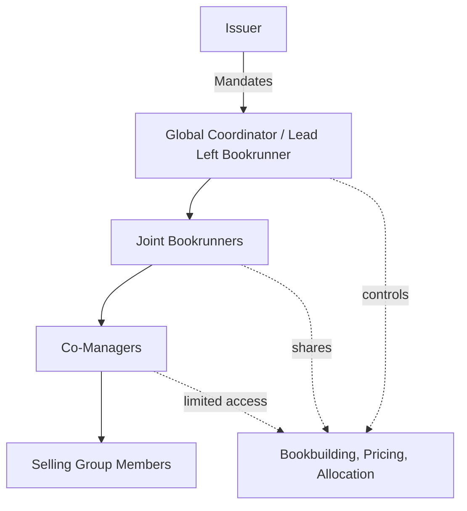

## Lead Manager, Joint Bookrunners, and Co-Managers

### Overview

In a syndicated bond or debt capital markets (DCM) transaction, the underwriting syndicate is structured hierarchically, with roles differentiated by economic entitlement, execution responsibility, and legal liability. The three core tiers — Lead Manager, Joint Bookrunners, and Co-Managers — define who controls the transaction, who bears the greatest risk and reward, and who provides ancillary distribution support. Understanding this hierarchy is foundational to analyzing fee splits, league table credit, liability allocation, and deal execution dynamics.

### Syndicate Hierarchy

**Key Points**

- The syndicate is a tiered structure, not a flat group of equal participants
- Position in the hierarchy is negotiated pre-mandate and formalized in the engagement letter and Agreement Among Managers (AAU)
- Titles correlate directly with: (1) economoic share (underwriting commitment and fee pool), (2) decision-making authority, (3) league table credit, and (4) legal/regulatory liability exposure

### Lead Manager (Lead Left / Global Coordinator)

**Definition**

The Lead Manager, often referred to as "Lead Left" (from its position on the left side of the underwriter tombstone) or Global Coordinator on larger deals, is the bank that holds primary responsibility for structuring, executing, and settling the transaction. It is typically the bank with the closest existing relationship to the issuer or the one that wins a competitive mandate process.

**Core Responsibilities**

- Leads negotiation of transaction terms with the issuer (tenor, size, structure, covenants)
- Drafts or supervises drafting of the offering memorandum / prospectus
- Owns the pricing process: sets initial price talk, manages order book updates, and determines final pricing (spread/coupon)
- Coordinates investor roadshows and management of the marketing timeline
- Acts as primary point of contact for legal counsel, rating agencies, and regulators
- Operates the central order book (in single-bookrunner deals) or the lead order book (in multi-bookrunner deals)
- Typically retains the largest single economic share of underwriting fees ("praecipuum" or the additional fee retained solely by the lead for administrative and structuring work)

**Legal and Economic Position**

$$\text{Total Underwriting Fee} = \text{Praecipuum} + \text{Management Fee} + \text{Underwriting Fee} + \text{Selling Concession}$$

The praecipuum (typically 10–20% of total gross spread) is paid exclusively to the Lead Manager(s)/bookrunners for structuring effort, before the remaining fee pool is distributed pro-rata across the syndicate according to underwriting commitments.

[Inference] The exact praecipuum percentage varies significantly by market (US 144A/Reg S vs. European MTN vs. domestic bond markets) and is a negotiated, deal-specific term rather than a fixed convention.

### Joint Bookrunners

**Definition**

Joint Bookrunners (JBRs) are two or more banks that share the top tier of the syndicate with equal or near-equal standing in running the order book, though one is usually designated "Lead Left" for administrative primacy (e.g., holding the pen on documentation, or being listed first on the tombstone).

**Why Issuers Use Multiple Bookrunners**

- **Distribution breadth**: different banks have different investor relationships (e.g., US real money accounts vs. Asian private banks vs. European insurers)
- **Risk diversification for the issuer**: reduces reliance on a single bank's balance sheet and placement power
- **Credibility signaling**: a larger, more prestigious syndicate can enhance investor confidence, particularly for benchmark-sized or first-time issuers
- **Relationship management**: rewards multiple relationship banks simultaneously (common for frequent issuers, sovereigns, and large corporates)

**Operational Mechanics**

All Joint Bookrunners typically:

- Have real-time or near-real-time visibility into the consolidated order book (via a shared syndicate desk system or the lead-designated "books" bank)
- Participate in setting price guidance and revising it based on demand
- Are named in the "left-to-right" tombstone order, reflecting negotiated seniority (left = senior) rather than alphabetical order
- Share the underwriting and management fee pool according to pre-agreed splits, though this may not be equal (skewed splits reflect actual work/distribution contribution)

**Distinguishing Bookrunner from Mandated Lead Arranger (Loans) Terminology**

[Unverified] In some markets, particularly syndicated loans (as opposed to bonds), the analogous top-tier role is titled "Mandated Lead Arranger" (MLA) or "Global Coordinator," and terminology can vary by jurisdiction and product; the bond market convention of "Bookrunner" specifically denotes control over the order book, which is a bond/equity capital markets-specific mechanic.

**Passive vs. Active Bookrunners**

- **Active Bookrunner**: substantively engaged in bookbuilding, price setting, and investor communication
- **Passive/Documentation-only Bookrunner**: receives bookrunner title and league table credit but contributes minimally to active order book management (often a relationship or regulatory concession)

### Co-Managers

**Definition**

Co-Managers are underwriting syndicate members below the bookrunner tier. They participate in distribution and typically hold an underwriting commitment, but do not run the order book or control pricing decisions.

**Core Characteristics**

- Receive an allocated portion of bonds to distribute to their own investor base
- Earn a selling concession and a smaller slice of the management/underwriting fee
- Have limited or no visibility into the full consolidated order book (may see only their own allocated orders)
- Are listed to the right of bookrunners on the tombstone
- Often included for relationship reasons (e.g., regional banks, minority- or women-owned business enterprise (MWBE) inclusion programs, or banks that provide ancillary services like lending relationships to the issuer)

**Rationale for Inclusion**

- **Regulatory/diversity mandates**: many US municipal and some corporate issuers include MWBE-certified firms as co-managers to meet supplier diversity goals
- **Balance sheet relationships**: banks providing revolving credit facilities or other lending to the issuer are frequently rewarded with co-manager roles ("recognition" for balance sheet commitment)
- **Niche distribution**: co-managers with strong footholds in specific investor segments (e.g., regional retail, specific geography) add incremental demand without diluting bookrunner economics

### Fee Pool Allocation Comparison

| Role | Order Book Access | Pricing Authority | Fee Share | League Table Credit |
| --- | --- | --- | --- | --- |
| Lead Manager / Lead Left | Full (owns it) | Primary/final say | Highest (praecipuum + pro-rata) | Full deal credit |
| Joint Bookrunner | Full or near-full | Shared | High (pro-rata, often skewed) | Full deal credit |
| Co-Manager | Limited/none | None | Low (selling concession + small mgmt fee) | Partial/reduced credit |

[Inference] League table credit conventions (e.g., full credit split evenly among bookrunners vs. weighted by underwriting share) vary by data provider (Bloomberg, Refinitiv/LSEG, Dealogic) and are not standardized across the industry.

### The Agreement Among Underwriters (AAU)

**Key Points**

- Legally binding contract among all syndicate members (Lead Manager, Joint Bookrunners, Co-Managers)
- Governs: underwriting commitments, liability allocation, indemnification, fee splits, stabilization rights, and default provisions ("Lead Manager step-up" if a syndicate member defaults on its commitment)
- In the US, often follows the SIFMA-standard Master Agreement Among Underwriters (MAAU) template as a base, customized per deal

**Liability Allocation**

Each syndicate member (including co-managers) generally bears **several liability** (not joint liability) for the disclosure document under most standard AAU frameworks — meaning each firm is liable only for its own underwriting portion, not for the acts of other syndicate members, subject to specific carve-outs for the Lead Manager's structuring/drafting role.

[Inference] Liability allocation specifics are heavily negotiated and jurisdiction-dependent (e.g., US Securities Act Section 11 due diligence defenses vs. UK FSMA/Prospectus Regulation liability regimes), so generic statements about "several liability" should be verified against the specific AAU and governing law of each transaction.

### Worked Example

**Example**

A $1 billion 10-year senior unsecured bond issuance:

- **Lead Left Bookrunner**: Bank A (holds the pen, runs the primary book, retains 15% praecipuum)
- **Joint Bookrunners**: Bank B, Bank C (each with real-time book visibility, contribute price talk input)
- **Co-Managers**: Bank D, Bank E, Bank F (each allocated $50–75mm in distribution, no book visibility beyond own orders)

Fee pool at 35bps gross spread = $3.5mm total:

- Praecipuum (15% off top) = $525,000 → split among Bookrunners A, B, C by pre-agreed ratio (e.g., 50/25/25)
- Remaining $2.975mm split: ~70% to Bookrunners (management + underwriting fee), ~30% to Co-Managers (selling concession weighted by final allocation)

$$\text{Bank D Fee} = (\text{Selling Concession Rate}) \times (\text{Bank D's Final Bond Allocation})$$

### Related Topics

- Agreement Among Underwriters (AAU) and Master Agreement Among Underwriters (MAAU) structures
- Bookbuilding process and order book mechanics
- Gross spread components: management fee, underwriting fee, selling concession
- League table methodology (Bloomberg, LSEG/Refinitiv, Dealogic)
- Stabilization and greenshoe mechanics in bond syndication
- Rule 144A / Regulation S execution and syndicate desk coordination
- Selling group vs. underwriting syndicate distinctions
- Skewed economics and "wallet share" negotiations in multi-bookrunner deals
- Syndicate desk technology platforms (order book management systems)