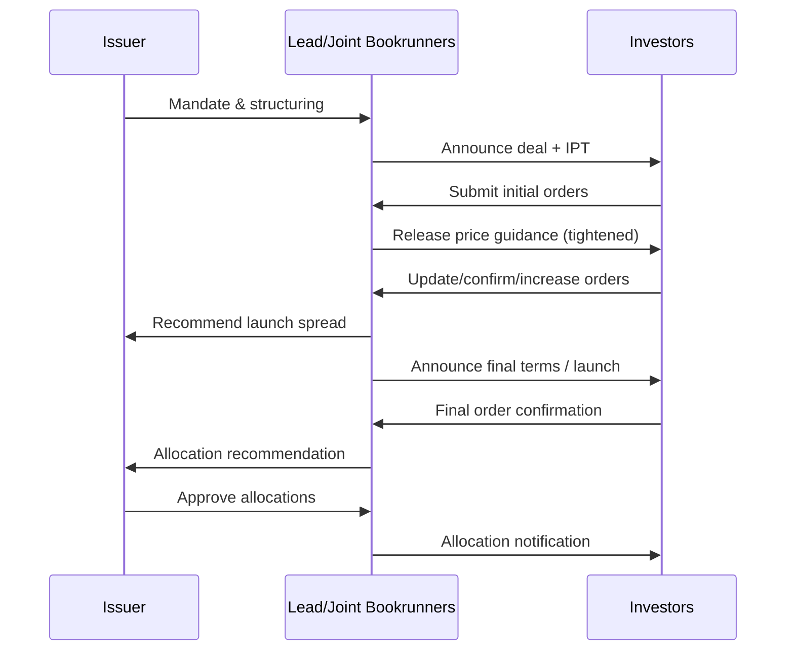

## Bookbuilding and Price Discovery Mechanics

### Overview

Bookbuilding is the process by which underwriters solicit, collect, and aggregate investor demand for a new bond issue in order to discover a market-clearing price and allocate securities. Unlike fixed-price offerings, bookbuilding is a dynamic, iterative price discovery mechanism that runs from initial price thoughts through to final pricing and allocation, typically compressed into a single trading day for benchmark bond deals.

### Pre-Deal Phase

**Key Points**

- Precedes the formal announcement of a transaction
- Establishes a baseline price expectation before the order book officially opens

**Investor Feedback and Pre-Sounding**

- Syndicate banks may conduct **pre-sounding** or **wall-crossing** exercises: contacting select investors under confidentiality (made "insiders" temporarily) to gauge appetite for size, tenor, and indicative pricing before public announcement
- [Inference] Wall-crossing practices are heavily regulated (e.g., under UK Market Abuse Regulation (MAR) and equivalent regimes) and require careful information barrier management, cleansing statements, and record-keeping to avoid unlawful disclosure of inside information

**Pre-Deal Investor Research (PDIR)**

- Independent research distributed by syndicate banks' research desks ahead of the roadshow, subject to strict information barrier protocols separating research analysts from the deal team
- Provides investors an independent credit view without the syndicate desk's direct sales bias, informing early demand formation

### Deal Announcement and Initial Price Thoughts (IPT)

**Definition**

Initial Price Thoughts (IPT), also called "initial guidance," is the first public indication of where a bond might price, expressed as a spread over a reference benchmark (e.g., "T+150bps area" for a Treasury-referenced deal, or "MS+120 area" for a mid-swaps reference).

**Characteristics of IPT**

- Deliberately wide/conservative relative to expected final pricing, to attract a broad initial order book and avoid under-subscription
- The word "area" signals flexibility (+/- a few basis points) rather than a precise level
- Announced via a formal deal announcement (often through Bloomberg/Reuters syndicate wires and DCM distribution platforms) simultaneously to all prospective investors to preserve fair access

$$\text{IPT Spread} = \text{Fair Value Spread} + \text{New Issue Concession} + \text{Pricing Buffer}$$

[Inference] The precise buffer built into IPT versus fair value is a matter of banker judgment and market convention rather than a formulaic calculation, and varies by market conditions, issuer familiarity, and sector.

### Order Book Opening and Live Bookbuilding

**Mechanics**

Once IPT is announced, the order book officially opens. Investors submit orders through the syndicate desk(s), specifying:

- **Order size**: the notional amount the investor wishes to purchase
- **Price/spread limit**: the maximum spread (minimum price) the investor is willing to accept — orders can be "at IPT," "at price talk," "at revised guidance," or place a specific limit (e.g., "T+140 or better")
- **Sensitivity flag**: whether the order is real or sensitive to final terms

**Price Guidance Revisions**

As the book builds, the lead bookrunner(s) typically revise guidance one or more times, tightening the spread as demand becomes clearer:

1. **IPT** → wide, exploratory
2. **Price Guidance (PG)** → narrower range or single point, often with a "the number" or "+/-" convention (e.g., "T+130, +/-5bps, the number")
3. **Final Price Guidance / Launch** → the spread at which the deal will price, announced once books are sufficiently covered

**Order Book Composition Monitoring**

Throughout the process, the syndicate desk tracks and often discloses (in aggregate) to the market:

- **Total order book size** (aggregate demand, e.g., "book in excess of $3bn")
- **Number of accounts** participating
- **Geographic and investor-type breakdown** (e.g., asset managers, insurers, pension funds, hedge funds, central banks, banks)
- **Oversubscription ratio**: total demand relative to deal size

$$\text{Oversubscription Ratio} = \frac{\text{Total Order Book}}{\text{Deal Size}}$$

A ratio significantly above 1x (e.g., "3x oversubscribed") is generally used by the syndicate as leverage to tighten pricing, since it signals the issuer could scale back allocations and still fill the deal.

### Price Discovery Dynamics

**Key Points**

- Price discovery balances two competing forces: **issuer's cost of funds minimization** (tighter spread) vs. **investor's required return / avoiding aftermarket underperformance** (wider spread, sufficient concession)
- The **New Issue Concession (NIC)** — the spread premium a new bond must offer over the issuer's existing secondary curve to compensate investors for primary market risk — is a central variable

$$\text{NIC} = \text{New Issue Spread} - \text{Fair Value Spread (interpolated from secondary curve)}$$

**Factors Influencing Final Pricing**

- Prevailing market volatility and rates environment at time of pricing
- Sector-specific technical factors (relative supply/demand for the issuer's sector)
- Credit rating and outlook (including any recent rating actions)
- Comparable recent transactions ("comps") from similar issuers
- Structural features (covenants, seniority, call features, ESG-linked terms)
- Investor sentiment toward the specific tenor point on the curve

[Inference] Determining "fair value" for NIC calculation involves interpolation across an issuer's curve and comparable credits, which is inherently a matter of banker and investor judgment rather than an objective, universally agreed figure — different market participants may compute fair value slightly differently.

### Book Building Strategies

**Accelerated Bookbuild (ABB)**

- Compressed timeline (often intraday or overnight), minimal or no roadshow
- Used for well-known, frequent issuers or opportunistic market windows
- Higher execution risk if market moves against the issuer during the short window, but reduces market/rate risk exposure from a longer marketing period

**Full Marketed Deal / Roadshow-Led Bookbuild**

- Multi-day investor roadshow (in-person or virtual/NetRoadshow) preceding book opening
- Used for first-time issuers, complex credits, or larger/benchmark transactions requiring broader education
- Allows for more extensive investor Q&A, deeper price discovery, and relationship building with new accounts

**Two-Stage / Anchor Order Strategy**

- Lead banks pre-secure "anchor orders" from key relationship investors before public book opening, providing a demand floor
- [Speculation] This approach reduces headline risk of a poorly covered book but may raise allocation fairness questions among non-anchor investors if not managed transparently

### Allocation Mechanics

**Key Points**

- Final order book, once closed, is reconciled against the deal size to determine allocations
- The issuer typically retains final allocation approval authority, though the lead bookrunner(s) make recommendations
- Allocation is not always pro-rata; qualitative factors influence final outcomes

**Common Allocation Considerations**

- **Order quality**: real money, long-only accounts often prioritized over hedge funds or perceived "flippers" seeking quick aftermarket trading gains
- **Relationship value**: investors with a history of participating in the issuer's or bank's other transactions
- **Price sensitivity**: orders placed "at tight end" or with firm limits may receive priority treatment over highly price-sensitive orders
- **Geographic/diversification goals**: issuer may want to build a diversified investor base across regions

**Scaling Back**

When oversubscribed, orders are typically scaled back from face value:

$$\text{Allocation}_i = \text{Order}_i \times \text{Scale-back Factor}$$

where the scale-back factor is not necessarily uniform across all investors — larger or more strategically valued orders may receive preferential (higher) scale-back factors.

### Pricing and Launch

**Example**

Illustrative bookbuilding progression for a $500mm 5-year senior bond:

| Stage | Guidance | Order Book Size | Notes |
| --- | --- | --- | --- |
| IPT | T+165 area | — | Deal announced 8:00 AM |
| Price Guidance | T+140 (+/-5), the number | $1.2bn | 9:30 AM, 2.4x covered |
| Final Guidance / Launch | T+130 | $1.8bn | 11:00 AM, book closes |
| Pricing | T+130 (fixed) | $1.8bn (3.6x oversubscribed) | Final terms confirmed, allocations sent |

Books are typically closed at a specified time, after which no further orders are accepted, and the lead bank(s) finalize the recommended spread and allocation schedule for issuer sign-off.

### Post-Pricing and Aftermarket Performance

**Key Points**

- Once priced, the bond is allocated and begins trading in the secondary (grey) market, often within minutes of terms being finalized
- **Aftermarket performance** (bond trading tighter or wider than reoffer spread) is a key metric used to assess pricing accuracy and syndicate execution quality
- A bond that trades meaningfully tighter immediately after pricing may suggest the deal was "left on the table" (priced too cheap, excessive NIC), while a bond trading wider suggests aggressive pricing or a mis-read of demand

[Inference] There is a persistent tension in bookbuilding between issuer preference for tight pricing (low NIC) and underwriters' interest in ensuring positive aftermarket performance to maintain investor goodwill for future transactions; how banks balance this trade-off is a matter of judgment and relationship management rather than a fixed rule.

### Related Topics

- New Issue Concession (NIC) calculation and curve interpolation methodology
- Reverse inquiry and private placement pricing mechanics
- Grey market trading and when-issued (WI) trading conventions
- Investor categorization frameworks (real money vs. fast money/hedge funds)
- Roadshow logistics and NetRoadshow/virtual investor meeting platforms
- Market Abuse Regulation (MAR) and wall-crossing compliance frameworks
- Curve construction and fair value spread interpolation techniques
- Greenshoe/upsize options during active bookbuilding
- Comparable transaction ("comps") analysis methodology in DCM pricing