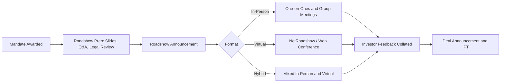

## Investor Roadshows and Reverse Inquiry


### Overview

Investor roadshows and reverse inquiry represent two distinct but related mechanisms through which issuers and underwriters engage with fixed income investors outside the standard live bookbuilding window. Roadshows are proactive, syndicate-driven marketing exercises designed to educate and solicit demand ahead of a broadly marketed transaction, while reverse inquiry is investor-initiated, typically resulting in bespoke, privately negotiated issuance that bypasses the full public syndication process. Together they represent the "demand-generation" and "demand-response" ends of the primary market spectrum.

### Investor Roadshows

**Definition**

A roadshow is a structured series of investor meetings — in-person, virtual, or hybrid — conducted by the issuer's management (typically CFO, Treasurer, or Head of IR) alongside syndicate bank representatives, designed to present the issuer's credit story, strategy, and financial profile to prospective bond investors ahead of a new issue.

**Objectives**

- Educate investors unfamiliar with the credit (particularly relevant for debut issuers or issuers entering a new market/currency)
- Reinforce and update the credit narrative for repeat issuers (strategy shifts, M&A activity, ESG initiatives, refinancing plans)
- Build and calibrate investor demand ahead of book opening, informing IPT levels
- Allow investors to conduct direct diligence via management Q&A



**Roadshow Formats**

1. **Physical/In-Person Roadshow**
   - Multi-city tour (e.g., London, Frankfurt, Paris, Boston, New York, Singapore for a global benchmark deal)
   - Combination of group investor lunches/breakfasts and targeted one-on-one meetings with large anchor accounts
   - Typically spans 1–3 days for standard deals; longer for debut or complex credits (e.g., first-time sovereign or emerging market issuers)
2. **Virtual/NetRoadshow**
   - Pre-recorded management video presentation hosted on a platform (e.g., NetRoadshow, Ipreo/IHS Markit predecessor platforms, or bank-proprietary portals)
   - Investors access on-demand, often paired with a live conference call Q&A session
   - Significantly reduces marketing timeline (can compress a multi-day physical tour into hours), enabling accelerated execution
3. **Global Investor Call (GIC)**
   - A single, live conference call open to all prospective investors simultaneously
   - Common for accelerated or well-known/frequent issuer transactions where a full roadshow is unnecessary
   - Often held the evening before or morning of deal launch

**Roadshow Materials and Compliance**

- **Investor presentation deck**: covers business overview, financial highlights, credit metrics, use of proceeds, and risk factors
- **Legal review**: presentation content is vetted by issuer and underwriter counsel to ensure consistency with the offering document and avoid selective/non-public disclosure
- [Inference] Roadshow materials are typically required to avoid introducing any information not already disclosed in the preliminary offering circular/prospectus, to prevent claims of unequal disclosure among investors, though the precise standard depends on the applicable securities regime (e.g., Regulation FD-adjacent concerns in the US, or MAR/Prospectus Regulation disclosure equivalence in the EU/UK)

**Timing Considerations**

$$\text{Total Execution Timeline} = \text{Roadshow Duration} + \text{Book Opening} + \text{Pricing}$$

A shorter roadshow (or GIC-only approach) reduces the issuer's exposure to market/rate volatility during the marketing period but sacrifices depth of investor education — a trade-off weighed heavily for volatile rate environments or credit-sensitive issuers.

### Reverse Inquiry

**Definition**

Reverse inquiry refers to a scenario in which an investor proactively approaches an issuer (typically via a relationship bank or directly) expressing interest in purchasing a specific bond structure — often a private placement, medium-term note (MTN), or structured note — with terms (size, tenor, currency, coupon structure) tailored to that investor's specific need, rather than being sourced through a broadly marketed public syndication process.

**Mechanics of Reverse Inquiry**

```mermaid
sequenceDiagram
    participant Investor
    participant DealerBank as Dealer/Arranger
    participant Issuer
    Investor->>DealerBank: Expresses interest in specific structure/size/tenor
    DealerBank->>Issuer: Relays terms and indicative pricing
    Issuer->>DealerBank: Confirms willingness and counter-terms
    DealerBank->>Investor: Negotiates final terms
    Investor->>DealerBank: Confirms trade
    DealerBank->>Issuer: Executes documentation under MTN/EMTN program
    Issuer->>Investor: Issues note; settlement via clearing systems
```

**Typical Use Cases**

- **Medium-Term Note (MTN) / Euro Medium-Term Note (EMTN) programs**: reverse inquiry is the dominant issuance mechanism under most MTN shelf programs, where an investor requests a specific maturity or structure not currently in the market
- **Structured notes**: investors (often insurance companies or pension funds with specific asset-liability matching needs) request bespoke coupon structures (e.g., callable, step-up, inflation-linked) via reverse inquiry
- **Private placements**: an investor or small club of investors negotiates directly for a non-syndicated, unregistered issuance
- **Tap issuances**: an existing bond line is reopened at investor request to add incremental size to a previously issued (often smaller or off-the-run) series

**Key Characteristics**

- **Pricing**: typically referenced off the issuer's existing curve (secondary levels) or comparable outstanding bonds, plus a negotiated premium/discount reflecting size and structure bespoke-ness
- **Documentation**: executed under an existing program (e.g., EMTN Programme, Rule 144A/Reg S shelf, or US MTN program) via a pricing supplement/final terms document rather than a full standalone prospectus, significantly reducing execution time and cost
- **Distribution**: typically involves one or a small handful of investors, as opposed to the broad syndicate distribution of a benchmark public deal
- **Fees**: generally lower than a full syndicated new issue, reflecting the reduced marketing/structuring burden, often a fixed dealer concession rather than a full gross spread

$$\text{Reverse Inquiry Price} = \text{Reference Curve Yield} + \text{Illiquidity/Bespoke Premium} - \text{Relationship Discount (if applicable)}$$

[Inference] The "relationship discount" term is a conceptual placeholder reflecting that highly relationship-driven reverse inquiries may price more favorably for the investor than an equivalent one-off structured note request from a non-relationship counterparty; this is not a standardized, quantifiable market convention.

**Advantages for Issuers**

- Access to incremental, non-dilutive funding without a full syndication process
- Ability to fill specific curve gaps (e.g., an underrepresented maturity point) opportunistically
- Lower execution costs and faster time-to-market compared to benchmark new issues
- Diversifies the investor base by capturing demand from investors with idiosyncratic needs

**Advantages for Investors**

- Ability to obtain a customized structure/maturity precisely matching liability duration or yield targets
- Access to issuance from issuers who may not be actively marketing benchmark deals at that time
- Potentially more favorable relative value if negotiated well, particularly for off-the-run maturities

**Risks and Considerations**

- **Price transparency**: reverse inquiry trades lack the public price discovery mechanism of bookbuilding, so pricing relies heavily on accurate curve interpolation and negotiation skill
- **Concentration risk**: single-investor or small-club placements may create liquidity risk for the investor if the note size is small and illiquid in secondary markets
- **Programme capacity constraints**: issuers must monitor cumulative issuance against program shelf limits (e.g., an EMTN Programme's maximum aggregate nominal amount)
- [Unverified] Some jurisdictions impose specific disclosure or investor-qualification requirements on reverse inquiry-driven private placements (e.g., accredited/qualified institutional buyer status under US Rule 144A), and these requirements should be verified against the specific regulatory regime and note structure involved

### Comparative Summary

| Dimension | Roadshow-Led Public Deal | Reverse Inquiry |
| --- | --- | --- |
| Initiator | Issuer/underwriter | Investor |
| Marketing Process | Broad, multi-investor | Bilateral/small club |
| Price Discovery | Live bookbuilding | Curve-referenced negotiation |
| Documentation | Full/updated prospectus | Pricing supplement under existing shelf |
| Typical Size | Benchmark ($500mm+) | Smaller, bespoke |
| Execution Timeline | Days | Hours to days |
| Investor Base | Broad and diversified | Concentrated/single investor |

### Related Topics

- Medium-Term Note (MTN) and EMTN programme structuring and shelf mechanics
- Structured note design (callable, step-up, inflation-linked coupons)
- Rule 144A / Regulation S private placement frameworks
- Tap issuance mechanics and fungibility considerations
- Curve interpolation and relative value analysis for off-the-run maturities
- Regulation FD and selective disclosure compliance in roadshow marketing
- NetRoadshow and virtual investor engagement platform architecture
- Global Investor Call (GIC) execution timeline and best practices
- Qualified Institutional Buyer (QIB) and accredited investor eligibility standards