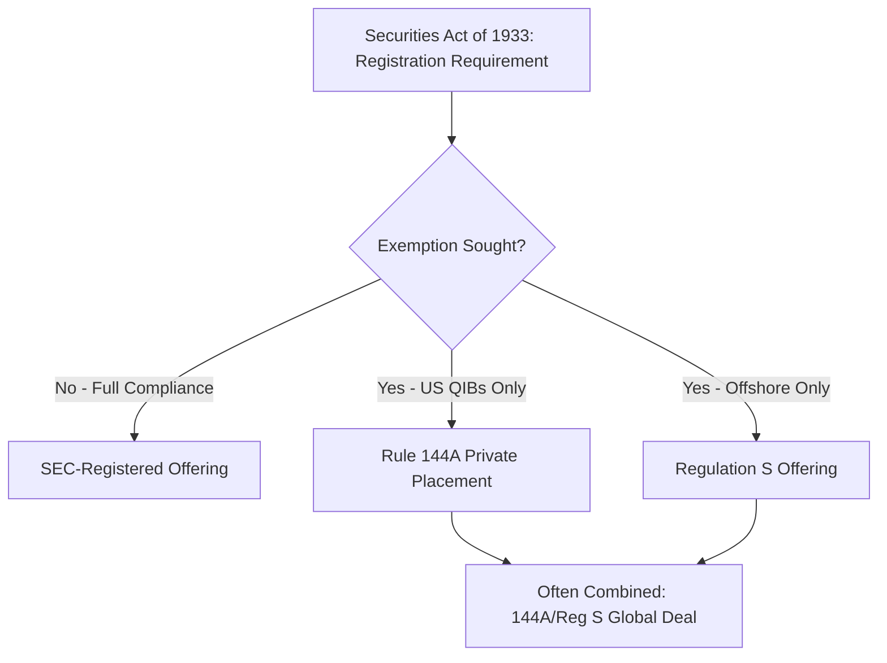
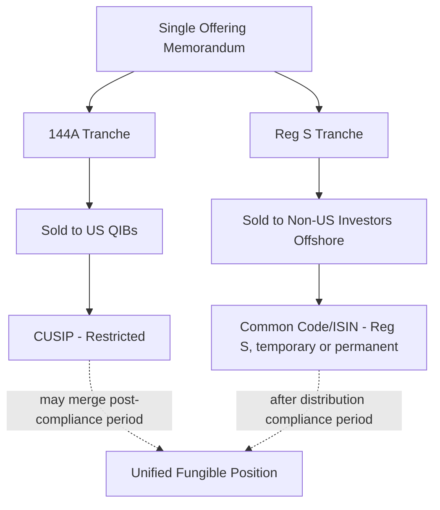

## Registered Offerings versus Rule 144A and Regulation S Placements

### Overview

The legal structure under which a bond is issued fundamentally determines its regulatory disclosure burden, eligible investor universe, execution timeline, and secondary market liquidity profile. In the US and cross-border context, issuers and underwriters choose among three principal frameworks: **SEC-registered offerings**, **Rule 144A private placements**, and **Regulation S offshore offerings** — frequently combined as a "144A/Reg S" structure for global bond issuance. Understanding the trade-offs among these frameworks is central to structuring any cross-border or US-nexus debt transaction.

### Regulatory Foundation

**Key Points**

- All three frameworks originate from the US Securities Act of 1933, which requires registration of securities offered or sold in the US unless an exemption applies
- Rule 144A and Regulation S are both **exemptions** from registration, while a registered offering fully complies with registration requirements
- The choice among frameworks is driven by target investor base, issuer's US reporting status, timeline constraints, and cost considerations

### SEC-Registered Offerings

**Definition**

A registered offering is a bond issuance that fully complies with the Securities Act registration requirements, typically via an effective **shelf registration statement** (Form S-3 for well-known seasoned issuers, or Form S-1 for others) filed with the SEC.

**Key Characteristics**

- **Full public disclosure**: requires a complete prospectus meeting SEC content and disclosure standards, subject to SEC review (though shelf takedowns by seasoned issuers may not require case-by-case review)
- **Broadest investor eligibility**: securities can be sold to any investor, retail or institutional, without transfer restrictions
- **Immediate free tradability**: securities are freely tradable in the secondary market from issuance, without holding periods or resale restrictions
- **Ongoing reporting obligations**: registered issuers are subject to Exchange Act reporting requirements (10-K, 10-Q, 8-K) if not already a reporting company
- **Underwriting liability regime**: subject to Securities Act Section 11 liability for material misstatements/omissions in the registration statement, with corresponding due diligence defense standards for underwriters

**Shelf Registration Mechanics**

$$\text{Shelf Takedown Timeline} \ll \text{Fresh Registration Timeline}$$

Well-known seasoned issuers (WKSIs) with effective shelf registrations can execute a "shelf takedown" — issuing new bonds off an already-effective registration statement — often within a single day, since the base disclosure is already on file and only a prospectus supplement with deal-specific terms needs to be prepared and filed.

**Typical Use Cases**

- US domestic corporate issuers with existing Exchange Act reporting obligations
- Issuers seeking maximum investor base breadth, including retail distribution
- Issuers for whom the cost/timeline of registration is justified by frequent, programmatic issuance (e.g., via a well-established debt shelf)

### Rule 144A Private Placements

**Definition**

Rule 144A provides a safe harbor exemption from Securities Act registration for resales of securities to **Qualified Institutional Buyers (QIBs)** — generally, institutional investors owning and investing at least $100 million in securities (with modified thresholds for certain entity types).

**Key Mechanics**

- Securities are initially sold by the issuer to the underwriter(s) in a private placement (itself exempt, often under Section 4(a)(2)), and the underwriters then immediately resell to QIBs relying on the Rule 144A safe harbor
- Disclosure is provided via an **offering memorandum** (OM) or **offering circular**, which is not filed with or reviewed by the SEC, though market practice has converged toward disclosure substantially similar to a registered prospectus for investment-grade issuers
- **Restricted securities**: 144A securities carry transfer restrictions and are not freely tradable to non-QIBs without an exemption or subsequent registration (e.g., via an "A/B exchange offer" registering equivalent freely-tradable notes in exchange for the restricted 144A notes)

**QIB Eligibility Threshold**

[Unverified] The specific dollar thresholds and entity-type qualifications for QIB status under Rule 144A are detailed and subject to periodic regulatory interpretation; practitioners should verify current thresholds against the current text of Rule 144A and any SEC guidance rather than relying on a general "$100 million" heuristic for edge cases involving non-standard entity structures.

**144A-for-Life vs. 144A with Registration Rights**

- **144A-for-life**: notes remain permanently restricted securities, common for high-yield issuers or issuers not intending to become SEC reporting companies
- **144A with registered exchange offer (A/B exchange)**: issuer commits (often via a registration rights agreement) to file a registration statement post-closing, allowing holders to exchange restricted 144A notes for economically identical, freely-tradable registered notes, typically within 180–365 days of issuance

$$\text{Investor Liquidity} = \begin{cases} \text{Restricted to QIBs} & \text{144A-for-life} \\ \text{Freely tradable} & \text{Post-exchange offer completion} \end{cases}$$

**Typical Use Cases**

- Foreign private issuers seeking US institutional investor access without full SEC registration
- High-yield issuers where speed-to-market and reduced disclosure burden are prioritized
- Issuers not wishing to become full SEC reporting companies

### Regulation S Offerings

**Definition**

Regulation S provides a safe harbor confirming that offers and sales of securities made **outside the United States**, to non-US persons, in compliance with specified conditions, are not subject to the Securities Act's registration requirements — because the transaction is deemed to occur entirely offshore.

**Key Conditions**

- **Offshore transaction requirement**: the offer must not be made to a person in the US, and either the buyer is offshore at the time the order is originated, or the sale is made through offshore facilities of a designated market
- **No directed selling efforts in the US**: underwriters must avoid conduct that could be construed as conditioning the US market for the securities
- **Category-based distribution compliance periods**: depending on the issuer's status (domestic vs. foreign, reporting vs. non-reporting), a "distribution compliance period" (commonly 40 days for many debt securities) restricts resales into the US during that window

**Category Classification (Regulation S)**

| Category | Issuer Type | Compliance Period (Debt) |
| --- | --- | --- |
| Category 1 | Foreign issuers with no substantial US market interest | None/minimal |
| Category 2 | Reporting foreign private issuers / certain other issuers | 40 days (typical for debt) |
| Category 3 | US domestic issuers | 40 days (debt); more restrictive for equity |

[Inference] Exact category assignment and applicable compliance periods depend on detailed issuer-specific facts (reporting status, substantial US market interest tests) that require case-by-case legal analysis; the table above reflects general/typical debt market convention rather than a substitute for specific legal advice on a given issuer.

**Typical Use Cases**

- Non-US issuers targeting European, Asian, or other offshore institutional investors
- Combined with Rule 144A tranches to create a global offering reaching both US QIBs and offshore investors

### Combined 144A/Reg S Global Offering Structure

**Definition**

Many cross-border benchmark bond issuances are structured as a combined offering, with two parallel tranches sold under different exemptions but typically fungible or near-fungible in economic terms, documented under a single offering memorandum with US and offshore-specific legending and selling restrictions.

**Operational Notes**

- The two tranches are often issued under the same terms (coupon, maturity, covenants) but carry separate CUSIP/ISIN identifiers initially, particularly during the Reg S distribution compliance period
- After the compliance period lapses, Reg S securities may become eligible to be sold into the US to QIBs and can sometimes be consolidated with the 144A tranche into a single fungible line, subject to any necessary certifications
- Clearing typically occurs through DTC (for 144A) and Euroclear/Clearstream (for Reg S), with settlement mechanics differing accordingly

### Comparative Summary

| Dimension | Registered Offering | Rule 144A | Regulation S |
| --- | --- | --- | --- |
| SEC Filing/Review | Yes (or shelf takedown) | No | No |
| Eligible Investors | Any (retail + institutional) | QIBs only | Non-US persons |
| Disclosure Document | Prospectus | Offering Memorandum | Offering Memorandum/Circular |
| Liquidity | Immediately free-trading | Restricted (unless exchanged) | Restricted during compliance period |
| Typical Timeline | Fast for WKSI shelf takedowns; slower for fresh registration | Fast (days) | Fast (days) |
| Common Issuer Profile | US domestic reporting companies | Foreign issuers, high-yield | Non-US issuers targeting offshore investors |

### Liability and Due Diligence Considerations

**Key Points**

- Registered offerings carry Securities Act Section 11 liability exposure for the issuer, underwriters, and certain signing officers/directors, with a corresponding "due diligence defense" available to underwriters who can demonstrate reasonable investigation
- Rule 144A and Regulation S offerings, while exempt from registration, are still subject to general antifraud provisions (e.g., Rule 10b-5 under the Exchange Act), meaning disclosure adequacy remains a material legal concern despite the absence of SEC review
- [Inference] Market practice for 144A offerings, particularly investment-grade 144A deals, has converged toward disclosure and due diligence rigor closely resembling registered offerings, even though the formal registration/liability regime differs, reflecting underwriters' practical risk management rather than a strict legal requirement to do so

### Related Topics

- Well-Known Seasoned Issuer (WKSI) shelf registration mechanics
- A/B exchange offers and registration rights agreements
- Qualified Institutional Buyer (QIB) eligibility criteria under Rule 144A
- Regulation S distribution compliance periods and category classification
- Securities Act Section 11 liability and underwriter due diligence defenses
- DTC, Euroclear, and Clearstream settlement mechanics for cross-border bonds
- EMTN Programme documentation versus US shelf registration structures
- Foreign private issuer status and its impact on disclosure obligations