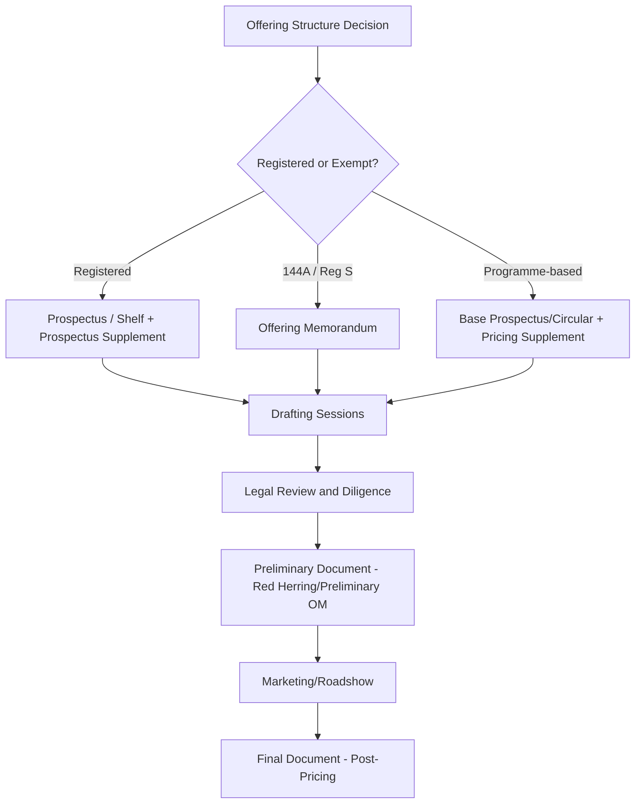

## Offering Memorandum and Prospectus Drafting

### Overview

The offering memorandum (OM) or prospectus is the core disclosure document through which an issuer communicates the material terms, risks, and financial condition of a bond offering to prospective investors. Drafting this document is a highly collaborative, multi-party process involving the issuer, underwriters, legal counsel for both sides, auditors, and — in registered deals — SEC review. The quality and completeness of this document underpins both the marketing of the transaction and the legal liability framework protecting (or exposing) the issuer and underwriters.

### Document Types by Offering Structure

**Key Points**

- Terminology and legal status of the disclosure document depend on the offering structure (see Registered Offerings versus Rule 144A and Regulation S Placements)
- **Prospectus**: used in SEC-registered offerings, filed with and (for non-shelf deals) reviewed by the SEC
- **Offering Memorandum (OM) / Offering Circular**: used in Rule 144A and Regulation S private placements, not filed with or reviewed by any regulator, though substantively similar in content to a prospectus for most institutional deals
- **Base Prospectus / Programme Circular**: the foundational document for a shelf or MTN/EMTN programme, supplemented deal-by-deal via **pricing supplements** or **final terms**

### Document Structure and Core Sections

**Standard Components**

1. **Cover Page**
   - Issuer name, security description, principal amount (often left blank/"TBD" in preliminary versions), maturity, and key structural terms
   - Underwriter names in tombstone order (Lead Left first, per syndicate hierarchy)
2. **Summary Section**
   - Condensed overview of the issuer's business, the offering terms, and key risk factors
   - Designed to give investors a rapid orientation before the full document
3. **Risk Factors**
   - Comprehensive enumeration of material risks affecting the issuer's business, the industry, and the specific securities being offered
   - Organized typically by category: business/operational risks, industry/market risks, financial/leverage risks, legal/regulatory risks, and risks specific to the securities (e.g., structural subordination, limited covenants, illiquidity)
4. **Use of Proceeds**
   - States how net proceeds will be applied (e.g., refinancing existing debt, general corporate purposes, funding a specific acquisition, capital expenditure)
   - For labeled bonds (green, social, sustainability-linked), this section carries heightened specificity requirements tied to the relevant framework
5. **Capitalization Table**
   - Pro forma presentation of the issuer's debt and equity capitalization before and after the offering
   - Demonstrates the impact of the new issuance on the issuer's overall capital structure
6. **Management's Discussion and Analysis (MD&A) / Operating and Financial Review**
   - Narrative analysis of financial condition, results of operations, liquidity, and capital resources
   - Typically incorporates or summarizes recent trends, key performance drivers, and known material trends/uncertainties
7. **Business Description**
   - Overview of the issuer's operations, competitive position, strategy, properties, employees, and legal proceedings
8. **Financial Statements**
   - Audited annual financial statements (typically 2-3 years) and unaudited interim financial statements, prepared under applicable GAAP/IFRS standards, accompanied by auditor consent (for registered deals) or comfort letters (for 144A deals)
9. **Description of the Notes**
   - Detailed legal terms: interest rate/coupon, maturity, redemption/call provisions, covenants, events of default, ranking/seniority, guarantees, and governing law
10. **Plan of Distribution / Underwriting**
    - Describes the underwriting arrangement, syndicate structure, and any stabilization/over-allotment provisions
11. **Legal Matters and Experts**
    - Identifies legal counsel opinions relied upon and auditor consents

### Drafting Process and Session Structure

**Key Points**

- Drafting proceeds through iterative sessions ("drafting sessions" or "all-hands calls") involving issuer management, issuer's counsel, underwriters' counsel, the syndicate desk/deal team, and often auditors for financial sections
- Multiple draft rounds circulate before the document is deemed "substantially final" for the preliminary offering document

**Typical Drafting Timeline (Illustrative)**

| Phase | Activity | Typical Duration |
| --- | --- | --- |
| Initial Draft | Issuer's counsel produces first full draft based on precedent/template | 1-2 weeks |
| Drafting Sessions | Line-by-line review calls with issuer, underwriters, and both counsel teams | 1-3 weeks (multiple sessions) |
| Due Diligence | Financial, legal, and business diligence conducted in parallel | Concurrent with drafting |
| Comfort Letter/Legal Opinions | Auditor comfort letter and legal opinions finalized | Final 1-2 weeks pre-launch |
| Preliminary Document | "Red herring" (registered) or Preliminary OM finalized for marketing | Prior to roadshow/launch |
| Pricing Supplement/Final Terms | Deal-specific terms finalized post-pricing | Day of pricing |

[Inference] Drafting timelines vary substantially based on issuer familiarity (debut vs. frequent issuer), complexity of structure, and whether the transaction leverages an existing effective shelf registration (which can compress the timeline to days) versus requiring fresh registration or first-time OM preparation (which can extend to several weeks).

### Due Diligence and the "10b-5" Process

**Definition**

Due diligence in bond offerings encompasses the systematic investigation by underwriters and their counsel into the issuer's business, financial condition, and legal affairs to support both accurate disclosure and, in registered offerings, the underwriters' statutory due diligence defense under Securities Act Section 11.

**Components**

- **Business due diligence**: management interviews, site visits, review of material contracts, litigation review
- **Financial due diligence**: review of audited/unaudited financials, discussions with auditors, review of internal controls representations
- **Legal due diligence**: review of corporate structure, material agreements, regulatory compliance, litigation, and intellectual property matters
- **Comfort letters**: auditors provide "negative assurance" comfort letters to underwriters regarding financial information in the offering document, typically delivered at signing and again at closing ("bring-down" comfort letter)
- **10b-5 disclosure letters/opinions**: underwriters' counsel typically delivers a "10b-5 letter" (or "negative assurance letter") stating that, based on the diligence conducted, nothing has come to counsel's attention causing them to believe the disclosure document contains a material misstatement or omission

[Inference] The precise scope and form of 10b-5 letters and comfort letters are heavily influenced by market practice conventions (e.g., SIFMA and ABA guidance, AICPA standards for comfort letters) rather than strict statutory mandates, and can vary somewhat by underwriters' counsel and transaction type.

### Preliminary vs. Final Documents

**Preliminary Offering Document**

- **Registered**: "Preliminary Prospectus" or "Red Herring" (named for the red legend on the cover stating the registration statement has not yet become effective and information is subject to change)
- **144A/Reg S**: "Preliminary Offering Memorandum" (Pref OM), typically lacking final pricing terms (coupon, yield, exact size)
- Used during the roadshow and bookbuilding period; investors submit orders based on this document, understanding final terms will be added

**Final Offering Document**

- Issued upon pricing, incorporating final terms: coupon, price/yield, final size, closing date
- **Registered**: filed with the SEC as the final prospectus (often via a prospectus supplement under Rule 424(b))
- **144A/Reg S**: Final Offering Memorandum, or in programme-based deals, a **Pricing Supplement** or **Final Terms** document appended to the base prospectus/circular

$$\text{Preliminary Document} + \text{Pricing Supplement (Final Terms)} = \text{Final Offering Document}$$

### Incorporation by Reference

**Key Points**

- To avoid restating extensive previously-disclosed information, offering documents frequently incorporate by reference the issuer's existing periodic reports (e.g., annual report/10-K, quarterly reports/10-Q, or equivalent home-market filings for foreign issuers)
- This is standard practice for frequent issuers with an established public reporting history and significantly streamlines document length and drafting time
- [Unverified] The specific mechanics and permissibility of incorporation by reference differ between registered shelf offerings (well-established SEC framework) and 144A/OM-based deals, where practice varies by issuer's home market disclosure regime and should be confirmed with counsel for the specific transaction

### Labeled Bond Disclosure Considerations

**Key Points**

- For green, social, sustainability, or sustainability-linked bonds, the offering document typically includes a dedicated section addressing:
  - Alignment with the relevant framework (e.g., ICMA Green Bond Principles, Social Bond Principles)
  - Use of proceeds specificity and eligible project categories
  - Reporting and impact measurement commitments
  - Any second-party opinion (SPO) or external review referenced
- [Inference] Disclosure standards for labeled bonds continue to evolve as regulatory frameworks (e.g., EU Green Bond Standard) and market taxonomies mature, so specific disclosure content should be benchmarked against current framework guidance at the time of any given transaction rather than treated as fixed

### Legal Opinions and Closing Deliverables

**Key Points**

- **Issuer's counsel opinion**: covers due authorization, valid issuance, enforceability of the notes, and no conflict with organizational documents/material agreements
- **Underwriters' counsel opinion**: may cover similar matters from the underwriters' perspective and often includes the 10b-5 negative assurance statement
- **Officer's certificates**: issuer officers certify accuracy of representations and warranties as of signing and closing
- **Indenture/Trustee documentation**: for the underlying debt instrument, indenture execution (or fiscal agency agreement) is typically finalized concurrently with the offering document

### Related Topics

- Due diligence defense standards under Securities Act Section 11
- Comfort letter mechanics and AICPA/SIFMA market practice standards
- Indenture structuring and trustee appointment (Trust Indenture Act considerations)
- Green Bond Principles and labeled bond disclosure frameworks
- Shelf registration and prospectus supplement mechanics (Rule 424(b))
- EMTN Programme base prospectus and pricing supplement architecture
- Covenant drafting and events of default structuring
- Rule 10b-5 antifraud liability and underwriter risk mitigation practices