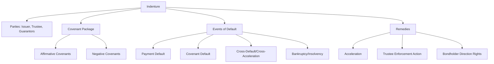
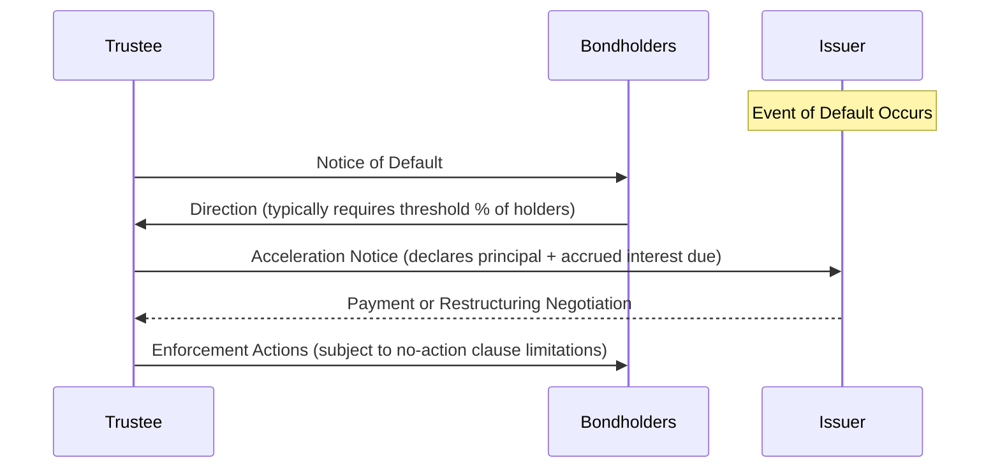

## Bond Covenants and Indenture Structuring

### Overview

The indenture is the foundational legal contract governing a bond issuance, defining the rights and obligations of the issuer, the trustee, and bondholders. Central to this document is the covenant package — the set of affirmative and negative promises that constrain issuer behavior throughout the life of the bond, allocate risk between the issuer and creditors, and provide bondholders with remedies in the event of deterioration or default. Covenant structuring varies dramatically across the credit spectrum, from minimal "incurrence-light" investment-grade packages to dense, heavily-negotiated high-yield covenant suites.

### The Indenture Framework

**Definition**

An indenture is a formal trust deed between the issuer and an indenture trustee (acting on behalf of bondholders as a class) that sets forth the terms of the debt securities, including the covenant package, events of default, and remedies. In the US, indentures for registered public debt above certain thresholds must comply with the **Trust Indenture Act of 1939 (TIA)**.

**Trust Indenture Act (TIA) Requirements**

[Inference] The TIA imposes specific structural requirements on qualifying indentures — including trustee independence and eligibility standards, prohibitions on impairing certain bondholder rights (e.g., the right to sue for principal and interest) without individual consent, and periodic reporting obligations — though the precise applicability thresholds and exemptions (e.g., for exempt securities or certain private placements) require verification against the current text of the TIA and SEC rules for any specific transaction, as coverage depends on registration status and other issuer-specific facts.

### Affirmative Covenants

**Definition**

Affirmative covenants require the issuer to take specified actions, generally imposing minimal operational burden and common across virtually all bond structures.

**Common Affirmative Covenants**

- **Reporting covenants**: obligation to deliver periodic financial statements and compliance certificates to the trustee/bondholders
- **Payment of taxes and maintenance of existence**: standard "housekeeping" covenants requiring the issuer to remain in good standing and pay obligations as due
- **Maintenance of insurance and properties**: obligation to maintain adequate insurance and properties in operating condition
- **Compliance with laws**: general covenant to comply with applicable law
- **Further assurances**: obligation to execute additional documents as needed to perfect security interests or guarantees (particularly relevant in secured/guaranteed structures)

### Negative Covenants

**Definition**

Negative covenants restrict specified issuer actions, forming the primary mechanism by which bondholders constrain issuer behavior to protect creditor value. The scope and stringency of negative covenants is the primary axis of differentiation between investment-grade and high-yield bond structures.

**Core Negative Covenant Categories**

1. **Limitation on Indebtedness (Debt Incurrence Covenant)**
   - Restricts the issuer's ability to incur additional debt beyond specified baskets or ratio-based tests
   - Common structure: a **fixed charge coverage ratio (FCCR)** test, permitting incremental debt only if pro forma FCCR exceeds a specified threshold (e.g., 2.0x)

$$\text{FCCR} = \frac{\text{EBITDA (or Consolidated Cash Flow)}}{\text{Fixed Charges (Interest Expense + Preferred Dividends, etc.)}}$$

2. **Limitation on Liens (Negative Pledge)**
   - Restricts the issuer from granting liens on assets to secure other debt without equally and ratably securing the existing bonds (or, more restrictively, prohibiting such liens altogether subject to permitted lien baskets)
3. **Limitation on Restricted Payments**
   - Restricts dividends, share buybacks, and certain investments, typically governed by a "builder basket" mechanism that accumulates capacity based on cumulative net income and other addbacks since a reference date

$$\text{Restricted Payments Basket} = \text{Starter Basket} + \sum (\text{Cumulative Net Income} \times \text{Applicable \%}) + \text{Other Addbacks}$$

4. **Limitation on Asset Sales**
   - Requires that proceeds from asset dispositions above a threshold be used to repay debt, reinvest in the business within a specified period, or otherwise be offered to bondholders via an **asset sale offer** (a mandatory offer to repurchase bonds, typically at par)
5. **Limitation on Affiliate Transactions**
   - Restricts transactions with related parties/affiliates unless conducted on arm's-length terms, often requiring board approval or a fairness opinion above certain size thresholds
6. **Merger, Consolidation, and Sale of Substantially All Assets Covenant**
   - Restricts the issuer's ability to merge or sell substantially all assets unless specified conditions are met (e.g., successor entity assumes the notes, no default results, pro forma covenant compliance maintained)
7. **Limitation on Guarantees and Subsidiary Structure**
   - Governs which subsidiaries must guarantee the notes and under what conditions new subsidiaries must become guarantors
8. **Change of Control Covenant**
   - Requires the issuer to make an offer to repurchase the notes (typically at 101% of principal) upon the occurrence of both a change of control and (in many structures) an associated ratings downgrade ("change of control put")

### Investment-Grade vs. High-Yield Covenant Packages

**Key Points**

- The covenant intensity spectrum correlates strongly with credit quality, reflecting the differing bargaining power and risk tolerance between issuers and investors at each end of the credit spectrum

| Covenant Feature | Investment-Grade (Typical) | High-Yield (Typical) |
| --- | --- | --- |
| Debt Incurrence | Often unrestricted or very limited (incurrence-light) | Ratio-based test (FCCR) with baskets |
| Restricted Payments | Rare/minimal | Detailed builder-basket mechanism |
| Negative Pledge | Often present, limited exceptions | Detailed permitted liens list |
| Asset Sale Covenant | Rare | Standard, with reinvestment/offer mechanics |
| Change of Control Put | Common | Standard, often with ratings decline trigger |
| Financial Maintenance Covenants | Rare in bonds (more common in loans) | Rare in bonds (incurrence-based instead) |
| Reporting | SEC reporting (if registered) | Indenture-specified reporting covenant |

[Inference] The characterization of investment-grade covenants as "covenant-lite" relative to high-yield is a widely observed market pattern reflecting relative negotiating leverage and credit risk, but the specific covenant package for any given deal is negotiated and can deviate from typical patterns based on issuer-specific credit considerations, sector norms, and prevailing market conditions at issuance.

### Financial Maintenance Covenants vs. Incurrence Covenants

**Definition**

- **Maintenance covenants**: require the issuer to maintain compliance with a financial ratio test at all times (typically tested quarterly), common in leveraged loan agreements but comparatively rare in high-yield bond indentures
- **Incurrence covenants**: only tested at the time the issuer takes a specified action (e.g., incurring new debt, making a restricted payment); if the issuer takes no such action, no test is required, and no default occurs even if the ratio would otherwise be breached

$$\text{Incurrence Test} = \text{Triggered only by: New Debt} \cup \text{Restricted Payment} \cup \text{Asset Sale (etc.)}$$

[Inference] The predominance of incurrence-based (rather than maintenance-based) covenants in high-yield bonds, contrasted with the more common use of maintenance covenants in leveraged loans, reflects differing market conventions between the loan and bond markets rather than a legal requirement, and "covenant-lite" loan structures have increasingly adopted incurrence-style tests as well, blurring this historical distinction over time.

### Events of Default and Remedies

**Standard Events of Default**

- **Payment default**: failure to pay principal or interest when due, typically subject to a cure period for interest payments
- **Covenant default**: breach of an affirmative or negative covenant, typically subject to notice and cure period requirements
- **Cross-default / Cross-acceleration**: default under other material debt of the issuer (cross-default triggers on default itself; cross-acceleration requires the other debt to actually be accelerated), subject to materiality thresholds
- **Bankruptcy/insolvency events**: voluntary or involuntary bankruptcy filings
- **Judgment default**: unsatisfied material judgments above a specified threshold

**Remedies**

- **Acceleration**: upon an Event of Default, the trustee or a specified percentage of holders (commonly 25% or 30% of outstanding principal) may declare the principal and accrued interest immediately due and payable
- **No-action clause**: individual bondholders are generally restricted from independently suing the issuer; enforcement typically must proceed through the trustee, subject to specified procedural prerequisites (written request, indemnification of the trustee, and a waiting period)
- **Rescission**: a specified majority of holders may, under certain conditions, rescind an acceleration if the default has been cured

### Guarantee and Security Structuring

**Key Points**

- **Guarantees**: subsidiary guarantees extend the credit of operating subsidiaries to noteholders, critical in structures where the issuing entity is a holding company without direct access to operating cash flows
- **Structural subordination**: bonds issued by a holding company without subsidiary guarantees are structurally subordinated to debt at the operating subsidiary level, since subsidiary creditors are paid from subsidiary assets before any residual value flows up to the holding company

$$\text{Structural Subordination Risk} \propto \frac{\text{Debt at Non-Guarantor Subsidiaries}}{\text{Total Consolidated Debt}}$$

- **Secured vs. unsecured structures**: secured notes benefit from a security interest in specified collateral, ranking ahead of unsecured claims to that collateral in a bankruptcy/insolvency scenario; intercreditor agreements govern relative priority when multiple secured creditor classes exist (e.g., first lien vs. second lien structures)

### Covenant Modification and Amendment Mechanics

**Key Points**

- Indentures specify the required bondholder consent threshold for amendments, typically differentiated by amendment type:
  - **Non-material/administrative amendments**: often permitted without bondholder consent (e.g., curing ambiguities)
  - **Ordinary amendments**: typically require majority consent (e.g., a majority of outstanding principal)
  - **"Sacred rights" amendments**: changes to payment terms (principal, interest rate, maturity date) typically require unanimous or near-unanimous consent from affected holders, reflecting the TIA's protections for certain fundamental bondholder rights in registered indentures

[Unverified] The specific consent thresholds for different amendment categories are heavily negotiated and indenture-specific; the general "sacred rights" framework described is a widely observed market convention rather than a universally fixed statutory requirement outside the specific protections mandated by the Trust Indenture Act for TIA-qualified indentures.

### Related Topics

- Trust Indenture Act (TIA) qualification requirements and trustee eligibility standards
- Fixed Charge Coverage Ratio (FCCR) calculation methodology and EBITDA addback conventions
- Intercreditor agreements and first lien/second lien priority structures
- Structural subordination and holding company debt structuring
- Change of control put mechanics and ratings decline triggers
- Consent solicitations and exchange offers for covenant amendments
- Cross-default versus cross-acceleration provisions in credit agreements
- High-yield bond covenant precedent analysis and market "covenant quality" scoring