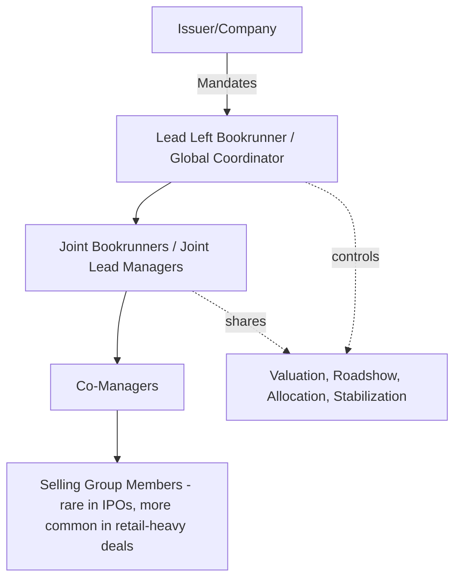
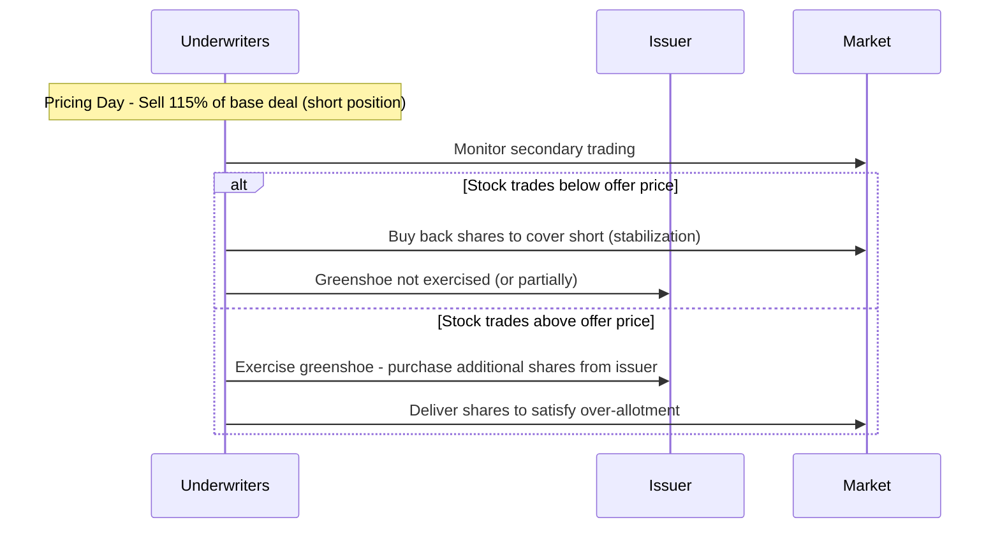

## IPO Underwriting Syndicate Structure

### Overview

The underwriting syndicate for an initial public offering (IPO) is a structured coalition of investment banks assembled to price, market, and distribute newly issued equity shares to the public market for the first time. While it shares conceptual DNA with the debt syndication hierarchy (Lead Manager, Joint Bookrunners, Co-Managers), IPO syndicate structuring carries distinct dynamics driven by equity valuation uncertainty, greater regulatory scrutiny, the absence of a pre-existing secondary market price, and mechanisms unique to equity offerings such as the greenshoe option and lock-up agreements.

### Syndicate Hierarchy in an IPO

**Key Points**

- IPO syndicates typically feature a more pronounced hierarchy than debt deals, given the higher valuation uncertainty and reputational stakes involved in "getting the price right"
- Roles are formalized in the underwriting agreement and an Agreement Among Underwriters (AAU), executed at or near pricing

**Lead Left / Global Coordinator**

- Runs the IPO process end-to-end: valuation analysis, S-1/F-1 drafting oversight, roadshow logistics, and final pricing recommendation
- Typically also serves as the **stabilization agent**, responsible for post-IPO price support activities (see Stabilization section)
- Retains the largest share of the underwriting discount (the equity equivalent of the debt "gross spread")

**Joint Bookrunners / Joint Lead Managers**

- Share primary responsibility for building and managing the institutional order book
- Contribute distribution capacity across different investor bases (US institutional, international institutional, specialist sector investors)
- Named in tombstone order reflecting negotiated seniority

**Co-Managers**

- Provide supplementary distribution, often to retail brokerage networks or niche institutional accounts
- Limited or no visibility into the consolidated book
- Frequently included to reward banking relationships (e.g., existing credit facility providers) or to satisfy diversity/inclusion program objectives

**Underwriting Discount Structure**

$$\text{Gross Spread (\%)} = \frac{\text{Total Underwriting Fees}}{\text{Total Offering Proceeds}} \times 100$$

[Inference] IPO gross spreads have historically clustered around certain conventional levels (e.g., a commonly cited approximate range for many US IPOs), but the actual spread is deal-specific, negotiated based on deal size, issuer profile, and market conditions, and should not be assumed to follow a fixed universal percentage.

### Formation of the Syndicate: Bake-Off and Mandate Process

**Definition**

The "bake-off" (or "beauty parade") is the competitive pitch process in which multiple investment banks present valuation analysis, market positioning strategy, and proposed syndicate structure to the issuer's board and management before a mandate is awarded.

**Selection Criteria Typically Considered**

- Sector expertise and comparable IPO track record
- Proposed valuation range and rationale
- Distribution strength (institutional relationships, geographic reach, research coverage commitment)
- Historical aftermarket performance of previously led IPOs
- Fee proposal and syndicate structure recommendation

### Research Analyst Involvement and Information Barriers

**Key Points**

- Equity research analysts at syndicate banks are subject to strict information barriers ("Chinese walls") separating them from the investment banking deal team, governed by regulatory frameworks (e.g., in the US, rules stemming from the Global Research Analyst Settlement and FINRA Rule 2241)
- Analysts may publish **pre-deal research** during a specified period after the roadshow but before trading begins (subject to a **quiet period**), providing independent (though bank-affiliated) valuation perspectives
- [Unverified] The specific duration of quiet periods and permissible research publication timing has evolved through regulatory reform (e.g., the US JOBS Act's changes to research restrictions for emerging growth companies) and should be verified against current FINRA/SEC rules applicable to the specific issuer classification at the time of any transaction

### Roadshow and Bookbuilding in the IPO Context

**Key Points**

- Unlike a seasoned bond issuer with an observable secondary curve, an IPO has no pre-existing public market price, making the roadshow's role in price discovery substantially more consequential
- The roadshow typically spans 1-2 weeks (longer than a typical bond roadshow), covering major financial centers with a mix of group presentations and one-on-one investor meetings
- Management (CEO, CFO) presents the equity story: growth strategy, total addressable market (TAM), competitive positioning, and financial projections (within permissible disclosure bounds)

**Price Range Setting**

$$\text{Indicative Price Range} = \text{Comparable Company Multiples} \times \text{Issuer Financial Metrics} \pm \text{IPO Discount}$$

An **IPO discount** (pricing below the theoretical fully-valued comparable multiple) is conventionally applied to compensate investors for the incremental risk and lack of trading history associated with a newly public company. [Inference] The magnitude of the IPO discount is not governed by a fixed formula and varies significantly based on market sentiment, sector "hotness," deal size, and issuer quality, representing a negotiated outcome rather than a precise calculable figure.

### Order Book Construction and Investor Categorization

**Key Points**

- The institutional order book in an IPO categorizes demand not just by size but by **order quality**, given the importance of building a stable long-term shareholder base for a newly public company

**Investor Tiers Commonly Used in Allocation**

| Tier | Description | Allocation Priority |
| --- | --- | --- |
| Anchor/Cornerstone Investors | Large, often pre-committed investors securing early commitments before broad marketing | Highest (often negotiated pre-roadshow) |
| Long-only institutional (real money) | Asset managers, pension funds, sovereign wealth funds with buy-and-hold orientation | High |
| Hedge funds / crossover investors | Shorter holding horizon, event-driven or momentum-oriented | Moderate, monitored for "flipping" risk |
| Retail (via co-managers/selling group) | Individual investors through brokerage distribution | Variable, jurisdiction/deal dependent |

**Cornerstone Investor Mechanics**

- Common particularly in Asian and certain European IPO markets: select large investors commit to purchase a fixed allocation at the eventual IPO price before public marketing begins, subject to typically longer lock-up periods than standard allocations
- Provides demand certainty and can be used to signal credibility to the broader market during the roadshow

### Greenshoe Option (Over-Allotment)

**Definition**

The greenshoe option (formally, the over-allotment option) grants underwriters the right to sell additional shares — typically up to 15% of the base offering size — beyond the original offer amount, exercisable within a specified period (commonly 30 days) after pricing.

**Mechanics**

- Underwriters initially sell (allocate) up to 115% of the base deal size, creating a short position
- If the stock trades below the offer price, underwriters can cover this short position by buying shares in the open market, which has the effect of supporting the stock price (a legally permitted form of stabilization)
- If the stock trades above the offer price, underwriters instead exercise the greenshoe option, purchasing the additional shares from the issuer at the offer price, avoiding an open-market purchase at a higher price

$$\text{Maximum Over-Allotment Shares} = \text{Base Deal Size} \times \text{Greenshoe \%}$$

[Inference] The commonly cited 15% greenshoe cap reflects long-standing US market convention and NYSE/Nasdaq/regulatory practice, but exact permissible percentages and structuring can vary by jurisdiction and specific transaction terms.

### Stabilization Activities

**Key Points**

- Underwriters (typically the lead left/stabilization agent) may engage in specific, regulated price stabilization activities during a defined period after pricing, intended to prevent or retard a decline in the market price of the newly issued shares
- In the US, such activities are governed by SEC Regulation M, which permits specific stabilizing bids and syndicate short covering transactions subject to disclosure and procedural requirements
- [Unverified] The specific mechanics, disclosure requirements, and permissible time windows for stabilization activity are detailed and jurisdiction-specific (Regulation M in the US; equivalent but distinct rules such as MAR safe harbors in the EU/UK); practitioners should verify the applicable regime for the specific listing venue and offering structure

### Lock-Up Agreements

**Definition**

Lock-up agreements are contractual restrictions, typically negotiated by the underwriters and signed by the issuer's directors, officers, and pre-IPO major shareholders, prohibiting the sale of shares for a specified period (commonly 180 days) following the IPO.

**Purpose**

- Prevents an immediate flood of insider selling that could depress the newly established market price
- Signals insider confidence in the post-IPO business outlook
- Underwriters typically retain discretion to waive lock-up restrictions early, subject to market conditions and often requiring advance public notice under exchange rules

$$\text{Lock-Up Expiration Risk} \propto \text{Volume of Shares Eligible for Sale at Expiration} \times \text{Insider Selling Propensity}$$

[Speculation] Anticipation of lock-up expiration is commonly discussed by market participants as a factor that can create technical selling pressure on a stock's price, though the actual magnitude of any such effect for a specific issuer depends on numerous idiosyncratic factors and is not a certainty.

### Comparative Note: IPO Syndicate vs. Bond Syndicate

| Dimension | IPO Syndicate | Bond Syndicate |
| --- | --- | --- |
| Price Discovery Basis | No pre-existing market price; comparable multiples + roadshow demand | Existing secondary curve + spread to benchmark |
| Key Post-Pricing Mechanism | Greenshoe/stabilization, lock-up agreements | Aftermarket spread performance monitoring |
| Regulatory Stabilization Framework | Regulation M (US) / equivalent | Less formalized; market-driven aftermarket trading |
| Typical Marketing Duration | 1-2 weeks roadshow | Hours to a few days (bond roadshow/GIC) |
| Investor Base Emphasis | Long-term shareholder base quality | Yield/spread-sensitive fixed income investors |

### Related Topics

- Comparable company analysis and IPO valuation methodology
- Regulation M stabilization rules and permissible stabilizing bid mechanics
- Cornerstone investor structuring in Asian and European IPO markets
- Lock-up agreement waiver mechanics and exchange notification requirements
- S-1/F-1 registration statement drafting and SEC review process
- FINRA Rule 2241 and research analyst independence requirements
- Dual-track processes (IPO alongside M&A sale process)
- Direct listings and SPAC mergers as alternative public listing mechanisms